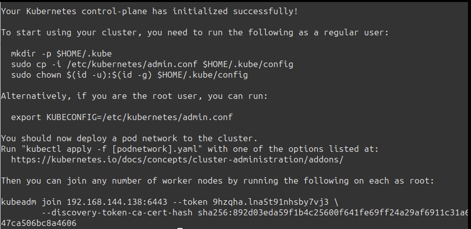
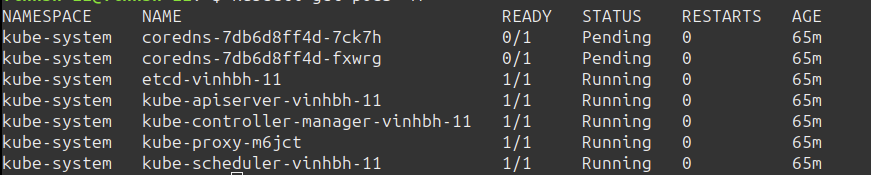
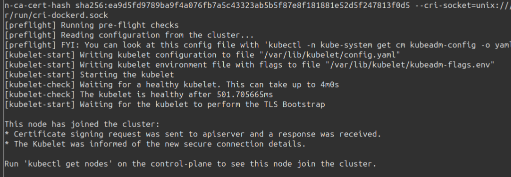
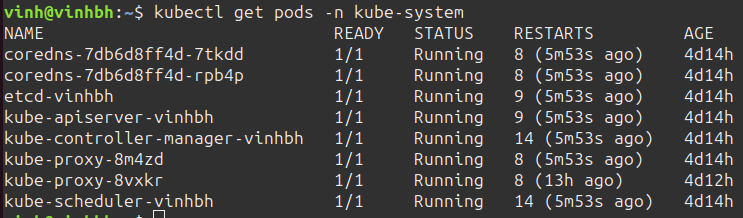
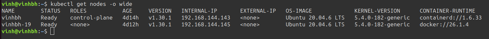

# Triển khai Kubernetes

## Triển khai được Kubernetes thông qua công cụ kubeadm lên 1 master node VM + 1 worker node VM
### Output:

- Tài liệu cài đặt

- Log của các lệnh kiểm tra hệ thống như: kubectl get nodes - o wide

### Tài liệu triển khai
#### Chuẩn bị
- Tạo 2 VM có 4Gb Ram, 2 core, 40Gb bộ nhớ

#### Cài đặt container runtime
Tài liệu tham chiếu cài đặt: https://kubernetes.io/docs/setup/production-environment/container-runtimes/

##### Thử nghiệm với nhiều container runtime khác nhau:
- Master node có container runtime là containerd
- Worker node có container runtime là docker

##### Enable IPv4 packet forwarding
```
# sysctl params required by setup, params persist across reboots
cat <<EOF | sudo tee /etc/sysctl.d/k8s.conf
net.ipv4.ip_forward = 1
EOF

# Apply sysctl params without reboot
sudo sysctl --system

# Verify that net.ipv4.ip_forward is set to 1 with:
sysctl net.ipv4.ip_forward
```
Install Container runtime (CONTAINERD)
```
# Add Docker's official GPG key:
sudo apt-get update
sudo apt-get install ca-certificates curl
sudo install -m 0755 -d /etc/apt/keyrings
sudo curl -fsSL https://download.docker.com/linux/ubuntu/gpg -o /etc/apt/keyrings/docker.asc
sudo chmod a+r /etc/apt/keyrings/docker.asc

# Add the repository to Apt sources:
echo \
  "deb [arch=$(dpkg --print-architecture) signed-by=/etc/apt/keyrings/docker.asc] https://download.docker.com/linux/ubuntu \
  $(. /etc/os-release && echo "$VERSION_CODENAME") stable" | \
  sudo tee /etc/apt/sources.list.d/docker.list > /dev/null
sudo apt-get update

sudo apt-get install containerd.io
```


### Installing kubeadm, kubelet and kubectl (Thực hiện trên Master Node và worker node)
Tài liệu tham chiếu cài đặt: https://kubernetes.io/docs/setup/production-environment/tools/kubeadm/install-kubeadm/#installing-kubeadm-kubelet-and-kubectl

Tắt swap
```
sudo swapoff -a 
sudo sed -i '/ swap / s/^/#/' /etc/fstab
```
1. Update the apt package index and install packages needed to use the Kubernetes apt repository:
```
sudo apt-get update
# apt-transport-https may be a dummy package; if so, you can skip that package
sudo apt-get install -y apt-transport-https ca-certificates curl gpg
```

2. Download the public signing key for the Kubernetes package repositories. The same signing key is used for all repositories so you can disregard the version in the URL:
```
# If the directory `/etc/apt/keyrings` does not exist, it should be created before the curl command, read the note below.
# sudo mkdir -p -m 755 /etc/apt/keyrings
curl -fsSL https://pkgs.k8s.io/core:/stable:/v1.30/deb/Release.key | sudo gpg --dearmor -o /etc/apt/keyrings/kubernetes-apt-keyring.gpg
```

3. Add the appropriate Kubernetes apt repository
```
# This overwrites any existing configuration in /etc/apt/sources.list.d/kubernetes.list
echo 'deb [signed-by=/etc/apt/keyrings/kubernetes-apt-keyring.gpg] https://pkgs.k8s.io/core:/stable:/v1.30/deb/ /' | sudo tee /etc/apt/sources.list.d/kubernetes.list
```

4. Update the apt package index, install kubelet, kubeadm and kubectl, and pin their version
```
sudo apt-get update
sudo apt-get install -y kubelet kubeadm kubectl
sudo apt-mark hold kubelet kubeadm kubectl
```

Thiết lập cgroup
```
containerd config default | sed 's/SystemdCgroup = false/SystemdCgroup = true/' | sed 's/sandbox_image = "registry.k8s.io\/pause:3.6"/sandbox_image = "registry.k8s.io\/pause:3.9"/' | sudo tee /etc/containerd/config.toml
sudo systemctl restart containerd
sudo systemctl status containerd
```
### Khởi tạo kubeadm (Chỉ chạy trên Master Node)
```
sudo kubeadm init --pod-network-cidr=10.244.0.0/16
```

#### Chú ý: 10.244.0.0/16 là 1 tên cidr phù hợp cho network add-on Flannel, nếu sử dụng 1 network add-on khác (ví dụ Calico) thì sẽ dùng cidr khác


Trong một số trường hợp trên VM cài nhiều CRI Endpoint (Ví dụ có containerd và docker runtime)
cần thêm chỉ thị sau:--cri-socket=unix:///var/run/cri-dockerd.sock

Lưu lại đường dẫn kubeadm join (Đường dẫn này sẽ chạy trên VM worker node để tham gia vào cụm K8s)
```
kubeadm join 192.168.144.138:6443 --token 9hzqha.lna5t91nhsby7vj3 \
	--discovery-token-ca-cert-hash sha256:892d03eda59f1b4c25600f641fe69ff24a29af6911c31a67847ca506bc8a4606
```

Làm theo hướng dẫn khi khởi tạo kubeadm
```
mkdir -p $HOME/.kube
sudo cp -i /etc/kubernetes/admin.conf $HOME/.kube/config
sudo chown $(id -u):$(id -g) $HOME/.kube/config
```
Chạy lệnh kiểm tra
```
kubectl get pods -A
```


Lúc này các pod coredns đang Pending, cần cài thêm network add-on Flannel

### Install network add-on là Flannel (Chỉ trên Master Node)

Tài liệu tham chiếu cài đặt: https://gist.github.com/rkaramandi/44c7cea91501e735ea99e356e9ae7883

```
kubectl apply -f https://github.com/coreos/flannel/raw/master/Documentation/kube-flannel.yml
```

### Cho các worker node join vào cụm K8s
```
kubeadm join 192.168.144.138:6443 --token 9hzqha.lna5t91nhsby7vj3 \
	--discovery-token-ca-cert-hash sha256:892d03eda59f1b4c25600f641fe69ff24a29af6911c31a67847ca506bc8a4606
```


Kiểm tra sau khi cho worker node join vào cụm với lệnh
```
kubectl get pods -n kube-system
```


Ngoài ra, nếu quên token join command, tham khảo link dưới đây để tạo lại câu lệnh join cho worker node:
https://stackoverflow.com/questions/40009831/cant-find-kubeadm-token-after-initializing-master 

### Kết quả kiểm tra hệ thống
```
kubectl get nodes -o wide
```


