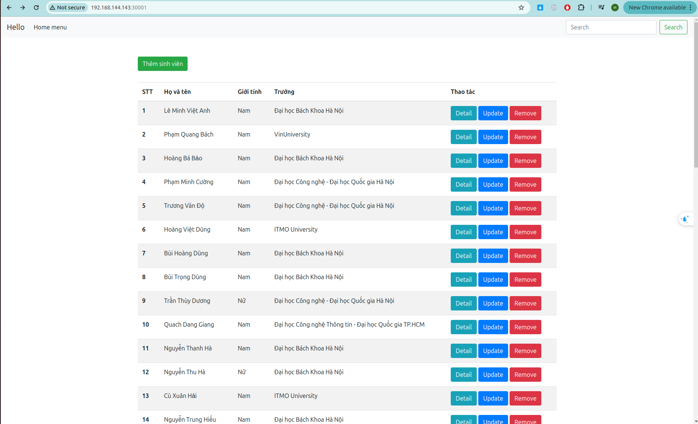

# Triển khai web application sử dụng các DevOps tools & practices 
## K8S Helm Chart
## Yêu cầu 1:

Cài đặt ArgoCD lên Kubernetes Cluster, expose được ArgoCD qua NodePort
Trong trường hợp sử dụng cụm Lab trên Viettel Cloud, cài đặt Loadbalancer lên Bastion Node thông qua công cụ docker-compose, expose port ArgoCD ra môi trường public thông qua một trong số các port đã được cấp cho từng sinh viên
## Output 1:
File manifests sử dụng để triển khai ArgoCD lên K8S Cluster
Ảnh chụp giao diện màn hình hệ thống ArgoCD khi truy cập qua trình duyệt trình duyệt

## Cài đặt ArgoCD lên Kubernetes Cluster
[Tài liệu tham chiếu cài đặt ArgoCD](https://argo-cd.readthedocs.io/en/stable/getting_started/)

### Install ArgoCD
```
# Tạo 1 namespace mới là argocd
kubectl create namespace argocd
# Cài đặt argocd thông qua file manifest chính thức
kubectl apply -n argocd -f https://raw.githubusercontent.com/argoproj/argo-cd/stable/manifests/install.yaml
```

[File Manifest cài đặt Argocd](./manifests/install-argocd.yaml)

File Manifest triển khai dịch vụ ArgoCD qua NodePort (nodePort: 30000)
```
# argocd-service.yaml
apiVersion: v1
kind: Service
metadata:
 name: argocd-server-nodeport
 namespace: argocd
spec:
 type: NodePort
 ports:
   - port: 80
     targetPort: 8080
     nodePort: 30000
 selector:
   app.kubernetes.io/name: argocd-server

```

Truy cập dịch vụ ArgoCD trên trình duyệt qua đường dẫn: https://192.168.144.143:30000/

Trong đó 192.168.144.143 là NodeIP, node port của ArgoCD Service là 30000

### Hình ảnh giao diện hệ thống ArgoCD khi truy cập qua trình duyệt

Trang đăng nhập tài khoản của ArgoCD


Trang hiển thị applications của ArgoCD


## Yêu cầu 2: 

- Viết 2 Helm Chart cho web Deployment và api Deployment, để vào 1 folder riêng trong repo web và repo api
- Tạo 2 Repo Config cho web và api, trong các repo này chứa các file values.yaml với nội dung của cá file values.yaml là các config cần thiết để chạy web và api trên k8s bằng Helm Chart 
- Sử dụng tính năng multiple sources của ArgoCD để triển khai các service web và api service lên K8S Cluster  theo hướng dẫn của ArgoCD, expose các service này dưới dạng NodePort Multiple Sources for an Application - Argo CD - Declarative GitOps CD for Kubernetes

## Output 2:
- Các Helm Chart sử dụng để triển khai web Deployment và api Deployment lên K8S Cluster 
- Các file values.yaml trong 2 config repo của  của web service và api service
Manifest của ArgoCD Application
- Ảnh chụp giao diện màn hình hệ thống ArgoCD trên trình duyệt
- Ảnh chụp giao diện màn hình trình duyệt khi truy cập vào Web URL, API URL

## Thông tin repo:

### API Service 
[Repo Source Code Api Service](https://github.com/Vinh1507/vdt-api)

[Repo Config Api Service](https://github.com/Vinh1507/vdt-api-config)

### Web Service 

[Repo Source Code Web Service](https://github.com/Vinh1507/vdt-web)

[Repo Config Web Service](https://github.com/Vinh1507/vdt-web-config)

## Các Helm Chart sử dụng để triển khai web Deployment và api Deployment lên K8S Cluster
### 1. Helm Chart triển khai API Deployment
[Source code Helm Chart API](https://github.com/Vinh1507/vdt-api/tree/main/django-chart)
(Source code Helm Chart nằm trong thư mục django-chart trong repo source code API)

#### Source Helm Chart triển khai API Deployment
```
apiVersion: apps/v1
kind: Deployment
metadata:
  name: {{ include "django-chart.fullname" . }}
  labels:
    app: {{ include "django-chart.name" . }}
spec:
  replicas: {{ .Values.replicaCount }}
  selector:
    matchLabels:
      app: {{ include "django-chart.name" . }}
  template:
    metadata:
      labels:
        app: {{ include "django-chart.name" . }}
    spec:
      containers:
        - name: {{ .Chart.Name }}
          image: "{{ .Values.image.repository }}:{{ .Values.image.tag }}"
          imagePullPolicy: {{ .Values.image.pullPolicy }}
          env:
            - name: DATABASE_HOST
              value: {{ .Values.database.host | quote }}
            - name: DATABASE_PORT
              value: {{ .Values.database.port | quote }}
            - name: DATABASE_NAME
              value: {{ .Values.database.name | quote }}
            - name: DATABASE_USER
              value: {{ .Values.database.user | quote }}
            - name: DATABASE_PASSWORD
              value: {{ .Values.database.password | quote }}
          ports:
            - containerPort: 8000
          command: ["python", "manage.py", "runserver", "0.0.0.0:8000"]
          resources:
{{- toYaml .Values.resources | nindent 12 }}
```

### 2. Helm Chart để triển khai Web Deployment

[Source code Helm Chart Web]()
(Source code deployment Helm Chart nằm trong thư mục helm-chart trong repo source code Web)

#### Source Helm Chart triển khai Web Deployment
```
apiVersion: apps/v1
kind: Deployment
metadata:
  name: {{ include "mynodeapp.fullname" . }}
spec:
  replicas: {{ .Values.replicaCount }}
  selector:
    matchLabels:
      app: {{ include "mynodeapp.name" . }}
  template:
    metadata:
      labels:
        app: {{ include "mynodeapp.name" . }}
    spec:
      containers:
      - name: {{ .Chart.Name }}
        image: "{{ .Values.image.repository }}:{{ .Values.image.tag }}"
        ports:
          - containerPort: 80
```


## Tạo 2 Repo Config cho web và api và Các file values.yaml trong 2 config repo của  của web service và api service

### Kịch bản triển khai:
- Đối với Api application: triển khai 3 replica, expose dạng nodeport
- Đối với Web application: triển khai 2 replica, expose dạng nodeport
- Đối với Database application: triển khai 1 replica, expose dạng nodeport

### 1. Repo Config Cho API
[Repo Config Api Service](https://github.com/Vinh1507/vdt-api-config)

file values-prod.yaml 
```
replicaCount: 3
image:
  repository: vinhbh/vdt_api
  pullPolicy: IfNotPresent
  tag: "v2.7"
  
service:
  type: NodePort
  port: 8000
  nodePort: 30002

database:
  host: vdt-db-postgres-chart
  port: 5432
  name: vdt_db
  user: vinhbh
  password: "123456789"

resources: {}
```

### 2. Repo Config Cho Web
[Repo Config Web Service](https://github.com/Vinh1507/vdt-web-config)

file values-prod.yaml  
```
replicaCount: 2
image:
  repository: vinhbh/vdt_web
  pullPolicy: IfNotPresent
  tag: "v2.10"

securityContext: {}

service:
  type: NodePort
  port: 80
  targetPort: 80
  nodePort: 30001
  portName: vdt-web-port

resources: {}

volumes: []

volumeMounts: []

nodeSelector: {}

tolerations: []

affinity: {}
```

## Manifest của ArgoCD Application

Sử dụng tính năng multiple sources của ArgoCD để triển khai các service web và api service lên K8S Cluster

Đối với mỗi Application Manifest sử dụng 2 repo:
- Repo source code chứa các file helm chart
- Repo config chứa file value-prod.yaml để triển khai các deployment

### 1. Manifest triển khai API Application
```
apiVersion: argoproj.io/v1alpha1
kind: Application
metadata:
  name: vdt-api
  namespace: argocd
spec:
  project: default
  sources:
    - repoURL: 'https://github.com/Vinh1507/vdt-api-config'
      targetRevision: HEAD
      ref: values
    - repoURL: 'https://github.com/Vinh1507/vdt-api'
      targetRevision: HEAD
      path: 'django-chart'
      helm:
        valueFiles:
        - $values/helm-values/values-prod.yaml
  destination:
    server: 'https://kubernetes.default.svc'
    namespace: default
  syncPolicy:
    syncOptions:
    - CreateNamespace=true
    automated:
      prune: true
      selfHeal: true
```

#### Manifest Service API expose dạng nodeport
[Manifest Service API nodeport](https://github.com/Vinh1507/vdt-api/blob/main/django-chart/templates/service.yaml)
### 2. Manifest triển khai WEB Application
```
apiVersion: argoproj.io/v1alpha1
kind: Application
metadata:
  name: vdt-web
  namespace: argocd
spec:
  project: default
  sources:
    - repoURL: 'https://github.com/Vinh1507/vdt-web-config'
      targetRevision: HEAD
      ref: values
    - repoURL: 'https://github.com/Vinh1507/vdt-web'
      targetRevision: HEAD
      path: 'helm-chart'
      helm:
        valueFiles:
        - $values/helm-values/values-prod.yaml
  destination:
    server: 'https://kubernetes.default.svc'
    namespace: default
  syncPolicy:
    syncOptions:
    - CreateNamespace=true
    automated:
      prune: true
      selfHeal: true                    
```

#### Manifest Service Web expose dạng nodeport
[Manifest Service Web Node Port](https://github.com/Vinh1507/vdt-web/blob/main/helm-chart/templates/service.yaml)

### 3. Bổ sung Manifest triển khai Database

[Repo triển khai dịch vụ Database](https://github.com/Vinh1507/vdt-db)
```
apiVersion: argoproj.io/v1alpha1
kind: Application
metadata:
  name: vdt-db
  namespace: argocd
spec:
  project: default
  source:
    repoURL: 'https://github.com/Vinh1507/vdt-db'
    targetRevision: HEAD
    path: 'postgres-chart'
    helm:
      valueFiles:
      - values.yaml
  destination:
    server: 'https://kubernetes.default.svc'
    namespace: default
  syncPolicy:
    syncOptions:
    - CreateNamespace=true
    automated:
      prune: true
      selfHeal: true
```

### Ảnh chụp giao diện màn hình hệ thống ArgoCD trên trình duyệt

#### Hình ảnh các applications trên ArgoCD


#### Hình ảnh API applications trên ArgoCD


#### Hình ảnh WEB applications trên ArgoCD


#### Hình ảnh Database applications trên ArgoCD


### Ảnh chụp giao diện màn hình trình duyệt khi truy cập vào Web URL, API URL

#### Hình ảnh truy cập Web Url http://192.168.144.143:30001/

Trong đó 192.168.144.143 là NodeIP, 30001 là node port WEB service


#### Hình ảnh truy cập API Url http://192.168.144.143:30002/api/students/
Trong đó 192.168.144.143 là NodeIP, 30002 là node port API service


