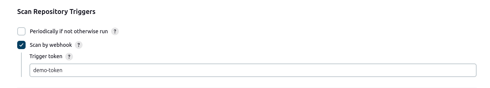
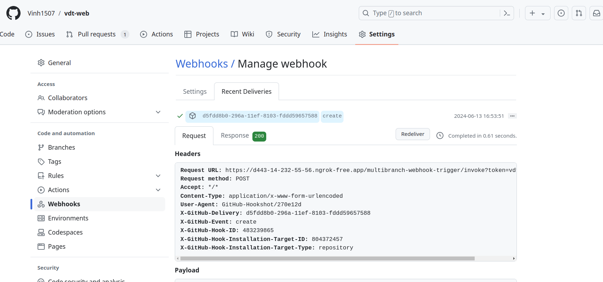

# Continuous Delivery
## Yêu cầu:
Viết 2 luồng CD cho 2 repo web và api, khi có 1 tag mới được tạo ra trên trên 1 trong 2 repo này thì luồng deploy tương ứng của repo đó thực hiện các công việc sau:

- Build docker image với image tag là tag name đã được tạo ra trên gitlab và push docker image sau khi build xong lên Docker Hub

- Sửa giá trị Image version trong file values.yaml  trong config repo và push thay đổi lên config repo. Tham khảo: https://stackoverflow.com/a/72696837
Cấu hình ArgoCD tự động triển khai lại web Deployment và api Deployment khi có sự thay đổi trên config repo.
                           
## Output:
- Các file setup công cụ của 2 luồng CD
- Output log của 2 luồng CD khi tạo tag mới trên repo web và repo api
- Hình ảnh app triển khai argoCD, hình ảnh diff khi argoCD phát hiện thay đổi ở config repo
- Các hình ảnh demo khác như danh sách event trong app

## Kịch bản Continuous Delivery
1. Cấu hình webhook trên github khi có event tạo tag, sẽ gửi yêu cầu về cho Jenkins chạy pipeline
2. Chạy Job trên CI Tool Jenkins khi có webhook
3. Jenkins pipeline tạo docker image từ source code trên git, sau đó sửa file values.yaml và push lên config repo
4. ArgoCD được cấu hình mặc định 3 phút / lần polling thay đổi trên config repo, nếu có sự khác biệt giữa Desired và Actual, sẽ tự động cập nhận lại các pod trong application

## 1. Continuous Delivery Cho API Service
Chuẩn bị github webhook cho API repo
Do Jenkins được chạy trên local, do đó em sử dụng tool Ngrok để tạo public domain cho Jenkins

Ngrok: Forwarding https://d443-14-232-55-56.ngrok-free.app -> http://localhost:8080

### 1.1. Cấu hình github webhook
Cấu hình URL webhook

Cấu hình event github webhook

webhook: https://d443-14-232-55-56.ngrok-free.app/multibranch-webhook-trigger/invoke?token=demo-token

### 1.2. Job Jenkins cho API Service
Sử dụng một số Jenkins Credential:
- DOCKER_HUB_CREDENTIALS = 'dockerhub_vinhbh', là Credential Global thông tin tài khoản docker hub - nhằm mục đích push image lên docker hub

- GITHUB_CREDENTIALS = 'github-token-v3', là Credential Global thông tin tài khoản Github (đạng username - token), nhằm mục đích clone code config repo sau đó sửa file value-prod.yaml, commit và push trở lại config repo

### File cấu hình CD cho Api pipeline 
[Jenkinsfile cho API Service](https://github.com/Vinh1507/vdt-api/blob/main/Jenkinsfile)

#### Tạo job item và cấú hình Jenkins pipeline
1. Tạo 1 Jenkins job tên là vdt_api

    Cấu hình repo github

Cấu hình webhook từ github có yêu cầu token hợp lệ (demo-token)

2. Tạo tag v2.12 lên repo API

    

3. Webhook được trigger về Jenkins server

4. Jenkins job pipeline được kích hoạt

5. Jenkins job pipeline được hoàn thành

    

6. Hình ảnh ArgoCD diff khi có sự kiện thay đổi trên repo config

7. Hình ảnh event thay đổi của API Application

8. Hình ảnh event thay đổi của API Deployment
3 pod được xóa, và tạo mới 3 pod

9. Hình ảnh manifest mới của API Deployment (Đã cập nhật docker image v2.12)

10. Hình ảnh application sau khi kết thúc luồng CD

### Output log của luồng CD cho API Service
- [Jenkins API Full log](./logs/jenkins-api-log.txt)

## 2. Continuous Delivery Cho Web Service
### 2.1. Cấu hình github webhook
Tương tự đối với cấu hình github webhook cho API Service, nhưng lần này dùng 1 token cho webhook khác để phân biệt giữa các job (vdt-web-token)
webhook: https://d443-14-232-55-56.ngrok-free.app/multibranch-webhook-trigger/invoke?token=vdt-web-token

### 2.2. Job Jenkins cho Web Service
Tương tự với Job api service sử dụng 2 Jenkins Credential:
- DOCKER_HUB_CREDENTIALS = 'dockerhub_vinhbh'
- GITHUB_CREDENTIALS = 'github-token-v3'

### File cấu hình CD cho WEB pipeline 
[Jenkinsfile cho Web Service](https://github.com/Vinh1507/vdt-web/blob/main/Jenkinsfile)

#### Tạo job item và cấú hình Jenkins pipeline cho WEB Repo
1. Tạo 1 Jenkins job tên là vdt_web
    Cấu hình repo github

Cấu hình webhook từ github có yêu cầu token hợp lệ (vdt-web-token)

2. Tạo tag v2.15 lên repo Web

    

3. Webhook được trigger từ Github về Jenkins server

    

4. Jenkins job pipeline được kích hoạt

    

5. Jenkins job pipeline được hoàn thành

    
    Docker image mới được đẩy lên docker hub

    
6. Hình ảnh ArgoCD diff khi có sự kiện thay đổi trên repo config

    
7. Hình ảnh event thay đổi của WEB Application

    
8. Hình ảnh event thay đổi của WEB Deployment

    2 pod được xóa, và tạo mới 2 pod

9. Hình ảnh manifest mới của WEB Deployment (Đã cập nhật docker image v2.15)

    
10. Hình ảnh application sau khi kết thúc luồng CD

    

### Output log của luồng CD cho WEB Service
- [Jenkins Web Full log](./logs/jenkins-web-log.txt)

