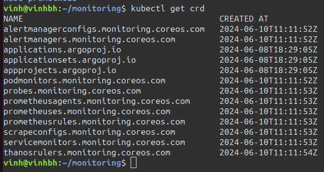
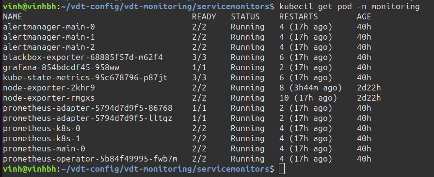
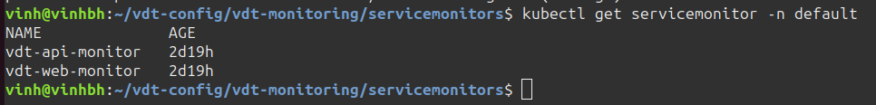
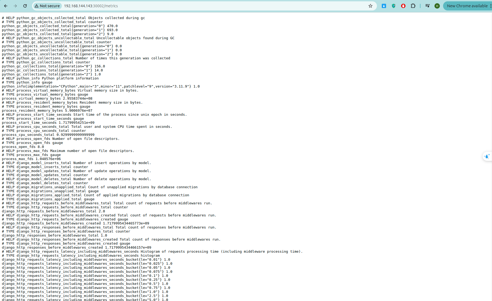
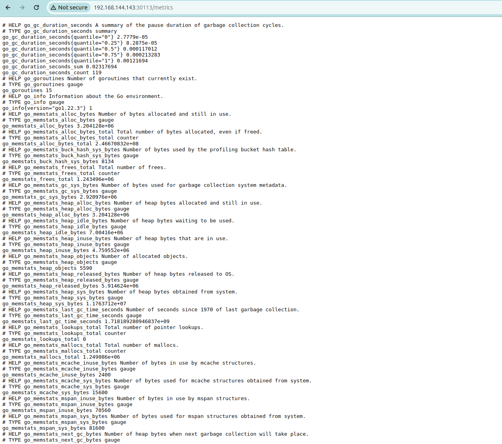
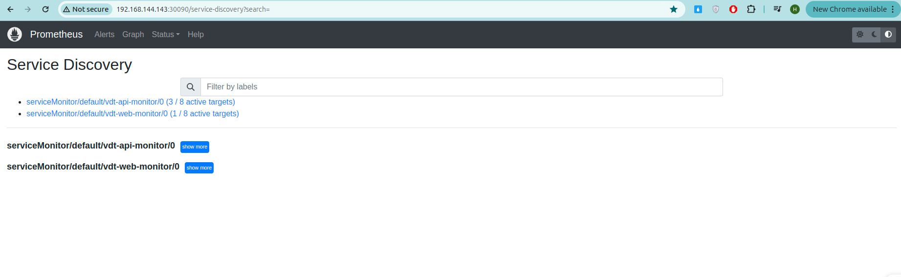
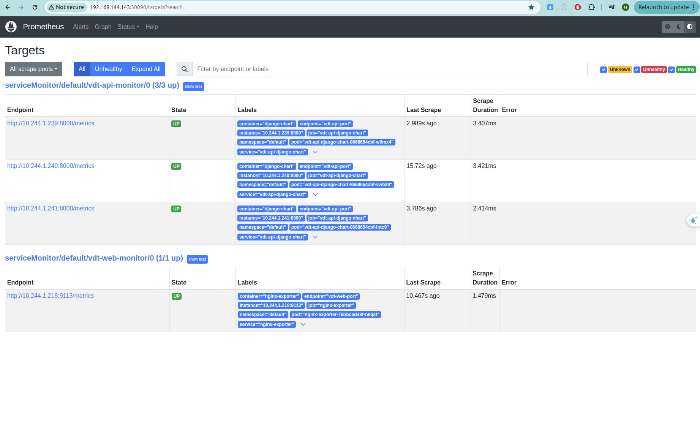

# Monitoring 
## Yêu cầu:
- Expose metric của web service và api service ra 1 http path. Tham khảo:
https://github.com/korfuri/django-prometheus
- Triển khai Prometheus lên Kubernetes Cluster thông qua Prometheus Operator, phơi ra ngoài dưới dạng NodePort: 
- Expose Prometheus dưới dạng Nodeport
- Trong trường hợp sử dụng cụm lab của Viettel Cloud, tạo 1 load balancer với backend là NodePort Service của Prometheus, để expose Prometheus UI ra Public Internet 
- Sử dụng Service Monitor của Prometheus Operator để giám sát Web Deployment và API Deployment

## Output:
- Các file setup để triển khai Prometheus lên Kubernetes Cluster
- Hình ảnh khi truy cập vào Prometheus UI thông qua trình duyệt
- Hình ảnh danh sách target của Web Deployment và API Deployment được giám sát bởi Prometheus


## Triển khai Prometheus lên Kubernetes Cluster
- clone code kube-prometheus để tiến hành cài đặt Prometheus Operator
```
git clone https://github.com/prometheus-operator/kube-prometheus
```
Tiến hành cài đặt CRD



Tự tạo 1 triển khai object Prometheus giám sát API Service và Web Service
Trước đó đã triển khai API pods, Web pods trên namespace default của cụm K8s

File manifest prometheus.yaml theo dõi các service trên namespace default
```
apiVersion: monitoring.coreos.com/v1
kind: Prometheus
metadata:
  name: main
  namespace: monitoring
spec:
  resources:
    requests:
      memory: 400Mi
  serviceAccountName: prometheus-k8s
  # serviceMonitorNamespaceSelector: {}
  serviceMonitorNamespaceSelector:
    matchLabels:
      kubernetes.io/metadata.name: default
  serviceMonitorSelector: {} #match all servicemonitors
```

Expose object Prometheus trên dạng NodePort qua cổng 30090
File manifest prometheus-service.yaml
```
apiVersion: v1
kind: Service
metadata:
  name: prometheus-service
  namespace: monitoring

spec:
  type: NodePort
  ports:
  - port: 9090
    targetPort: 9090
    nodePort: 30090
  selector:
    prometheus: main                      
```

### Kết quả triển khai các manifest 

Hình ảnh tạo ra 1 replica prometheus-main-0 trên namespace monitoring


Hình ảnh tạo ra 2 service monitor trên namespace default (cùng namespace với API service, web service)


### 1. Monitor API Service

#### Tạo đường dẫn /metrics cho API Service


Thông tin về API Service:
- có label là ```app: django-chart```
- có port name là ```port: vdt-api-port```

Tạo 1 object ServiceMonitor theo dõi service API (django-chart):
```
apiVersion: monitoring.coreos.com/v1
kind: ServiceMonitor
metadata:
  labels:
    app: django-chart
  name: vdt-api-monitor
  namespace: default
spec:
  endpoints:
  - interval: 30s
    port: vdt-api-port
  selector:
    matchLabels:
      app: django-chart
```

### 2. Monitor Web Service

#### Tạo đường dẫn /metrics cho Web Service
Sử dụng nginx exporter để hỗ trợ chuyển các metrics của nginx react sang dạng mà Prometheus có thể hiểu được

[File cấu hình nginx default](https://github.com/Vinh1507/vdt-web/blob/main/nginx-config/default.conf) (nhằm tạo đường dẫn /metrics dạng thô Prometheus chưa hiểu được)

[File install dịch vụ nginx-exporter](https://github.com/Vinh1507/vdt-web/blob/main/helm-chart/templates/nginx-exporter-deployment.yaml) (convert metrics dạng thô sang dạng Prometheus có thể hiểu được)

Nginx-exporter được triển khai trên cổng 30113 dạng NodePort


Kết quả của đường dẫn /metrics tại Web URL


Thông tin về Nginx Expoter Service:
- có label là ```app: vdt-web-monitor```
- có port name là ```port: vdt-web-port```

Tạo 1 object ServiceMonitor theo dõi service API (django-chart):
```
apiVersion: monitoring.coreos.com/v1
kind: ServiceMonitor
metadata:
  labels:
    app: vdt-web-monitor
  name: vdt-web-monitor
  namespace: default
spec:
  endpoints:
  - interval: 30s
    port: vdt-web-port
  selector:
    matchLabels:
      app: vdt-web-monitor
```

## Hình ảnh truy cập Prometheus UI thông qua trình duyệt

Hình ảnh Prometheus đã theo dõi được 2 ServiceMonitor cho 2 dịch vụ API và WEB


## Hình ảnh danh sách target của Web Deployment và API Deployment được giám sát bởi Prometheus

