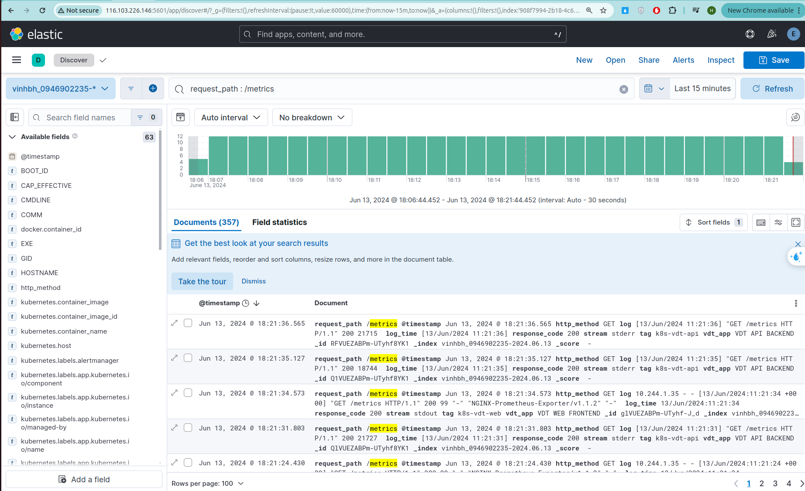

# Logging 
## Yêu cầu:
- Sử dụng Kubernetes DaemonSet triển khai fluentd hoặc fluentbit lên kubernetes đẩy log của các Deployment Web Deployment và API Deployment lên cụm ElasticSearch tập trung với prefix index dưới dạng tên_sinh_viên_viết_tắt_sdt: Ví dụ: conghm_012345678
- Thông tin cụm ES tập trung:
    + Username: elastic
    + Password: iRsUoyhqW-CyyGdwk6V_
    + Elastic Search URL: https://116.103.226.146:9200
    + Kibana URL: http://116.103.226.146:5601/login?next=%2Fapp%2Fdiscover#/
- Cấu hình logging cho web service và api service, đảm bảo khi có http request gửi vào web service hoặc api service thì trong các log mà các service này sinh ra, có ít nhất 1 log có các thông tin:
    + Request Path(VD: /api1/1, /api2/3 ..)
    + HTTP Method VD: (GET PUT POST…)
    + Response Code: 302, 200, 202, 201…
## Output:
Hình ảnh chụp màn hình Kibana kết quả tìm kiếm log của các Service Web và Service API theo url path

## Tài liệu triển khai:

### 1. Tạo configmap để customize cấu hình fluentd.conf mặc định 

```
apiVersion: v1
kind: ConfigMap
metadata:
  name: fluentd-config
  namespace: logging
data:
  fluent.conf: |
    @include "#{ENV['FLUENTD_SYSTEMD_CONF'] || 'systemd'}.conf"
    @include "#{ENV['FLUENTD_PROMETHEUS_CONF'] || 'prometheus'}.conf"
    @include kubernetes.conf
    @include conf.d/*.conf
  
    <source>
      @type tail
      @id in_tail_container_logs_vdt_api
      path "/var/log/containers/vdt-api*.log"
      pos_file "#{File.join('/var/log/', ENV.fetch('FLUENT_POS_EXTRA_DIR', ''), 'fluentd-containers-api.log.pos')}"
      tag "k8s-vdt-api"
      exclude_path "#{ENV['FLUENT_CONTAINER_TAIL_EXCLUDE_PATH'] || use_default}"
      read_from_head true
      <parse>
        @type "#{ENV['FLUENT_CONTAINER_TAIL_PARSER_TYPE'] || 'json'}"
        time_format "#{ENV['FLUENT_CONTAINER_TAIL_PARSER_TIME_FORMAT'] || '%Y-%m-%dT%H:%M:%S.%NZ'}"
      </parse>
    </source>

    <source>
      @type tail
      @id in_tail_container_logs_vdt_web
      path "/var/log/containers/vdt-web*.log"
      pos_file "#{File.join('/var/log/', ENV.fetch('FLUENT_POS_EXTRA_DIR', ''), 'fluentd-containers-web.log.pos')}"
      tag "k8s-vdt-web"
      exclude_path "#{ENV['FLUENT_CONTAINER_TAIL_EXCLUDE_PATH'] || use_default}"
      read_from_head true
      <parse>
        @type "#{ENV['FLUENT_CONTAINER_TAIL_PARSER_TYPE'] || 'json'}"
        time_format "#{ENV['FLUENT_CONTAINER_TAIL_PARSER_TIME_FORMAT'] || '%Y-%m-%dT%H:%M:%S.%NZ'}"
      </parse>
    </source>

    <filter k8s-vdt-api>
      @type record_transformer
      enable_ruby true
      <record>
        log_time ${record["log"].split(' ')[0..1].join(' ')}
        http_method ${record["log"].split(' ')[2][1..-1]}
        request_path ${record["log"].split(' ')[3]}
        response_code ${record["log"].split(' ')[5]}
        vdt_app "VDT API BACKEND"
      </record>
    </filter>

    <filter k8s-vdt-web>
      @type record_transformer
      enable_ruby true
      <record>
        log_time ${record["log"].split(' ')[3][1..-1]}
        http_method ${record["log"].split(' ')[5][1..-1]}
        request_path ${record["log"].split(' ')[6]}
        response_code ${record["log"].split(' ')[8]}
        vdt_app "VDT WEB FRONTEND"
      </record>
    </filter>

    <match **>
      @type elasticsearch
      @id out_es
      @log_level info
      include_tag_key true
      host "#{ENV['FLUENT_ELASTICSEARCH_HOST']}"
      port "#{ENV['FLUENT_ELASTICSEARCH_PORT']}"
      path "#{ENV['FLUENT_ELASTICSEARCH_PATH']}"
      scheme "#{ENV['FLUENT_ELASTICSEARCH_SCHEME'] || 'http'}"
      ssl_verify "#{ENV['FLUENT_ELASTICSEARCH_SSL_VERIFY'] || 'true'}"
      ssl_version "#{ENV['FLUENT_ELASTICSEARCH_SSL_VERSION'] || 'TLSv1'}"
      user "#{ENV['FLUENT_ELASTICSEARCH_USER'] || use_default}"
      password "#{ENV['FLUENT_ELASTICSEARCH_PASSWORD'] || use_default}"
      reload_connections "#{ENV['FLUENT_ELASTICSEARCH_RELOAD_CONNECTIONS'] || 'false'}"
      reconnect_on_error "#{ENV['FLUENT_ELASTICSEARCH_RECONNECT_ON_ERROR'] || 'true'}"
      reload_on_failure "#{ENV['FLUENT_ELASTICSEARCH_RELOAD_ON_FAILURE'] || 'true'}"
      log_es_400_reason "#{ENV['FLUENT_ELASTICSEARCH_LOG_ES_400_REASON'] || 'false'}"
      logstash_prefix "#{ENV['FLUENT_ELASTICSEARCH_LOGSTASH_PREFIX'] || 'logstash'}"
      logstash_dateformat "#{ENV['FLUENT_ELASTICSEARCH_LOGSTASH_DATEFORMAT'] || '%Y.%m.%d'}"
      logstash_format "#{ENV['FLUENT_ELASTICSEARCH_LOGSTASH_FORMAT'] || 'true'}"
      index_name "#{ENV['FLUENT_ELASTICSEARCH_LOGSTASH_INDEX_NAME'] || 'logstash'}"
      target_index_key "#{ENV['FLUENT_ELASTICSEARCH_TARGET_INDEX_KEY'] || use_nil}"
      type_name "#{ENV['FLUENT_ELASTICSEARCH_LOGSTASH_TYPE_NAME'] || 'fluentd'}"
      include_timestamp "#{ENV['FLUENT_ELASTICSEARCH_INCLUDE_TIMESTAMP'] || 'false'}"
      template_name "#{ENV['FLUENT_ELASTICSEARCH_TEMPLATE_NAME'] || use_nil}"
      template_file "#{ENV['FLUENT_ELASTICSEARCH_TEMPLATE_FILE'] || use_nil}"
      template_overwrite "#{ENV['FLUENT_ELASTICSEARCH_TEMPLATE_OVERWRITE'] || use_default}"
      sniffer_class_name "#{ENV['FLUENT_SNIFFER_CLASS_NAME'] || 'Fluent::Plugin::ElasticsearchSimpleSniffer'}"
      request_timeout "#{ENV['FLUENT_ELASTICSEARCH_REQUEST_TIMEOUT'] || '5s'}"
      application_name "#{ENV['FLUENT_ELASTICSEARCH_APPLICATION_NAME'] || use_default}"
      <buffer>
        flush_thread_count "#{ENV['FLUENT_ELASTICSEARCH_BUFFER_FLUSH_THREAD_COUNT'] || '8'}"
        flush_interval "#{ENV['FLUENT_ELASTICSEARCH_BUFFER_FLUSH_INTERVAL'] || '5s'}"
        chunk_limit_size "#{ENV['FLUENT_ELASTICSEARCH_BUFFER_CHUNK_LIMIT_SIZE'] || '2M'}"
        queue_limit_length "#{ENV['FLUENT_ELASTICSEARCH_BUFFER_QUEUE_LIMIT_LENGTH'] || '32'}"
        retry_max_interval "#{ENV['FLUENT_ELASTICSEARCH_BUFFER_RETRY_MAX_INTERVAL'] || '30'}"
        retry_forever true
      </buffer>
    </match>

```

### 2. Tạo deamonset để triển khai Fluentd tới tất cả các Node
#### Một số lưu ý:
- Sử dụng image: fluent/fluentd-kubernetes-daemonset:v1.16.2-debian-elasticsearch8-1.1, phù hợp với phiên bản 8. của Elasticsearch tập trung
- Sử dụng securityContext chạy container dưới quyền root để có thể đọc/ghi vào các file trong /var/log và /var/lib/docker/containers

File manifest daemonset.yaml triển khai
```
apiVersion: apps/v1
kind: DaemonSet
metadata:
  name: fluentd
  namespace: logging
  labels:
    k8s-app: fluentd-logging
spec:
  selector:
    matchLabels:
      name: fluentd
  template:
    metadata:
      labels:
        name: fluentd
    spec:
      serviceAccountName: fluentd
      containers:
      - name: fluentd
        image: fluent/fluentd-kubernetes-daemonset:v1.16.2-debian-elasticsearch8-1.1
        env:
          - name: FLUENT_ELASTICSEARCH_HOST
            value: "116.103.226.146"
          - name: FLUENT_ELASTICSEARCH_PORT
            value: "9200"
          - name: FLUENT_ELASTICSEARCH_SCHEME
            value: "https"
          - name: FLUENT_ELASTICSEARCH_SSL_VERIFY
            value: "false"
          - name: FLUENT_ELASTICSEARCH_SSL_VERSION
            value: "TLSv1_2"
          - name: FLUENT_ELASTICSEARCH_LOGSTASH_PREFIX
            value: "vinhbh_0946902235"
          - name: FLUENT_ELASTICSEARCH_USER
            value: "elastic"
          - name: FLUENT_ELASTICSEARCH_PASSWORD
            value: "iRsUoyhqW-CyyGdwk6V_"
        resources:
          limits:
            memory: 512Mi
          requests:
            cpu: 100m
            memory: 200Mi
        volumeMounts:
        - name: config-volume
          mountPath: /fluentd/etc/fluent.conf
          subPath: fluent.conf
        - name: varlog
          mountPath: /var/log
        - name: varlibdockercontainers
          mountPath: /var/lib/docker/containers
          readOnly: true
        securityContext:
          runAsUser: 0 # Chạy container dưới quyền root
          runAsGroup: 0
          allowPrivilegeEscalation: true
      volumes:
        - name: config-volume
          configMap:
            name: fluentd-config
        - name: varlog
          hostPath:
            path: /var/log
        - name: varlibdockercontainers
          hostPath:
            path: /var/lib/docker/containers

```

Câu lệnh kiểm tra cài đặt:
```
kubectl get pod -n logging
```


## Các log được tạo bởi API service, Web service: đã có đầy đủ 3 thành phần quan trọng:

- Request Path (được đặt tên key là 'request_path')
- HTTP Method (được đặt tên key là 'http_method')
- Response Code (được đặt tên key là 'response_code')
- Ngoài ra còn có log được tạo từ cụm K8s

## Hình ảnh Kibana kết quả tìm kiếm log của các Service API

#### Tìm kiếm log cho request_path: /api/students/
[Log khi có request /api/students/ vào service API](./logs/vdt-api-log.md)


## Hình ảnh Kibana kết quả tìm kiếm log của các Web API
### Tìm kiếm log cho request_path: /metrics
[Log khi có request /metrics vào service Web](./logs/vdt-web-log.md)



### Tìm kiếm log cho request_path: /demo-404-notfound (trả về status 404)

[Log khi có request /demo-404-notfound vào service Web](./logs/vdt-web-log-404.md)


### Thông tin của một số container trong cụm K8s
[Log của một số container trong cụm K8s](./logs/container-k8s-log.md)


