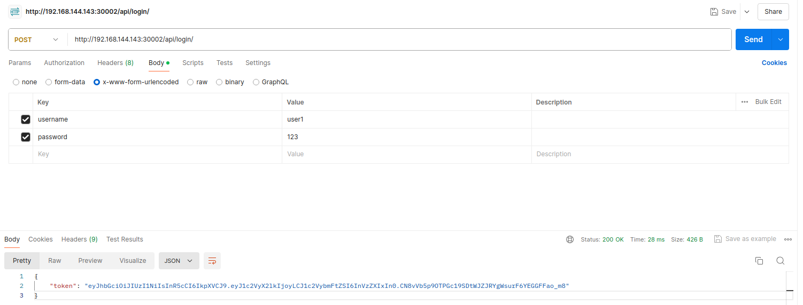

# Giải pháp sử dụng để authen/authorization cho Django Rest API

## Vấn đề xác thực trong Django Rest API

Sử dụng xác thực truy cập thông qua phương thức Token Auth (Baerer Token)
Do sẽ có rất nhiều controller khác nhau cần xác thực truy cập thông qua token, giải pháp thực hiện viết 1 middleware đứng trước tất cả các controller, thực hiện các bước sau:

### Khi người dùng tạo token thông qua đường dẫn /api/login
Token được tạo ra bằng cách mã hóa JWT các thông tin cơ bản của user như user_id, username, token này sẽ được trả về cho người dùng khi đăng nhập thành công vào hệ thống

(Đường dẫn /api/login sẽ không yêu cầu token để truy cập)

Chuẩn bị một số tài khoản users


Hình ảnh truy cập đường dẫn /api/login, điền các thông tin username, password hợp lệ để tiến hành nhận về token


### Khi người dùng truy cập vào đường dẫn API yêu cầu token
- Middleware nhận request, lấy thông tin token từ trong request
- Nếu không có token, sẽ lập tức trả về lỗi 403 (Token không hợp lệ)
- Nếu có token, tiến hành giải mã token, nếu quá trình giải mã không thành công, trả về lỗi 403 (Token không hợp lệ)
- Nếu token hợp lệ, sau khi giải mã, lấy thông tin user_id, username
- Từ thông tin user_id, username tiến hành lấy đầy đủ thông tin của user trong database, đính kèm vào request, sau đó middleware chuyển tiếp request tới controller xử lý
- Tại controller, có được thông tin user trong request có thể làm một số mục đích khác như Phân quyền (Authorization)

Source code middleware triển khai JWT Authen với token Bearer
```
class JWTMiddleware:
    EXCLUDED_PATHS = ['/api/login/']

    def __init__(self, get_response):
        self.get_response = get_response

    def __call__(self, request):
        auth_header = request.headers.get('Authorization', None)

        path = request.path_info
        if path in self.EXCLUDED_PATHS:
            return self.get_response(request)
        
        if auth_header and auth_header.startswith('Bearer '):
            token = auth_header.split(' ')[1]
            try:
                payload = jwt.decode(token, settings.SECRET_KEY, algorithms=['HS256'])
                print(payload)
                user_id = payload.get('user_id', None)
                
                if user_id:
                    user = VdtUser.objects.get(id=user_id)
                    request.user_info = user
                    response = self.get_response(request)
                    return response
                else:
                    return JsonResponse({'error': 'Tài khoản không tồn tại'}, status=403)
            except jwt.ExpiredSignatureError:
                return JsonResponse({'error': 'Token hết hạn'}, status=403)
            except jwt.InvalidTokenError:
                return JsonResponse({'error': 'Token không hợp lệ'}, status=403)

        return JsonResponse({'error': 'Token không hợp lệ'}, status=403)

```


## Vấn đề authorization trong Django Rest API
Tương tự như vấn đề xác thực, yêu cầu phân quyền cũng được sử dụng trong rất nhiều controller, do đó tạo 1 middleware đứng trước các controller, nhưng middleware này sẽ đứng sau middleware xác thực ở phía trên.

### Các bước thực hiện phân quyền:
- Sau khi middleware xác thực đã đính kèm thông tin user vào request, tại middleware author này sẽ có được thông tin user
- Viết các điều kiện cần thiết về việc phân quyền - Phân loại theo phương thức:

    + Nếu là phương thức GET, thì middleware author sẽ chuyển tiếp request cho controller
    + Nếu là phương thức POST, DELETE thì sẽ tiến hành kiểm tra role của user

### Tiến hành cài đặt trong Django Rest API
```
class AuthorMiddleware:
    EXCLUDED_PATHS = ['/api/login/']
    def __init__(self, get_response):
        self.get_response = get_response

    def __call__(self, request):
        path = request.path_info
        if path in self.EXCLUDED_PATHS:
            return self.get_response(request)
        user = request.user_info
        
        if request.method in ["POST", "DELETE"]:
            if user.role == 'admin':
                return self.get_response(request)
            else:
                return JsonResponse({'error': 'User không đủ thẩm quyền'}, status=403)
        return self.get_response(request)
```

```
# Trong file settings.py sẽ để thứ tự JWTMiddleware đứng trước, AuthorMiddleware đứng sau
MIDDLEWARE = [
    ...
    'base.middlewares.JWTMiddleware',
    'base.middlewares.AuthorMiddleware',
    ...
]
```