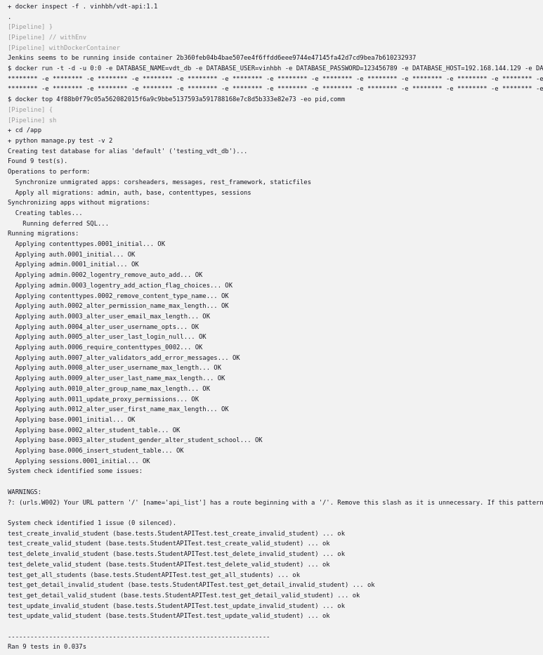

# Bài tập lớn giữa kỳ chương trình VDT 2024 lĩnh vực Cloud

## Phát triển một 3-tier web application đơn giản

### Yêu cầu:

- Hiển thị danh sách sinh viên tham gia chương trình VDT2024 dưới dạng bảng với các thông tin sau: Họ và tên, Giới tính, trường đang theo học. 
- Cho phép xem chi tiết/thêm/xóa/cập nhật thông tin sinh viên.

### Hình ảnh kết quả 

#### Web service
Web service sử dụng framework ReactJs
- Chức năng danh sách thí sinh

- Chức năng xem thông tin chi tiết thí sinh

- Chức năng thêm một thí sinh

- Chức năng cập nhật một thí sinh

- Chức năng xóa một thí sinh

#### Api service
Api service sử dụng framework Django
- API list danh sách thí sinh (url: http://192.168.144.135:8001/api/students/)

- API get thí sinh (url: http://192.168.144.135:8001/api/students/1)

- API thêm một thí sinh () (url: http://192.168.144.135:8001/api/students/create, method: POST)

- API cập nhật một thí sinh (url: http://192.168.144.135:8001/api/students/update/79, method: PUT)

- API xóa một thí sinh (url: http://192.168.144.135:8001/api/students/delete/78, method: DELETE)

#### Database service
Database Postgres được triển khai sử dụng docker, danh sách các bảng sau khi migrate từ backend Django

#### Unit test cho các API: Unit test được chạy trên một database test khác với database chính của API

Mã nguồn unit test: https://github.com/Vinh1507/vdt-api/blob/main/vdt_api/base/tests.py

### Mã nguồn từng dịch vụ

#### Web service: https://github.com/Vinh1507/vdt-web
#### Api service: https://github.com/Vinh1507/vdt-api

## Triển khai web application sử dụng các DevOps tools & practices

### 1. Containerization
Triển khai 3-tier web sử dụng Docker và Docker compose
- Dockerfile cho dịch vụ Web: https://github.com/Vinh1507/vdt-web/blob/main/Dockerfile
- Dockerfile cho dịch vụ API: https://github.com/Vinh1507/vdt-api/blob/main/vdt_api/Dockerfile
- Dockerfile cho dịch vụ DB: https://github.com/Vinh1507/vdt-db/blob/main/Dockerfile

#### Web Service Containerization
Dockerfile cho dịch vụ web sử dụng thủ thuật multi-stage build, giúp giảm kích thước image và giảm thời gian chạy bằng cách tách môi trường build khỏi môi trường run-time

- Output lệnh build: (image: vinhbh/vdt_web:1.0)

- Docker history của Web image (image: vinhbh/vdt_web:1.0)

#### API Service Containerization
Dockerfile cho dịch vụ API sử dụng layer caching trong việc cài đặt các thư viện cần thiết (copy requirements.txt) riêng biệt. Nếu file requirements.txt không thay đổi, Docker sẽ tái sử dụng cached layer để tiết kiệm thời gian build. Đồng thời khi cài đặt sử dụng câu lệnh 'pip install --no-cache-dir' để đảm bảo không sử dụng cache trong quá trình cài đặt các dependencies, điều này giúp giảm kích thước của các cache không cần thiết bên trong image, từ đó giảm kích thước image.

- Output lệnh build: (image: vinhbh/vdt_api:2.0)

- Docker history của API image (image: vinhbh/vdt_api:2.0)

#### DB Service Containerization
Dockerfile cho dịch vụ DB được buidl từ base image postgres:lastest
- Output lệnh build: (image: vinhbh/vdt_db:1.0)

- Docker history của DB image (image: vinhbh/vdt_db:1.0)

### 2. Continuous Integration
Hệ thống sử dụng Jenkins trong quá trình thực hiện CI.

Cấu hình job trên Jenkins: 
- Sử dụng multi branch pipeline
- Sử dụng github webhook khi có sự kiện tạo pull request và push commit
- Sử dụng github integration jenkins plugin

#### File cài đặt Jenkins với Docker: 
Dockerfile: https://github.com/Vinh1507/vdt-ci/blob/main/jenkins/Dockerfile

Docker compose: https://github.com/Vinh1507/vdt-ci/blob/main/jenkins/docker-compose.yml
#### File setup CI cho API service: https://github.com/Vinh1507/vdt-api/blob/main/Jenkinsfile

#### Output log của luồng CI
- stage Checkout SCM:

- stage Checkout Git

- stage Build Image (Tạo docker image từ source code mới nhất trên branch git)

- stage Run Test (Sử dụng docker inside và chạy lênh test bên trong container được tạo bới image trong bước trước)

- Khi có sự kiện push commit lên 1 nhánh

- Khi có sự kiện tạo pull request vào branch main

