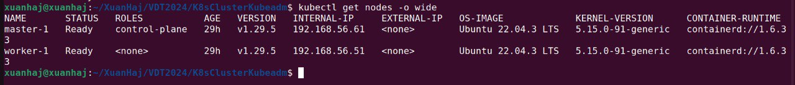

# Báo Cáo Triển Khai Kubernetes

## 1. Set up Máy Ảo

Để thiết lập môi trường ảo hóa, chúng ta sử dụng Vagrant và VirtualBox. Với hai công cụ này, ta có thể dễ dàng khởi tạo và quản lý các máy ảo.

### Cấu hình Vagrant

Chúng ta sử dụng lệnh `vagrant up` để khởi tạo hai máy ảo với các địa chỉ IP lần lượt là `192.168.56.51` và `192.168.56.61`.

Link tới file Vagrantfile: [Vagrantfile](https://github.com/vuitinhvl7x/K8S-config/blob/main/Vagrantfile)

## 2. Dùng Ansible để triển khai Kubernetes Cluster với Kubeadmin

Để triển khai Kubernetes cluster, chúng ta sử dụng Ansible. Công cụ này giúp tự động hóa quá trình cài đặt và cấu hình các thành phần của Kubernetes.

### Cấu hình Ansible

Link tới repository Ansible:

[Inventory](https://github.com/vuitinhvl7x/K8S-config/blob/main/playbook/inventory.yml)

[Playbook](https://github.com/vuitinhvl7x/K8S-config/blob/main/playbook/playbook.yml)

Sau khi triển khai xong, ta cần xuất biến môi trường để kết nối tới Kubernetes cluster: `export KUBECONFIG=~/.kube-local/config
`
Kiểm tra các node trong cluster

Để kiểm tra thông tin chi tiết về các node (bao gồm master và worker), ta sử dụng lệnh: `kubectl get nodes -o wide`

Output: 
