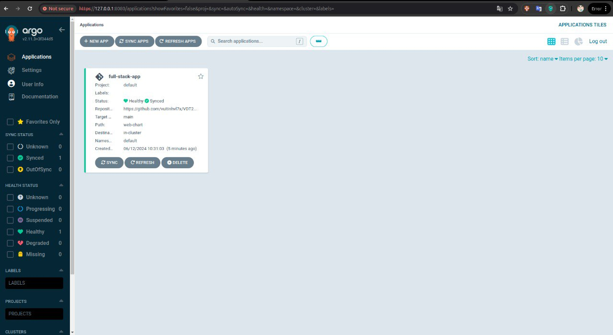
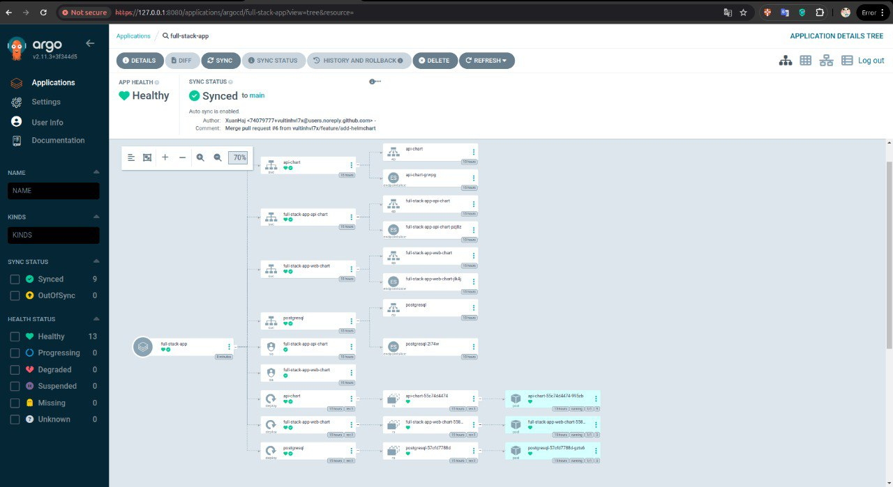
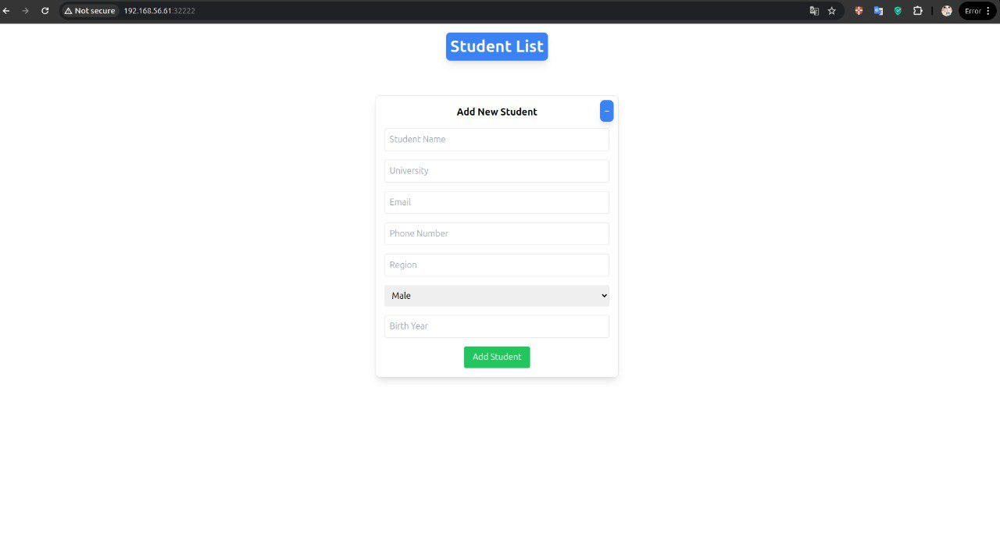
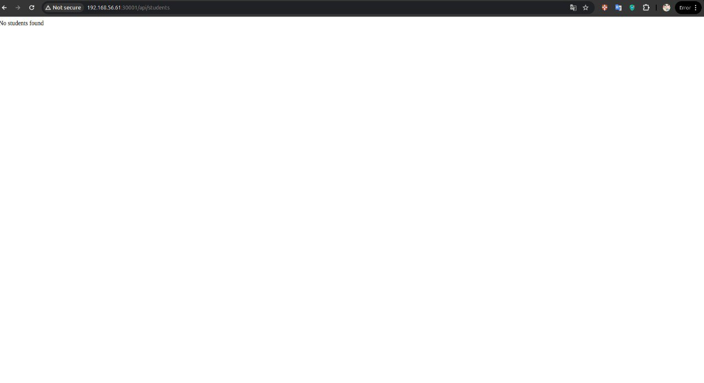

## Cài đặt Argocd

- Cài đặt argocd sử dụng manifest gốc https://raw.githubusercontent.com/argoproj/argo-cd/stable/manifests/install.yaml

```bash
kubectl create namespace argocd
kubectl apply -f https://raw.githubusercontent.com/argoproj/argo-cd/stable/manifests/install.yaml
```

- Đổi service argocd type sang NodePort bằng lệnh:

```bash
kubectl apply -f argocd-server-service.yaml

```

Link tới file argocd-server-service.yaml: [argocd-server-service.yaml](https://github.com/vuitinhvl7x/K8S-config/blob/main/mainfests/argocd-server-service.yaml)


- Lấy mật khẩu khởi tạo của argocd

```bash
kubectl -n argocd get secret argocd-initial-admin-secret -o jsonpath="{.data.password}" | base64 -d
```

## Giao diện của ArgoCD



## Web Deployment

Link tới source code của Web Deployment: [Web Deployment Source Code](https://github.com/vuitinhvl7x/VDT2024-Midterm-api/tree/dev/api-chart)

## API Deployment

Link tới source code của API Deployment: [API Deployment Source Code](https://github.com/vuitinhvl7x/VDT2024-Midterm-frontend/tree/main/web-chart)

## Repo Config

### Config cho Web

Link tới source code config cho Web: [Web Config Source Code](https://github.com/vuitinhvl7x/VDT2024-web-config/blob/main/values.yaml)

### Config cho API

Link tới source code config cho API: [API Config Source Code](https://github.com/vuitinhvl7x/VDT2024-api-config/blob/main/values.yaml)

## Triển khai ứng dụng sử dụng tính năng multisources của ArgoCD

ArgoCD là một công cụ triển khai liên tục (CD) cho Kubernetes, cho phép triển khai các ứng dụng từ nhiều nguồn khác nhau.

### File manifest multisource của ứng dụng

Link tới file manifest: [Multisource Manifest](https://github.com/vuitinhvl7x/K8S-config/blob/main/mainfests/full-stack-app-production.yaml)

## Ảnh chụp giao diện



### Giao diện màn hình trình duyệt khi truy cập vào Web URL



### Giao diện màn hình trình duyệt khi truy cập vào API URL


