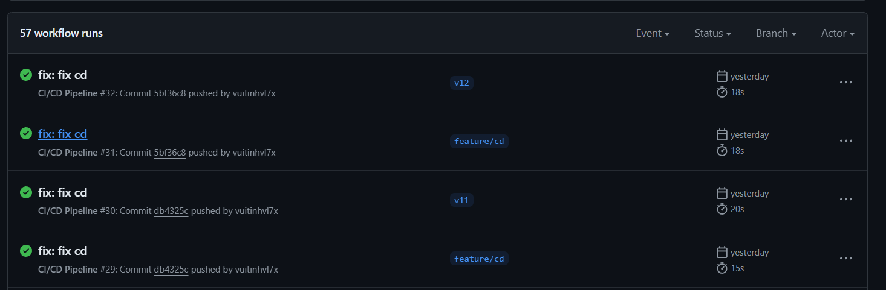
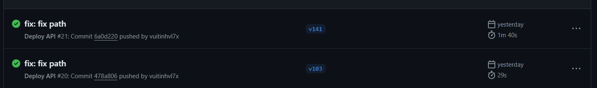
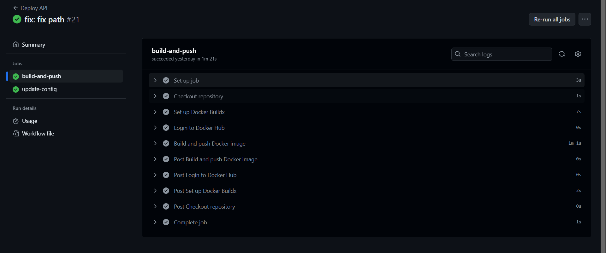
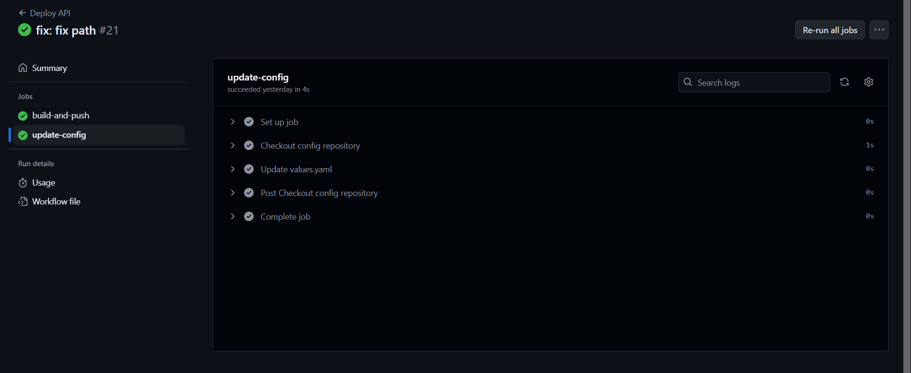
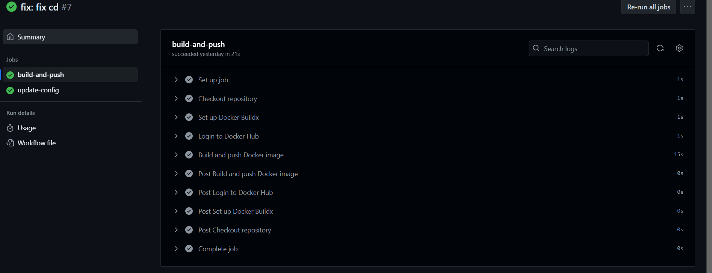
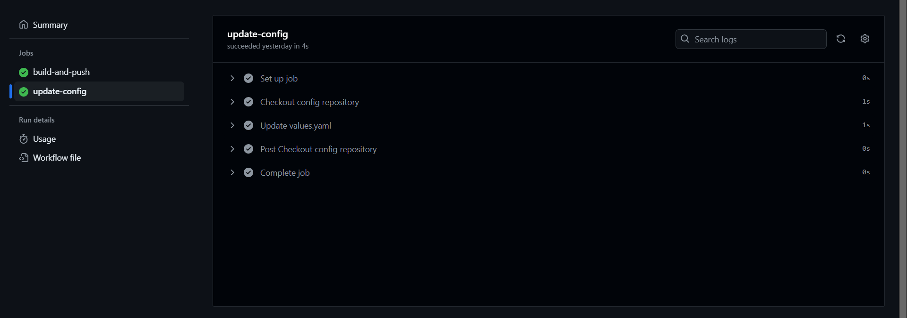
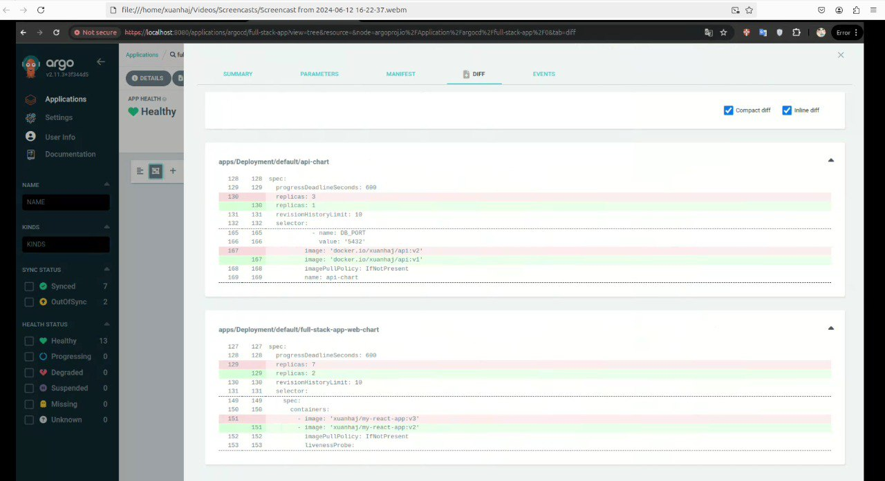

-File setup CD của api: [cd.yml](https://github.com/vuitinhvl7x/VDT2024-Midterm-api/blob/dev/.github/workflows/cd.yml)  
-File setup CD của web: [cd.yml](https://github.com/vuitinhvl7x/VDT2024-Midterm-frontend/blob/main/.github/workflows/cd.yaml)

## 1. CD được trigger khi có event tag

- Ứng dụng web
- Ứng dụng API
 
## 2. Output của luồng

### 2.1. Ứng dụng web

- Output phần build and push 
- Output phần update config

### 2.2 Ứng dụng api

- Output phần build and push
- Output phần update config

## 3. Argo bắt được sự khác nhau khi có thay đổi tag image

