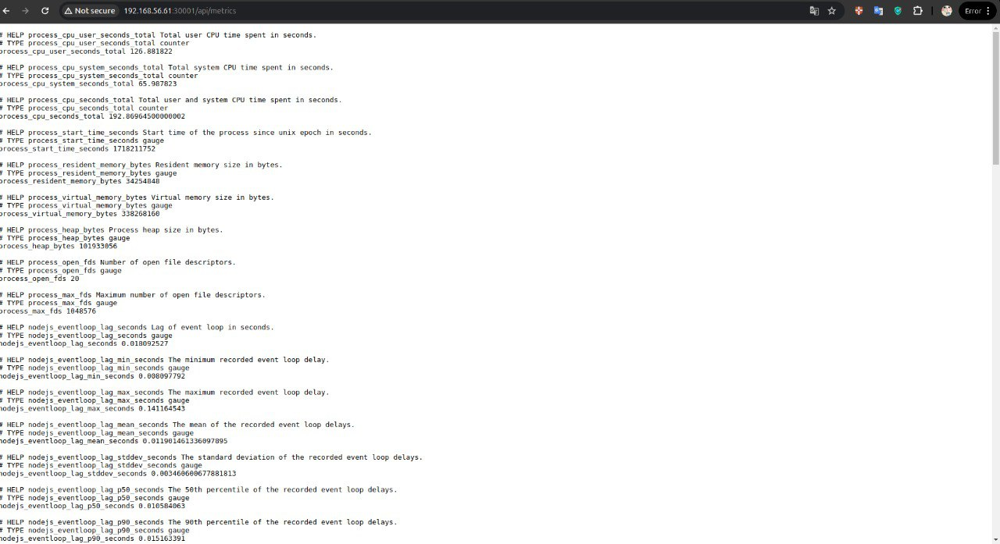
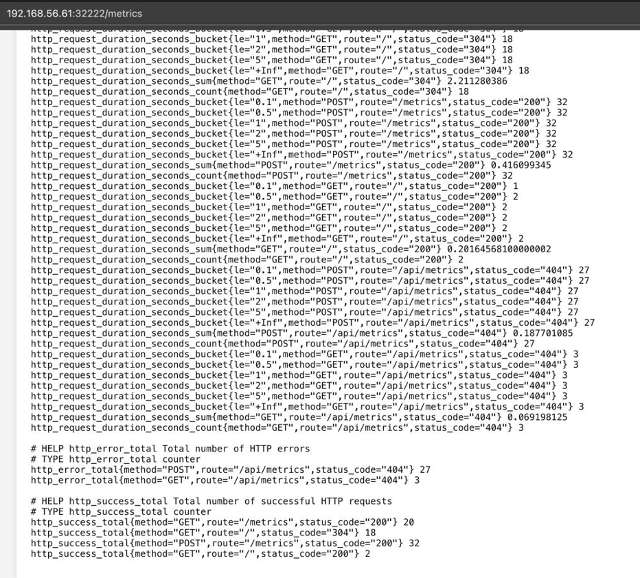
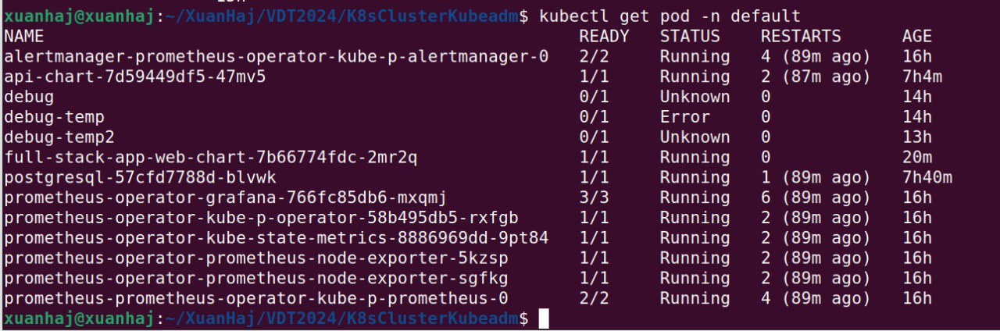
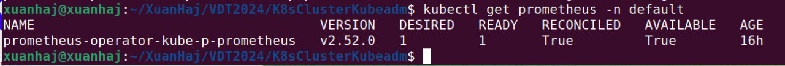
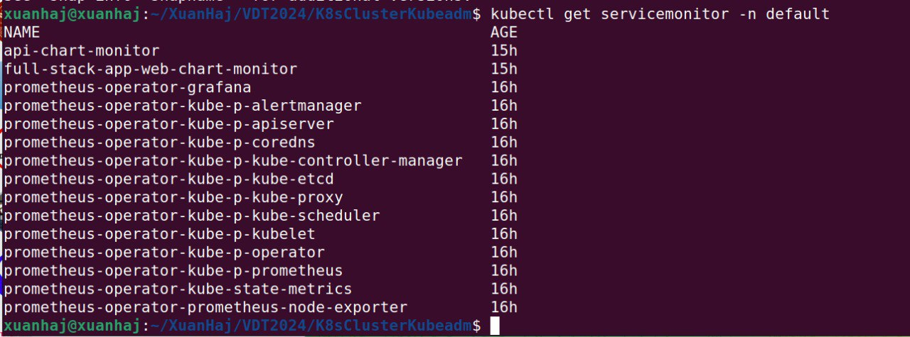
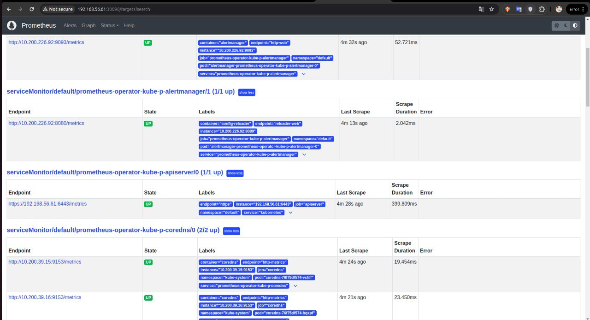

# Triển khai Hệ thống Giám sát Metrics cho Ứng dụng

## 1. Ứng dụng API

### Middleware cho Metrics

Để expose metrics cho ứng dụng, sử dụng `metricsMiddleware` và `prom-client`.

#### Cấu hình Middleware trong `index.js`

```javascript
const {
  httpRequestCounter,
  httpRequestDuration,
} = require("../metrics/metrics");

const metricsMiddleware = (req, res, next) => {
  const end = httpRequestDuration.startTimer();
  res.on("finish", () => {
    httpRequestCounter
      .labels(req.method, req.path, res.statusCode.toString())
      .inc();
    end({
      method: req.method,
      route: req.path,
      status_code: res.statusCode.toString(),
    });
  });
  next();
};

module.exports = metricsMiddleware;
```

```javascript
const client = require("prom-client");
const register = new client.Registry();

client.collectDefaultMetrics({ register });

const createCounter = (name, help, labelNames) => {
  const counter = new client.Counter({ name, help, labelNames });
  register.registerMetric(counter);
  return counter;
};

const createHistogram = (name, help, labelNames, buckets) => {
  const histogram = new client.Histogram({ name, help, labelNames, buckets });
  register.registerMetric(histogram);
  return histogram;
};

const httpRequestCounter = createCounter(
  "http_request_total",
  "Total number of HTTP requests",
  ["method", "route", "status_code"]
);
const httpRequestDuration = createHistogram(
  "http_request_duration_seconds",
  "Duration of HTTP requests in seconds",
  ["method", "route", "status_code"],
  [0.1, 0.5, 1, 2, 5]
);

module.exports = {
  register,
  httpRequestCounter,
  httpRequestDuration,
};
```

## 2. Ứng dụng web

Sử dụng web-vitals

```javascript
import { getCLS, getFID, getLCP, getTTFB, getFCP } from "web-vitals";
import axios from "axios";

const sendToAnalytics = (metric) => {
  const body = JSON.stringify(metric);
  const ANALYTICS_URL = "http://192.168.56.61:30001/metrics"; // Sử dụng URL tuyệt đối

  axios
    .post(ANALYTICS_URL, body, {
      headers: {
        "Content-Type": "application/json",
      },
    })
    .catch((error) => {
      console.error("Error posting data:", error);
    });
};

const reportWebVitals = (onPerfEntry) => {
  if (onPerfEntry && onPerfEntry instanceof Function) {
    getCLS(onPerfEntry);
    getFID(onPerfEntry);
    getLCP(onPerfEntry);
    getTTFB(onPerfEntry);
    getFCP(onPerfEntry);
  }
};

export default (onPerfEntry) => {
  reportWebVitals((metric) => {
    sendToAnalytics(metric);
    if (onPerfEntry) {
      onPerfEntry(metric);
    }
  });
};
```

# Triển khai Prometheus Operator

## 1. Cài đặt Prometheus Operator bằng Helm

- Các bước cài đặt

  - Cài đặt Helm:
    ```bash
    curl https://raw.githubusercontent.com/helm/helm/master/scripts/get-helm-3 | bash
    ```
  - Thêm repository của Prometheus Community:
    ```bash
    helm repo add prometheus-community https://prometheus-community.github.io/helm-charts
    helm repo update
    ```
  - Cài đặt Prometheus Operator:
    ```bash
    helm install prometheus-operator prometheus-community/kube-prometheus-stack -f values.yaml
    ```

## 2. Tạo ServiceMonitor cho ứng dụng

Hình ảnh về metrics khi thử truy vấn api svc 
Hình ảnh về metrics khi thử truy vấn web svc 

## 3 Tạo Servicemonitor cho ứng dụng

#### Ứng dụng web

```yaml
apiVersion: monitoring.coreos.com/v1
kind: ServiceMonitor
metadata:
  name: full-stack-app-web-chart-monitor
  labels:
    release: prometheus-operator
spec:
  selector:
    matchLabels:
      app.kubernetes.io/instance: full-stack-app
      app.kubernetes.io/name: web-chart
  endpoints:
    - port: http
      path: /api/metrics
      scheme: http
```

#### Ứng dụng api

```yaml
apiVersion: monitoring.coreos.com/v1
kind: ServiceMonitor
metadata:
  name: api-chart-monitor
  labels:
    release: prometheus-operator
spec:
  selector:
    matchLabels:
      app: api-chart
  endpoints:
    - port: api
      path: /api/metrics
      scheme: http
```

### Kết quả sau khi tạo








