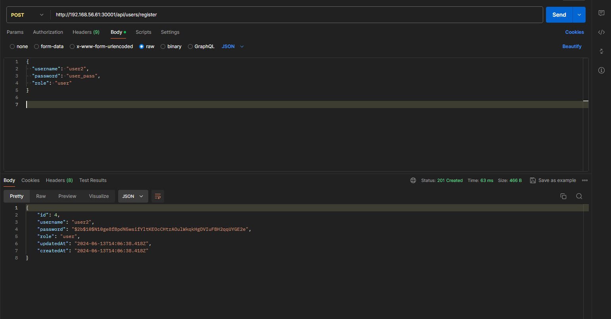
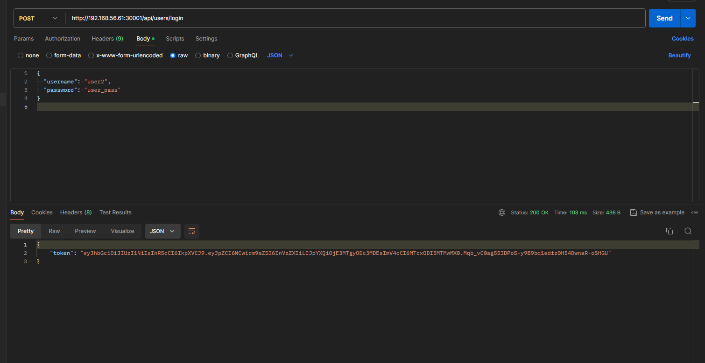
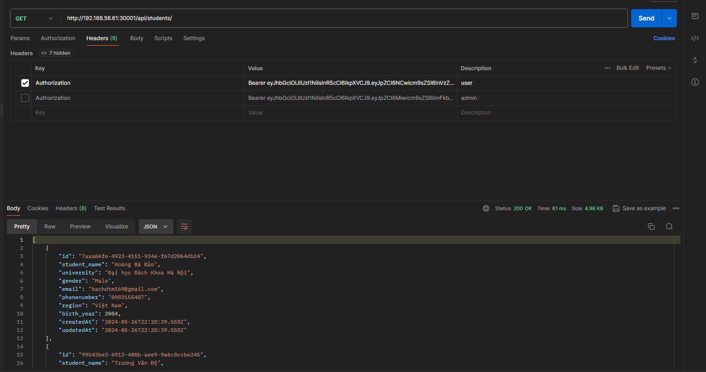
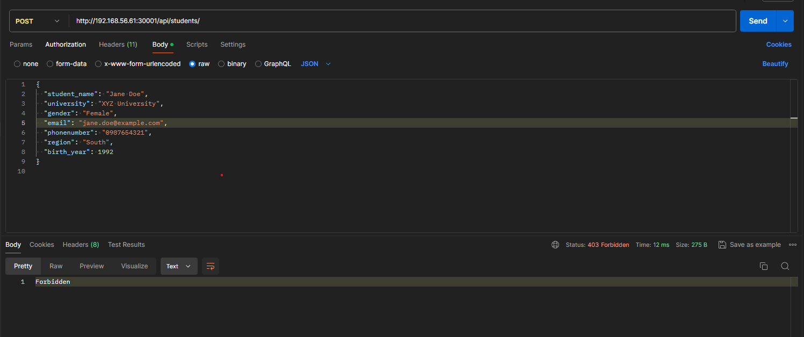
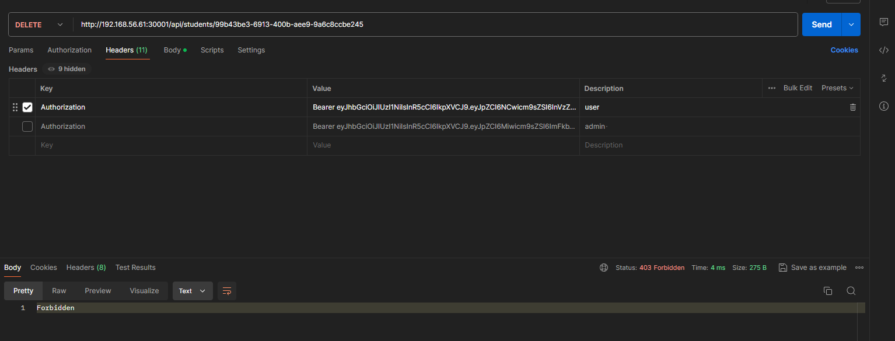
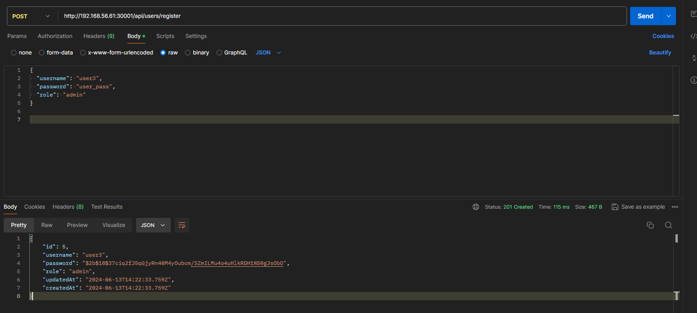
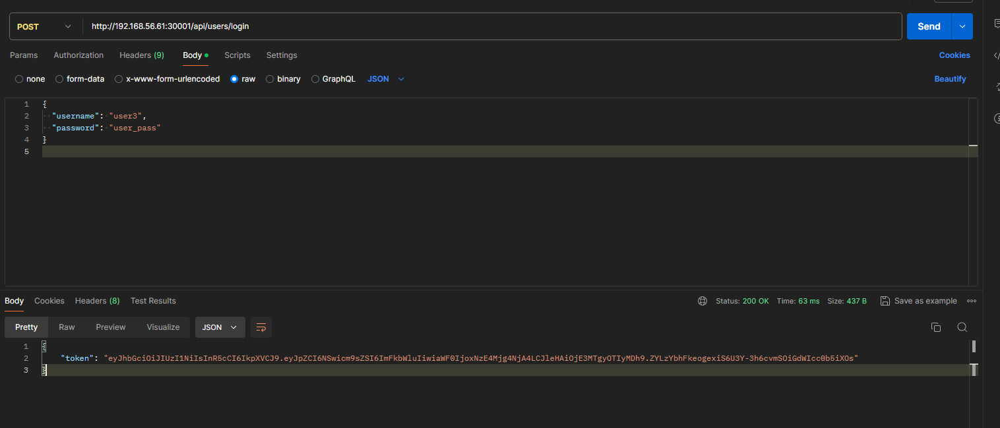
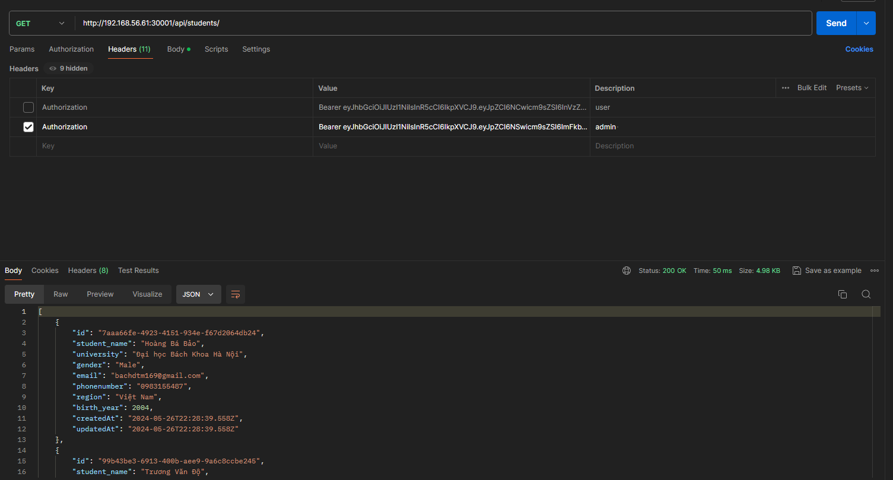
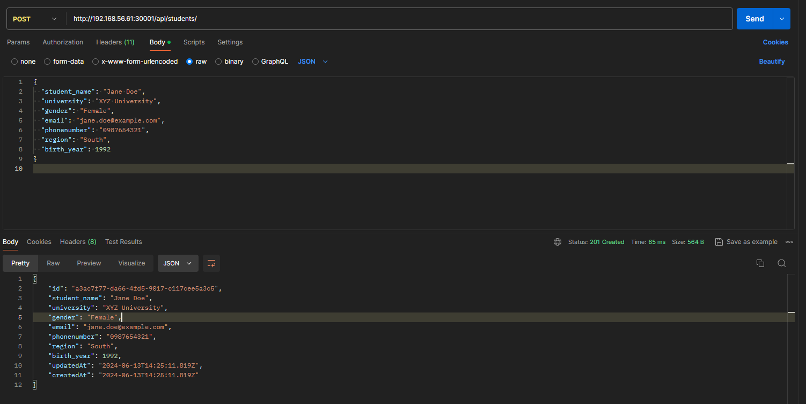
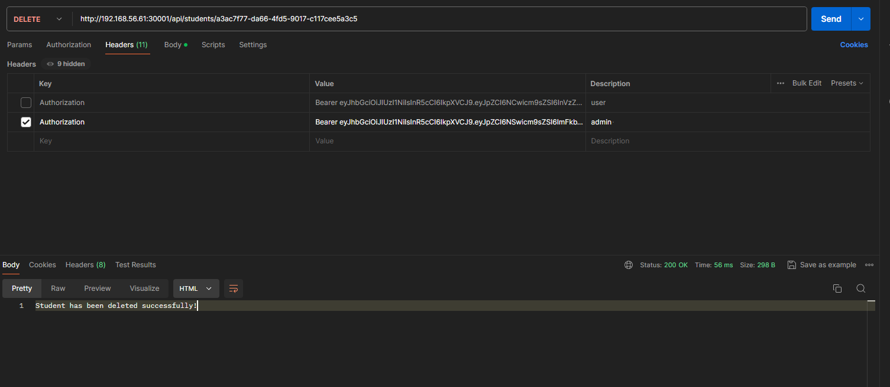

# Báo Cáo Triển Khai API Service với Xác Thực và Phân Quyền

## Tổng quan

Triển khai một API service sử dụng Express.js và PostgreSQL. Dịch vụ API này được bảo mật bằng cách sử dụng JSON Web Tokens (JWT) cho xác thực và phân quyền người dùng.

## Giải Pháp

### Mục Tiêu

- Đảm bảo các API chỉ có thể được truy cập bởi các người dùng đã xác thực.
- Phân quyền truy cập API dựa trên role của người dùng.

### Phương Pháp

- Sử dụng JWT để xác thực người dùng. Khi người dùng đăng nhập thành công, một token sẽ được tạo và gửi về cho người dùng.
- Sử dụng middleware để xác thực token và phân quyền người dùng trước khi cho phép truy cập các endpoint.

### Các Bước Triển Khai

1. Cài đặt các thư viện cần thiết: `express`, `jsonwebtoken`, `bcrypt`, `pg`.
2. Tạo model và controller cho người dùng để quản lý việc đăng ký và đăng nhập.
3. Tạo middleware để xác thực token và phân quyền dựa trên role của người dùng.
4. Cập nhật các route để sử dụng middleware xác thực và phân quyền.
5. Kiểm tra API bằng Postman để đảm bảo rằng các yêu cầu xác thực và phân quyền hoạt động đúng.

## 2. Tạo Model và Controller

### 2.1 Tạo Model cho User

**models/User.js:**

```javascript
const { Model, DataTypes } = require("sequelize");
const sequelize = require("../config/database");

class User extends Model {}

User.init(
  {
    username: {
      type: DataTypes.STRING,
      allowNull: false,
      unique: true,
    },
    password: {
      type: DataTypes.STRING,
      allowNull: false,
    },
    role: {
      type: DataTypes.ENUM("user", "admin"),
      allowNull: false,
    },
  },
  {
    sequelize,
    modelName: "user",
  }
);

module.exports = User;
```

### 2.2 Tạo Controller cho User

```javascript
const bcrypt = require("bcrypt");
const jwt = require("jsonwebtoken");
const User = require("../models/User");

const secretKey = process.env.JWT_SECRET;

exports.register = async (req, res) => {
  const { username, password, role } = req.body;
  try {
    const hashedPassword = await bcrypt.hash(password, 10);
    const user = await User.create({
      username,
      password: hashedPassword,
      role,
    });
    res.status(201).json(user);
  } catch (error) {
    res.status(400).json({ error: error.message });
  }
};

exports.login = async (req, res) => {
  const { username, password } = req.body;
  try {
    const user = await User.findOne({ where: { username } });
    if (!user || !(await bcrypt.compare(password, user.password))) {
      return res.status(401).json({ error: "Invalid credentials" });
    }
    const token = jwt.sign({ id: user.id, role: user.role }, secretKey, {
      expiresIn: "1h",
    });
    res.json({ token });
  } catch (error) {
    res.status(500).json({ error: error.message });
  }
};
```

### 2.3 Tạo Middleware cho Xác Thực và Phân Quyền

```js
const jwt = require("jsonwebtoken");
const secretKey = process.env.JWT_SECRET;

const authenticateToken = (req, res, next) => {
  const authHeader = req.headers["authorization"];
  const token = authHeader && authHeader.split(" ")[1];

  if (!token) return res.sendStatus(403);

  jwt.verify(token, secretKey, (err, user) => {
    if (err) return res.sendStatus(403);
    req.user = user;
    next();
  });
};

const authorizeRole = (role) => {
  return (req, res, next) => {
    if (req.user.role !== role) return res.sendStatus(403);
    next();
  };
};

module.exports = { authenticateToken, authorizeRole };
```

### 2.4 Cập Nhật studentRouter.js để Sử Dụng Xác Thực và Phân Quyền

```js
const express = require("express");
const router = express.Router();
const studentController = require("../controllers/studentController");
const {
  authenticateToken,
  authorizeRole,
} = require("../middleware/authMiddleware");

// Define routes
router.get("/", authenticateToken, studentController.findAll);
router.get("/:id", authenticateToken, studentController.findById);
router.post(
  "/",
  authenticateToken,
  authorizeRole("admin"),
  studentController.create
);
router.put(
  "/:id",
  authenticateToken,
  authorizeRole("admin"),
  studentController.update
);
router.delete(
  "/:id",
  authenticateToken,
  authorizeRole("admin"),
  studentController.deleteById
);

module.exports = router;
```

### 2.5 Tạo Router cho User

```js
const express = require("express");
const router = express.Router();
const userController = require("../controllers/userController");

// Define routes
router.post("/register", userController.register);
router.post("/login", userController.login);

module.exports = router;
```

## 3. Kiểm Tra Ứng Dụng Bằng Postman

## ROLE USER

#### Đăng Ký User Mới



#### Đăng nhập User



#### GET Request:



#### POST Request



#### DELETE Request



## ROLE ADMIN

#### Đăng Ký User Mới



#### Đăng nhập User



#### GET Request:



#### POST Request



#### DELETE Request


