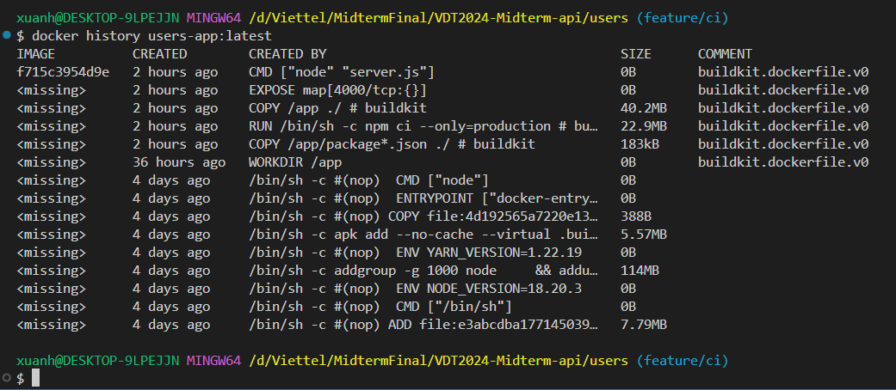

# Bài tập lớn giữa kỳ chương trình VDT 2024 lĩnh vực Cloud

## Phát triển một 3-tier web application đơn giản

### 1. Chức năng

- Hiển thị danh sách sinh viên tham gia chương trình VDT2024 dưới dạng bảng với các thông tin: Họ và tên, Giới tính, và Trường đang theo học.
- Cho phép xem chi tiết, thêm, xóa, và cập nhật thông tin sinh viên.

### 2. Kiến trúc hệ thống

Hệ thống được thiết kế với ba dịch vụ:

- **web**: React
- **api**: Js, Express
- **db**: Postgresql

### 3. Kho mã nguồn

- [Web](https://github.com/vuitinhvl7x/VDT2024-Midterm-frontend)
- [API](https://github.com/vuitinhvl7x/VDT2024-Midterm-api)

### 4. Output

- Hiển thị danh sách sinh viên  
  

- Thêm sinh viên mới
  

- Xóa sinh viên
  

- Xem chi tiết
  

- Cập nhật thông tin
  

## Triển khai web application sử dụng các DevOps tools & practices

### 1. Containerization

- **API** :

  - Source code

    - [Dockerfile](https://github.com/vuitinhvl7x/VDT2024-Midterm-api/blob/main/users/Dockerfile)
    - [Docker-compose](https://github.com/vuitinhvl7x/VDT2024-Midterm-api/blob/main/users/docker-compose.yml)

  - History image
    
    

- **WEB** :

  - Source code

    - [Dockerfile](https://github.com/vuitinhvl7x/VDT2024-Midterm-frontend/blob/main/Dockerfile)

  - History image
    

### 2. Continuous Integration

- Source code: [here](https://github.com/vuitinhvl7x/VDT2024-Midterm-api/blob/main/.github/workflows/ci.yml)

- Output:
    
  

### 3. Automation

- Source code: [here](https://github.com/vuitinhvl7x/VDT2024-Midterm-Ansible)
- Output:
  - Log
    

### 4. Research topic: [Security in Docker](./Research%20topic/README.md)
