# Docker Security

## Giới thiệu

Docker là một trong những nền tảng container hóa phổ biến nhất hiện nay. Với khả năng tách biệt phần mềm và các phụ thuộc của nó thành các đơn vị độc lập, Docker cho phép chạy ứng dụng một cách độc lập trên cùng một máy chủ.
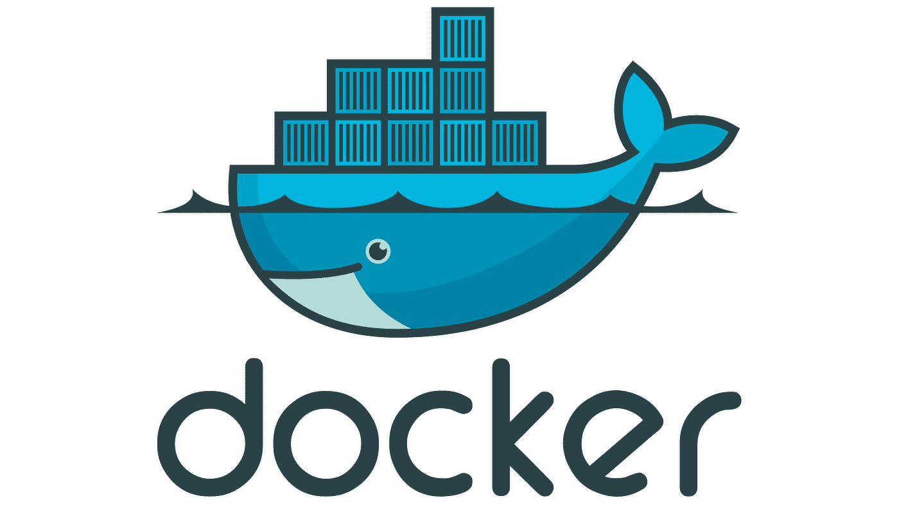
Mô hình cách ly của Docker mang lại một lớp bảo mật bổ sung cho các khối lượng công việc trong container. Bằng cách phân chia các ứng dụng thành các container riêng biệt, Docker giúp giảm thiểu tác động của các lỗi và vấn đề phát sinh giữa chúng. Tuy nhiên, việc sử dụng Docker cũng mang lại những rủi ro bảo mật mới nếu không triển khai và cấu hình môi trường một cách cẩn thận.

Vậy làm thế nào để đảm bảo tính bảo mật của Docker? Hãy cùng khám phá các biện pháp bảo mật và các chiến lược phòng ngừa để tối ưu hóa an ninh cho môi trường Docker của bạn.

## Docker hoạt động như thế nào ?

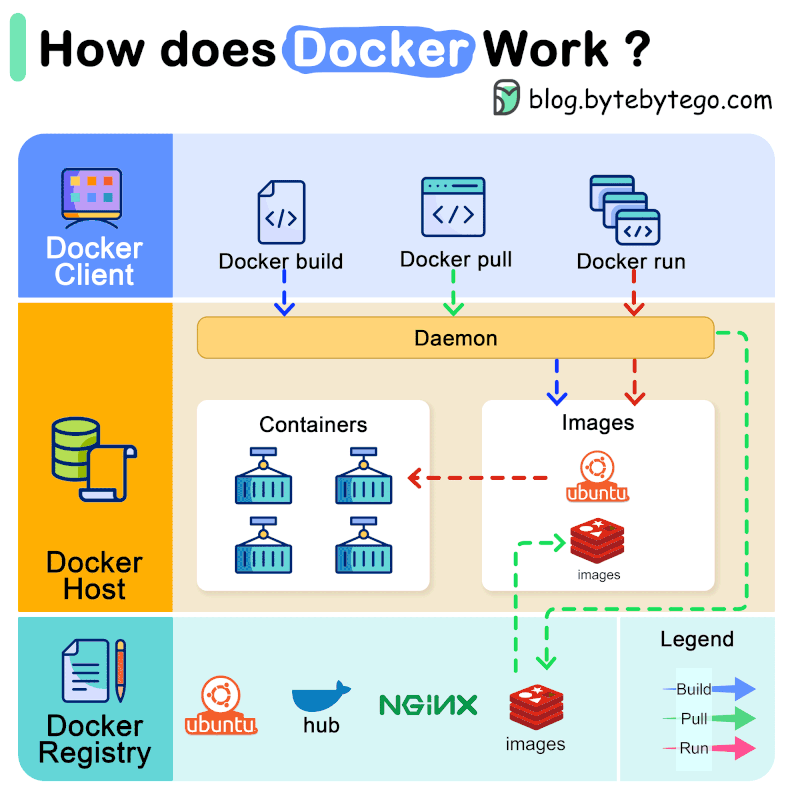

- **Docker là một hệ điều hành dành cho vùng chứa:**

  - Cung cấp cách tiêu chuẩn để chạy mã.
  - Bộ chứa ảo hóa hệ điều hành của máy chủ và Docker được cài đặt trên mỗi máy chủ để cung cấp các lệnh đơn giản.

- **Chạy ứng dụng trong vùng chứa:**

  - Docker cho phép đóng gói và chạy ứng dụng trong các container.
  - Mỗi container chứa mọi thứ cần thiết để ứng dụng hoạt động và chia sẻ dịch vụ của một hệ điều hành cơ bản.

- **Cơ chế cách ly tài nguyên:**

  - Docker sử dụng cách ly tài nguyên trong kernel của hệ điều hành để chạy nhiều container trên cùng một hệ điều hành.

- **Quản lý nhiều container:**

  - Có thể chạy nhiều container cùng lúc trên một máy chủ và chia sẻ chúng giữa các môi trường làm việc khác nhau.

- **Giảm độ trễ:**

  - Docker giúp giảm đáng kể độ trễ giữa việc viết mã và chạy mã trong môi trường sản xuất.

- **Sử dụng hình ảnh và vùng chứa:**

  - Hình ảnh Docker chứa tất cả các phần phụ thuộc cần thiết để thực thi mã bên trong vùng chứa.

- **Kiến ​​trúc client-server:**

  - Docker sử dụng kiến ​​trúc client-server, với máy khách gửi lệnh tới daemon Docker để quản lý các đối tượng Docker.

- **Sổ đăng ký Docker:**

  - Cơ quan đăng ký Docker lưu trữ hình ảnh Docker, ví dụ như Docker Hub, cho phép bạn tìm kiếm và chia sẻ hình ảnh.

- **Vùng chứa và điều khiển:**

  - Vùng chứa là phiên bản có thể chạy được của một hình ảnh, có thể tạo, di chuyển hoặc xóa chúng bằng API Docker hoặc CLI.

- **Ứng dụng Docker Desktop:**
  - Có thể cài đặt Docker Desktop để dễ dàng sử dụng và quản lý các môi trường Docker trên máy tính.

## Tại sao bảo mật container Docker lại là một thách thức

1. **Sự đơn giản của máy ảo và máy chủ truyền thống trong việc bảo mật:**

   - Trước khi Docker trở nên phổ biến, các tổ chức thường sử dụng máy ảo hoặc máy chủ cơ bản để lưu trữ ứng dụng.
   - Từ góc độ bảo mật, các công nghệ này tương đối đơn giản vì chỉ cần tập trung vào hai lớp: môi trường máy chủ và ứng dụng.

2. **Sự phức tạp của bảo mật Docker:**

   - Bảo mật vùng chứa Docker phức tạp hơn do môi trường Docker có nhiều bộ phận chuyển động hơn cần được bảo vệ.
   
   - Các phần đó bao gồm:
     - Thùng chứa Docker: Cần bảo mật và giám sát từng hình ảnh và phiên bản container riêng biệt.
     - Daemon Docker: Cần được bảo mật để đảm bảo an toàn cho các container.
     - Máy chủ lưu trữ: Có thể là máy chủ hoặc máy ảo.
     - Lớp mạng và API: Để hỗ trợ giao tiếp giữa các container.
     - Khối lượng dữ liệu hoặc hệ thống lưu trữ bên ngoài vùng chứa.

3. **Khó khăn trong việc bảo mật Docker:**
   - **Phân tán rộng rãi:** Các thành phần được phân tán rộng rãi, không có một điểm truy cập duy nhất cho tất cả các thực thể đang được giám sát. Mỗi yếu tố đều phải nhận được sự quan tâm toàn diện.
   - **Không có giải pháp chung:** Không có phương pháp "một kích thước phù hợp cho tất cả". Các phương pháp bảo mật cho hình ảnh vùng chứa có thể không phù hợp với cơ sở hạ tầng hướng vùng chứa.
   - **Bảo mật mạng:** Các container sử dụng địa chỉ IP động, làm cho việc bảo vệ trở nên khó khăn do các địa chỉ này được cập nhật động.
   - **Liên kết chặt chẽ:** Mặc dù các thành phần được phân bố, chúng vẫn liên kết chặt chẽ với nhau. Lỗi hình ảnh vùng chứa có thể ảnh hưởng đến thời gian chạy của vùng chứa và ngược lại, gây khó khăn cho việc bảo vệ hoàn toàn.
   - **Tuân thủ:** Có nhiều yêu cầu tuân thủ như SOC-2, GDPR, HIPAA và PCI DSS với các thông số và tiêu chuẩn bảo mật khác nhau, làm cho việc đáp ứng tất cả các tiêu chuẩn này trở nên phức tạp.

## Các loại giải pháp bảo mật container

#### Công cụ giám sát
- Các công cụ bảo mật vùng chứa đầy đủ tính năng cho phép nhóm bảo mật ứng dụng (AppSec) giám sát hiệu suất của ứng dụng trong suốt quá trình.
- Do các container có tính tạm thời, việc xử lý chúng trở nên phức tạp. Việc giám sát giải pháp dựa trên container cũng tốn thời gian và công sức.
- Với các công cụ giám sát tự động, có thể thu thập dữ liệu hiệu suất ứng dụng theo thời gian thực ở quy mô lớn. Không chỉ thu thập dữ liệu hiệu suất mà còn phân tích chúng mà không có lỗi.
- Các công cụ này có khả năng hoạt động dễ dàng và hoàn hảo khi các cụm và khối lượng công việc tăng hoặc giảm.
- Các công cụ giám sát rất quan trọng vì chúng cho phép các doanh nghiệp đảm bảo rằng các ứng dụng và cơ sở hạ tầng dựa trên container hoạt động tối ưu. Các giải pháp giám sát nâng cao có thể theo dõi mức sử dụng CPU và dữ liệu lịch sử, giúp các nhà phân tích xác định nguyên nhân chính gây ra sự cố.

#### Máy quét vùng chứa
- Việc sử dụng các công cụ quét bảo mật vùng chứa được ưu tiên để xác nhận rằng chỉ những hình ảnh vùng chứa đã được xác thực và đáng tin cậy mới tham gia vào quy trình SDLC, do hình ảnh vùng chứa được lấy từ nhiều nguồn.
- Các vấn đề bảo mật hoặc lỗ hổng ẩn trong các cụm, mẫu IaC và container đều có thể được kiểm tra đồng thời bằng các máy quét vùng chứa hiện đại.

#### Mạng lưới vùng chứa
- Các công cụ liên quan đến mạng lưới đặc thù của vùng chứa được sử dụng rộng rãi để thiết lập kết nối ảo hóa và tối ưu hóa cao giữa các container liên quan.
- Ở mức độ cơ bản, kỹ thuật này có trách nhiệm tích hợp nhiều ứng dụng dựa trên container để chúng có thể tích hợp vào một hệ sinh thái bảo mật cao.
- Dựa trên nhu cầu tổ chức và khả năng của các công cụ mạng lưới vùng chứa được sử dụng, có thể tích hợp nhiều mạng lưới đồng thời. Mặc dù tồn tại một vài mạng, các công cụ này làm cho tất cả các mạng liên quan hoàn toàn biệt lập.
- Tính khả thi của các công cụ này rất quan trọng vì chúng làm cho dữ liệu dễ dàng truy cập mà không làm suy giảm tính bảo mật và toàn vẹn dữ liệu. Bằng cách này, chúng đóng góp đáng kể vào khả năng kết nối của các dịch vụ vi mô và ứng dụng phân tán.


## Best Practices cho Docker

### 1. Bảo mật Docker Daemon
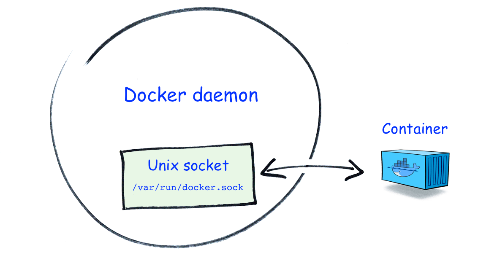
Kiến trúc của Docker dựa trên daemon, nghĩa là CLI của máy khách giao tiếp với dịch vụ nền để thực hiện các hành động như xây dựng hình ảnh và khởi động vùng chứa. Việc bảo vệ daemon là rất quan trọng vì quyền truy cập vào nó cho phép thực thi các lệnh Docker trên máy chủ.


1. **Không để lộ socket của Docker daemon**
   - Docker daemon thường được truy cập qua Unix socket tại `/var/run/docker.sock`. Tuy nhiên, có thể cấu hình để lắng nghe trên TCP socket, cho phép kết nối từ xa.
   - Tránh cấu hình này vì nó tạo ra điểm tấn công bổ sung. Để lộ TCP socket trên mạng công cộng cho phép bất kỳ ai gửi lệnh đến Docker API mà không cần truy cập vật lý vào máy chủ. Giữ TCP bị vô hiệu hóa trừ khi cần truy cập từ xa.

2. **Sử dụng TLS nếu phải để lộ socket của daemon**
   - Nếu bắt buộc phải sử dụng TCP, bảo vệ socket bằng TLS để chỉ cho phép các client có chứng chỉ hợp lệ truy cập.
   - Dù sử dụng TCP với TLS vẫn tiềm ẩn rủi ro vì bất kỳ client nào có chứng chỉ đều có thể tương tác với Docker. Có thể sử dụng kết nối dựa trên SSH để giao tiếp với Docker daemon, tận dụng các khóa SSH hiện có.

3. **Kích hoạt chế độ không root nếu có thể**
   - Docker mặc định chạy cả daemon và container dưới quyền root. Điều này có thể cho phép các lỗ hổng trong daemon hoặc container cho phép kẻ tấn công thực thi lệnh tùy ý trên host.
   - Chế độ không root là một tính năng tùy chọn cho phép khởi động Docker daemon mà không cần quyền root. Dù phức tạp hơn để thiết lập và có một số hạn chế, nhưng nó cung cấp thêm một lớp bảo vệ hữu ích cho các môi trường sản xuất nhạy cảm về bảo mật.

4. **Cập nhật Docker thường xuyên**
   - Duy trì bảo mật Docker bằng cách luôn cập nhật các phiên bản mới nhất. Docker thường xuyên phát hành các bản vá sửa các vấn đề bảo mật mới. Chạy phiên bản cũ có thể thiếu các biện pháp bảo vệ cho các lỗ hổng có thể khai thác.
   - Thường xuyên áp dụng các cập nhật từ trình quản lý gói OS để đảm bảo bảo vệ tốt nhất.

5. **Vô hiệu hóa giao tiếp giữa các container**
   - Docker cho phép giao tiếp tự do giữa các container chạy trên host. Mỗi container mới tự động được thêm vào mạng cầu `docker0`, cho phép nó khám phá và liên lạc với các container khác.
   - Giữ giao tiếp giữa các container (ICC) mở là rủi ro vì có thể cho phép một quy trình độc hại tấn công các container lân cận. Tăng cường bảo mật bằng cách khởi động Docker daemon với ICC bị vô hiệu hóa (sử dụng cờ `--icc=false`), sau đó cho phép giao tiếp giữa các container cụ thể bằng cách tạo mạng thủ công.

6. **Kích hoạt các biện pháp bảo vệ bảo mật ở mức hệ điều hành (SELinux/Seccomp/AppArmor)**
   - Đảm bảo các hệ thống bảo mật ở mức hệ điều hành hoạt động giúp bảo vệ chống lại hoạt động độc hại từ trong các container và Docker daemon. Docker hỗ trợ các chính sách cho SELinux, Seccomp và AppArmor; giữ chúng hoạt động để đảm bảo các giá trị mặc định hợp lý được áp dụng cho các container, bao gồm các hạn chế cho các cuộc gọi hệ thống nguy hiểm.

7. **Củng cố máy chủ**
   - Bảo mật Docker chỉ tốt khi bảo vệ xung quanh máy chủ được đảm bảo. Củng cố môi trường máy chủ bằng các biện pháp như cập nhật thường xuyên OS và kernel của máy chủ, kích hoạt tường lửa và cách ly mạng, và hạn chế truy cập trực tiếp vào máy chủ chỉ cho những quản trị viên cần thiết.

8. **Kích hoạt ánh xạ không gian tên người dùng**
   - Ánh xạ không gian tên người dùng là tính năng Docker chuyển đổi UID của host sang một dải không có đặc quyền bên trong các container. Điều này giúp ngăn chặn các cuộc tấn công leo thang đặc quyền, nơi một quy trình chạy trong container có được các quyền tương tự như UID của nó trên host.
   - Ánh xạ không gian tên người dùng gán cho container một dải UID từ 0 đến 65536 chuyển thành các người dùng không có đặc quyền trên host ở dải cao hơn nhiều. Để kích hoạt tính năng này, phải khởi động Docker daemon với cờ `--userns-remap` để chỉ định cách ánh xạ. Một số tính năng container không tương thích với ánh xạ, nhưng nên kích hoạt tính năng này bất cứ khi nào có thể.

### 2. Bảo mật Docker Image

Sau khi đã thắt chặt bảo mật cho cài đặt Docker daemon, quan trọng không kém là kiểm tra các hình ảnh (images) mà bạn sử dụng. Một hình ảnh bị xâm nhập có thể chứa các mối đe dọa bảo mật, tạo cơ sở cho một cuộc tấn công thành công.

#### 1. Sử dụng hình ảnh gốc đáng tin cậy/tối giản

- Chỉ chọn các hình ảnh gốc đáng tin cậy cho các lệnh `FROM` trong Dockerfile của bạn. Có thể dễ dàng tìm các hình ảnh này bằng cách lọc theo "Docker Official Image" và "Verified Publisher" trên Docker Hub. Hình ảnh được xuất bản bởi tác giả không rõ hoặc có ít lượt tải xuống có thể không chứa nội dung như bạn mong đợi.
- Nên sử dụng các hình ảnh tối giản (chẳng hạn như các biến thể dựa trên Alpine) khi có thể. Những hình ảnh này có kích thước tải xuống nhỏ hơn và chứa ít gói hệ điều hành hơn, giảm bề mặt tấn công của bạn.

#### 2. Thường xuyên xây dựng lại hình ảnh

- Thường xuyên xây dựng lại hình ảnh từ Dockerfile của bạn để đảm bảo chúng bao gồm các gói hệ điều hành và phụ thuộc đã được cập nhật. Các hình ảnh đã xây dựng là bất biến, vì vậy các bản sửa lỗi và bản vá bảo mật phát hành sau khi bạn xây dựng sẽ không đến được các container đang chạy của bạn.
- Định kỳ xây dựng lại hình ảnh và khởi động lại các container là cách tốt nhất để ngăn chặn việc sử dụng các phụ thuộc cũ trong sản xuất. Bạn có thể tự động hóa quy trình thay thế container bằng cách sử dụng công cụ như Watchtower.

#### 3. Sử dụng công cụ quét lỗ hổng cho hình ảnh

- Quét các hình ảnh đã xây dựng của bạn để tìm lỗ hổng là một trong những cách hiệu quả nhất để thông báo cho bạn về các vấn đề. Các công cụ quét có khả năng xác định các gói bạn đang sử dụng, liệu chúng có chứa lỗ hổng hay không và cách bạn có thể giải quyết vấn đề bằng cách nâng cấp hoặc loại bỏ gói.
- Bạn có thể thực hiện quét bằng cách chạy lệnh `docker scout` (trước đây là `docker scan`) hoặc công cụ bên ngoài như Anchore hoặc Trivy. Quét mỗi hình ảnh bạn xây dựng sẽ tiết lộ các vấn đề trước khi hình ảnh được sử dụng bởi các container chạy trong sản xuất. Nên đưa các bước quét này vào pipeline CI của bạn.

#### 4. Sử dụng Docker content trust để xác minh tính xác thực của hình ảnh

- Trước khi bắt đầu một container, cần đảm bảo rằng hình ảnh bạn đang sử dụng là xác thực. Kẻ tấn công có thể đã tải lên một hình ảnh thay thế độc hại vào registry của bạn hoặc chặn quá trình tải xuống vào host của bạn.
- Docker Content Trust là một cơ chế để ký và xác minh hình ảnh. Các nhà tạo hình ảnh có thể ký hình ảnh của họ để chứng minh rằng họ đã tạo ra chúng; người tiêu dùng kéo hình ảnh có thể xác minh tin cậy bằng cách so sánh chữ ký công khai của hình ảnh.
- Docker có thể được cấu hình để ngăn việc sử dụng các hình ảnh chưa được ký hoặc không thể xác minh. Điều này cung cấp một biện pháp bảo vệ chống lại nội dung có thể đã bị can thiệp.

#### 5. Kiểm tra Dockerfile để phát hiện các cấu hình không an toàn

- Kiểm tra Dockerfile của bạn trước khi xây dựng là cách dễ dàng để phát hiện các lỗi thông thường có thể gây ra rủi ro bảo mật. Các công cụ linting như Hadolint kiểm tra các lệnh trong Dockerfile của bạn và đánh dấu bất kỳ vấn đề nào vi phạm các best practices.
- Sửa các vấn đề phát hiện được trước khi xây dựng sẽ giúp đảm bảo hình ảnh của bạn an toàn và đáng tin cậy. Đây cũng là một quy trình đáng đưa vào pipeline CI của bạn.


### 3. Bảo mật Docker Container

Các thiết lập bạn áp dụng cho các Docker container khi chạy ảnh ảnh cốt lõi của ứng dụng container hóa cũng ảnh hưởng đến bảo mật của ứng dụng và máy chủ Docker của bạn. Dưới đây là một số kỹ thuật giúp ngăn chặn các container trở thành mối đe dọa.


#### Docker container security best practices bao gồm:

1. **Không tiết lộ các cổng không cần thiết**

   Tiết lộ các cổng của container không cần thiết (sử dụng cờ `-p` hoặc `--port` cho lệnh `docker run`) có thể tăng diện tích tấn công của bạn bằng cách cho phép các quy trình bên ngoài dò xét bên trong container. Chỉ các cổng thực sự cần thiết bởi ứng dụng container hóa (thường là các chỉ thị `EXPOSE` trong Dockerfile) nên được mở.

   ```bash
   $ docker run -p 8080:80 example-image:latest
   ```

2. **Không khởi động các container ở chế độ đặc quyền**

   Sử dụng chế độ đặc quyền (`--privileged`) là một rủi ro bảo mật và nên tránh nếu bạn chưa chắc chắn rằng nó cần thiết. Các container chạy trong chế độ đặc quyền được cấp tất cả các quyền Linux có sẵn và có một số hạn chế cgroups được nâng lên. Điều này cho phép chúng thực hiện gần như bất kỳ điều gì mà máy chủ có thể.

   ```bash
   $ docker run --privileged example-image:latest
   ```

3. **Hạ các khả năng khi bạn bắt đầu các container**

   Thậm chí cả tập hợp mặc định các khả năng Linux được cấp bởi Docker cũng có thể quá lớn cho việc sử dụng sản xuất. Chúng bao gồm khả năng thay đổi UID và GID của tệp, giết các quy trình và bypass kiểm tra quyền đọc, ghi và thực thi của tệp.

   ```bash
   $ docker run --cap-drop=ALL --cap-add=CHOWN example-image:latest
   ```

4. **Thiết lập giới hạn tài nguyên cho các container**

   Docker không tự động áp dụng bất kỳ ràng buộc tài nguyên nào cho các container của bạn. Các quy trình được container hóa có thể tự do sử dụng CPU và bộ nhớ không giới hạn, điều này có thể ảnh hưởng đến các ứng dụng khác trên máy chủ của bạn. Đặt giới hạn cho các tài nguyên này giúp bảo vệ chống lại các cuộc tấn công từ chối dịch vụ (DoS).

   ```bash
   $ docker run -m=128m example-image:latest
   $ docker run --cpus=2 example-image:latest
   ```

5. **Đảm bảo quy trình container chạy với người dùng không phải là root**

   Các container mặc định chạy với quyền root nhưng điều này có thể thay đổi bằng cách bao gồm chỉ thị `USER` trong Dockerfile của bạn hoặc đặt cờ `--user` cho lệnh `docker run`:

   ```bash
   $ docker run --user=1000 example-image:latest
   ```

6. **Ngăn container leo thang đặc quyền**

   Các container thường có thể leo thang đặc quyền của họ bằng cách gọi các tệp nhị phân setuid và setgid. Điều này là một rủi ro bảo mật vì quy trình container hóa có thể sử dụng setuid để thực sự trở thành root.

   ```bash
   $ docker run --security-opt=no-new-privileges:true example-image:latest
   ```

7. **Sử dụng chế độ hệ thống tập tin chỉ đọc**

   Ít ứng dụng container hóa cần phải ghi trực tiếp vào hệ thống tệp của chúng. Chọn chế độ chỉ đọc của Docker cho phép họ ngừng việc sửa đổi hệ thống tệp, ngoại trừ các vị trí gắn thư mục dữ liệu. Điều này sẽ ngăn kẻ xâm nhập thực hiện các thay đổi độc hại đối với nội dung trong container, chẳng hạn như thay thế tệp nhị phân hoặc tệp cấu hình.

   ```bash
   $ docker run --read-only example-image:latest
   ```

8. **Sử dụng một bộ quản lý bí mật riêng biệt**

   Dữ liệu nhạy cảm được yêu cầu bởi các container của bạn, như các khóa API, token và chứng chỉ, nên được lưu trữ trong một giải pháp quản lý bí mật riêng biệt. Điều này giảm thiểu rủi ro tiết lộ vô tình xảy ra khi biến môi trường hoặc tệp cấu hình thông thường được sử dụng.

   ```bash
   $ docker run --env-file
   ```

## Vấn đề thực tiễn: Chiến thuật và Kỹ thuật của Kẻ Tấn Công trong Docker Daemon 
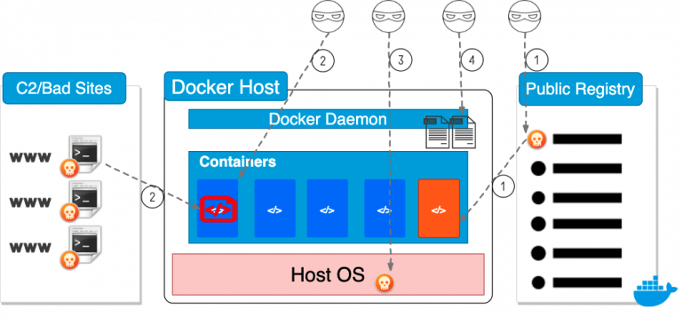
### Tóm Tắt Điều Hành

Trong khoảng thời gian từ tháng 9 đến tháng 12 năm 2019, nhóm nghiên cứu của Đơn vị 42 đã tiến hành quét và thu thập dữ liệu siêu dữ liệu từ các máy chủ Docker tiếp xúc với Internet. Kết quả của nghiên cứu này đã tiết lộ một số chiến thuật và kỹ thuật được kẻ tấn công sử dụng trong các công cụ Docker bị xâm nhập. Trong nghiên cứu, tổng cộng có 1.400 máy chủ Docker không bảo mật, 8.673 vùng chứa đang hoạt động và 17.927 hình ảnh Docker đã được phát hiện.

Công nghệ container đã trở nên rất phổ biến trong vài năm qua và hiện đang là một phương pháp thực tế để đóng gói, phân phối và triển khai các ứng dụng hiện đại. Tuy nhiên, công nghệ này cũng trở thành mục tiêu đáng chú ý của các kẻ thù.

Trong khi phần lớn các hoạt động độc hại liên quan đến việc mã hóa (chủ yếu là khai thác Monero), một số công cụ Docker bị xâm nhập đã được sử dụng để khởi động các cuộc tấn công khác hoặc cài đặt rootkit trên máy chủ. Thông tin nhạy cảm, như thông tin xác thực ứng dụng và cấu hình cơ sở hạ tầng, cũng được tìm thấy từ các nhật ký bị lộ.

Đã sắp xếp các hoạt động độc hại được quan sát thành bốn danh mục dưới đây và cung cấp thông tin tổng quan về từng danh mục bằng các mẫu thực.

1. **Triển Khai Hình Ảnh Vùng Chứa Có Mã Độc Hại:**
   - Hình ảnh độc hại được đẩy tới cơ quan đăng ký công khai và sau đó triển khai trên các máy chủ Docker không bảo mật.

2. **Triển Khai Hình Ảnh Vùng Chứa Lành Tính và Tải Xuống Các Tải Trọng Độc Hại Trong Thời Gian Chạy:**
   - Hình ảnh lành tính được triển khai trước đó, sau đó các tải trọng độc hại sẽ được tải xuống và thực thi bên trong các vùng chứa lành tính.

3. **Triển Khai Tải Trọng Độc Hại Trên Máy Chủ:**
   - Kẻ tấn công gắn toàn bộ hệ thống tệp máy chủ vào một vùng chứa và truy cập hệ thống tệp máy chủ từ vùng chứa.

4. **Lấy Thông Tin Nhạy Cảm Từ Nhật Ký Docker:**
   - Kẻ tấn công sẽ thu thập nhật ký Docker để tìm thông tin nhạy cảm như thông tin đăng nhập và cấu hình.

Các biện pháp phòng ngừa cần được triển khai để đối phó với các cuộc tấn công này và để bảo vệ hệ thống Docker khỏi các mối đe dọa tiềm ẩn.


#### Docker Daemon

Docker daemon là một quy trình nền liên tục quản lý các vùng chứa trên một máy chủ.

#### Cấu Hình Mặc Định và Vấn Đề Bảo Mật

Theo mặc định, daemon Docker tạo một ổ cắm tên miền Unix không nối mạng tại `/var/run/docker.sock`.

#### Phát Hiện Daemon Docker Trên Internet

Nhiều daemon Docker bị định cấu hình sai và không bảo mật trên internet, tạo ra rủi ro bảo mật.

#### Quét và Thu Thập Siêu Dữ Liệu

Quét định kỳ các daemon Docker bị lộ trên Internet và thu thập siêu dữ liệu từ chúng để hiểu các chiến thuật và kỹ thuật của tác nhân độc hại.
- API Docker Daemon được sử dụng để thu thập siêu dữ liệu. 
  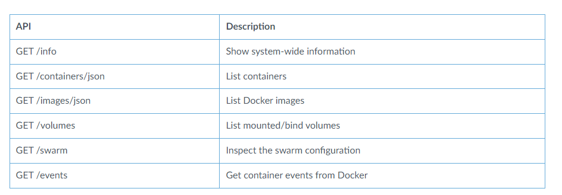

## Các hoạt động độc hại trong Docker Daemon bị lộ

Khi daemon Docker không bảo mật, tác nhân độc hại có thể kiểm soát toàn bộ nền tảng Docker và xâm phạm máy chủ. Phần lớn các cuộc tấn công liên quan đến khai thác tiền điện tử, và một số được sử dụng để thực hiện các cuộc tấn công khác.

## Triển khai hình ảnh vùng chứa có mã độc hại

Hình ảnh Docker chứa mã độc thường được phân phối thông qua các cơ quan đăng ký vùng chứa công cộng như Docker Hub. Các loại phần mềm độc hại này thường chỉ đánh cắp tài nguyên mà không gây hại cho các bộ chứa khác trên cùng một máy chủ. Docker Hub thường vô hiệu hóa những hình ảnh này sau khi báo cáo.

## Triển khai hình ảnh vùng chứa lành tính và tải xuống các tải trọng độc hại trong thời gian chạy

Các thùng chứa được thiết kế để tự cung cấp và khi chúng được khởi động, hệ thống tệp và các quy trình của chúng thường không thay đổi. Tuy nhiên, nếu không có các chính sách bảo mật như AppArmor hoặc SELinux để hạn chế quyền truy cập hệ thống tệp, kẻ tấn công vẫn có thể cài đặt và thực thi các tải trọng độc hại trong thời gian chạy của vùng chứa.

Mặc dù các công cụ phân tích thành phần có thể phát hiện mã độc trong hình ảnh vùng chứa, nhưng chúng không thể nhìn thấy các tải trọng độc hại được cài đặt trong thời gian chạy. Kẻ tấn công có thể triển khai hình ảnh đã được xác minh từ Docker Hub và thêm các quy trình độc hại vào vùng chứa sau đó. Cần có biện pháp bảo vệ thời gian chạy vùng chứa cao cấp để phát hiện loại tấn công này.

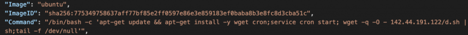Một tập lệnh độc hại đã được tải xuống và thực thi trong image Ubuntu chính thức.

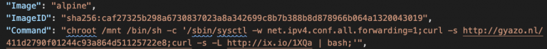Hai tập lệnh độc hại đã được tải xuống và chạy trên hệ thống tệp máy chủ thông qua hình ảnh chính thức của Alpine.

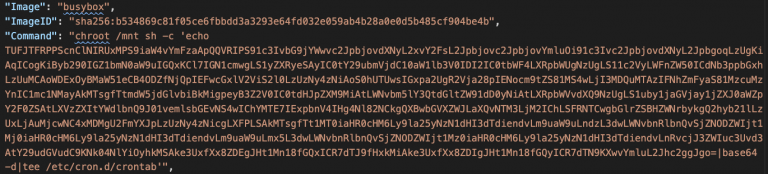Tập lệnh được mã hóa base64 đã được thêm vào crontab của máy chủ thông qua hình ảnh Busybox chính thức.
## Triển khai tải trọng độc hại trên máy chủ

Daemon Docker không bảo mật cung cấp cho tác nhân độc hại toàn quyền truy cập vào tất cả các vùng chứa và hình ảnh, nhưng daemon không trực tiếp cung cấp quyền truy cập vào hệ điều hành máy chủ. Một thủ thuật thú vị mà chúng tôi thường thấy là những kẻ tấn công gắn toàn bộ hệ thống tệp máy chủ vào một vùng chứa và truy cập hệ điều hành máy chủ từ vùng chứa đó. Khi toàn bộ hệ thống tệp máy chủ được gắn kết, hầu hết tất cả các tệp trên máy chủ đều có thể được đọc/ghi từ vùng chứa.

Root của hệ thống file máy chủ được gắn vào một thùng chứa
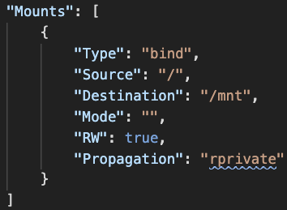

Thực thi các lệnh bên trong container
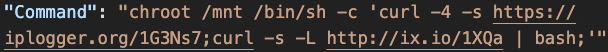

Thực thi các lệnh bên trong container
![Hình 9](./images/Figure-9.-Execute-commands-inside-a-container-768x93.png

Thực thi các lệnh bên trong container
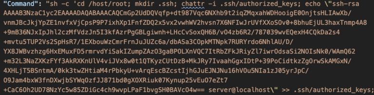

Thực thi các lệnh bên trong container
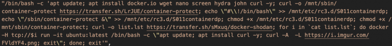
## Lấy thông tin nhạy cảm từ Nhật ký Docker

Theo mặc định, trình nền Docker duy trì sự kiện và nhật ký cho mọi vùng chứa kể từ khi nó được tạo cho đến khi nó bị hủy. Nhật ký rất quan trọng cho việc gỡ lỗi và kiểm tra, nhưng những thông tin nhạy cảm như cấu hình và thông tin đăng nhập cũng có thể bị rò rỉ từ nhật ký.

Rò rỉ thông tin xác thực redis từ lệnh container
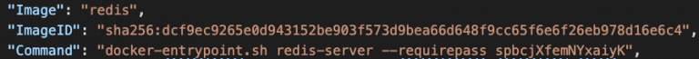

Thông tin xác thực của Portainer bị rò rỉ từ lệnh container
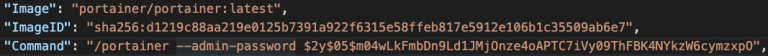

Các tập tin khóa bị rò rỉ từ lệnh container
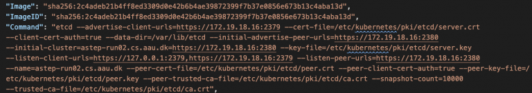
## Tổng kết và Phòng thủ

Nghiên cứu này cung cấp cái nhìn đầu tiên ở cấp độ đường phố về các chiến thuật và kỹ thuật mà kẻ tấn công sử dụng khi xâm phạm nền tảng container. Chúng tôi đã tìm hiểu không chỉ các hoạt động độc hại trong nền tảng container mà còn cả các phép đo truy cập cần thiết để phát hiện và ngăn chặn các hoạt động này.

### Chiến lược phòng thủ:

1. **Thực thi xác thực lẫn nhau khi định cấu hình TLS trên ổ cắm daemon Docker:** Đảm bảo rằng mọi kết nối được thiết lập với daemon Docker đều được xác thực một cách an toàn.

2. **Sử dụng ổ cắm Unix để giao tiếp cục bộ với daemon Docker hoặc sử dụng SSH để kết nối với daemon Docker từ xa:** Giảm thiểu việc sử dụng ổ cắm TCP không an toàn và đảm bảo chỉ những người dùng được ủy quyền mới có thể truy cập vào daemon Docker từ xa.

3. **Chỉ cho phép một "danh sách cho phép" IP khách truy cập vào máy chủ Docker:** Hạn chế truy cập vào daemon Docker chỉ từ các IP được ủy quyền.

4. **Kích hoạt tính năng Tin cậy nội dung trong Docker để chỉ có thể kéo những hình ảnh đã được ký và xác minh:** Đảm bảo chỉ các hình ảnh được xác minh mới được triển khai.

5. **Quét mọi hình ảnh vùng chứa để tìm lỗ hổng và mã độc:** Đảm bảo rằng tất cả các hình ảnh vùng chứa được sử dụng đều an toàn và không chứa mã độc.

6. **Triển khai các công cụ bảo vệ thời gian chạy để giám sát các vùng chứa đang chạy:** Theo dõi hoạt động của các vùng chứa và phát hiện các hành vi độc hại ngay khi chúng xảy ra.


## Kết luận

Bảo mật trong Docker đòi hỏi sự cân nhắc và triển khai cẩn thận để đảm bảo an toàn cho hệ thống. Bằng cách hiểu rõ các thách thức và áp dụng các biện pháp phòng ngừa phù hợp, chúng ta có thể tăng cường bảo mật cho môi trường Docker của mình.
