# Bài tập lớn cuối kỳ chương trình VDT 2024 lĩnh vực Cloud - GĐ 1

### **Triển khai Kubernetes (1 điểm)**

**Yêu cầu:**

Y/c 1:

- Triển khai được Kubernetes thông qua công cụ minikube trên 1 node: 0.5
  điểm

Hoặc

- Triển khai được Kubernetes thông qua công cụ kubeadm hoặc kubespray
  lên 1 master node VM + 1 worker node VM: 1 điểm

**Output:**

- Tài liệu cài đặt

[<u>Setting up K8s cluster with
Kubeadm</u>](https://docs.google.com/document/d/1CAzkQIp9_0iI_t639SokY-1eLIa_nMum1lXLz9TzlT8/edit?usp=sharing)

- Log của các lệnh kiểm tra hệ thống như: **kubectl get nodes - o wide**

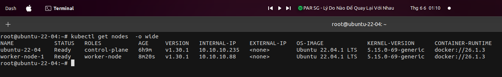

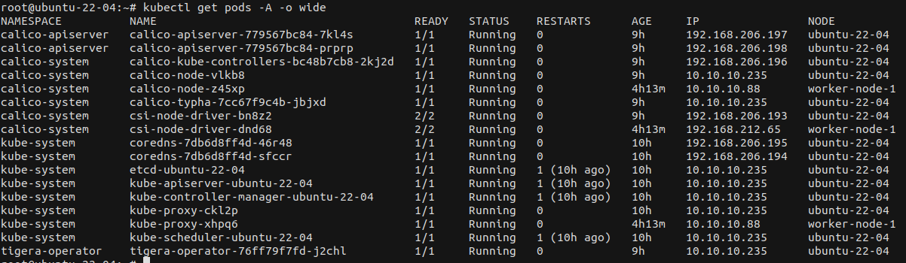

## Triển khai web application sử dụng các DevOps tools & practices

### **K8S Helm Chart (1.5đ)**

**Yêu cầu 1:**

- Cài đặt ArgoCD lên Kubernetes Cluster, expose được ArgoCD qua NodePort


**Output 1:**

- File manifests sử dụng để triển khai ArgoCD lên K8S Cluster

> [<u>https://raw.githubusercontent.com/argoproj/argo-cd/stable/manifests/install.yaml</u>](https://raw.githubusercontent.com/argoproj/argo-cd/stable/manifests/install.yaml)
>
> Sử dụng các câu lệnh sau để triển khai ArgoCD
>
> kubectl create namespace argocd
>
> kubectl apply -n argocd -f
> [<u>https://raw.githubusercontent.com/argoproj/argo-cd/stable/manifests/install.yaml</u>](https://raw.githubusercontent.com/argoproj/argo-cd/stable/manifests/install.yaml)

kiểm tra kết quả chạy các resources của ArgoCD

 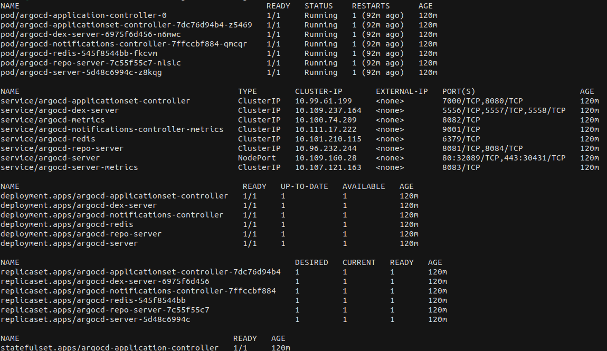

Expose ArgoCD thông qua NodePort sử dụng câu lệnh: 
```
kubectl patch svc argocd-server -n argocd -p '{"spec": {"type": "NodePort", "ports":\[{"port": 80, "nodePort": 32089}\]}}'
```
<span class="mark">Kiểm tra kết quả service</span>

 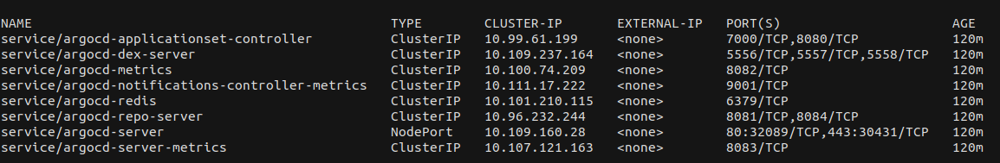

- Ảnh chụp giao diện màn hình hệ thống ArgoCD khi truy cập qua trình
  duyệt trình duyệt

Truy cập thông qua trình duyệt

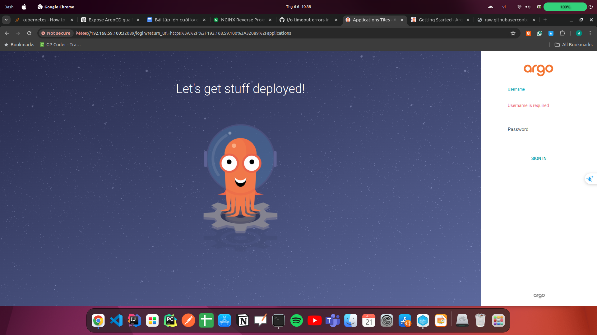

Đăng nhập vào ArgoCD

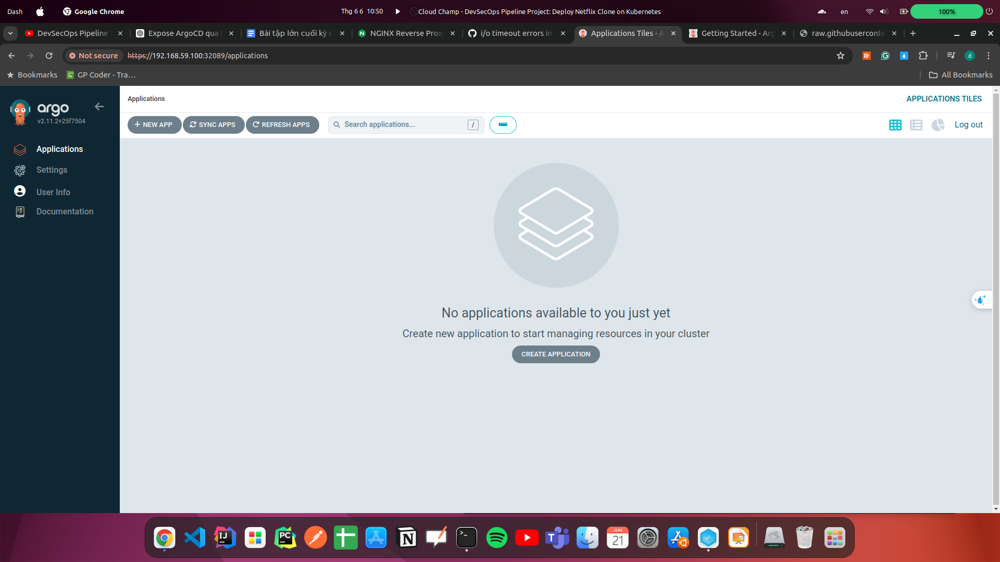

**Yêu cầu 2:**

- Viết 2 Helm Chart cho web Deployment và api Deployment, để vào 1
  folder riêng trong repo web và repo api

- Tạo 2 Repo Config cho web và api, trong các repo này chứa các file
  values.yaml với nội dung của cá file values.yaml là các config cần
  thiết để chạy web và api trên k8s bằng Helm Chart

- Sử dụng tính năng multiple sources của ArgoCD để triển khai các
  service web và api service lên K8S Cluster theo hướng dẫn của ArgoCD,
  expose các service này dưới dạng NodePort [<u>Multiple Sources for an
  Application - Argo CD - Declarative GitOps CD for
  Kubernetes</u>](https://argo-cd.readthedocs.io/en/release-2.7/user-guide/multiple_sources/#helm-value-files-from-external-git-repository)


**Output 2:**

- Các Helm Chart sử dụng để triển khai web Deployment và api Deployment
  lên K8S Cluster

Helm Chart cho API  
[<u>https://gitlab.com/JackeyyLove/student-management-backend/-/tree/main/helm-chart?ref_type=heads</u>](https://gitlab.com/JackeyyLove/student-management-backend/-/tree/main/helm-chart?ref_type=heads)

Helm Chart cho Web

[<u>https://gitlab.com/JackeyyLove/student-management-frontend/-/tree/main/helm-chart?ref_type=heads</u>](https://gitlab.com/JackeyyLove/student-management-frontend/-/tree/main/helm-chart?ref_type=heads)

- Các file values.yaml trong 2 config repo của của web service và api
  service

File values.yaml của API

[<u>https://gitlab.com/JackeyyLove/vdt24-config-api/-/raw/main/values.yaml?ref_type=heads</u>](https://gitlab.com/JackeyyLove/vdt24-config-api/-/raw/main/values.yaml?ref_type=heads)

File values.yaml của Web

[<u>https://gitlab.com/JackeyyLove/vdt24-config-web/-/raw/main/values.yaml?ref_type=heads</u>](https://gitlab.com/JackeyyLove/vdt24-config-web/-/raw/main/values.yaml?ref_type=heads)

- Manifest của ArgoCD Application

[<u>https://raw.githubusercontent.com/JackeyyLove/VDT24-Argo-repo/master/application.yaml</u>](https://raw.githubusercontent.com/JackeyyLove/VDT24-Argo-repo/master/application.yaml)

- Ảnh chụp giao diện màn hình hệ thống ArgoCD trên trình duyệt

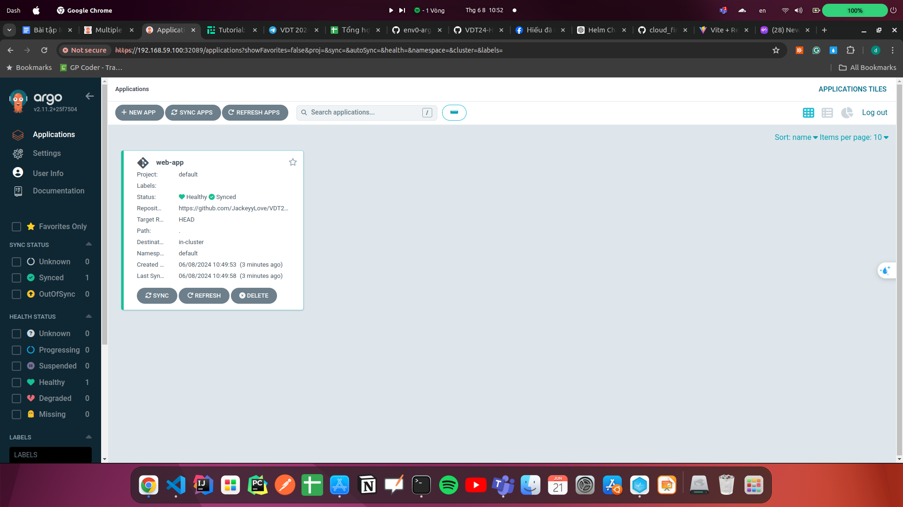

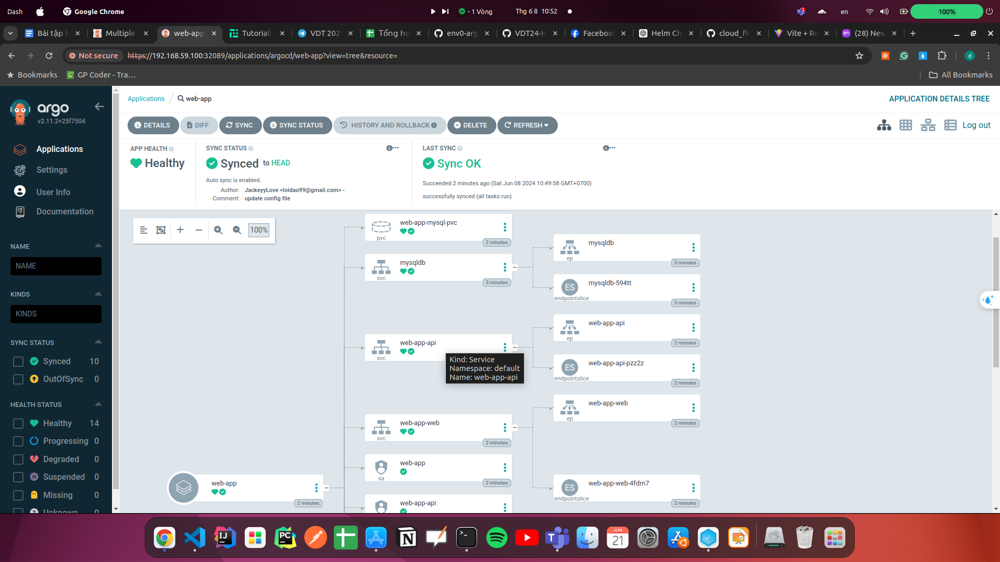


- Ảnh chụp giao diện màn hình trình duyệt khi truy cập vào Web URL, API
  URL

Truy cập vào Web

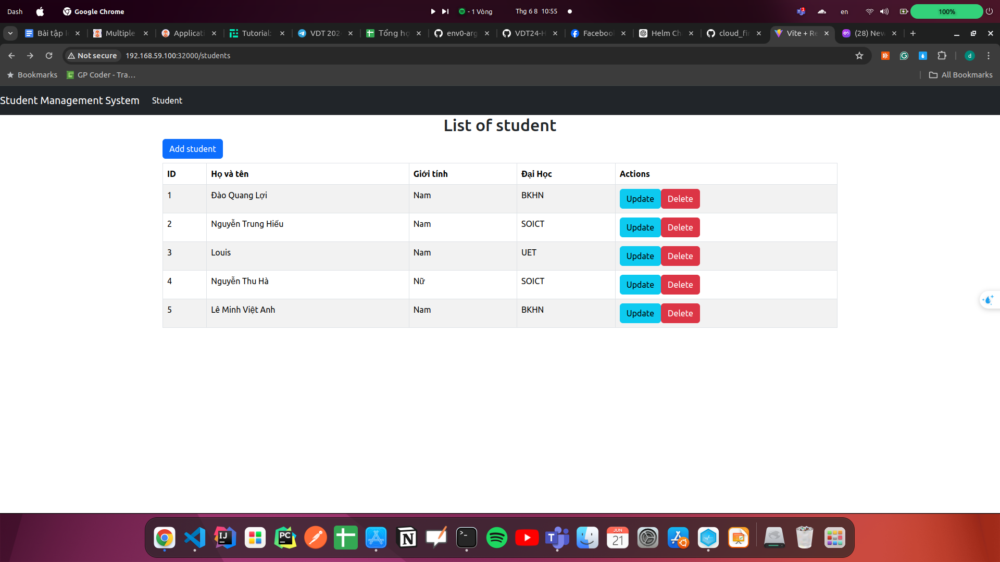

Truy cập vào API

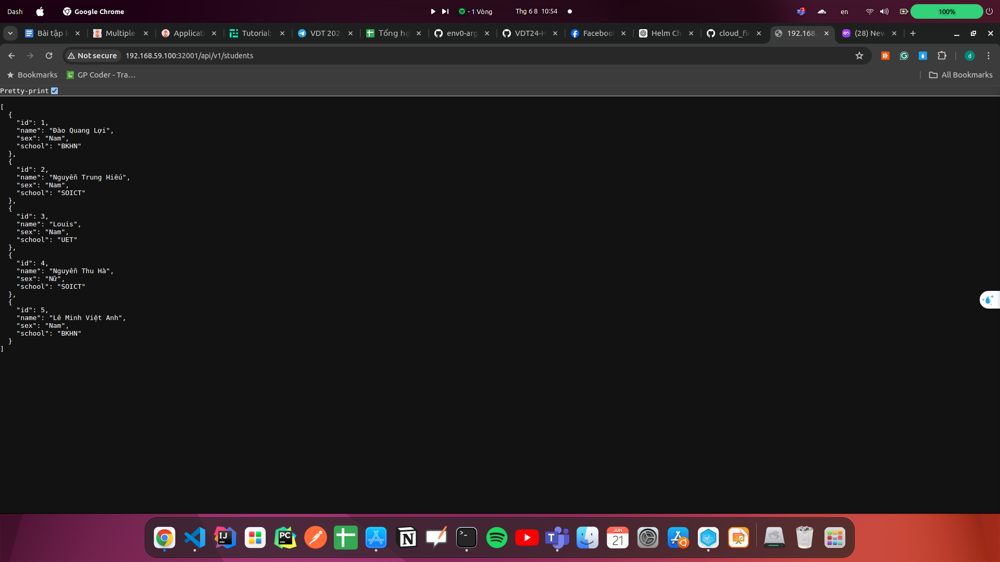

### **Continuous Delivery (1.5đ)**

**Yêu cầu:**

- Viết 2 luồng CD cho 2 repo web và api, khi có 1 tag mới được tạo ra
  trên trên 1 trong 2 repo này thì luồng deploy tương ứng của repo đó
  thực hiện các công việc sau:

  - Build docker image với image tag là tag name đã được tạo ra trên
    gitlab và push docker image sau khi build xong lên Docker Hub

  - Sửa giá trị Image version trong file values.yaml trong config repo
    và push thay đổi lên config repo. Tham khảo:
    [<u>https://stackoverflow.com/a/72696837</u>](https://stackoverflow.com/a/72696837)

- Cấu hình ArgoCD tự động triển khai lại web Deployment và api
  Deployment khi có sự thay đổi trên config repo.

 **Output:**

- Các file setup công cụ của 2 luồng CD

File setup GitlabCI của API:
[<u>https://gitlab.com/JackeyyLove/student-management-backend/-/raw/main/.gitlab-ci.yml</u>](https://gitlab.com/JackeyyLove/student-management-backend/-/raw/main/.gitlab-ci.yml)


File setup GitlabCI của Web: 
[<u>https://gitlab.com/JackeyyLove/student-management-frontend/-/raw/main/.gitlab-ci.yml</u>](https://gitlab.com/JackeyyLove/student-management-frontend/-/raw/main/.gitlab-ci.yml)


- Repo contains file setup:

API: https://gitlab.com/JackeyyLove/student-management-backend

Web: https://gitlab.com/JackeyyLove/student-management-frontend

- Output log của 2 luồng CD khi tạo tag mới trên repo web và repo api

> **Luồng CD của API**

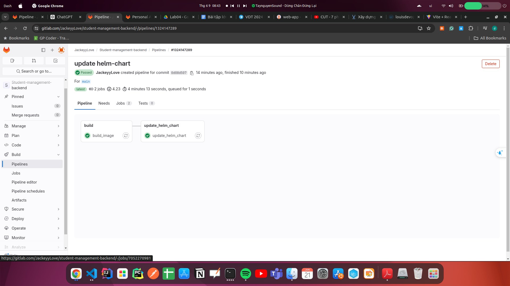

Log build and push image


Log update values.yaml file

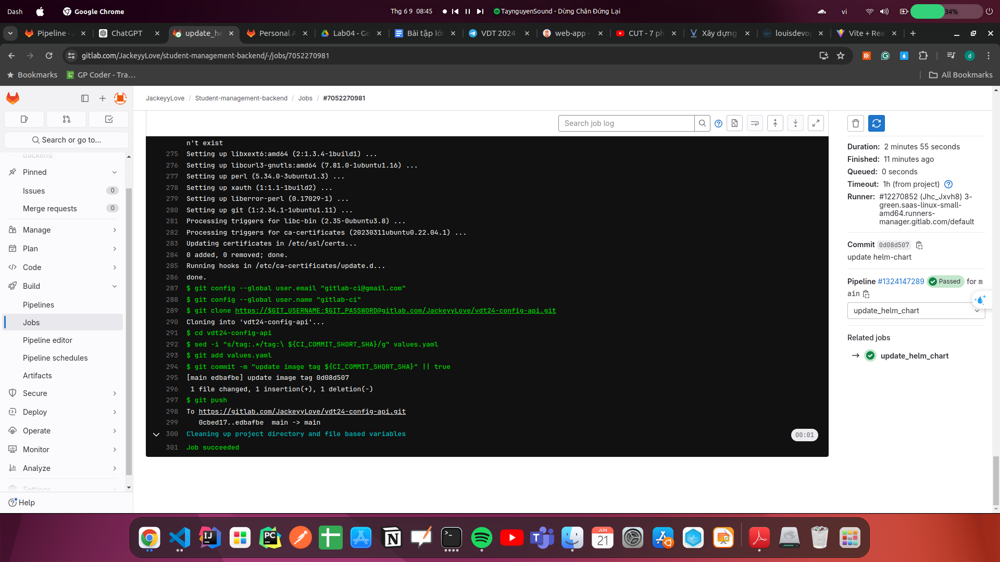

Tag name trên GitLab

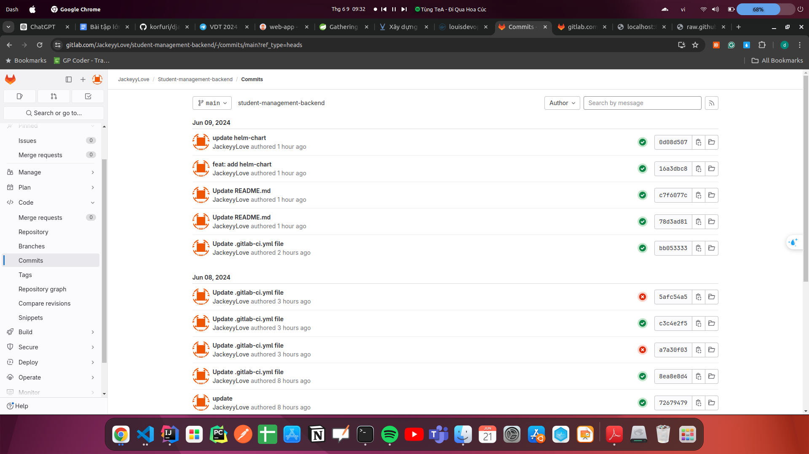

 Kiểm tra sự thay đổi ở Dockerhub

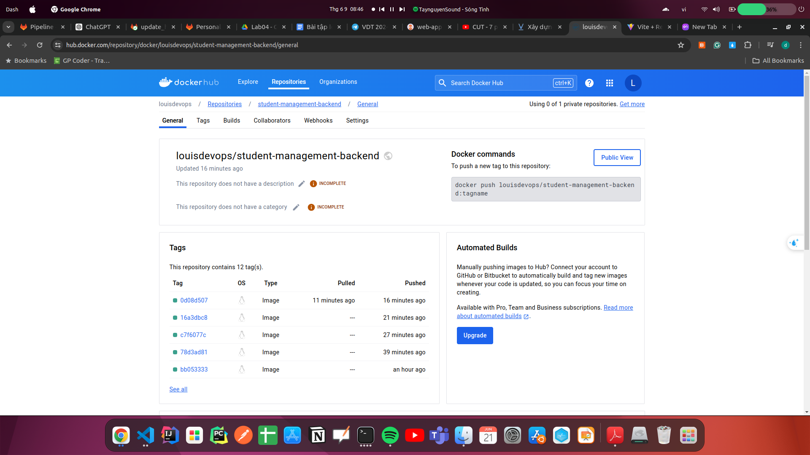

 Kiểm tra file config

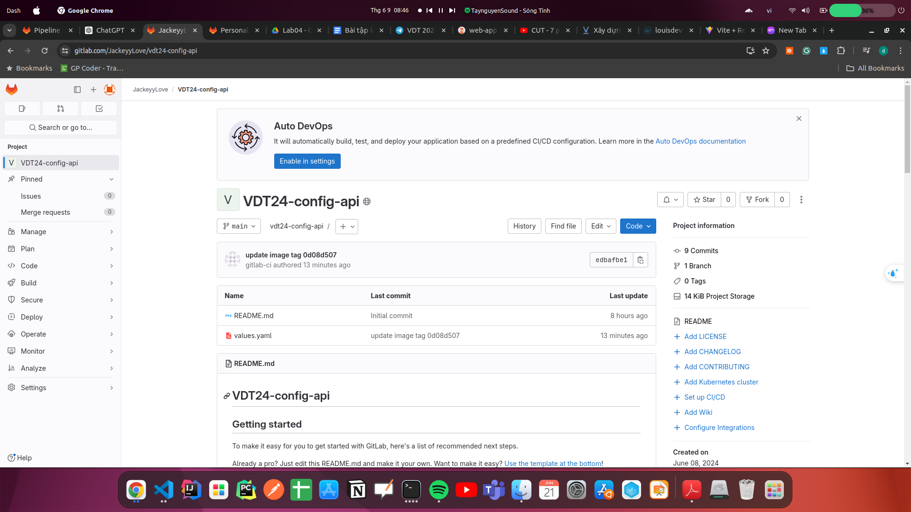


> **Luồng CD của Web**


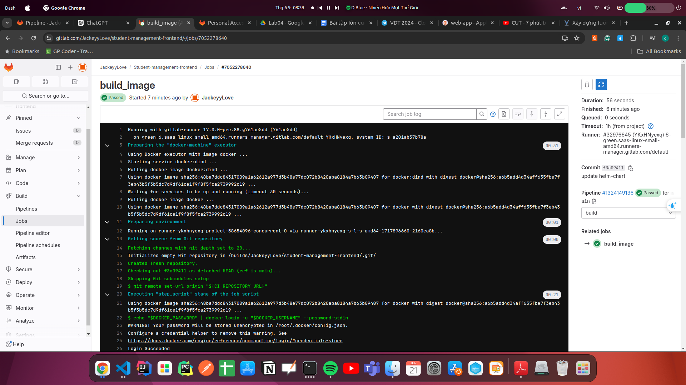

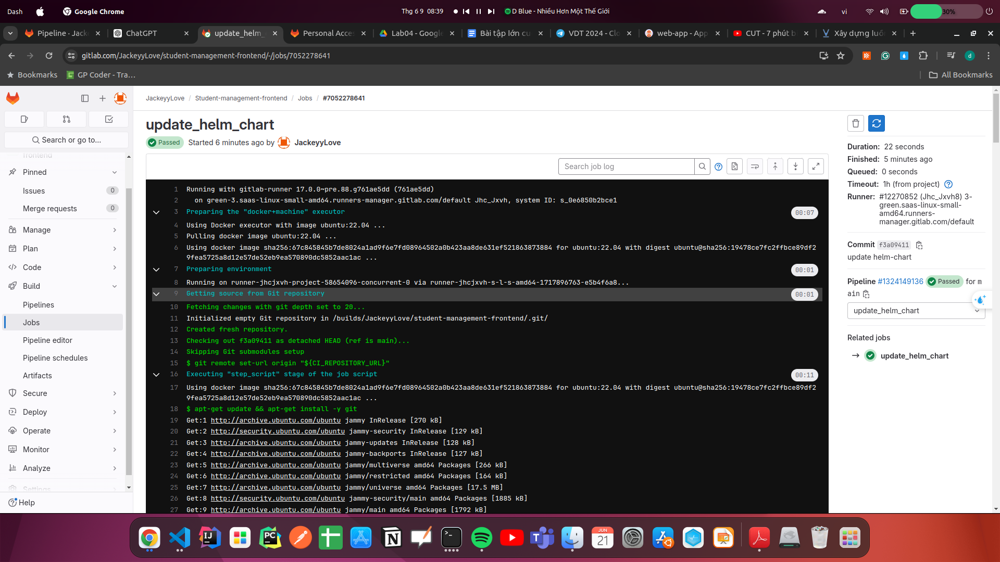

Tag name trên GitLab

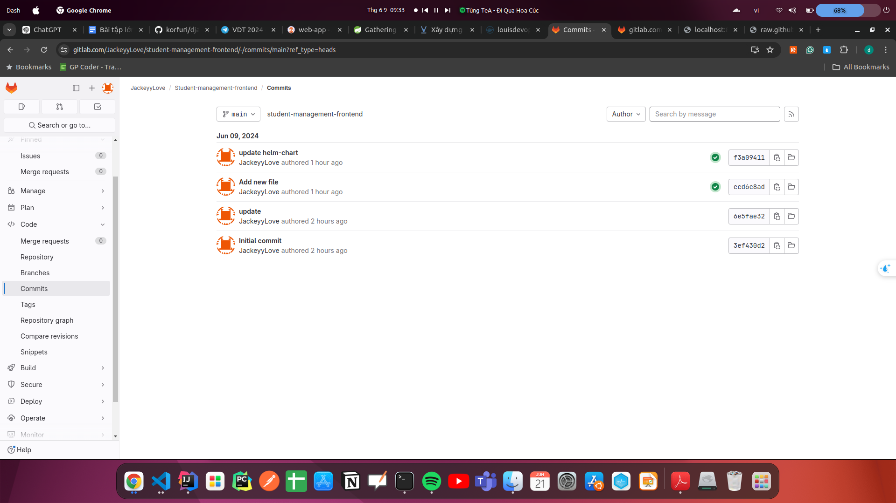

 Kiểm tra Dockerhub

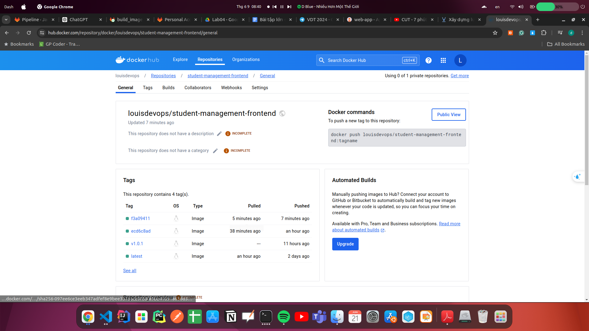

 Kiểm tra repo config


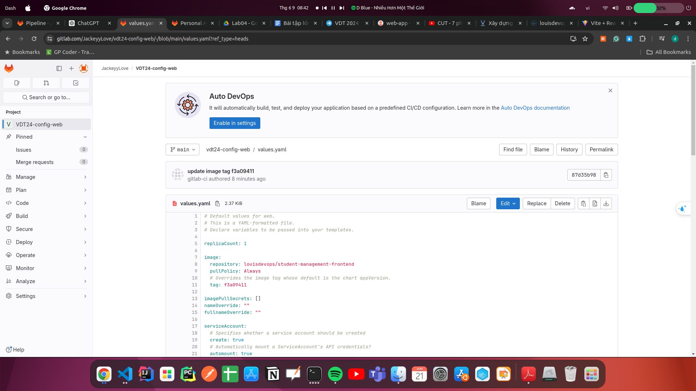

- Hình ảnh history của ArgoCD khi có sự thay đổi trên web config repo và
  api config repo tương tự hình ảnh sau

> Capture một event khi có thay đổi trên repo config trên gitlab

Khi có thay đổi trên web repo thì gitlab sẽ tạo ra một tag name ( ở đây
là b3302353), nó sẽ tự động cập nhật thay đổi này vào file values.yaml ở
web config repo và đồng thời đẩy image với tag mới là tag name này lên
Dockerhub.

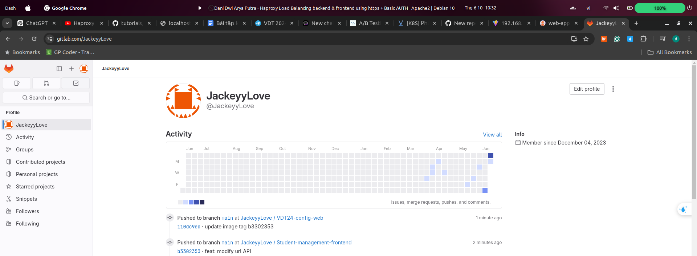

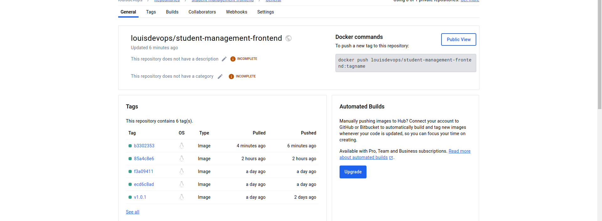

ArgoCD sẽ tự động đồng bộ khi có thay đổi và cập nhật web với phiên bản
image có tag là b3302353

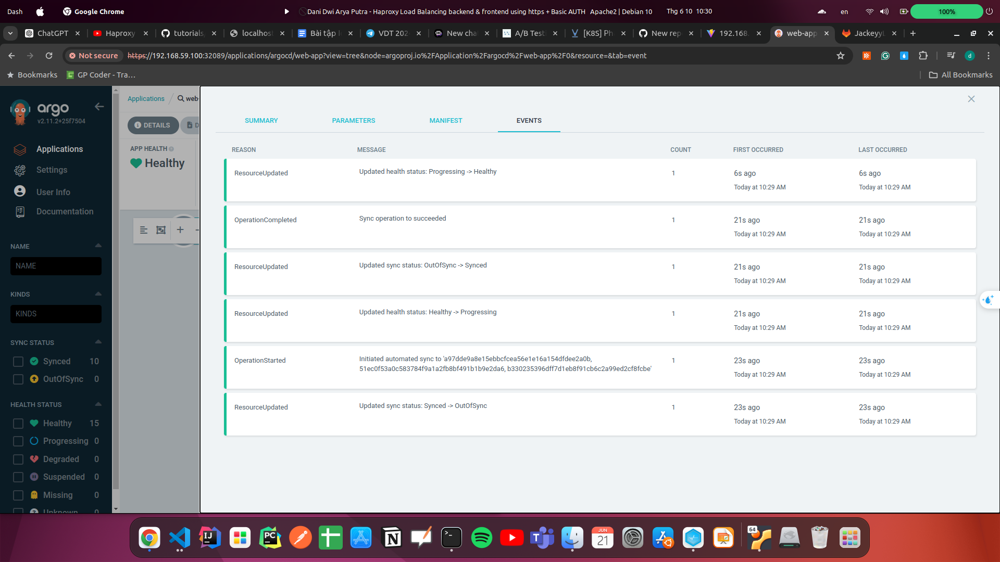

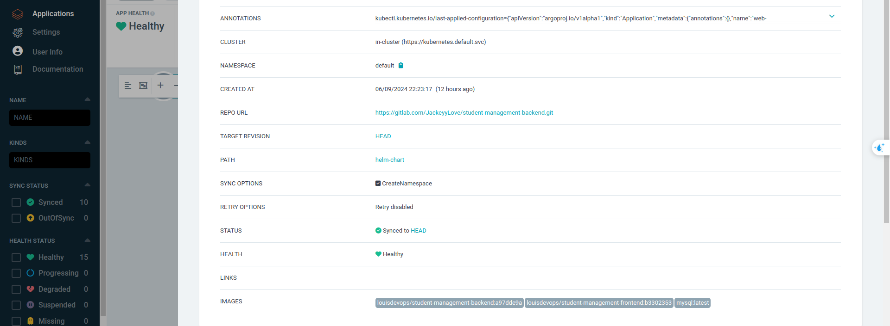


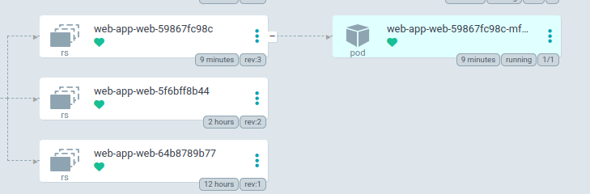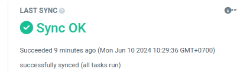

- Các hình ảnh demo khác

### **Monitoring (1.5đ)**

**Yêu cầu:**

- Expose metric của web service và api service ra 1 http path. 

<!-- -->

- Triển khai Prometheus lên Kubernetes Cluster thông qua Prometheus
  Operator, phơi ra ngoài dưới dạng NodePort:

- Expose Prometheus dưới dạng Nodeport

- Sử dụng **Service Monitor** của Prometheus Operator để giám sát Web
  Deployment và API Deployment

 **Output:**

- Các file setup để triển khai Prometheus lên Kubernetes Cluster

[<u>https://github.com/JackeyyLove/prometheus/tree/master/prometheus-operator</u>](https://github.com/JackeyyLove/prometheus/tree/master/prometheus-operator)

[<u>https://github.com/JackeyyLove/prometheus/tree/master/prometheus</u>](https://github.com/JackeyyLove/prometheus/tree/master/prometheus)

- File setup Service Monitor

[<u>https://raw.githubusercontent.com/JackeyyLove/prometheus/master/deploy/service-monitor.yaml</u>](https://raw.githubusercontent.com/JackeyyLove/prometheus/master/deploy/service-monitor.yaml)

 - Hình ảnh khi truy cập vào Prometheus UI thông qua trình duyệt

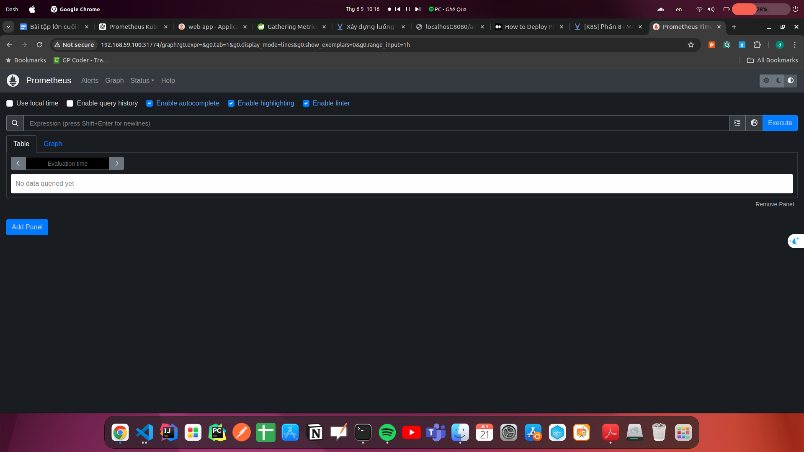

- Hình ảnh danh sách target của Web Deployment và API Deployment được
  giám sát bởi Prometheus:

Monitor API qua service-monitor


Metric của API Deployment

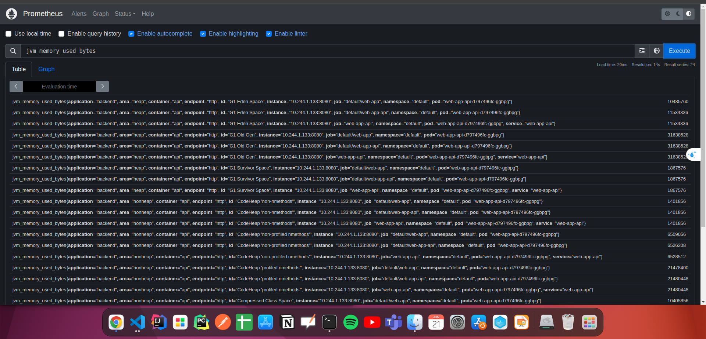

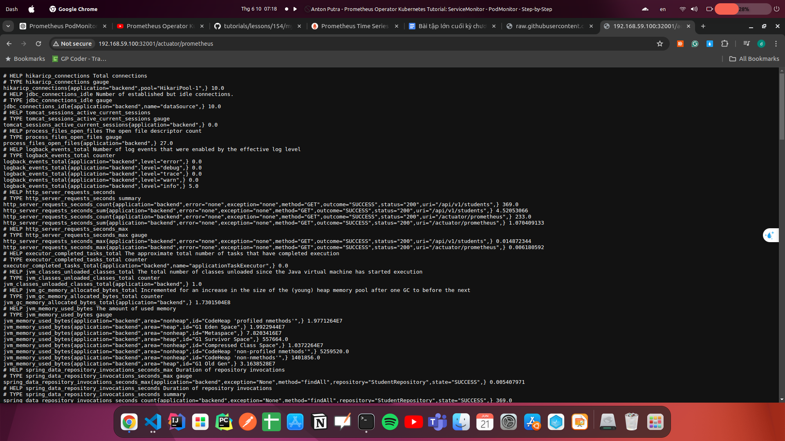

### **Logging (1.5đ)**

**Yêu cầu:**

- Sử dụng Kubernetes DaemonSet triển khai fluentd hoặc fluentbit lên
  kubernetes đẩy log của các Deployment Web Deployment và API Deployment
  lên cụm ElasticSearch tập trung với prefix index dưới dạng
  tên_sinh_viên_viết_tắt_sdt: Ví dụ: conghm_012345678

Thông tin cụm ES tập trung:

- Username: elastic

- Password: **iRsUoyhqW-CyyGdwk6V\_**

- Elastic Search URL:
  [<u>https://116.103.226.146:9200</u>](https://116.103.226.146:9200)

- Kibana URL:
  [<u>http://116.103.226.146:5601/login?next=%2Fapp%2Fdiscover#/</u>](http://116.103.226.146:5601/login?next=%2Fapp%2Fdiscover#/)

<!-- -->

- Cấu hình logging cho web service và api service, đảm bảo khi có http
  request gửi vào web service hoặc api service thì trong các log mà các
  service này sinh ra, có ít nhất 1 log có các thông tin:

  - Request Path(VD: /api1/1, /api2/3 ..)

  - HTTP Method VD: (GET PUT POST…)

  - Response Code: 302, 200, 202, 201…

**Output:**

- Repo contains Fluentd config: https://github.com/JackeyyLove/VDT24-Logging/tree/master/FluentD

- Hình ảnh chụp màn hình Kibana kết quả tìm kiếm log của các Service Web
  và Service API theo **url path**

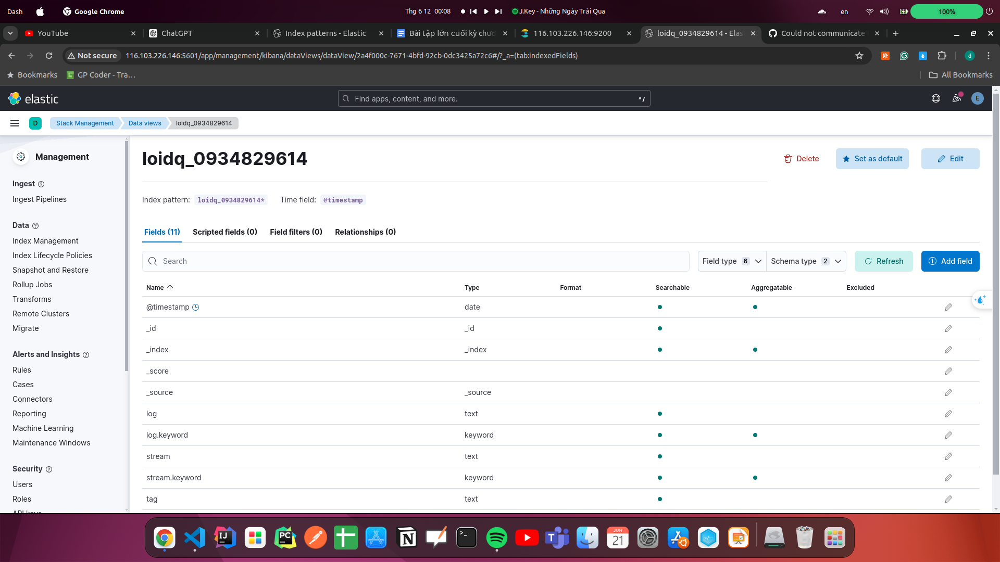

Request path của API service với endpoints
/api/v1/students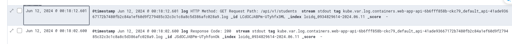

Đôi lúc sẽ có những request trả về code 409 do đã áp dụng rate limitter
ở phần sau

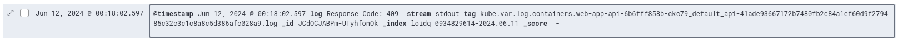

### **Security**

**Yêu cầu 1 (1đ):**

- Dựng HAProxy Loadbalancer trên 1 VM riêng (trong trường hợp cụm lab
  riêng của sinh viên) hoặc trên Basion Node (trường hợp sử dụng cụm Lab
  của Viettel Cloud) với **mode TCP**, mở 2 port **web_port** và
  **api_port** trên LB trỏ đến 2 NodePort của Web Deployment và API
  Deployment trên K8S Cluster. (0.5)

- Sử dụng 1 trong 2 giải pháp Ingress, hoặc haproxy sidecar container
  cho các deployment, đảm bảo các truy cập đến các port **web_port** và
  **api_port** sử dụng https (0.5)

- Cho phép sinh viên sử dụng self-signed cert để làm bài

**Output 1:**

- File cấu hình của HAProxy Loadbalancer cho web port và api port

[<u>https://raw.githubusercontent.com/JackeyyLove/VDT24-HAproxy/master/haproxy.cfg</u>](https://raw.githubusercontent.com/JackeyyLove/VDT24-HAproxy/master/haproxy.cfg)

- File cấu hình ingress hoặc file cấu hình deployment sau khi thêm
  HAProxy sidecar container vào Deployment

- Kết quả truy cập vào web port và api port từ trình duyệt thông qua
  giao thức https hoặc dùng curl. Ví dụ:

Dựng HAProxy Loadbalancer trên 1 VM riêng với **mode TCP**, mở 2 port
**web_port** và **api_port** trên LB trỏ đến 2 NodePort của Web
Deployment và API Deployment trên K8S Cluster

Test bằng lệnh curl trong VM

Trong file cấu hình của HAProxy có cấu hình việc map cổng 3000 của máy
ảo đến cổng 32000 của nodeport Web trên k8s cluster và map cổng 8080 của
máy ảo đến cổng 32001 của nodeport API

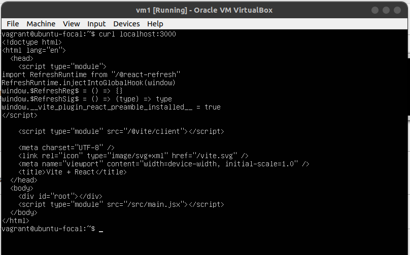


Địa chỉ IP của máy ảo

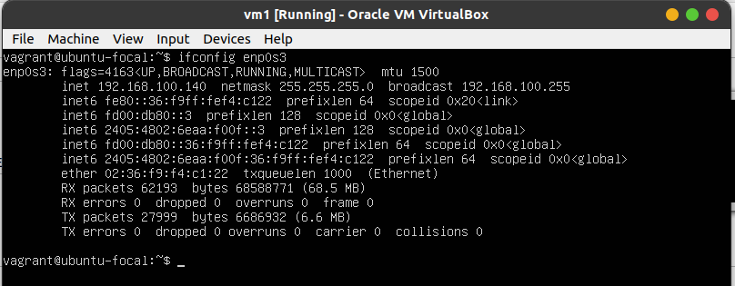

Truy cập vào máy ảo thông qua browser của host

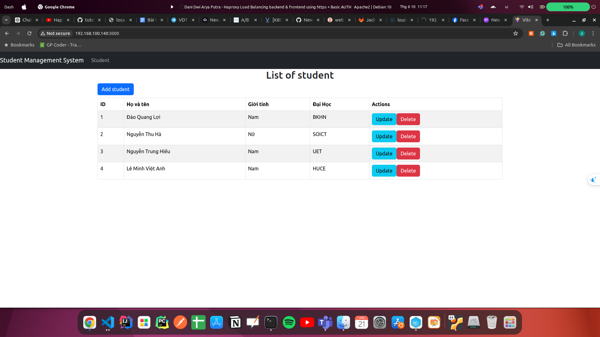

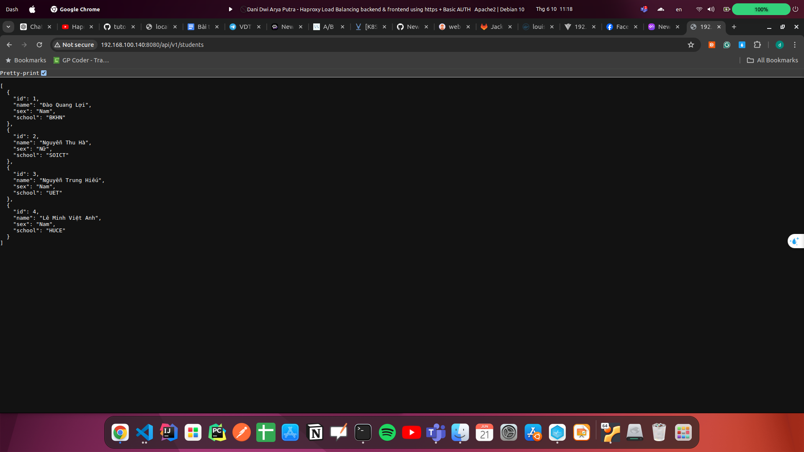

**Yêu cầu 2 (1đ):**

- Đảm bảo 1 số URL của api service khi truy cập phải có xác thực thông
  qua 1 trong số các phương thức cookie, basic auth, token auth, nếu
  không sẽ trả về HTTP response code 403. (0.5)

- Thực hiện phân quyền cho 2 loại người dùng trên API:

  - Nếu người dùng có role là user thì truy cập vào GET request trả về
    code 200, còn truy cập vào POST/DELETE thì trả về 403

  - Nếu người dùng có role là admin thì truy cập vào GET request trả về
    code 200, còn truy cập vào POST/DELETE thì trả về 2xx

**Output:**

- File trình bày giải pháp sử dụng để authen/authorization cho các
  service

 [Basic Authentication and Authorization with Spring
security](https://docs.google.com/document/d/180k9I-SFLqQRdAlGlB14-BU1HGCUX7ni_LqnxWtjB4M/edit?usp=sharing)

Ở đây chúng ta sẽ áp dụng basic auth cho phần authentication và
authorization

- Kết quả HTTP Response khi curl hoặc dùng postman gọi vào các URL khi
  truyền thêm thông tin xác thực và khi không truyền thông tin xác thực

Khi không có thông tin xác thực

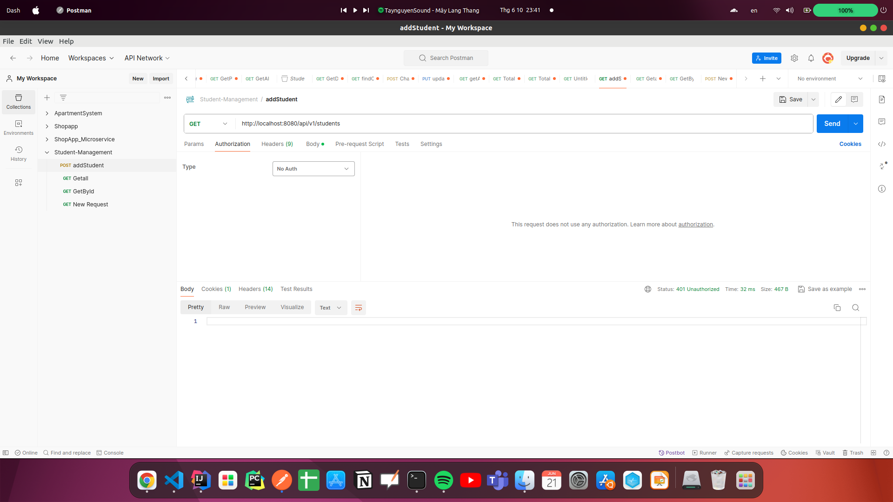

Khi có thông tin xác thực


- Kết quả HTTP Response khi curl hoặc dùng postman vào các URL với các
  method GET/POST/DELETE khi lần lượt dùng thông tin xác thực của các
  user có role là user và admin

**Đối với user có role là USER**

- Thử trên môi trường localhost

GET return 200 OK

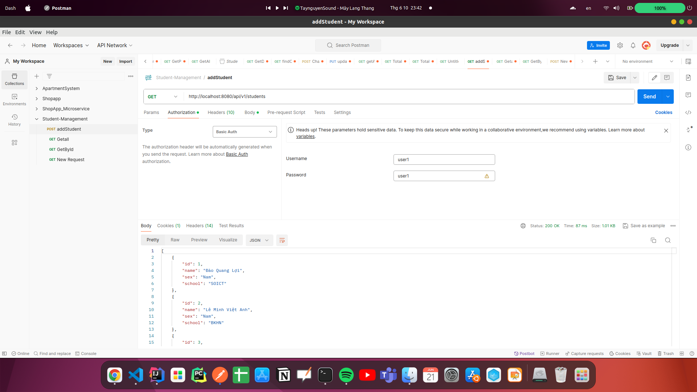

POST return 403 Forbidden

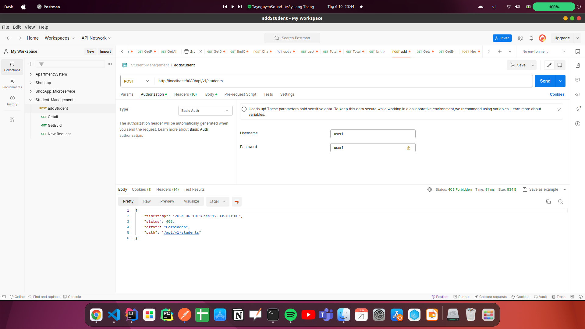

DELETE return 403 Forbidden

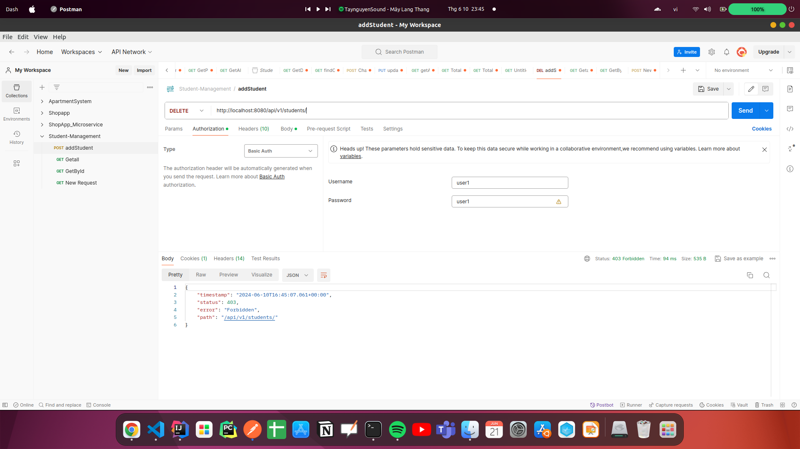

- Thử với API được deploy trên K8s cluster

POST return 403 Forbidden


DELETE return 403 Forbidden

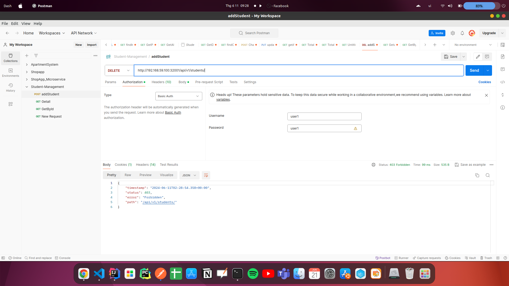

**Đối với user có Role là ADMIN**

- Thử trên môi trường localhost

GET return 200 OK


POST return 201 Created


DELETE return 202 Accepted

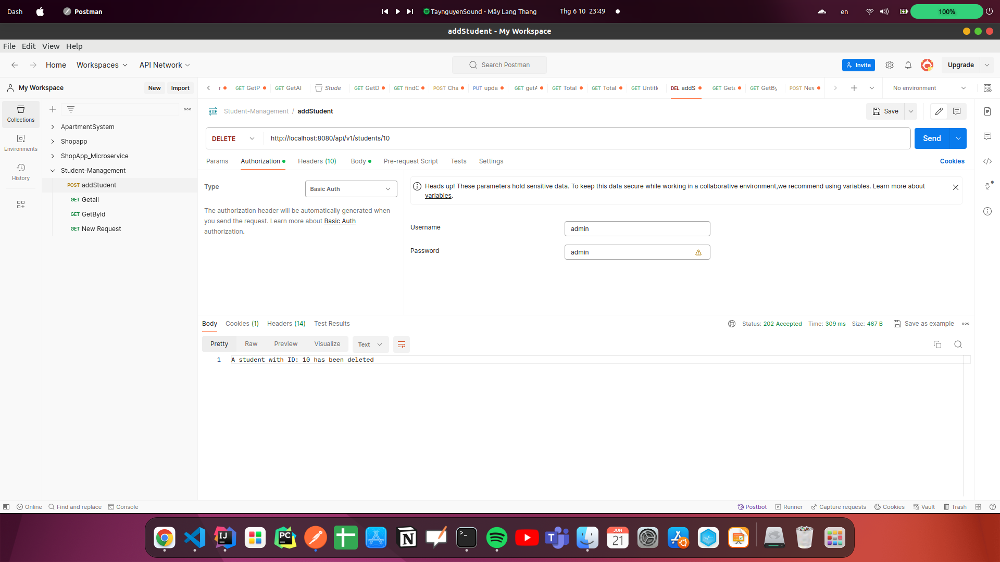

- Thử với API được deploy trên K8s cluster

POST return 201 Created

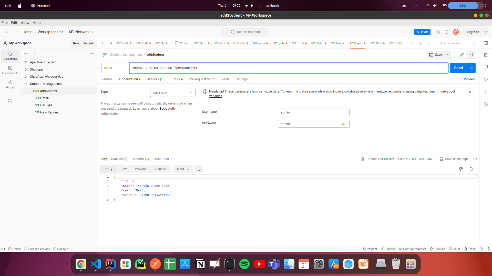

DELETE return 202 Accepted

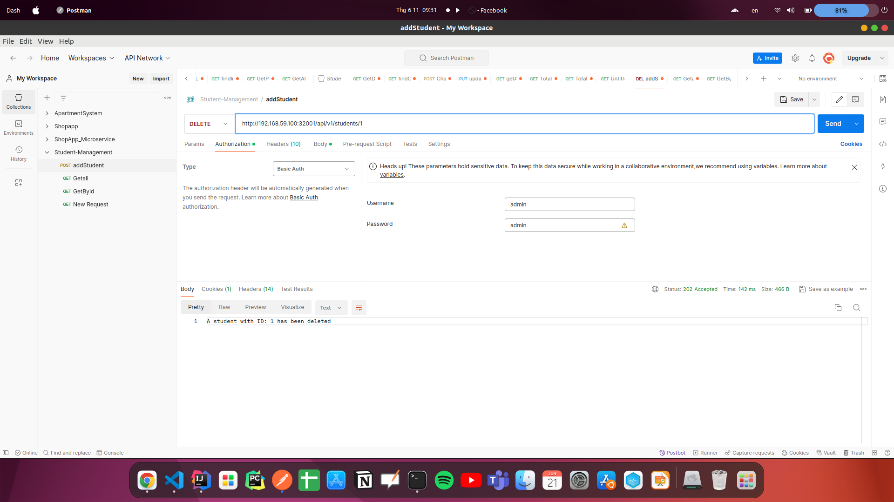

**Yêu cầu 3 (1đ):**

Sử dụng 1 trong số các giải pháp để ratelimit cho Endpoint của api
Service, sao cho nếu có quá **10 request trong 1 phút** gửi đến Endpoint
của api service thì các request sau đó bị trả về HTTP Response 409

**Output:**

- File tài liệu trình bày giải pháp

[<u>RateLimitter with Spring
bucket4j</u>](https://docs.google.com/document/d/1TO893sXUwGiQD8r7TXs0jFnf3FxbGExP0YuQdtpYbwA/edit?usp=sharing)

- File ghi lại kết quả thử nghiệm khi gọi quá 10 request trong 1 phút
  vào Endpoint của API Service

Đây là script viết bằng Python để tự động gọi liên tục 12 request GET
vào API endpoint. Vì chúng ta chỉ giới hạn 10 request trong một phút nên
các request từ 11-12 sẽ bị reject
Sau một phút các token sẽ được refill lại 
``` py
import requests
from datetime import datetime
import time
api_key = '<API_KEY>'  
url = 'http://localhost:8080/api/v1/students'
headers = {'X-api-key': api_key}

# Number of requests to make
num_requests = 12

for i in range(num_requests):
    start_time = datetime.now()
    
    # Send the request
    response = requests.get(url, headers=headers)
    
    end_time = datetime.now()
    request_time = end_time - start_time
    
    if response.status_code == 200:
        print(f'Request {i+1}: Status Code: {response.status_code}, Response: {response.text}')
    elif response.status_code == 409:
        print(f'Request {i+1}: Status Code: {response.status_code}, Response: {"Conflict - Rate limit exceeded, more than 10 requests per minute"}')
    else:
        print(f'Request {i+1}: Status Code: {response.status_code}, Response: {response.text}')

    # Log the time when the request was made
    print(f'Request {i+1} made at {start_time.strftime("%Y-%m-%d %H:%M:%S")}, took {request_time.total_seconds()} seconds')
time.sleep(60) #sleep for 60s, wait until the token in bucket has been refilled
for i in range(num_requests):
    start_time = datetime.now()

    # Send the request
    response = requests.get(url, headers=headers)

    end_time = datetime.now()
    request_time = end_time - start_time

    if response.status_code == 200:
        print(f'Request {i+1}: Status Code: {response.status_code}, Response: {response.text}')
    elif response.status_code == 409:
        print(f'Request {i+1}: Status Code: {response.status_code}, Response: {"Conflict - Rate limit exceeded, more than 10 requests per minute"}')
    else:
        print(f'Request {i+1}: Status Code: {response.status_code}, Response: {response.text}')

    # Log the time when the request was made
    print(f'Request {i+1} made at {start_time.strftime("%Y-%m-%d %H:%M:%S")}, took {request_time.total_seconds()} seconds')

```

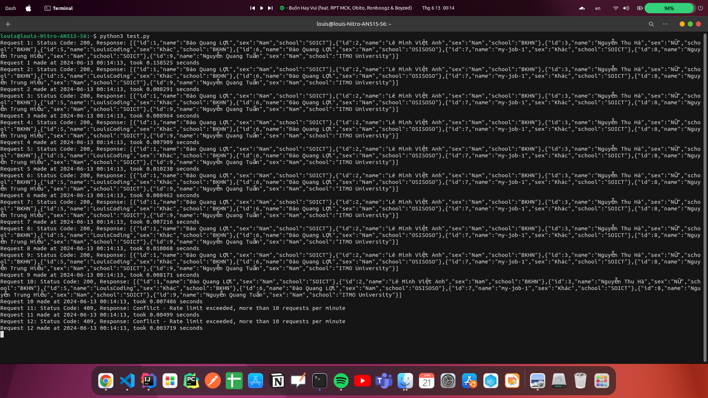
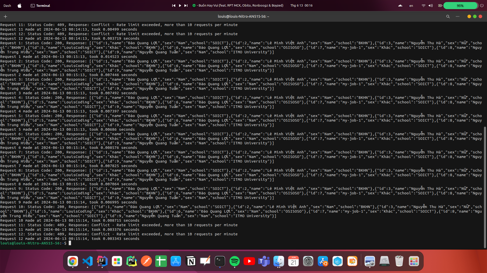
