## Project giữa kỳ Viettel Digital Talent 2024
### Đỗ Thu Trang

### Phát triển một 3-tier web application đơn giản 
Hiển thị danh sách sinh viên tham gia chương trình VDT2024 dưới dạng bảng với các thông tin sau: Họ và tên, Giới tính, trường đang theo học. 
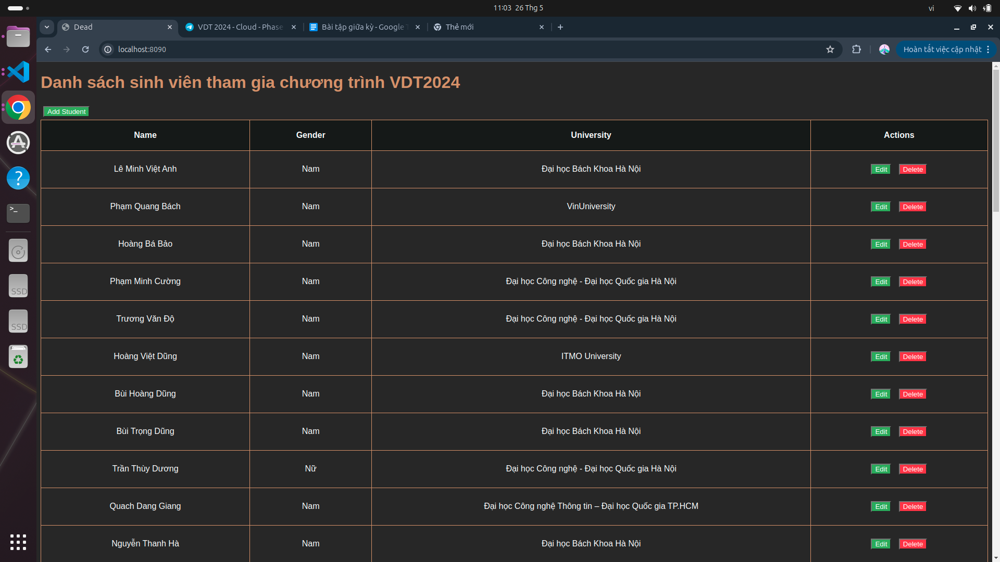
Cho phép xem chi tiết/thêm/xóa/cập nhật thông tin sinh viên.
- Thêm sinh viên
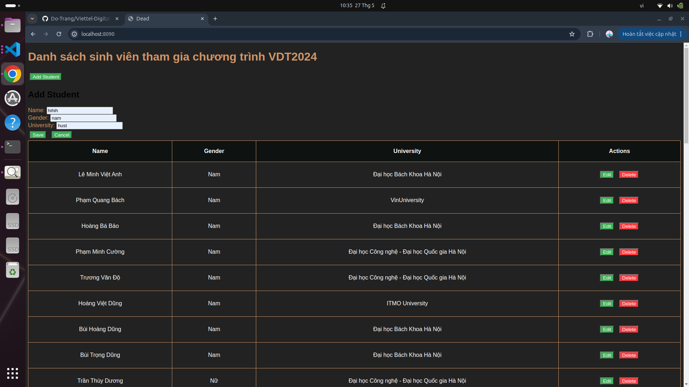
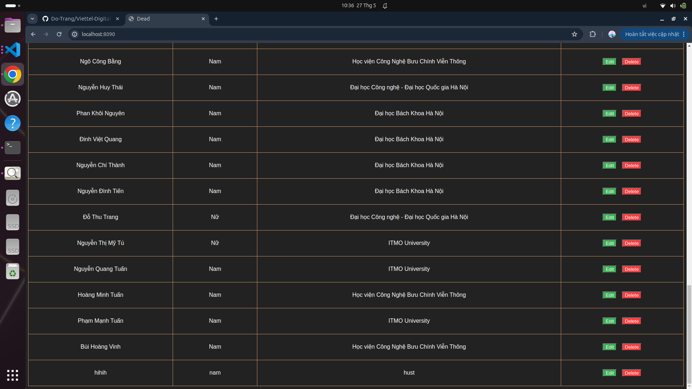

- Cập nhật thông tin sinh viên
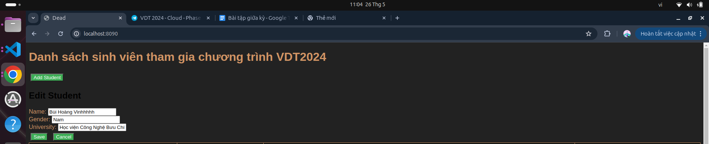
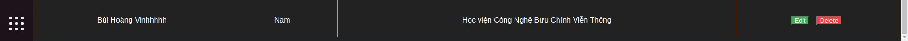

- Xóa sinh viên
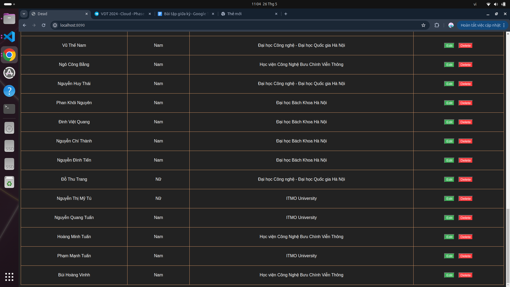

- Kết quả unit test cho các chức năng API:

 


# Mã nguồn web service: [web](https://github.com/Do-Trang/web)
# Mã nguồn api service: [api](https://github.com/Do-Trang/api)

### Triển khai web application sử dụng các DevOps tools & practices

#### 1. Containerization 
 - Dockerfile cho từng dịch vụ: 
 - [Web](https://github.com/Do-Trang/web/blob/main/Dockerfile)
      ```Dockerfile
    FROM nginx:alpine

    COPY nginx.conf /etc/nginx/nginx.conf

    COPY index.html /usr/share/nginx/html/index.html
    COPY style.css /usr/share/nginx/html/style.css

    EXPOSE 80

    CMD ["nginx", "-g", "daemon off;"]
    ```

- [API](https://github.com/hantbk/api_service/blob/main/Dockerfile)

    ```Dockerfile
    FROM node:latest

    WORKDIR /usr/src/app

    COPY package*.json ./
    RUN npm install

    COPY . .

    EXPOSE 3000
    CMD ["node", "src/app.js"]

    ```

- Output câu lệnh history api, web service

    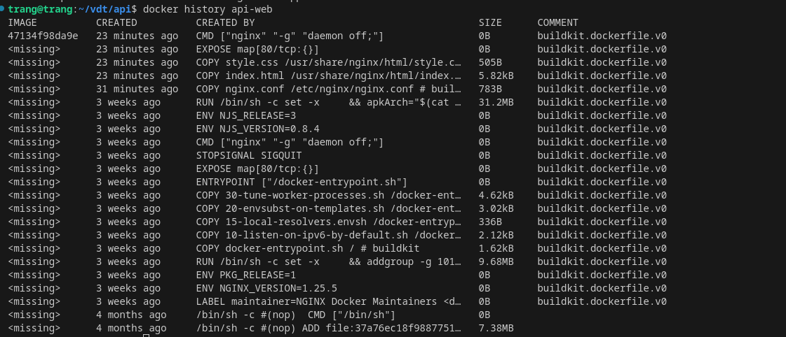
    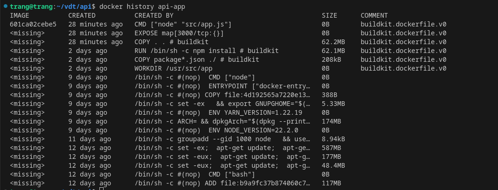

- Sử dụng docker-compose để triển khai 3 dịch vụ web, api, db   

[docker-compose.yml](https://github.com/Do-Trang/api/blob/main/docker-compose.yml)

```yaml
version: '3.8'

services:
  app:
    build: .
    ports:
      - "3001:3000"
    depends_on:
      - mongo
    environment:
      MONGO_URI: mongodb://mongo:27017/student

  mongo:
    image: mongo:latest
    ports:
      - "27018:27017"
    volumes:
      - mongo-data:/data/db

  seed:
    build: .
    depends_on:
      - mongo
    command: ["node", "data.js"]

  web:
    build: ../web
    ports:
      - "8090:80"
    depends_on:
      - app
    environment:
      - API_URL=http://app:3001/api/students

volumes:
  mongo-data:
```
- Output câu lệnh docker-compose up --build
    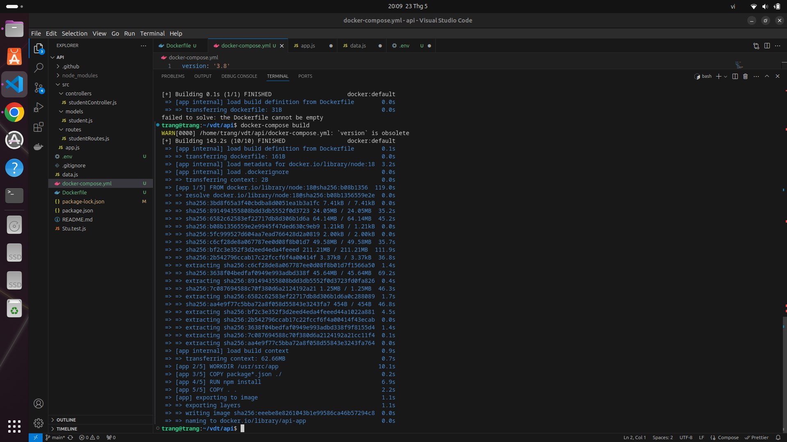
    

#### 2. Continuous Integration
- Tự động chạy unit test khi tạo Pull request vào nhánh main
- Tự động chạy unit test khi push commit lên một nhánh
 - File setup công cụ CI: [ci](https://github.com/Do-Trang/api/blob/main/.github/workflows/push.yml)

    ```yml
    name: Node.js CI

    on:
    pull_request: 
        branches:
        - main 
    push:
        branches: 
        - '*'

    jobs:
    build:

        runs-on: ubuntu-latest

        strategy:
        matrix:
            node-version: [16.x, 18.x]
            # See supported Node.js release schedule at https://nodejs.org/en/about/releases/

        steps:
        - uses: actions/checkout@v2
        - name: Use Node.js ${{ matrix.node-version }}
        uses: actions/setup-node@v2
        with:
            node-version: ${{ matrix.node-version }}
            cache: 'npm'
        - run: npm install
        - run: npm test
    ```
Lịch sử chạy CI : [CI History](https://github.com/Do-Trang/api/actions)
- Output log của luồng CI

     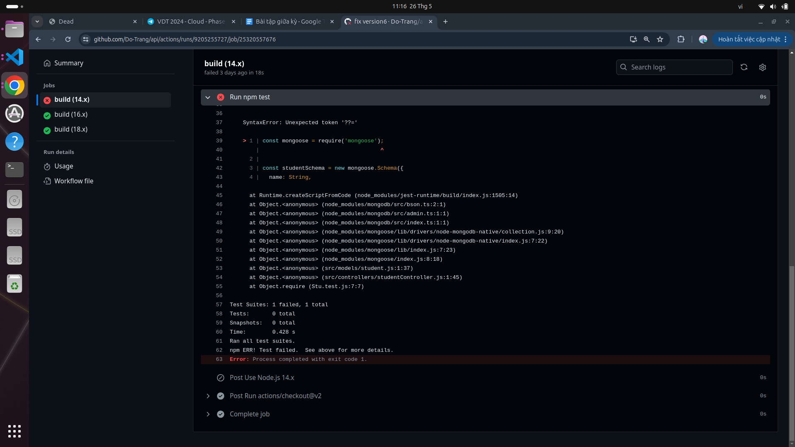

     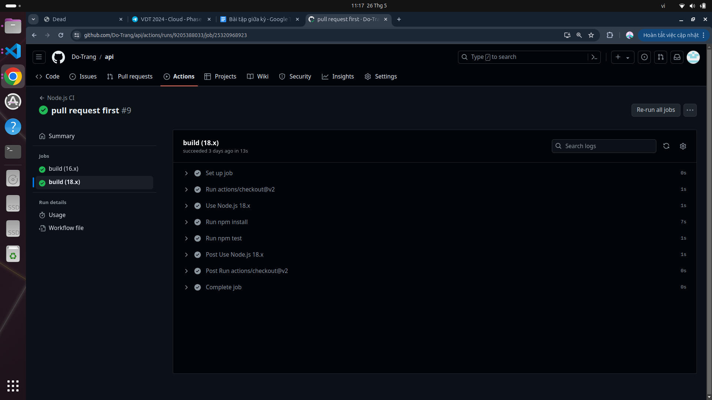

     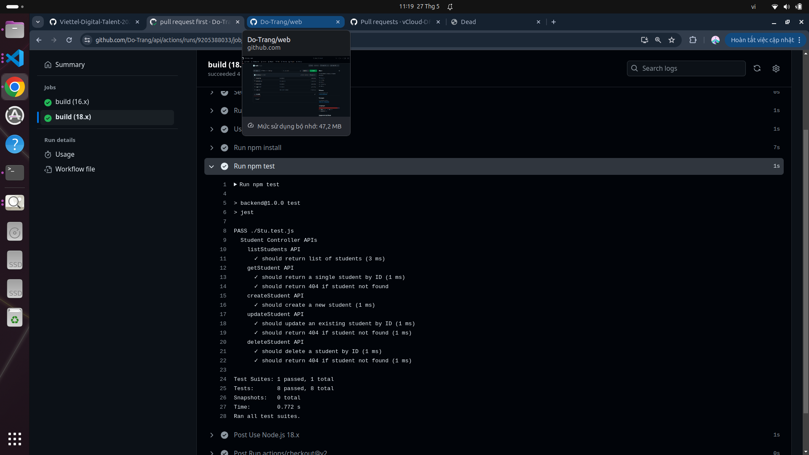
     
- Lịch sử chạy CI khi push commit, pull request

    Success
    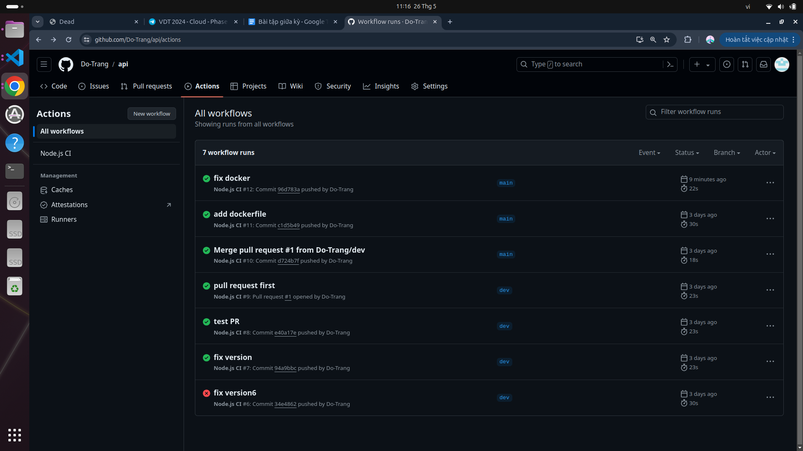
    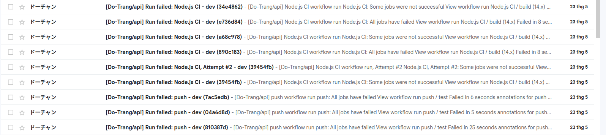