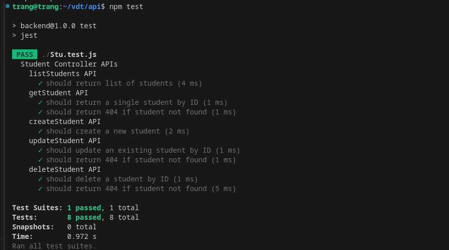

## Project giữa kỳ Viettel Digital Talent 2024
### Đỗ Thu Trang

### Phát triển một 3-tier web application đơn giản 
Hiển thị danh sách sinh viên tham gia chương trình VDT2024 dưới dạng bảng với các thông tin sau: Họ và tên, Giới tính, trường đang theo học. 

Cho phép xem chi tiết/thêm/xóa/cập nhật thông tin sinh viên.
- Thêm sinh viên

- Cập nhật thông tin sinh viên

- Xóa sinh viên

- Kết quả unit test cho các chức năng API:

 

# Mã nguồn web service: [web](https://github.com/Do-Trang/web)
# Mã nguồn api service: [api](https://github.com/Do-Trang/api)