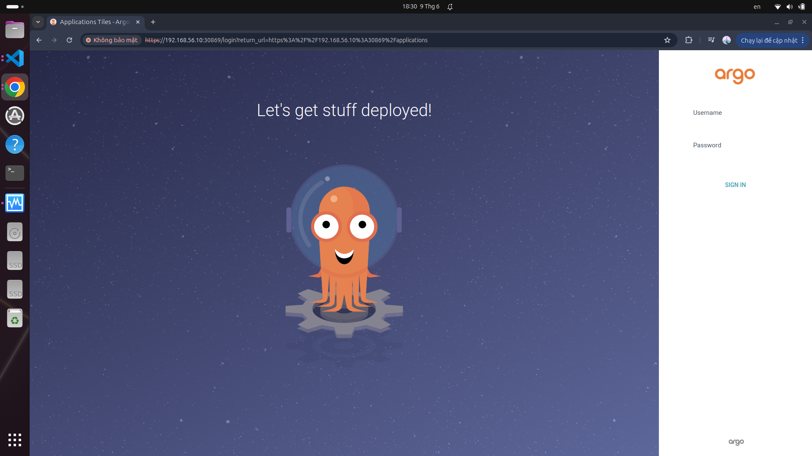
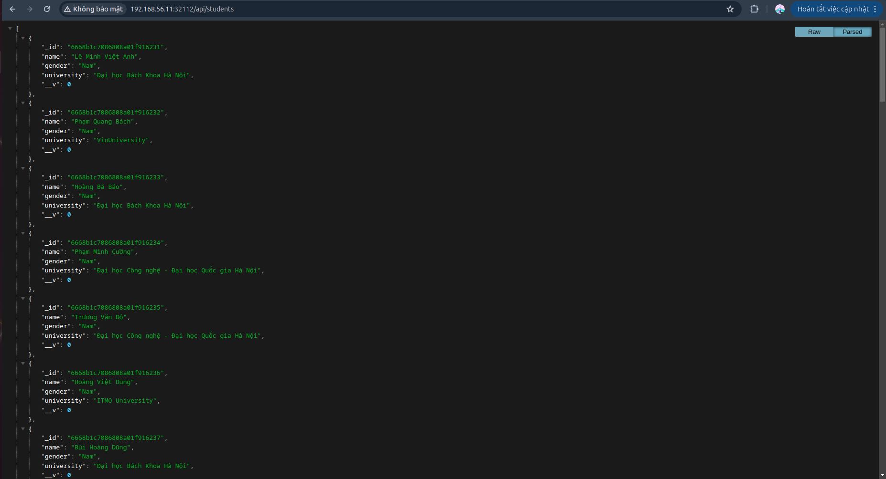

# Bài tập lớn cuối kỳ chương trình VDT 2024 lĩnh vực Cloud - Giai đoạn 1
Đỗ Thu Trang
## I. Triển khai Kubernetes:

Cụ thể gồm các bước sau: 
use kubeadm and calico
1. Setup for master, node

```
# sysctl params required by setup, params persist across reboots
cat <<EOF | sudo tee /etc/sysctl.d/k8s.conf
net.ipv4.ip_forward = 1
EOF
```

```
sudo sysctl --system

sysctl net.ipv4.ip_forward
```

```
# Add Docker's official GPG key:
sudo apt-get update
sudo apt-get install ca-certificates curl
sudo install -m 0755 -d /etc/apt/keyrings
sudo curl -fsSL https://download.docker.com/linux/ubuntu/gpg -o /etc/apt/keyrings/docker.asc
sudo chmod a+r /etc/apt/keyrings/docker.asc

# Add the repository to Apt sources:
echo \
  "deb [arch=$(dpkg --print-architecture) signed-by=/etc/apt/keyrings/docker.asc] https://download.docker.com/linux/ubuntu \
  $(. /etc/os-release && echo "$VERSION_CODENAME") stable" | \
  sudo tee /etc/apt/sources.list.d/docker.list > /dev/null
sudo apt-get update
```

```
sudo apt-get install docker-ce docker-ce-cli containerd.io docker-buildx-plugin docker-compose-plugin
```

```
sudo apt-get update
sudo apt-get install -y apt-transport-https ca-certificates curl gpg
curl -fsSL https://pkgs.k8s.io/core:/stable:/v1.30/deb/Release.key | sudo gpg --dearmor -o /etc/apt/keyrings/kubernetes-apt-keyring.gpg
echo 'deb [signed-by=/etc/apt/keyrings/kubernetes-apt-keyring.gpg] https://pkgs.k8s.io/core:/stable:/v1.30/deb/ /' | sudo tee /etc/apt/sources.list.d/kubernetes.list
sudo apt-get update
sudo apt-get install -y kubelet kubeadm kubectl
sudo apt-mark hold kubelet kubeadm kubectl
```
2. Only master
```
curl https://raw.githubusercontent.com/projectcalico/calico/v${CALICO_VERSION}/manifests/calico.yaml -O

kubectl apply -f calico.yaml

```

3. Only worker(node)
```
kubeadm join 192.168.56.10:6443 --token h7at7n.mp8yn3ql5j7iuf8s --discovery-token-ca-cert-hash sha256:27fd2c848bb0a6b27b87162ddb260c5afe526a2be513d163612eb00ceadcbc2d 
```

- Kết quả sau khi chạy lệnh và log của lệnh kiểm tra hệ thống:
 


## II. K8S Helm Chart:

### 1. Kết quả 1:


    - Bắt đầu triển khai argoCD lên cụm K8s bằng cách tạo một namespace riêng và install file manifest sau
    ```
    kubectl create namespace argocd

    kubectl apply -n argocd -f https://raw.githubusercontent.com/argoproj/argo-cd/stable/manifests/install.yaml
    ```
    - File argo-services.yaml để expose ArgoCD ra cổng 30869 sử dụng nodePort:
    ```
    apiVersion: v1
    kind: Service
    metadata:
    name: argocd-server
    namespace: argocd
    labels:
        app.kubernetes.io/name: argocd-server
    spec:
    type: NodePort
    ports:
        - port: 80
        targetPort: 8080
        nodePort: 30869
    ```


- Kết quả sau khi chạy file manifest trên cổng 30869:


- Ảnh chụp giao diện màn hình AgroCD trên trình duyệt: 



### 2. Kết quả 2:
- Helm chart:
  - Cho api Deployment: https://github.com/Do-Trang/api/tree/main/helm-webapp
  - Cho web Deployment: https://github.com/Do-Trang/web/tree/main/helm-webapp
- File values.yaml:
  - Cho web service: https://github.com/Do-Trang/web-config/blob/main/values.yaml
  - Cho api service: https://github.com/Do-Trang/api-config/blob/main/values.yaml
- Manifest của ArgoCD Application API:
```                                                      
project: default
destination:
  server: 'https://kubernetes.default.svc'
  namespace: vdt-api
syncPolicy:
  automated: {}
  syncOptions:
    - CreateNamespace=true
sources:
  - repoURL: 'https://github.com/Do-Trang/api'
    path: helm-webapp
    targetRevision: HEAD
    helm:
      valueFiles:
        - $values/values.yaml
  - repoURL: 'https://github.com/Do-Trang/api-config'
    targetRevision: HEAD
    ref: values

```

- Manifest của ArgoCD Application WEB:
```
project: default
destination:
  server: 'https://kubernetes.default.svc'
  namespace: vdt-web
syncPolicy:
  automated: {}
  syncOptions:
    - CreateNamespace=true
sources:
  - repoURL: 'https://github.com/Do-Trang/web'
    path: helm-webapp
    targetRevision: HEAD
    helm:
      valueFiles:
        - $values/values.yaml
  - repoURL: 'https://github.com/Do-Trang/web-config'
    targetRevision: HEAD
    ref: values

```

- Ảnh chụp giao diện màn hình trình duyệt khi truy cập vào Web URL, API URL:
   
  

## III. Continuous delivery: 

### 1. Kết quả:

- Sử dụng công cụ github actions để triển khai luồng CD: 

- File github/workflows của api: https://github.com/Do-Trang/api/blob/main/.github/workflows/deploy.yml

- File github/workflows của web: https://github.com/Do-Trang/web/blob/main/.github/workflows/deploy.yml

- Output log của 2 luồng CD khi tạo tag mới trên repo web và repo api
  
   
  
   


- Hình ảnh diff khi ArgoCD phát hiện thay đổi
  
  


## IV. Monitoring:

### 1. Kết quả:

Triển khai prometheus lên trên cổng 30090 thông qua nodePort:
- File prometheus-config.yaml để áp dụng cấu hình prometheus:

- Hình ảnh truy cập vào prometheus qua trình duyệt:


- Hình ảnh danh sách target của Web Deployment và API Deployment được giám sát bởi Prometheus


 
## V. Logging:


## VI. Security:

### 1. HAProxy & HTTPS:

#### 1.1 Cài đặt:

#### 1.2 HAProxy:
Cài đặt haproxy trên máy HAProxyVM bằng lệnh:

```
sudo apt-get install haproxy
```
Cấu hình file haproxy.conf ở trong thư mục /etc/haproxy như sau: 
```                                  
frontend https_front
    bind *:443 ssl crt /etc/haproxy/haproxy.pem
    acl is_api path_beg /api
    use_backend api_back if is_api
    acl is_web path_beg /
    use_backend web_back if is_web

backend api_back
    balance roundrobin
    server api1 192.168.56.10:32112 check

backend web_back
    balance roundrobin
    server web1 192.168.56.11:31090 check


```

Chạy lệnh sau để khởi động haproxy:
``` 
sudo systemctl start haproxy
```

Kiểm tra trạng thái của haproxy bằng lệnh `sudo systemctl status haproxy`:


#### 1.3 HTTPS:


### 2. Authen/Authorization:
 sử dụng JWT (Json Web Token) để thiết lập token cho việc xác thực và phân quyền.

#### Các bước triển khai:

1. Tạo middleware để xác thực và phân quyền: 

```

const jwt = require('jsonwebtoken');

const authenticateToken = (req, res, next) => {
  const authHeader = req.headers['authorization'];
  const token = authHeader && authHeader.split(' ')[1];

  if (!token) return res.sendStatus(403);

  jwt.verify(token, process.env.TOKEN_SECRET, (err, user) => {
    if (err) return res.sendStatus(403);
    req.user = user;
    next();
  });
};

const authorizeRoles = (roles) => {
  return (req, res, next) => {
    if (roles.includes(req.user.role)) { 
      return next();
    }
    return res.sendStatus(403);
  };
};

module.exports = {
  authenticateToken,
  authorizeRoles
};

```
3. Cập nhật lại route, áp dụng các middleware:
```
// Public routes
router.get('/', studentController.listStudents);
router.get('/:id', studentController.getStudent);

// Protected routes
router.post('/', authenticateToken, authorizeRoles(['admin']), studentController.createStudent);
router.put('/:id', authenticateToken, authorizeRoles(['admin']), studentController.updateStudent);
router.delete('/:id', authenticateToken, authorizeRoles(['admin']), studentController.deleteStudent);
```

#### Kết quả chạy:
- Với role user:
  - Khi truy cập vào GET request:
  
  - Khi truy cập vào POST request:
  
  - Khi truy cập vào DELETE request:
  

  

- Với role admin
  - Khi truy cập vào GET request:
  

  - Khi truy cập vào DELETE request:
  


### 3. Ratelimit:

Ứng dụng này sử dụng express-rate-limit để giới hạn truy cập đến Endpoint của từng máy tính.


Cách triển khai giải pháp:

1. Cấu hình cho rate-limiting-middleware: 
```
const rateLimit = require('express-rate-limit');

const apiLimiter = rateLimit({
  windowMs: 1 * 60 * 1000, 
  max: 10, 
  handler: (req, res) => {
    res.status(409).json({ message: "Nhieu request qua! Cuu toi voi" });
  }
});

module.exports = apiLimiter;

```

- Kết quả sau khi cấu hình thành công express-rate-limit:

  - Kiểm tra trên postman:
  
  - Kiểm tra ở trong log của api:
  
