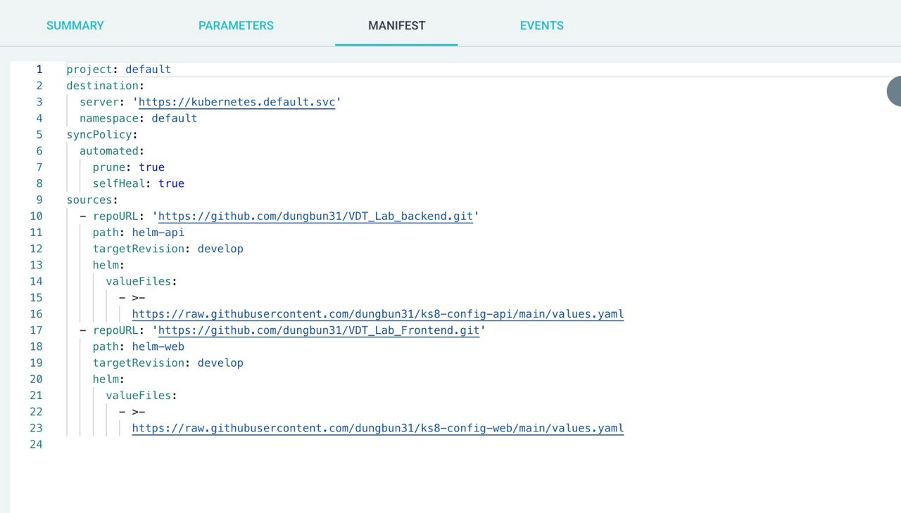

# Triển khai web application sử dụng các DevOps tools & practices
## 1. Yêu cầu 1

### ArgoCD là gì?
ArgoCD là một công cụ triển khai liên tục (Continuous Deployment - CD) mã nguồn mở dành cho Kubernetes. Được phát triển bởi Intuit, ArgoCD cho phép bạn tự động hóa quá trình triển khai các ứng dụng và quản lý trạng thái của chúng trên các cụm Kubernetes.

  

### Tính năng chính của ArgoCD
1. **Quản lý trạng thái mong muốn**:
   - ArgoCD duy trì trạng thái mong muốn của các ứng dụng trong Kubernetes Cluster bằng cách so sánh trạng thái thực tế với các định nghĩa cấu hình lưu trữ trong hệ thống kiểm soát mã nguồn (Git).
   
2. **Triển khai tự động**:
   - ArgoCD tự động triển khai các thay đổi từ kho lưu trữ Git vào Kubernetes Cluster. Điều này giúp đảm bảo rằng trạng thái của ứng dụng luôn đồng bộ với cấu hình đã được xác định.

3. **Theo dõi và đồng bộ hóa**:
   - ArgoCD cung cấp khả năng theo dõi và đồng bộ hóa các ứng dụng theo thời gian thực. Người dùng có thể dễ dàng kiểm tra và sửa lỗi các thay đổi không mong muốn hoặc không đúng với cấu hình.

4. **Hỗ trợ nhiều loại ứng dụng**:
   - ArgoCD hỗ trợ nhiều loại ứng dụng và cấu hình, bao gồm Helm charts, Kustomize, và các tài nguyên Kubernetes thuần.

5. **Quản lý nhiều cụm**:
   - ArgoCD có khả năng quản lý và triển khai ứng dụng trên nhiều cụm Kubernetes, giúp tăng cường khả năng quản lý và mở rộng hệ thống.

  

### Lợi ích của ArgoCD
1. **Tự động hóa và tăng hiệu quả**:
   - ArgoCD tự động hóa quá trình triển khai và quản lý trạng thái, giúp giảm thiểu sự can thiệp của con người và tăng cường hiệu quả làm việc.

2. **Đảm bảo tính nhất quán**:
   - Việc sử dụng hệ thống kiểm soát mã nguồn giúp đảm bảo rằng cấu hình triển khai luôn nhất quán và dễ dàng truy vết các thay đổi.

3. **Khả năng mở rộng**:
   - Với khả năng quản lý nhiều cụm và hỗ trợ các loại ứng dụng khác nhau, ArgoCD phù hợp với các hệ thống từ nhỏ đến lớn và phức tạp.

4. **Cộng đồng hỗ trợ mạnh mẽ**:
   - ArgoCD có một cộng đồng mã nguồn mở rộng lớn và sôi động, giúp người dùng dễ dàng tìm kiếm hỗ trợ và tài liệu.

### Cách thức hoạt động của ArgoCD
1. **Đồng bộ hóa với Git**:
   - ArgoCD đồng bộ hóa cấu hình ứng dụng từ kho Git và so sánh với trạng thái thực tế của các ứng dụng trên Kubernetes Cluster.

2. **Triển khai thay đổi**:
   - Khi phát hiện sự khác biệt, ArgoCD sẽ tự động hoặc bán tự động triển khai các thay đổi để đảm bảo trạng thái thực tế khớp với trạng thái mong muốn.

3. **Giám sát và báo cáo**:
   - ArgoCD giám sát các ứng dụng và cung cấp báo cáo về trạng thái triển khai, giúp người dùng dễ dàng nắm bắt tình hình hoạt động của hệ thống.

### output

  <i><a href=https://raw.githubusercontent.com/argoproj/argo-cd/stable/manifests/install.yaml>
         File manifests sử dụng để triển khai ArgoCD 
        </a></i>

 

  <i><a href=https://argo-cd.readthedocs.io/en/stable/getting_started/#4-login-using-the-cli>
         hướng dẫn cài đặt
        </a></i>

 

  

  <i> giao diện màn hình của hệ thống ArgoCD 
        </i>

  

  <i> nodePort
        </i>

## 2. Yêu cầu 2

### Helm Chart là gì?
Helm Chart là một công cụ quản lý các gói phần mềm cho Kubernetes. Nó hoạt động như một trình quản lý gói, giúp dễ dàng xác định, cài đặt và nâng cấp các ứng dụng trên Kubernetes. Helm Chart cung cấp các mẫu cấu hình (templates) giúp chuẩn hóa và tự động hóa việc triển khai ứng dụng.

### Tính năng chính của Helm Chart
1. **Đóng gói ứng dụng**:
   - Helm cho phép đóng gói các ứng dụng và tài nguyên Kubernetes thành các đơn vị được gọi là Charts. Một Chart có thể chứa tất cả các định nghĩa tài nguyên cần thiết để chạy một ứng dụng, công cụ, hoặc dịch vụ trên Kubernetes.

2. **Cấu hình dễ dàng**:
   - Helm Charts sử dụng các templates để cung cấp các giá trị cấu hình mặc định và cho phép ghi đè các giá trị này bằng các tập tin cấu hình (values.yaml) hoặc các giá trị trực tiếp từ dòng lệnh.

3. **Quản lý phiên bản**:
   - Helm quản lý các phiên bản của Charts, giúp bạn dễ dàng quay lại phiên bản trước nếu có vấn đề xảy ra sau khi nâng cấp.

4. **Triển khai tự động**:
   - Helm tự động triển khai các Charts lên Kubernetes Cluster, quản lý các vòng đời của ứng dụng từ cài đặt đến gỡ bỏ.

5. **Thư viện Chart phong phú**:
   - Có nhiều Helm Chart có sẵn trong các repository công khai, giúp bạn nhanh chóng triển khai các ứng dụng phổ biến mà không cần tự viết từ đầu.

### ArgoCD và tính năng multiple sources
ArgoCD là một công cụ triển khai liên tục (Continuous Deployment - CD) dành cho Kubernetes, hỗ trợ việc tự động hóa quá trình triển khai ứng dụng. Một trong những tính năng mạnh mẽ của ArgoCD là khả năng tích hợp và đồng bộ hóa với nhiều nguồn (multiple sources) để quản lý và triển khai các ứng dụng.

### Tính năng multiple sources của ArgoCD
1. **Hỗ trợ nhiều loại nguồn**:
   - ArgoCD có thể tích hợp với nhiều loại nguồn khác nhau như Git repositories, Helm repositories, S3 buckets, và nhiều dịch vụ lưu trữ khác.

2. **Đồng bộ hóa nhiều nguồn**:
   - Tính năng multiple sources cho phép ArgoCD đồng bộ hóa các ứng dụng từ nhiều nguồn khác nhau. Điều này rất hữu ích khi bạn có các cấu hình ứng dụng và biểu đồ Helm lưu trữ ở các kho khác nhau.

3. **Quản lý tập trung**:
   - Với khả năng hỗ trợ nhiều nguồn, ArgoCD cho phép bạn quản lý tập trung các cấu hình và trạng thái triển khai của ứng dụng, bất kể chúng được lưu trữ ở đâu.

4. **Tích hợp dễ dàng với Helm**:
   - ArgoCD có khả năng tích hợp mạnh mẽ với Helm, giúp bạn dễ dàng triển khai và quản lý các ứng dụng sử dụng Helm Charts. Bạn có thể chỉ định các Helm Chart từ nhiều nguồn khác nhau và ArgoCD sẽ tự động quản lý việc đồng bộ hóa và triển khai chúng.

### Lợi ích của tính năng multiple sources
1. **Linh hoạt và mở rộng**:
   - Tính năng này mang lại sự linh hoạt và khả năng mở rộng cho quá trình triển khai ứng dụng, cho phép bạn sử dụng các nguồn lưu trữ khác nhau tùy theo nhu cầu và cấu trúc tổ chức.

2. **Tăng cường khả năng quản lý**:
   - Với khả năng đồng bộ hóa từ nhiều nguồn, bạn có thể dễ dàng quản lý các cấu hình phức tạp và phân tán của ứng dụng.

3. **Tiết kiệm thời gian và công sức**:
   - Việc tích hợp nhiều nguồn giúp giảm thiểu công sức và thời gian cần thiết để thiết lập và quản lý các kho lưu trữ khác nhau cho các phần khác nhau của ứng dụng.

### output

  <i><a href=https://github.com/dungbun31/VDT_Lab_Frontend.git>
         VDT_Lab_Frontend
        </a></i>

 

  <i><a href=https://github.com/dungbun31/VDT_Lab_backend.git>
         VDT_Lab_backend 
        </a></i>

 

  <i><a href=https://github.com/dungbun31/ks8-config-web.git>
         ks8-config-web
        </a></i>

 

  <i><a href=https://github.com/dungbun31/ks8-config-api.git>
        ks8-config-api 
        </a></i>

 

  

  <i> Manifest của ArgoCD
        </i>

 

  

  <i> giao diện màn hình trình duyệt khi truy cập vào Web URL
        </i>

 

  

  <i> giao diện màn hình trình duyệt khi truy cập vào API URL
        </i>

 