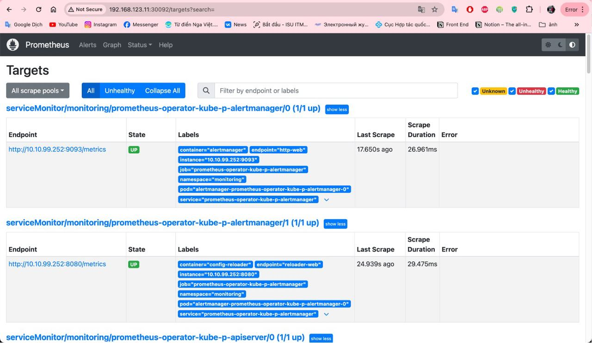
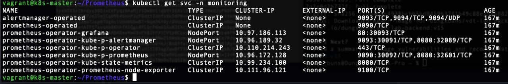
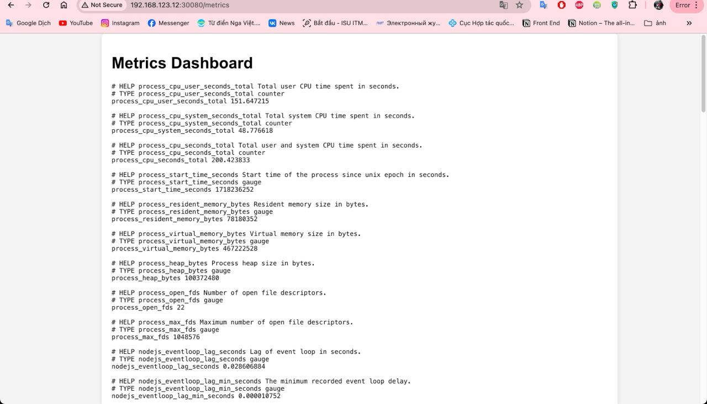
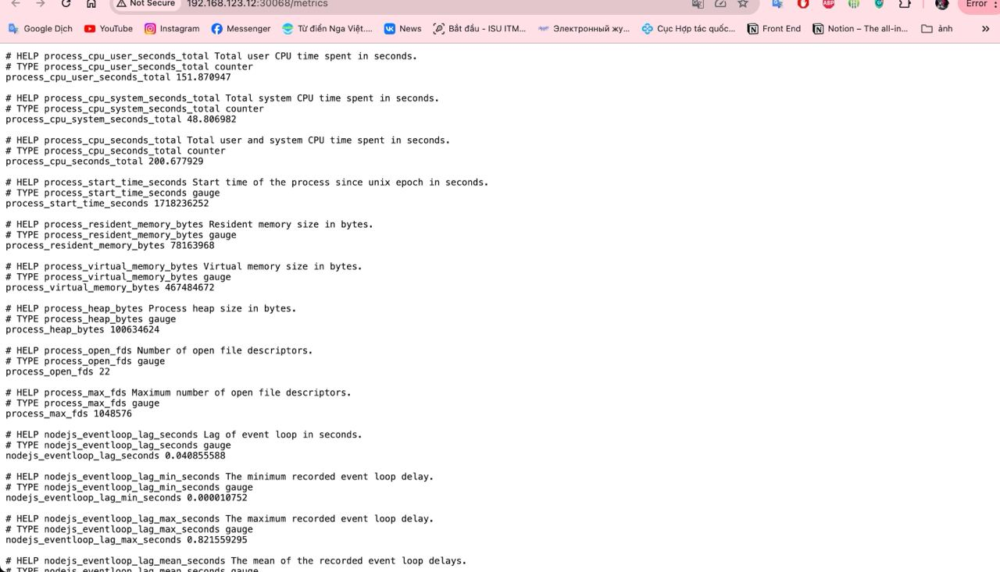
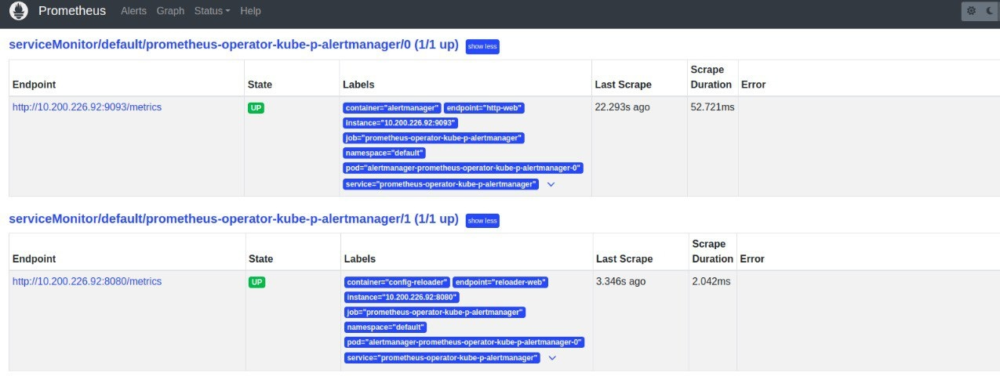

# Triển khai web application sử dụng các DevOps tools & practices
## 1. Mô tả

**I. Prometheus**

Prometheus là một hệ thống giám sát và cảnh báo nguồn mở, được phát triển ban đầu bởi SoundCloud và hiện nay được duy trì bởi cộng đồng mã nguồn mở. Được ra mắt vào năm 2012, Prometheus đã nhanh chóng trở thành một trong những công cụ giám sát phổ biến nhất trong thế giới DevOps và Cloud Native.

**II. Chức Năng và Tính Năng Chính**

1. **Thu thập Dữ Liệu (Data Collection):** Prometheus thu thập số liệu từ các ứng dụng thông qua các HTTP endpoint. Nó thường được sử dụng với các exporter để thu thập số liệu từ các dịch vụ và hệ thống khác nhau.

2. **Lưu Trữ Dữ Liệu (Data Storage):** Prometheus lưu trữ các số liệu thời gian thực (time-series) với độ chính xác cao. Các dữ liệu này được lưu trữ cục bộ mà không cần phụ thuộc vào các hệ thống lưu trữ bên ngoài.

3. **Ngôn Ngữ Truy Vấn PromQL:** Prometheus sử dụng một ngôn ngữ truy vấn mạnh mẽ gọi là PromQL, cho phép người dùng thực hiện các truy vấn phức tạp để phân tích dữ liệu.

4. **Cảnh Báo (Alerting):** Prometheus có hệ thống cảnh báo tích hợp thông qua Alertmanager, giúp gửi cảnh báo đến các kênh như email, Slack, hay các hệ thống quản lý sự cố khác.

5. **Tích Hợp Dễ Dàng:** Prometheus dễ dàng tích hợp với nhiều hệ thống khác nhau như Kubernetes, Docker, và nhiều hệ thống giám sát khác.

**III. Kiến Trúc**

Kiến trúc của Prometheus bao gồm các thành phần chính:

1. **Prometheus Server:** Thành phần chính thu thập và lưu trữ dữ liệu.
2. **Exporter:** Các thành phần thu thập số liệu từ các hệ thống khác nhau và chuyển đổi chúng thành định dạng mà Prometheus có thể hiểu.
3. **Pushgateway:** Hỗ trợ thu thập số liệu từ các job ngắn hạn.
4. **Alertmanager:** Xử lý các cảnh báo từ Prometheus server và gửi đến người dùng.
5. **Client Libraries:** Thư viện giúp tích hợp Prometheus vào các ứng dụng.

**V. Lợi Ích và Hạn Chế**

**Lợi Ích:**
- Dễ dàng triển khai và cấu hình.
- Khả năng mở rộng tốt.
- Hỗ trợ nhiều ngôn ngữ lập trình và hệ thống.

## 2. Output

<div align="center">
  
</div>

<div align="center">
  <i> Prometheus UI thông qua trình duyệt
        </i>
</div>

file setup để triển khai Prometheus lên Kubernetes Cluster


```
alertmanager:
  enabled: true
  service:
    type: NodePort
    nodePort: 30091

prometheus:
  enabled: true
  service:
    type: NodePort
    nodePort: 30092

grafana:
  enabled: true
  service:
    type: NodePort
    nodePort: 30093

kubeEtcd:
  service:
    type: NodePort

kubeScheduler:
  service:
    type: NodePort

kubeControllerManager:
  service:
    type: NodePort

prometheusOperator:
  enabled: true
```


<div align="center">
  
</div>

<div align="center">
  <i> Expose Prometheus dưới dạng Nodepor
        </i>
</div>

<div align="center">
  
</div>

<div align="center">
  <i> Expose metric của web service
        </i>
</div>

<div align="center">
  
</div>

<div align="center">
  <i> Expose metric của api service
        </i>
</div>

<div align="center">
  
</div>

<div align="center">
  <i> target của Web Deployment và API Deployment
        </i>
</div>