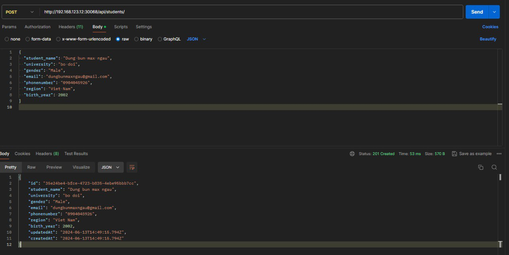

# Security
## 1. Yêu cầu 1

### Giới Thiệu Về Mục Tiêu và Giải Pháp Dựng HAProxy Loadbalancer

#### Mục Tiêu
Mục tiêu của bài tập này là hướng dẫn sinh viên triển khai một HAProxy Loadbalancer trong môi trường ảo hóa hoặc sử dụng nền tảng Viettel Cloud. Cụ thể, HAProxy sẽ được cấu hình để hoạt động trong chế độ TCP và mở hai cổng (web_port và api_port). Các cổng này sẽ trỏ đến các NodePort tương ứng của Web Deployment và API Deployment trên Kubernetes Cluster.

Ngoài ra, bài tập cũng yêu cầu sinh viên triển khai giải pháp đảm bảo các truy cập đến các cổng web_port và api_port sử dụng HTTPS. Điều này có thể được thực hiện thông qua hai giải pháp: sử dụng Ingress hoặc HAProxy sidecar container cho các deployment. Sinh viên cũng sẽ được phép sử dụng chứng chỉ tự ký (self-signed certificate) để hoàn thành bài tập này.

#### Giải Pháp

1. **Dựng HAProxy Loadbalancer**
    - **Môi Trường Cụm Lab Riêng của Sinh Viên**: Sinh viên sẽ dựng HAProxy Loadbalancer trên một máy ảo (VM) riêng biệt. VM này sẽ được cấu hình để xử lý tải và điều hướng các yêu cầu đến các NodePort của Web Deployment và API Deployment trên Kubernetes Cluster.
    - **Môi Trường Viettel Cloud**: Trong trường hợp sử dụng cụm Lab của Viettel Cloud, HAProxy sẽ được triển khai trên Basion Node.

    HAProxy sẽ hoạt động trong chế độ TCP, mở hai cổng cụ thể:
    - `web_port`: Trỏ đến NodePort của Web Deployment.
    - `api_port`: Trỏ đến NodePort của API Deployment.

2. **Đảm Bảo Truy Cập HTTPS**
    - **Ingress**: Sinh viên có thể sử dụng Ingress Controller để quản lý và điều hướng lưu lượng vào Kubernetes Cluster. Ingress sẽ được cấu hình để chuyển tiếp các yêu cầu HTTPS đến các cổng nội bộ tương ứng.
    - **HAProxy Sidecar Container**: Một giải pháp khác là sử dụng HAProxy như một sidecar container trong các deployment. HAProxy sidecar sẽ chịu trách nhiệm chuyển tiếp và mã hóa các kết nối đến các cổng web_port và api_port.

3. **Sử Dụng Self-Signed Certificate**
    - Sinh viên được phép sử dụng chứng chỉ tự ký (self-signed certificate) để triển khai HTTPS. Điều này giúp sinh viên nắm vững quy trình tạo và sử dụng chứng chỉ SSL trong môi trường thực tế, dù không phải là chứng chỉ từ các cơ quan cấp phát chính thức.

### output
<div >
  <i><a [href=https://github.com/dungbun31/ks8-config-web.git](https://green.cloud/docs/how-to-install-and-configure-haproxy-on-ubuntu-20-04/)>
         cách cài HAProxy
        </a></i>
</div>
<br>

cấu hình HAProxy
```
global
    log /dev/log local0
    log /dev/log local1 notice
    chroot /var/lib/haproxy
    stats socket /run/haproxy/admin.sock mode 660 level admin
    stats timeout 30s
    user haproxy
    group haproxy
    daemon

    ca-base /etc/ssl/certs
    crt-base /etc/ssl/private
    ssl-default-bind-ciphers PROFILE=SYSTEM
    ssl-default-bind-options no-sslv3

defaults
    log global
    mode tcp
    option tcplog
    option dontlognull
    timeout connect 5000
    timeout client  50000
    timeout server  50000

frontend web_frontend
    bind *:443 ssl crt /etc/haproxy/certs/selfsigned.pem
    default_backend web_backend

frontend api_frontend
    bind *:8443 ssl crt /etc/haproxy/certs/selfsigned.pem
    default_backend api_backend

backend web_backend
    server web1 192.168.123.12:30080 check

backend api_backend
    server api1 192.168.123.12:30068 check

```


## 2. Yêu cầu 2

### Mục tiêu

Mục tiêu của việc triển khai code backend này là:

1. **Đảm bảo xác thực và phân quyền**:
   - Mỗi yêu cầu đến API phải được xác thực thông qua token JWT.
   - Phân quyền rõ ràng giữa hai loại người dùng: `user` và `admin`.

2. **Thực hiện đầy đủ CRUD**:
   - Cho phép tạo, đọc, cập nhật, và xóa các bản ghi sinh viên trong cơ sở dữ liệu.
   - Đảm bảo rằng các yêu cầu CRUD chỉ được thực hiện bởi những người dùng có quyền phù hợp.

3. **Cải thiện bảo mật và quản lý lỗi**:
   - Bảo vệ các API endpoint bằng cách sử dụng xác thực JWT.
   - Xử lý và log các lỗi một cách rõ ràng để dễ dàng theo dõi và sửa lỗi.

### Phương pháp

Phương pháp triển khai gồm các bước sau:

1. **Cài đặt và cấu hình các thư viện cần thiết**:
   - Sử dụng Express.js để xây dựng server.
   - Sử dụng Sequelize ORM để quản lý cơ sở dữ liệu.
   - Sử dụng `jsonwebtoken` để tạo và xác thực token JWT.

2. **Xây dựng mô hình dữ liệu**:
   - Định nghĩa mô hình `Students` với các trường thông tin cần thiết.
   - Đồng bộ mô hình với cơ sở dữ liệu để tạo bảng và cột tương ứng.

3. **Triển khai các middleware xác thực và phân quyền**:
   - Tạo middleware để xác thực token JWT.
   - Tạo middleware để kiểm tra vai trò người dùng và phân quyền truy cập.

4. **Xây dựng các route cho các yêu cầu CRUD**:
   - Tạo các endpoint cho phép tạo, đọc, cập nhật và xóa các bản ghi sinh viên.
   - Sử dụng các middleware để bảo vệ các endpoint và đảm bảo chỉ người dùng có quyền phù hợp mới có thể thực hiện các thao tác.

5. **Kiểm tra và xác thực chức năng**:
   - Sử dụng Postman để kiểm tra các endpoint và đảm bảo rằng xác thực và phân quyền hoạt động đúng.
   - Ghi log các lỗi và thông tin cần thiết để dễ dàng theo dõi và sửa lỗi.

### Các bước tiến hành

1. **Cài đặt thư viện**:
   - Cài đặt Express, Sequelize, `jsonwebtoken`, và các thư viện cần thiết khác.

2. **Cấu hình cơ sở dữ liệu**:
   - Thiết lập kết nối cơ sở dữ liệu bằng Sequelize.
   - Định nghĩa mô hình `Students` và đồng bộ với cơ sở dữ liệu.

3. **Tạo middleware xác thực và phân quyền**:
   - Tạo file `authMiddleware.js` để xử lý xác thực JWT.
   - Tạo file `roleMiddleware.js` để kiểm tra vai trò người dùng.

4. **Xây dựng các route CRUD**:
   - Tạo file `students_controller.js` để xử lý các yêu cầu CRUD.
   - Sử dụng các middleware xác thực và phân quyền trong các route này.

5. **Kiểm tra chức năng với Postman**:
   - Kiểm tra các yêu cầu tạo, đọc, cập nhật và xóa với token của người dùng có vai trò khác nhau.
   - Đảm bảo rằng chỉ người dùng có quyền admin mới có thể thực hiện các thao tác POST, PUT và DELETE.

6. **Log và xử lý lỗi**:
   - Ghi log chi tiết các lỗi và thông tin cần thiết để dễ dàng theo dõi và sửa lỗi.
   - Xử lý các lỗi và phản hồi cho người dùng với thông báo lỗi rõ ràng.

### Output
#### ROLE USER
<div align="center">
  
</div>

<div align="center">
  <i> Đăng Ký User Mới
        </i>
</div>
<div align="center">
  
</div>

<div align="center">
  <i> Đăng nhập User
        </i>
</div>
<div align="center">
  
</div>

<div align="center">
  <i> GET Request:
        </i>
</div>
<div align="center">
  
</div>

<div align="center">
  <i> POST Request
        </i>
</div>
<div align="center">
  
</div>

<div align="center">
  <i> DELETE Request
        </i>
</div>

#### ROLE ADMIN
<div align="center">
  
</div>

<div align="center">
  <i> Đăng Ký User Mới
        </i>
</div>
<div align="center">
  
</div>

<div align="center">
  <i> Đăng nhập User
        </i>
</div>
<div align="center">
  
</div>

<div align="center">
  <i> GET Request:
        </i>
</div>
<div align="center">
  
</div>

<div align="center">
  <i> POST Request
        </i>
</div>
<div align="center">
  
</div>

<div align="center">
  <i> DELETE Request
        </i>
</div>

## 3. Yêu cầu 3

Trong quá trình phát triển các dịch vụ API, việc kiểm soát số lượng yêu cầu (requests) gửi đến Endpoint là rất quan trọng để bảo vệ hệ thống khỏi bị quá tải và đảm bảo dịch vụ luôn hoạt động ổn định. Một trong những giải pháp phổ biến để thực hiện việc này là sử dụng cơ chế ratelimit. Bài báo cáo này sẽ trình bày về việc áp dụng giải pháp ratelimit cho một Endpoint của API service, cụ thể là giới hạn số lượng yêu cầu tối đa là 10 yêu cầu trong một phút. Nếu số lượng yêu cầu vượt quá giới hạn này, các yêu cầu sau đó sẽ bị trả về với HTTP Response 409.

```
const rateLimit = require("express-rate-limit");

const apiLimiter = rateLimit({
  windowMs: 1 * 60 * 1000, // 1 phút
  max: 10, // Tối đa 10 yêu cầu
  handler: (req, res) => {
    res.status(409).json({
      error: "Too many requests, please try again later.",
    });
  },
});
```

</div>
<div align="center">
  
</div>

<div align="center">
  <i> 
        </i>
</div>
