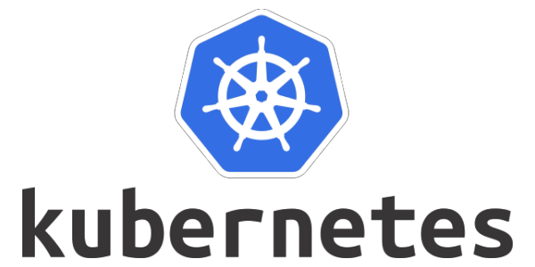
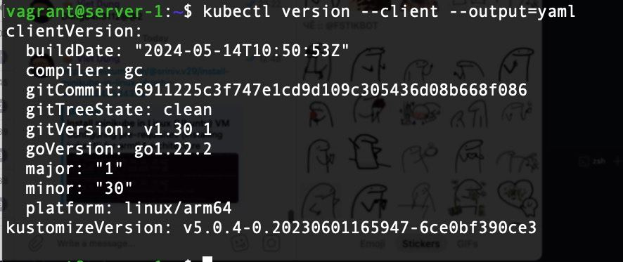

# Phát triển Kubernetes
## 1. Mô tả
Kubernetes là một hệ thống mã nguồn mở được phát triển bởi Google, được sử dụng để quản lý và triển khai các ứng dụng container. Được ra mắt lần đầu vào năm 2014, Kubernetes nhanh chóng trở thành một công cụ quan trọng trong việc xây dựng và vận hành các hệ thống ứng dụng phức tạp.

  

### Ưu điểm của Kubernetes

1. **Tự động hóa**: Kubernetes cung cấp các công cụ tự động hóa cho việc triển khai, mở rộng và quản lý ứng dụng container, giảm bớt công việc thủ công và rủi ro lỗi.

2. **Tăng tính sẵn sàng và độ tin cậy**: Kubernetes giúp cân bằng tải tự động, phục hồi từ lỗi và tự động khôi phục dịch vụ, giúp ứng dụng của bạn luôn sẵn sàng hoạt động.

3. **Mở rộng linh hoạt**: Kubernetes cho phép bạn mở rộng ứng dụng của mình một cách dễ dàng, từ môi trường thử nghiệm đến môi trường sản xuất, và có thể tự động thích ứng với các yêu cầu tài nguyên.

4. **Tiết kiệm chi phí**: Bằng cách tận dụng tài nguyên máy chủ một cách hiệu quả và tự động hóa các quy trình, Kubernetes giúp tiết kiệm chi phí vận hành hệ thống.

5. **Cộng đồng lớn và hỗ trợ mạnh mẽ**: Kubernetes được hỗ trợ bởi một cộng đồng lớn và đa dạng, với sự đóng góp từ nhiều tổ chức và cá nhân hàng đầu trong ngành công nghiệp công nghệ.

### Cách hoạt động của Kubernetes

Kubernetes hoạt động dựa trên một mô hình quản lý và triển khai các ứng dụng container mạnh mẽ và tự động. Dưới đây là một cái nhìn tổng quan về cách hoạt động của Kubernetes:

1. **Quản lý Cụm (Cluster Management)**: Kubernetes quản lý một cụm (cluster) các máy chủ (nodes), nơi các ứng dụng container chạy. Cụm này bao gồm một hoặc nhiều máy chủ làm việc (worker nodes) và một máy chủ điều khiển (master node) để điều phối hoạt động của các máy chủ làm việc.

2. **Quản lý Các Tài Nguyên**: Kubernetes quản lý tài nguyên của cụm, bao gồm bộ nhớ, CPU, lưu trữ và mạng. Nó đảm bảo rằng các ứng dụng container được chạy trên cụm được phân phối một cách cân bằng và hiệu quả sử dụng tài nguyên.

3. **Triển Khai Ứng Dụng**: Kubernetes cung cấp các tài nguyên để triển khai các ứng dụng container, được gọi là các Pod. Mỗi Pod chứa một hoặc nhiều container, chia sẻ một không gian lưu trữ, mạng và tài nguyên khác.

4. **Tự Động Hoá**: Kubernetes cung cấp các công cụ tự động hoá để quản lý và giám sát các ứng dụng container. Các tính năng tự động bao gồm việc tự động mở rộng, cân bằng tải, và khôi phục từ lỗi.

5. **Mở Rộng và Linh Hoạt**: Kubernetes cho phép bạn mở rộng và linh hoạt triển khai ứng dụng của mình trên nhiều môi trường khác nhau, từ máy chủ riêng tư đến môi trường đám mây đến điện toán phân tán.

  

Với những lợi ích này, Kubernetes đã trở thành một công cụ quản lý container phổ biến và được nhiều tổ chức lựa chọn để xây dựng và triển khai ứng dụng của họ trên môi trường Cloud.

## 2. Output
### Triển khai được Kubernetes thông qua công cụ minikube trên 1 node

  <i><a href=https://medium.com/@sriniv.v29/install-minikube-in-linux-ubuntu-vm-2a694b54433a>
         Cách triển khai Kubernetes thông qua công cụ minikube 
        </a></i>

 

  <i><a href=https://minikube.sigs.k8s.io/docs/start/?arch=%2Flinux%2Farm64%2Fstable%2Fbinary+download>
         Công cụ minikube 
        </a></i>

 

  

  

  

minikube dashboard

  

### Triển khai được Kubernetes thông qua công cụ kubeadm hoặc kubespray lên 1 master node VM + 1 worker node VM

  <i><a href=https://nvtienanh.info/blog/cai-dat-kubernetes-cluster-tren-ubuntu-server-22-04>
         Hướng dẫn triển khai được Kubernetes thông qua công cụ kubeadm  
        </a></i>

 

  <i><a href=https://v1-29.docs.kubernetes.io/docs/setup/production-environment/tools/kubeadm/install-kubeadm/>
         Cài đặt kubelet kubeadm và kubectl
        </a></i>

 

  <i><a href=https://docs.docker.com/engine/install/ubuntu/>
         Cài đặt containerd
        </a></i>

 

  

Kubernetes Dashboard

  

