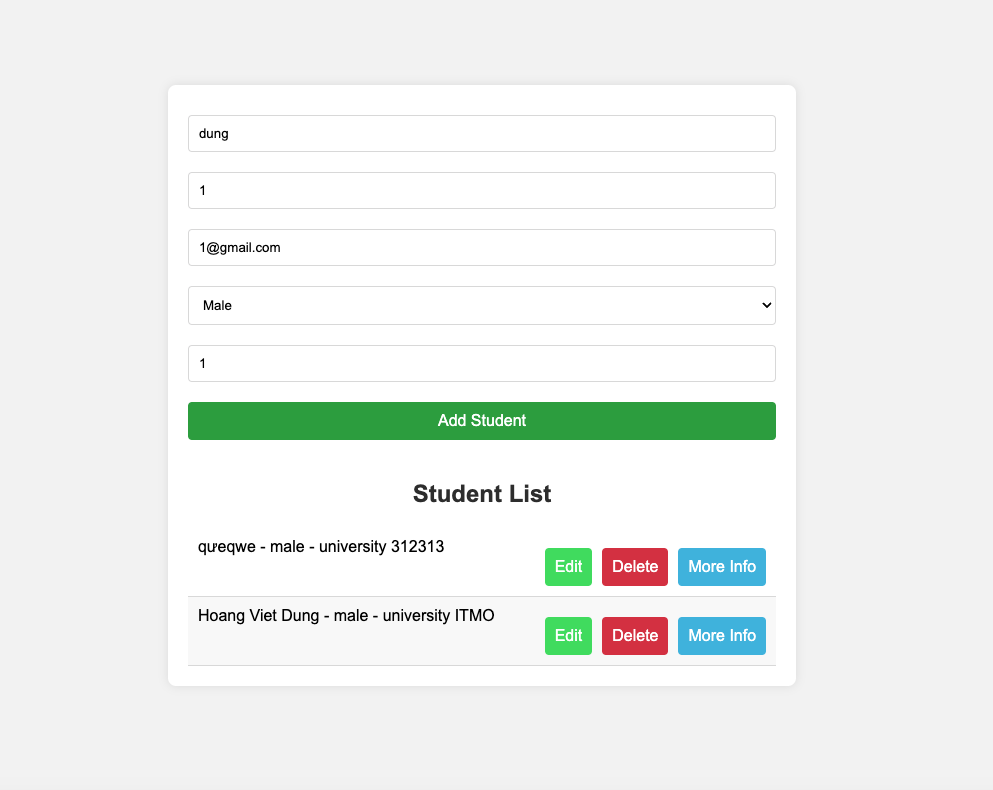

# Phát triển một 3-tier web application đơn giản

## 1. Mô tả

3-tier web application sử dụng 3 dịch vụ gồm: web, api và database.

Để quản lý mã nguồn cho API và trang web, chúng ta sử dụng hai kho lưu trữ riêng biệt. Mỗi tính năng mới sẽ được thực hiện qua một pull request. Cả hai kho lưu trữ này đều tuân theo quy trình git flow, bao gồm các nhánh chính là main, release, và develop. Khi phát triển 1 tính năng mới sẽ thực hiện checkout ra và tạo pull request vào nhánh khác, cụ thể đây là nhánh sẽ được mang tên của chức năng đó. Từ các nhánh đó sẽ được merge vào release rồi sau đó đến main. Các phiên bản sẽ được gắn tag từ nhánh main để đánh dấu các phiên bản triển khai. Trong 2 repo `VDT_Lab_backend` và `VDT_Lab_Frontend`, Các commit gửi lên sẽ được tuân theo 1 Commit convention. Nó sẽ giúp các thành viên trong nhóm hiểu rõ hơn về nội dung của mỗi commit và dễ dàng theo dõi lịch sử thay đổi của dự án.

  

  <i><a href=https://medium.com/@yanminthwin/understanding-github-flow-and-git-flow-957bc6e12220>
         Understanding GitHub Flow and Git Flow
        </a></i>

 

### 1.1 Ứng dụng web

Phát triển dịch vụ web sử dụng thư viện ReactJS

ReactJS là một thư viện JavaScript phổ biến để xây dựng giao diện người dùng. Nó cho phép tạo ra các thành phần UI tái sử dụng và hiệu quả, giúp phát triển các ứng dụng web trở nên nhanh chóng và dễ dàng hơn. 

  

  <i> ReactJs</i>

### 1.2 Dịch vụ api của ứng dụng

Phát triển dịch vụ api sử dụng framework [ExpressJs] của Nodejs.

Node.js là một môi trường runtime cho JavaScript, cho phép thực thi mã JavaScript trên phía máy chủ. Điều này mở ra khả năng xây dựng các ứng dụng web có hiệu suất cao và khả năng mở rộng tốt. Express.js là một framework web phổ biến cho Node.js, cho phép tạo ra các ứng dụng web và API một cách nhanh chóng và dễ dàng.

  

  <i>Nodejs + ExpressJs </i>

### 1.3 Database

Phát triển dịch vụ cơ sở dữ liệu dựa trên PostgreSQL.

PostgreSQL là một cơ sở dữ liệu quan hệ mã nguồn mở, cho phép lưu trữ và truy vấn dữ liệu dưới dạng bảng với các mối quan hệ phức tạp. Được thiết kế để mở rộng và hỗ trợ tính toàn vẹn dữ liệu và các truy vấn SQL mạnh mẽ, PostgreSQL là một lựa chọn phổ biến cho các ứng dụng web hiện đại và yêu cầu tính bền vững cao.

  

  <i>PostgreSQL</i>

## 2. Output

  <i><a href=https://github.com/dungbun31/VDT_Lab_Frontend.git>
         VDT_Lab_Frontend
        </a></i>

 
Demo web

  

  <i>Get list users</i>

 

  

  <i>Create user</i>

 

  

  <i>Update user</i>

 

  

  <i>Show more info</i>

 

  

  <i>Delete user</i>

 

  <i><a href=https://github.com/dungbun31/VDT_Lab_backend.git>
         VDT_Lab_backend
        </a></i>

 
Test Api trên postman

  

  <i>Api get list users</i>

 

  

  

  <i>Api create user</i>

 

  

  

  <i>Api update user</i>

 

  

  

  <i>Api delete user</i>

 

#### Kết quả khi chạy các test cases

  

  <i>Result of test cases</i>

 

#### Kết quả hiển thị trên browser

  

  <i>Bảng danh sách các users</i>

 