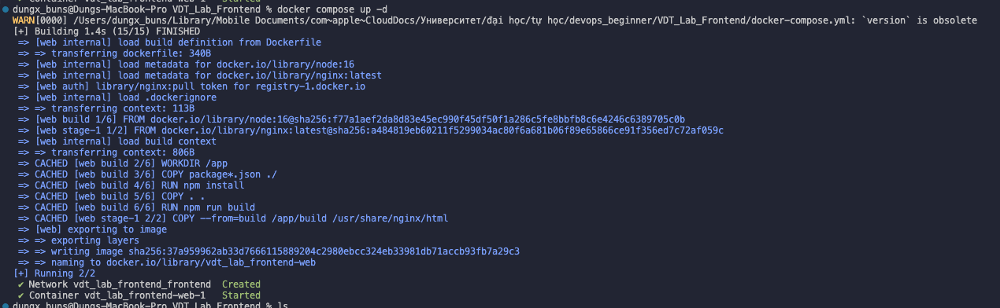
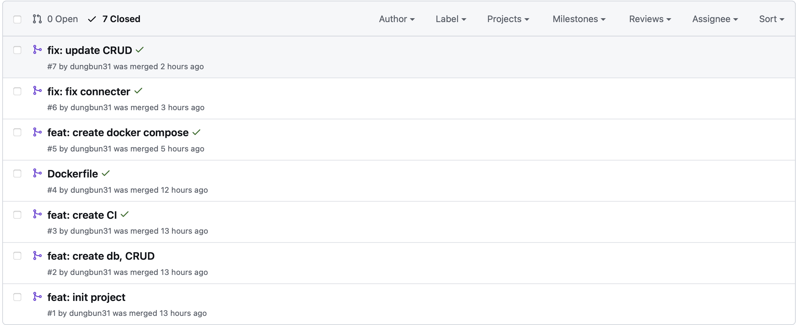

# Triển khai web application sử dụng các DevOps tools & practices

## 1. Containerization

### 1.1 Mô tả

Containerization là công nghệ cho phép gói gọn và triển khai ứng dụng cùng tất cả các thư viện, cấu hình, và các phụ thuộc cần thiết vào một container riêng lẻ. Việc sử dụng container hóa đảm bảo ứng dụng hoạt động ổn định trên mọi môi trường, từ máy tính cá nhân của lập trình viên đến hệ thống máy chủ sản xuất.

Lợi ích:

- Tính Di Động: Containers cho phép ứng dụng hoạt động nhất quán trên các môi trường khác nhau, từ máy tính cá nhân đến hệ thống sản xuất.

- Tối Ưu Hóa Tài Nguyên: Containers tiết kiệm tài nguyên hơn so với máy ảo nhờ việc chia sẻ kernel của hệ điều hành chủ.

- Tốc Độ: Containers có thời gian khởi động nhanh hơn nhiều so với máy ảo, giúp tăng tốc quá trình phát triển và triển khai.

- Sự Cách Ly: Mỗi container hoạt động trong một môi trường biệt lập, giúp tránh xung đột giữa các ứng dụng và tăng cường bảo mật.

- Quản Lý Phiên Bản: Các images của containers có thể được quản lý phiên bản tương tự như mã nguồn, giúp theo dõi và quay lại các phiên bản trước dễ dàng.

<div align="center">
  
</div>

<div align="center">
  <i><a href=https://aws.amazon.com/vi/what-is/containerization/?nc1=f_ls>
         Contanerization
    </a></i>
</div>

#### 1.1.1 Docker

Docker là một nền tảng mã nguồn mở dành cho containerization, giúp xây dựng, triển khai và vận hành ứng dụng trong các container. Docker tận dụng các tính năng cách ly của hệ điều hành Linux như cgroups và namespaces, cho phép chạy các container nhẹ nhàng nhưng tách biệt với nhau và với hệ điều hành chủ.

Các Thành Phần Chính của Docker:

- Docker Engine: Đây là thành phần cốt lõi của Docker, cung cấp khả năng tạo lập, triển khai và quản lý các container.

- Docker Images: Là các bản mẫu bất biến của container, bao gồm mọi thứ cần thiết để vận hành ứng dụng như mã nguồn, runtime, thư viện và các biến môi trường.

- Docker Containers: Là các instance của Docker image, một môi trường thực thi độc lập.

- Docker Registry: Là dịch vụ lưu trữ và phân phối Docker images, cho phép người dùng lưu trữ và chia sẻ các images với nhau.

<div align="center">
  
</div>

<div align="center">
  <i><a href=https://www.geeksforgeeks.org/architecture-of-docker/>
         Architecture of Docker
        </a></i>
</div>

#### 1.1.2 Docker compose

Docker Compose là một công cụ hỗ trợ định nghĩa và quản lý các ứng dụng Docker sử dụng nhiều container. Với Docker Compose, bạn có thể tạo một file YAML để cấu hình các dịch vụ, mạng, và volume mà ứng dụng yêu cầu, sau đó chỉ cần một lệnh đơn giản để khởi động và vận hành toàn bộ hệ thống.

Một số điểm nổi bật của Docker Compose:

- Định nghĩa dịch vụ: File YAML cho phép bạn định nghĩa các dịch vụ khác nhau của ứng dụng, bao gồm web server, database, cache, và các thành phần khác.

- Mạng lưới linh hoạt: Docker Compose cung cấp khả năng cấu hình mạng tùy chỉnh giữa các container, giúp đảm bảo giao tiếp hiệu quả và an toàn.

- Quản lý volume: Volume được định nghĩa và quản lý dễ dàng, giúp duy trì dữ liệu bền vững qua các lần khởi động lại container.

- Khả năng mở rộng: Docker Compose hỗ trợ mở rộng quy mô ứng dụng một cách linh hoạt, cho phép dễ dàng tăng giảm số lượng container theo nhu cầu.

- Đơn giản hóa quy trình làm việc: Chỉ với một lệnh duy nhất, toàn bộ các thành phần của ứng dụng có thể được khởi động hoặc tắt đi, giúp đơn giản hóa quá trình phát triển và triển khai.

<div align="center">
  
</div>

<div align="center">
  <i><a href=https://docs.docker.com/compose>
         Docker compose
    </a></i>
</div>

### 1.2 Output

#### 1.2.1 File docker và docker compose cho từng dịch vụ

File [docker-backend](https://github.com/dungbun31/VDT_Lab_backend/blob/main/Dockerfile) và [docker-compose-backend](https://github.com/dungbun31/VDT_Lab_backend/blob/main/docker-compose.yml) dịch vụ api và database

File Docker cho dịch vụ API sử dụng các kỹ thuật sau để tối ưu hóa và bảo mật:

- Xây dựng đa giai đoạn (Multi-Stage Build): Để giảm kích thước của image cuối cùng và tối ưu hóa quy trình xây dựng. Multi-Stage Build cho phép sử dụng nhiều lệnh FROM trong Dockerfile, mỗi lệnh bắt đầu một giai đoạn mới.

  - Giai đoạn Builder: Trong giai đoạn này, các phụ thuộc được cài đặt, các tệp cần thiết được sao chép và ứng dụng được xây dựng.
  - Giai đoạn Start: Giai đoạn này tạo ra image cuối cùng, chỉ chứa các tệp cần thiết và các phụ thuộc cần thiết cho thời gian chạy.

- Bộ nhớ đệm lớp (Layer Caching): Docker lưu trữ kết quả của mỗi lệnh trong Dockerfile để tăng tốc quá trình xây dựng. Nếu một lớp không thay đổi, Docker sử dụng phiên bản đã lưu trong bộ nhớ đệm.
  - Sao chép tối ưu: Bằng cách sao chép các tệp cần thiết và chạy các lệnh xây dựng trong các bước riêng biệt, Docker đảm bảo rằng các thay đổi trong mã nguồn không làm vô hiệu hóa các lớp đã lưu trữ cho các phụ thuộc, giúp tăng tốc quá trình xây dựng.
Người dùng không phải root (Non-Root User): Tạo và chuyển sang người dùng không có quyền root (appuser) để cải thiện bảo mật, đảm bảo rằng ứng dụng không chạy với quyền root.

- Tách biệt các môi trường: Dockerfile có thể được cấu hình để hỗ trợ nhiều môi trường (development, staging, production), giúp dễ dàng chuyển đổi giữa các môi trường mà không cần thay đổi nhiều trong mã nguồn.

- Tối ưu hóa kích thước image: Ngoài Multi-Stage Build, việc xóa các tệp không cần thiết và sử dụng các base image nhỏ gọn (như Alpine) giúp giảm kích thước của image cuối cùng, cải thiện hiệu suất triển khai và tiết kiệm tài nguyên.

**_Dockerfile_**

```shell
FROM node:alpine AS builder
WORKDIR /app

COPY package*.json ./

RUN npm install

COPY . .

FROM node:alpine

WORKDIR /app

COPY --from=builder /app/node_modules ./node_modules
COPY --from=builder /app .

CMD ["npm", "run", "dev"]
```
<br>

## File docker-compose.yml

### Triển khai dịch vụ API và DB

#### Mạng

- **app-network**: Định nghĩa 2 mạng `backend:` và `frontend:` là mạng ngoài (external), được tạo bên ngoài Docker Compose và được sử dụng.

#### Dịch vụ API
- **depends_on**: sẽ được build sau khi build DB.
- **build**:
  - **context**: Đường dẫn xây dựng: thư mục hiện tại (./).
  - **dockerfile**: Tệp Dockerfile: Dockerfile.local.
- **env_file**: Sử dụng tệp môi trường .env để cung cấp biến môi trường cho container.
- **environment**: định nghĩa các biến môi trường cần thiết.
- **ports**: Mở cổng $NODE_LOCAL_PORT trên máy host và ánh xạ tới cổng $NODE_DOCKER_PORT trong container.
- **networks**: Kết nối vào 2 mạng `backend:` và `frontend:`.
- **volumes**: Gắn volume hiện tại từ máy host tới thư mục /src/app trong container để lưu trữ dữ liệu.

#### Dịch vụ DB

- **image**: Sử dụng image PostgreSQL mới nhất (postgres:latest).
- **volumes**: Gắn volume `postgres_data` từ máy host tới thư mục /var/lib/postgresql/data trong container để lưu trữ dữ liệu PostgreSQL.
- **env_file**: Sử dụng tệp môi trường .env để cung cấp biến môi trường cho container.
- **environment**: định nghĩa các biến môi trường cần thiết.
- **ports**: Mở cổng $DB_LOCAL_PORT trên máy host và ánh xạ tới cổng $DB_PORT trong container.
- **networks**: Kết nối vào mạng `backend:`.

#### Volumes

- **postgres_data**: Volume được sử dụng để lưu trữ dữ liệu của dịch vụ PostgreSQL.


**_docker-compose_**

```shell
version: '3.8'  

networks:
  backend:
  frontend:
   
services:
  api:
    depends_on:
      - db
    build:
      context: .
      dockerfile: Dockerfile
    env_file:
      - ./.env
    environment:
      - DB_HOST=${DB_HOST}
      - DB_USER=${DB_USER}
      - DB_PASSWORD=${DB_PASS}
      - DB_NAME=${DB_NAME}
      - DB_PORT=${DB_PORT}
      - CLIENT_ORIGIN=$CLIENT_ORIGIN
    ports:
      - $NODE_LOCAL_PORT:$NODE_DOCKER_PORT
    networks:
      - backend
      - frontend
    volumes:
      - .:/src/app
  

  db:
    image: postgres
    volumes:
      - postgres_data:/var/lib/postgresql/data
    env_file:
    - ./.env
    environment:
      - POSTGRES_USER=${DB_USER}
      - POSTGRES_PASSWORD=${DB_PASS}
      - POSTGRES_DB=${DB_NAME}
    ports:
      - $DB_LOCAL_PORT:$DB_PORT
    networks:
      - backend


volumes:
  postgres_data:
```

<br>


File [docker-frontend](https://github.com/dungbun31/VDT_Lab_Frontend/blob/main/student-management/Dockerfile) và [docker-compose-frontend](https://github.com/dungbun31/VDT_Lab_Frontend/blob/main/docker-compose.yml) dịch vụ web và máy chủ Web Server

Tuơng tự như trên, ngoài ra dịch vụ web sử dụng web server là nginx để triển khai dịch vụ.
Nginx là một máy chủ web mã nguồn mở hiệu suất cao. Hiện nay Nginx đã trở thành một trong những máy chủ web phổ biến nhất trên thế giới. Nginx không chỉ hoạt động như một máy chủ web mà còn có thể được sử dụng như một máy chủ proxy ngược (reverse proxy), cân bằng tải (load balancer), và cache HTTP.

**_Dockerfile_**

```shell
FROM node:16 AS build

WORKDIR /app

COPY package*.json ./

RUN npm install

COPY . .

ARG REACT_APP_API_BASE_URL
ENV REACT_APP_API_BASE_URL=$REACT_APP_API_BASE_URL

RUN npm run build

FROM nginx

COPY --from=build /app/build /usr/share/nginx/html
EXPOSE $REACT_DOCKER_PORT

CMD nginx -g 'daemon off;'
```

**_docker-compose_**

```shell
  version: '3.8'  

networks:
  backend:
  frontend:
   
services:
  web:
    build:
      context: ./student-management
      dockerfile: Dockerfile
      args:
        - REACT_APP_API_BASE_URL=$CLIENT_API_BASE_URL
    ports:
      - $REACT_LOCAL_PORT:$REACT_DOCKER_PORT
    networks:
      - frontend
    volumes:
      - ./student-management:/src/app

volumes:
  postgres_data:
```

<br>

#### 1.2.2 Output câu lệnh build và thông tin docker history của từng image

**Output câu lệnh build thông qua docker-compose**

<div align="center">
  
</div>

<div align="center">
  <i>VDT_Lab_backend</i>
</div>
<br>

<div align="center">
  
</div>

<div align="center">
  <i>VDT_Lab_Frontend</i>
</div>

**docker log của từng container**

<div align="center">
  
</div>

<div align="center">
  <i>Docker logs of container vdt_lab_backend-api-1</i>
</div>
<br>

<div align="center">
  
</div>

<div align="center">
  <i>Docker logs of container vdt_lab_frontend-web-1</i>
</div>
<br>

<div align="center">
  
</div>

<div align="center">
  <i>Docker logs of container vdt_lab_backend-db-1</i>
</div>
<br>

**docker history của từng image**
<div align="center">
  
</div>

<div align="center">
  <i>Docker history of image vdt_lab_backend-api-1</i>
</div>
<br>

<div align="center">
  
</div>

<div align="center">
  <i>Docker history of image vdt_lab_frontend-web-1</i>
</div>
<br>

<div align="center">
  
</div>

<div align="center">
  <i>Docker history of image vdt_lab_backend-db-1</i>
</div>
<br>

## 2. CI/CD

### 2.1 Mô tả

### CI/CD: Continuous Integration và Continuous Delivery/Deployment

CI/CD là viết tắt của Continuous Integration và Continuous Delivery/Deployment, được xem như một quy trình kết hợp tự động hoá giúp đẩy nhanh tiến độ phát triển sản phẩm và đưa sản phẩm đến người dùng cuối cùng. CI/CD đã được áp dụng rộng rãi vào quy trình làm việc của các doanh nghiệp làm trong lĩnh vực IT, song hành cùng với DevOps và Agile.

#### Continuous Integration (CI) - Tích hợp liên tục

Continuous Integration là một phương pháp phát triển phần mềm trong đó các thay đổi mã nguồn được tích hợp vào nhánh chính thường xuyên. Quá trình này bao gồm:

- Tích hợp mã thường xuyên: Các lập trình viên thường xuyên đẩy (push) mã nguồn lên kho lưu trữ chung (repository).
- Tự động hóa xây dựng: Mỗi lần có thay đổi mã nguồn, một quy trình xây dựng tự động sẽ được kích hoạt để kiểm tra xem mã có thể được biên dịch và xây dựng mà không gặp lỗi.
- Kiểm thử tự động: Các bộ kiểm thử tự động (unit tests, integration tests) được thực hiện để đảm bảo mã mới không gây ra lỗi.

#### Continuous Deployment/Continuous Delivery (CD) - Triển khai liên tục/Giao hàng liên tục

So sánh giữa Continuous Deployment và Continuous Delivery

Quá trình này bao gồm:

- Tự động hóa triển khai: Sau khi mã đã vượt qua tất cả các kiểm thử tự động, nó sẽ được sẵn sàng để triển khai lên các môi trường.
- Giám sát và phản hồi: Hệ thống giám sát liên tục để phát hiện và xử lý các vấn đề sau khi triển khai.

So sánh giữa Continuous Deployment và Continuous Delivery

- Continuous Deployment: Tự động triển khai sau khi mã nguồn vượt qua tất cả các kiểm thử. Không cần sự can thiệp thủ công.
- Continuous Delivery: Mã nguồn sẵn sàng để triển khai sau khi vượt qua các kiểm thử, nhưng cần sự can thiệp thủ công để thực hiện triển khai cuối cùng.


<div align="center">
  
</div>

<div align="center">
  <i>CI/CD</i>
</div>
<br>

Ưu điểm của CI/CD không chỉ giới hạn ở việc tăng cường sự nhanh nhẹn của quy trình phát triển và triển khai phần mềm. Nó còn mang lại sự linh hoạt và tiết kiệm thời gian cho các nhóm phát triển. Bằng cách tự động hóa quy trình kiểm thử và triển khai, CI/CD giúp giảm thiểu sự phụ thuộc vào các tác vụ thủ công, từ đó tối ưu hóa hiệu suất làm việc và giảm thiểu nguy cơ lỗi do con người gây ra.

Một ưu điểm khác là CI/CD tạo ra một môi trường làm việc tích hợp và hợp tác mạnh mẽ. Nhờ quá trình triển khai liên tục, các nhóm phát triển có thể chia sẻ mã nguồn, phản hồi và hợp tác một cách hiệu quả hơn. Điều này không chỉ giúp tăng cường sự kết nối giữa các thành viên trong dự án mà còn tạo ra một bản sao làm việc thống nhất, đảm bảo rằng mọi người đều làm việc trên cùng một phiên bản của mã nguồn.

Ngoài ra, CI/CD còn đảm bảo chất lượng của phần mềm thông qua việc thực hiện kiểm thử tự động và triển khai liên tục. Điều này giúp định kỳ kiểm tra và đảm bảo rằng mã nguồn được triển khai chỉ là các phiên bản ổn định và có chất lượng. Mục tiêu cuối cùng là cung cấp sản phẩm hoặc dịch vụ chất lượng cao, giảm thiểu các lỗi có thể gặp phải từ phía người dùng cuối.

Tuy nhiên, nhược điểm của CI/CD cũng không thể phủ nhận. Việc thiết lập ban đầu có thể phức tạp và đòi hỏi sự đầu tư về thời gian và kiến thức. Đặc biệt đối với các dự án lớn, việc xây dựng và duy trì một hệ thống CI/CD có thể tốn kém về mặt tài chính và nhân lực. Điều này đặc biệt đúng khi cần tích hợp với cơ sở hạ tầng phức tạp hoặc khi cần phải tuân thủ các quy định và tiêu chuẩn nghiêm ngặt.

### 2.2 Github actions
GitHub Actions là một dịch vụ được cung cấp bởi GitHub, giúp tự động hóa các quy trình phát triển phần mềm từ việc quản lý mã nguồn, kiểm thử, triển khai cho đến phản hồi. Với GitHub Actions, bạn có thể tạo các luồng làm việc (workflows) để tự động hóa các công việc cụ thể trong quy trình phát triển phần mềm của mình.

Mỗi luồng làm việc trong GitHub Actions được định nghĩa trong một file cấu hình YAML, gọi là file workflow. File này mô tả các bước cần thực hiện, bao gồm cả các hành động (actions) cụ thể mà bạn muốn thực hiện trên mã nguồn của mình, như kiểm thử, xây dựng, triển khai, và nhiều tác vụ khác.

GitHub Actions cung cấp một loạt các hành động sẵn có để bạn có thể sử dụng, và bạn cũng có thể tạo ra các hành động tùy chỉnh của riêng mình. Bằng cách sử dụng GitHub Actions, bạn có thể tăng cường tự động hóa trong quy trình phát triển phần mềm của mình, giúp giảm thời gian và công sức cần thiết cho việc triển khai và kiểm thử, đồng thời cũng giúp tăng cường chất lượng và độ tin cậy của sản phẩm cuối cùng.

#### 2.2.1 Github actions
- File `test.yml` được tích hợp vào GitHub Actions thông qua việc lưu trữ trong repository của dự án trên GitHub. Khi một push hoặc pull request được thực hiện, GitHub Actions sẽ đọc và thực thi các luồng làm việc được định nghĩa trong file test.yml.

Khi workflow được kích hoạt, GitHub Actions sẽ tạo ra một môi trường chạy được cấu hình trước (ví dụ: ubuntu-latest trong file `test.yml`) và thực hiện các bước được liệt kê trong workflow. Kết quả của các bước được ghi lại và hiển thị trên giao diện của GitHub, giúp người dùng dễ dàng theo dõi quá trình kiểm thử và triển khai của dự án.

Điều này giúp tăng cường tự động hóa trong quy trình phát triển phần mềm, giảm thiểu thời gian và công sức cần thiết cho việc kiểm thử, đồng thời cũng giúp tăng cường chất lượng và độ tin cậy của sản phẩm cuối cùng.

**test.yml**
```
name: Run Unit Tests

on:
  pull_request:
    branches:
      - main
  push:
    branches:
      - main

jobs:
  test:
    runs-on: ubuntu-latest

    steps:
      - name: Checkout code
        uses: actions/checkout@v2

      - name: Set up Node.js
        uses: actions/setup-node@v2
        with:
          node-version: '14'

      - name: Install dependencies
        run: npm install

      - name: Run unit tests
        run: npm test
```

#### 2.2.1 chi tiết file `test.yml`

##### Tên Workflow
- **Tên Workflow:** Run Unit Tests

##### Sự kích hoạt
- **Kích hoạt:** Workflow này sẽ được kích hoạt khi có pull request hoặc push vào nhánh main.
- **Sự kích hoạt (triggers):**
  - Pull request: Khi có pull request được mở vào nhánh main.
  - Push: Khi có push vào nhánh main.

##### Các công việc (Jobs)
- **Tên công việc (Job):** test
- **Môi trường chạy công việc:** Ubuntu latest

##### Các Bước (Steps)
1. **Checkout mã nguồn:**
   - Sử dụng hành động (action) `actions/checkout@v2` để checkout mã nguồn từ repository. Hành động này đảm bảo rằng mã nguồn mới nhất được sử dụng cho quá trình kiểm thử.

2. **Cài đặt Node.js:**
   - Sử dụng hành động `actions/setup-node@v2` để cài đặt môi trường Node.js với phiên bản 14.

3. **Cài đặt các phụ thuộc:**
   - Sử dụng lệnh `npm install` để cài đặt các phụ thuộc (dependencies) của dự án. Điều này đảm bảo rằng tất cả các thư viện cần thiết đã được cài đặt trước khi chạy bài kiểm thử.

4. **Chạy bài kiểm thử đơn vị:**
   - Sử dụng lệnh `npm test` để chạy bài kiểm thử đơn vị. Điều này sẽ thực hiện bài kiểm thử được định nghĩa trong dự án và báo cáo kết quả.

#### 2.2.2 output

<div align="center">
  
</div>

<div align="center">
  <i>Cách file đã test qua</i>
</div>
<br>

<div align="center">
  
</div>

<div align="center">
  <i>logs trong CI</i>
</div>
<br>

Khi tạo 1 PR thì code sẽ được chạy qua test trước khi được merge 
<div align="center">
  
</div>

<div align="center">
  <i>thông báo chạy test</i>
</div>
<br>

<div align="center">
  
</div>

<div align="center">
  <i>quá trình test</i>
</div>
<br>
<div align="center">
  
</div>

<div align="center">
  <i>pass hết các test/i>
</div>
<br>

#### 3. Automation 

[code ansible](https://github.com/dungbun31/VDT_lab_ansible.git)

- Output log triển khai hệ thống
<div align="center">
  
</div>


<div align="center">
  
</div>


<div align="center">
  
</div>

#### 4. Research topic: DevSecOps
[DevSecOps](https://www.redhat.com/en/topics/devops/what-is-devsecops#:~:text=Red%20Hat's%20approach-,Overview,throughout%20the%20entire%20IT%20lifecycle.)

<div align="center">
  
</div>