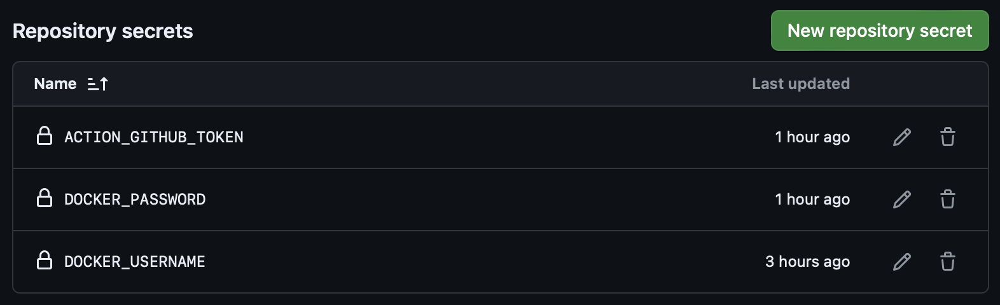
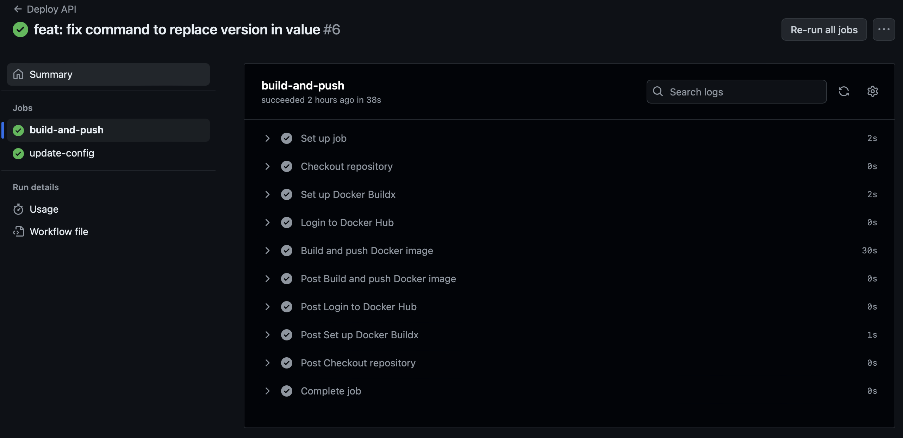
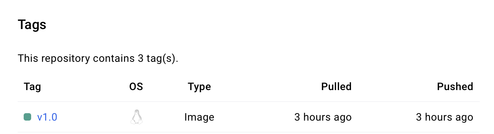
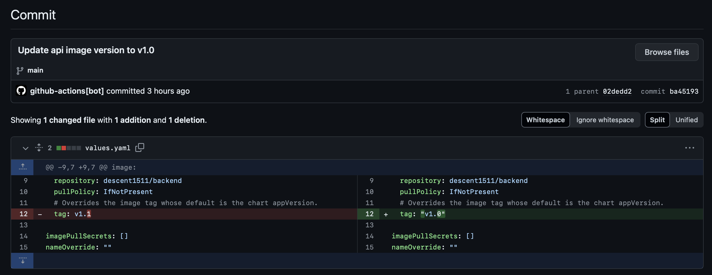
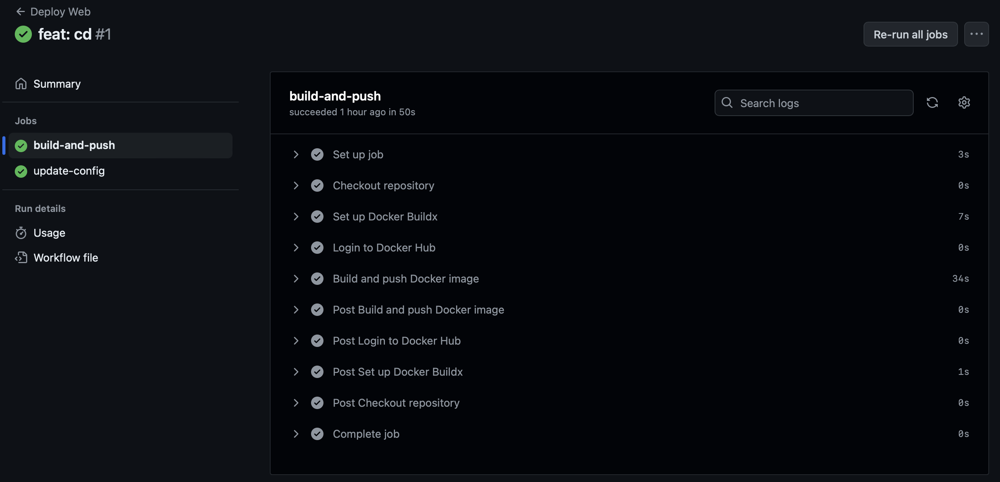
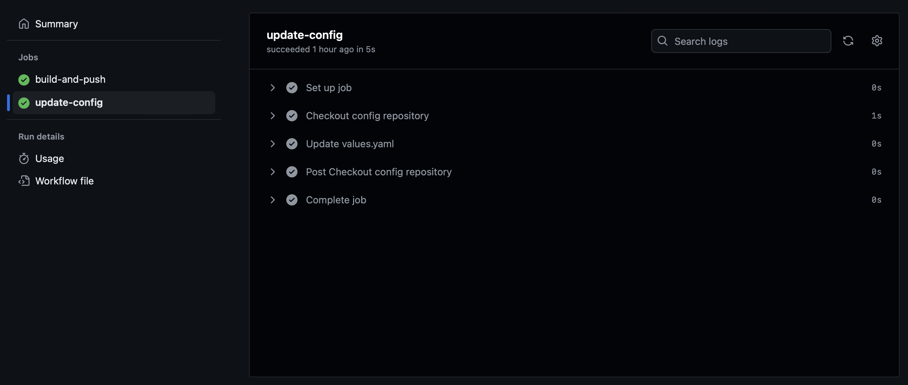
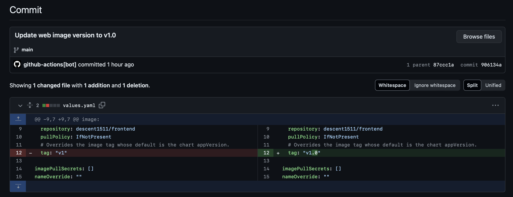

# Continuous Delivery 
## Yêu cầu 
-   Viết 2 luồng CD cho 2 repo web và api, khi có 1 tag mới được tạo ra trên trên 1 trong 2 repo này thì luồng deploy tương ứng của repo đó thực hiện các công việc sau:
    +   Build docker image với image tag là tag name đã được tạo ra trên gitlab và push docker image sau khi build xong lên Docker Hub
    +   Sửa giá trị Image version trong file values.yaml  trong config repo và push thay đổi lên config repo.
-   Cấu hình ArgoCD tự động triển khai lại web Deployment và api Deployment khi có sự thay đổi trên config repo.

## Triển khai 
### Tạo GitHub Secrets
-   Vào Settings của repo trên GitHub.
-   Chọn Secrets > Actions 
-   Tạo secrets cần thiết
<div align="center">
    
</div>  

### Tạo GitHub Actions Workflow
-   Tạo file `.github/workflows/cd.yml`:
    + API: [code here](https://github.com/descent1511/vdt2024-api-nodejs/blob/develop/.github/workflows/cd.yml)
    + Web:: [code here](https://github.com/descent1511/vdt2024-vuejs-frontend/blob/develop/.github/workflows/cd.yml)

### Cấu hình ArgoCD để tự động triển khai
-   Cấu hình **SyncPolicy**: Đặt là automated để ArgoCD tự động triển khai lại khi có thay đổi trên config repo.
```yaml
 syncPolicy:
    automated:
      prune: true
      selfHeal: true
      allowEmpty: false
```
## Kết quả
### API
-   Auto build image and push 
<div align="center">
    
</div>  

<div align="center">
    
</div>  

-   Update config
<div align="center">
    
</div>  
<div align="center">
    
</div>  

### Web
-   Auto build image and push 
<div align="center">
    
</div>  

<div align="center">
    
</div>  

-   Update config
<div align="center">
    
</div>  
<div align="center">
    
</div>  

## References
- [Build and push Docker images](https://github.com/marketplace/actions/build-and-push-docker-images)
