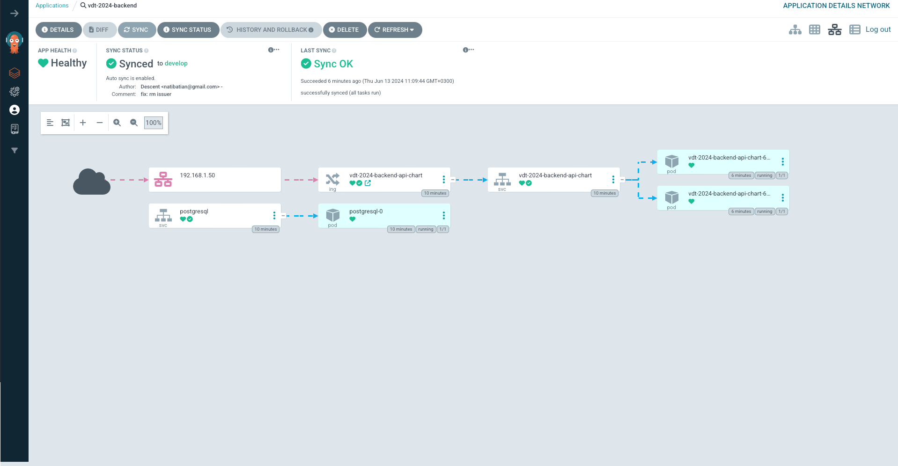
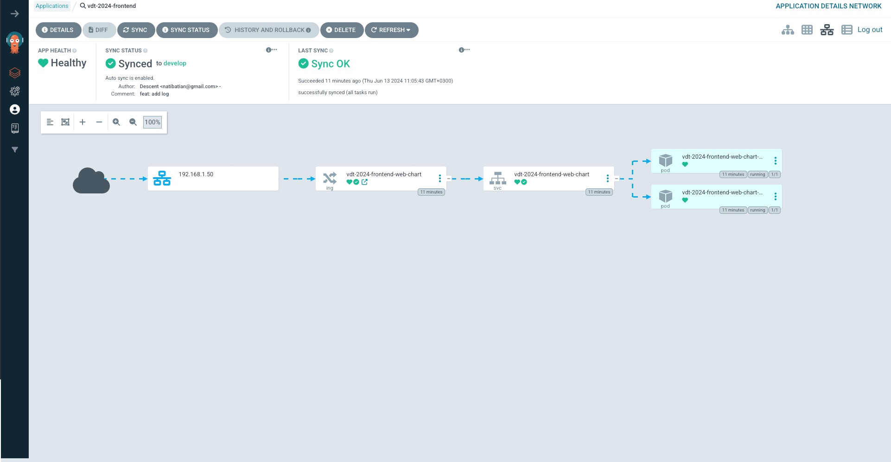
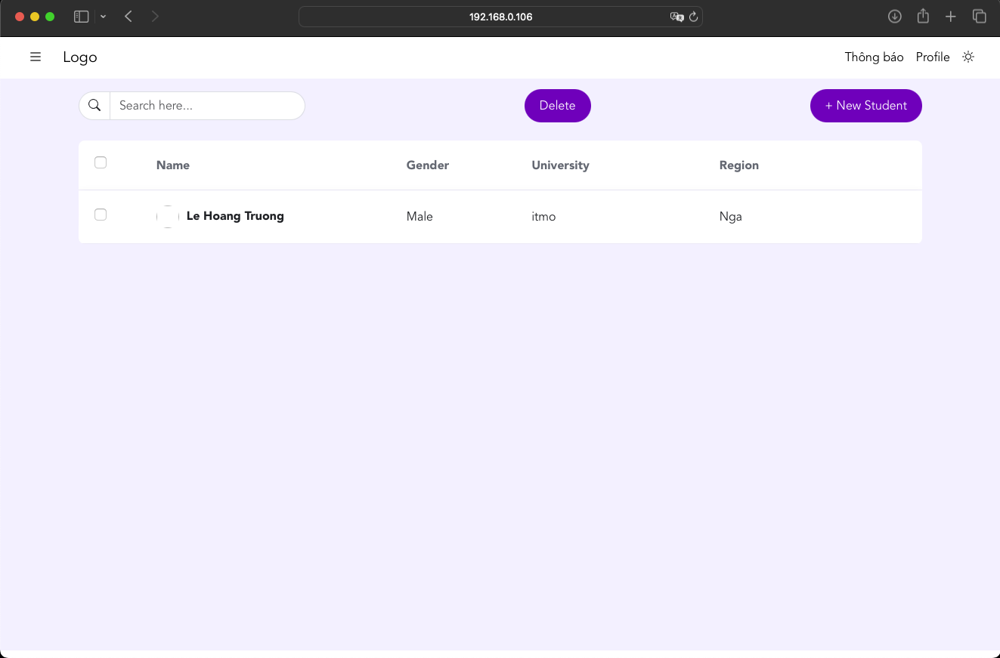

# K8S Helm Chart 

## 1. Yêu cầu: 
-   Cài đặt ArgoCD lên Kubernetes Cluster, expose được ArgoCD qua NodePort
-   Viết 2 Helm Chart cho web Deployment và api Deployment, để vào 1 folder riêng trong repo web và repo api
-   Tạo 2 Repo Config cho web và api, trong các repo này chứa các file values.yaml với nội dung của cá file values.yaml là các config cần thiết để chạy web và api trên k8s bằng Helm Chart 
-   Sử dụng tính năng multiple sources của ArgoCD để triển khai các service web và api service lên K8S Cluster  theo hướng dẫn của ArgoCD, expose các service này dưới dạng NodePort Multiple Sources for an Application - Argo CD - Declarative GitOps CD for Kubernetes

## 2. Khái niệm 
### 2.1 ArgoCD là gì ?

<div align="center">
    
</div>

-   ArgoCD là một mã nguồn mở container-native workflow engine phục vụ việc deploy service trên Kubernetes.  
-   ArgoCD được triển khai trên Kubernetes như một Kubernetes CRD (Custom Resource Definition)

### 2.1 Helm là gì ?
-   **Helm** là một công cụ giúp quản lý các biểu đồ (charts), là các gói chứa tất cả các định nghĩa tài nguyên cần thiết để chạy một ứng dụng trên Kubernetes.
    +   **Chart**: Một biểu đồ Helm là một bộ sưu tập các tệp giúp định nghĩa một ứng dụng Kubernetes.
    + **Values.yaml**: Tệp giá trị mặc định cho các cấu hình trong một chart.

## 3. Cài đặt ArgoCD lên Kubernetes Cluster
-   Tạo namespace cho Argo CD:
```bash
kubectl create namespace argocd
```

-   Áp dụng các manifest của Argo CD:
```bash
kubectl apply -n argocd -f https://raw.githubusercontent.com/argoproj/argo-cd/stable/manifests/install.yaml
```
- Chuyển tiếp cổng từ Pod của Argo CD:
```bash
kubectl port-forward svc/argocd-server -n argocd 5000:443
```
-   Truy cập giao diện của Argocd:
<div align="center">
    
</div>

-   Tên người dùng mặc định là **admin**. Sau đó chúng ta lấy mật khẩu bằng lệnh sau. 
```bash
kubectl -n argocd get secret argocd-initial-admin-secret -o jsonpath="{.data.password}" | base64 --decode ; echo
```

## 4. Triển khai helm chart 

### 4.1 Source code: 
#### API
- **Chart**: [api-chart](https://github.com/descent1511/vdt2024-api-nodejs/tree/feat/helm-chart/api-chart)
- **Config**: [api-config](https://github.com/descent1511/vdt2024-api-config)

#### Web
- **Chart**: [web-chart](https://github.com/descent1511/vdt2024-vuejs-frontend/tree/develop/web-chart)
- **Config**: [web-config](https://github.com/descent1511/vdt2024-web-config)

#### Argocd 
- **API**: [api](https://github.com/descent1511/vdt2024-argocd-config/blob/main/api.yaml)
- **Web**: [web](https://github.com/descent1511/vdt2024-argocd-config/blob/main/web.yaml)
### 4.2 Kết quả:

#### Check services:
```bash
kubectl get svc 
```
<div align="center">
    
</div>

#### Giao diện Argocd:
- **API**
  <div align="center">
      
  </div>
- **Web**
  <div align="center">
      
  </div>
-   Hiện thị thay đổi trên code:
  <div align="center">
      
  </div>
#### Web:
-   ip: `192.168.0.106`
-   port: `30002`
<div align="center">
    
</div>

#### API:
-   ip: `192.168.0.106`
-   port: `30001`
<div align="center">
    
</div>


## References
-   [Getting Started - Declarative GitOps CD for Kubernetes](https://argo-cd.readthedocs.io/en/stable/getting_started/)
-   [ArgoCD Installation on Kubernetes  -  YouTube](https://www.youtube.com/watch?v=fBd_tz6BALU)

