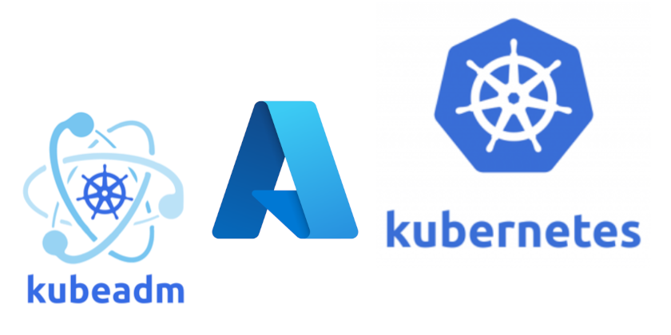
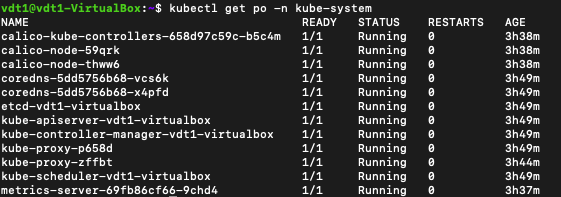
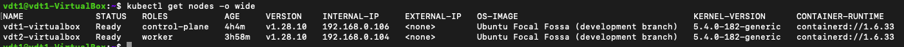
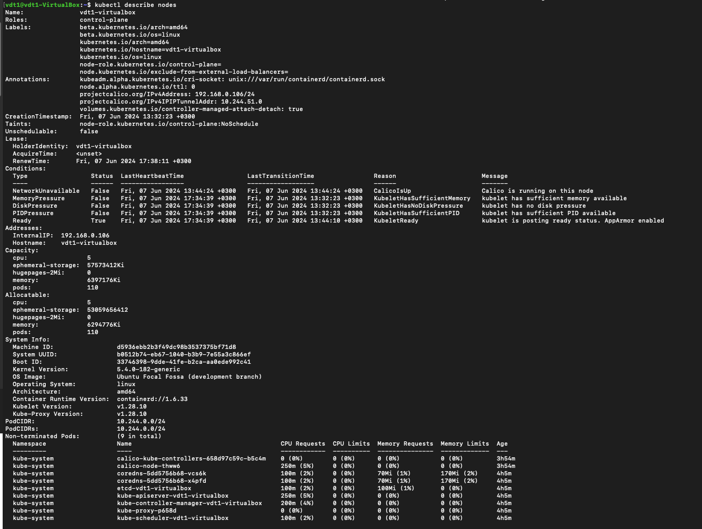

# Triển khai Kubernetes

## 1. Yêu cầu: 
-   Triển khai Kubernetes thông qua công cụ kubeadm lên một master node VM và một worker node VM.

## 2. khái niệm 
<div align="center">
    
</div>

### 2.1 Kubeadm là gì?
-   Kubeadm là một công cụ để thiết lập cụm Kubernetes khả thi tối thiểu mà không cần cấu hình phức tạp. Ngoài ra, Kubeadm giúp toàn bộ quá trình trở nên dễ dàng bằng cách chạy một loạt các bước kiểm tra trước để đảm bảo rằng máy chủ có tất cả các thành phần và cấu hình cần thiết để chạy Kubernetes.

### 2.2 Điều kiện tiên quyết để thiết lập Kubeadm
-   Sau đây là các điều kiện tiên quyết để thiết lập cụm Kubeadm Kubernetes: 
    +   Tối thiểu hai nút Ubuntu [Một nút chính và một nút công nhân]. Có thể có nhiều nút công nhân hơn theo yêu cầu triển khai.
    +   Nút chính phải có tối thiểu 2 vCPU và RAM 2GB.
    +   Đối với các nút công nhân, nên sử dụng tối thiểu 1vCPU và RAM 2 GB.
    +   Phạm vi mạng 10.X.X.X/X với IP tĩnh cho nút chính và nút công nhân. Ở đây em sẽ sử dụng chuỗi 192.x.x.x làm phạm vi mạng nhóm sẽ được plugin mạng Calico sử dụng. Đảm bảo phạm vi Node IP và phạm vi IP nhóm không trùng nhau.

## 3. Cài đặt Kubernetes bằng Kubeadm
### 3.1. Chuẩn bị môi trường
- Chạy các lệnh bên dưới trên cả Master và Worker Node

1. Tạo tệp `/etc/modules-load.d/k8s.conf` và thêm các mô-đun kernel cần thiết:
    ```bash
    cat <<EOF | sudo tee /etc/modules-load.d/k8s.conf
    overlay
    br_netfilter
    EOF
    ```
    -   **overlay**: Mô-đun này hỗ trợ hệ thống tệp overlay, cần thiết cho các container.
    -   **br_netfilter**: Mô-đun này cho phép Netfilter (tường lửa) xử lý gói tin đi qua cầu mạng (bridge network), cần thiết cho việc lọc gói tin trong mạng của Kubernetes.

2. Tải các mô-đun kernel :
    ```bash
    sudo modprobe overlay
    sudo modprobe br_netfilter
    ```
3. Tạo tệp cấu hình sysctl `/etc/sysctl.d/k8s.conf` để thiết lập các tham số mạng cần thiết:
    ```bash 
    cat <<EOF | sudo tee /etc/sysctl.d/k8s.conf
    net.bridge.bridge-nf-call-iptables  = 1
    net.bridge.bridge-nf-call-ip6tables = 1
    net.ipv4.ip_forward                 = 1
    EOF
    ```

4. Vô hiệu hóa **SWAP**:
    ```bash
    sudo swapoff -a
    (crontab -l 2>/dev/null; echo "@reboot /sbin/swapoff -a") | crontab - || true
    ```

5. Install **container runtime** :

    ```bash
    # Add Docker's official GPG key:
    sudo apt-get update
    sudo apt-get install ca-certificates curl
    sudo install -m 0755 -d /etc/apt/keyrings
    sudo curl -fsSL https://download.docker.com/linux/ubuntu/gpg -o /etc/apt/keyrings/docker.asc
    sudo chmod a+r /etc/apt/keyrings/docker.asc

    # Add the repository to Apt sources:
    echo \
    "deb [arch=$(dpkg --print-architecture) signed-by=/etc/apt/keyrings/docker.asc] https://download.docker.com/linux/ubuntu \
    $(. /etc/os-release && echo "$VERSION_CODENAME") stable" | \
    sudo tee /etc/apt/sources.list.d/docker.list > /dev/null
    sudo apt-get update
    sudo apt-get install docker-ce docker-ce-cli containerd.io docker-buildx-plugin docker-compose-plugin
    ```

6. Cài đặt kubeadm, kubelet và kubectl:
-   Cập nhật danh sách gói APT và cài đặt các gói cần thiết để sử dụng kho apt của Kubernetes
    ```bash
    sudo apt-get update
    sudo apt-get install -y apt-transport-https ca-certificates curl gpg
    ```
-   Tải `public signing key` cho Kubernetes package repositories
    ```bash
    curl -fsSL https://pkgs.k8s.io/core:/stable:/v1.28/deb/Release.key | sudo gpg --dearmor -o /etc/apt/keyrings/kubernetes-apt-keyring.gpg
    ```
-   Thêm responsitory Kubernetes apt thích hợp
    ```bash
    echo 'deb [signed-by=/etc/apt/keyrings/kubernetes-apt-keyring.gpg] https://pkgs.k8s.io/core:/stable:/v1.30/deb/ /' | sudo tee /etc/apt/sources.list.d/kubernetes.list
    ```
-   Cập nhật các gói apt, tải kubelet, kubeadm and kubectl:
    ```bash
    sudo apt-get update
    sudo apt-get install -y kubelet kubeadm kubectl
    sudo apt-mark hold kubelet kubeadm kubectl
    ```
-   Kích hoạt dịch vụ kubelet trước khi chạy kubeadm:
    ```bash
    sudo systemctl enable --now kubelet
    ```
### 3.2. Khởi động control plane và node
1. Khởi tạo control plane
-   `control plane` là nơi chạy các component bao gồm `etcd` (cơ sở dữ liệu của `cluster`) và `API Server` (nơi các câu lệnh `kubectl` giao tiếp).
- Chạy câu lệnh sau ở máy ảo mà chúng ta đặt tên là Master:
    ```bash
    sudo kubeadm init --apiserver-advertise-address=192.168.0.106 --pod-network-cidr=10.244.0.0/16
    ```
    - `apiserver-advertise-address=192.168.0.106`: Địa chỉ IP mà máy chủ API sẽ lắng nghe các câu lệnh. Trong hướng dẫn này sẽ là địa chỉa IP của máy ảo Master.
    - `pod-network-cidr=10.244.0.0/16`: Chọn CIDR sao cho không trùng với bất kỳ dải mạng hiện có để tránh xung đột địa chỉ IP.

- Tạo kubeconfig trong master để có thể sử dụng kubectl để tương tác với cluster API.
    ```
    mkdir -p $HOME/.kube
    sudo cp -i /etc/kubernetes/admin.conf $HOME/.kube/config
    sudo chown $(id -u):$(id -g) $HOME/.kube/config
    ```
-   Xác minh kubeconfig bằng cách thực hiện lệnh kubectl sau để liệt kê tất cả các nhóm trong không gian tên kube-system.
    ```
    kubectl get po -n kube-system
    ```
    <div align="center">
    
    </div>

2. Add worker node to master node Kubernetes
-  Tạo token (hoặc có thể lấy nó ở phần kết quả sau khi khởi tạo control plane)
    ```bash
    kubeadm token create --print-join-command
    ```

- Chạy lệnh để add worker node :
    ```bash
    sudo kubeadm join --token <token> <control-plane-host>:<control-plane-port> --discovery-token-ca-cert-hash sha256:<hash>
    ```

## 4. Kết quả kiểm tra hệ thống:
```bash
kubectl get nodes - o wide
```
<div align="center">
    
</div>

```bash
kubectl describe nodes
```

<div align="center">
    
</div>


## References
-   [Creating a cluster with kubeadm](https://kubernetes.io/docs/setup/production-environment/tools/kubeadm/create-cluster-kubeadm/)
-   [Setup Kubernetes Cluster Using Kubeadm -  YouTube](https://www.youtube.com/watch?v=xX52dc3u2HU)
