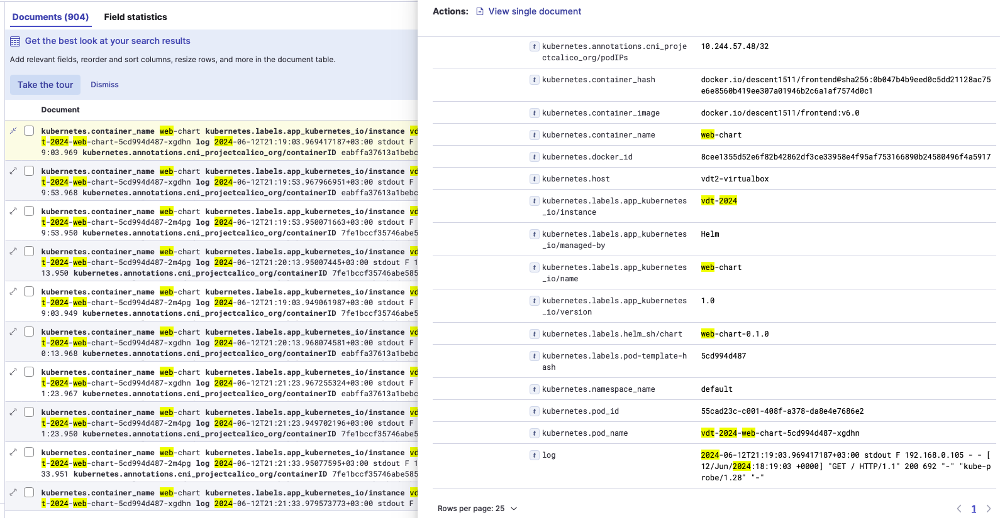

# Logging
## 1. Yêu cầu
-   Sử dụng Kubernetes DaemonSet triển khai fluentd hoặc fluentbit lên kubernetes đẩy log của các Deployment Web Deployment và API Deployment lên cụm ElasticSearch tập trung

## 2. Khái niệm
-   EFK (Elasticsearch-Fluentbit-Kibana) stack là tập hợp của 3 phần mềm đi chung với nhau bao gồm:
    +   Elasticsearch: Cơ sở dữ liệu NoSQL dùng để lưu trữ dữ liệu và cung cấp interface để tìm kiếm và query log.
    +   Fluent-bit: Là phần mềm mã nguồn mở, viết bằng C, được thiết kế nhằm chú trọng đến hiệu suất. Nó cho phép bạn thu thập logs từ nhiều nguồn khác nhau. Fluent bit được phát triển bởi Fluentd team với mục đích tạo ra một phiên bản lightweight trong việc xử lý logs. Sau đó, fluent bit được sử dụng như một giải pháp xử lý dành cho Cloud.
    +   Kibana: Giao diện để quản lý, thống kê logs. Có nhiệm vụ đọc thông tin từ elasticsearch.
-   Cơ chế hoạt động của bộ công cụ được mô tả qua hình dưới đây:

    <div align="center">
        
    </div>  

    +   Đầu tiên, log sẽ được đưa đến Fluent-bit.  
    +   Fluent-bit sẽ đọc những log này, thêm những thông tin như thời gian, IP, parse dữ liệu từ log (server nào, độ nghiêm trọng, nội dung log) và ghi xuống Elasticsearch.  

    +   Để xem log, chúng ta truy cập URL của Kibana. Kibana sẽ đọc thông tin log trong Elasticsearch, hiển thị lên giao diện cho người dùng query và xử lý.  

### 3. Triển khai
-   Tao account cho fluent-bit với các quyền ["get", "list", "watch"] để có thể quản lý logs 
```yaml
apiVersion: v1
kind: ServiceAccount
metadata:
  name: fluent-bit
  namespace: logging
---
apiVersion: rbac.authorization.k8s.io/v1beta1
kind: ClusterRole
metadata:
  name: fluent-bit-read
rules:
- apiGroups: [""]
  resources:
  - namespaces
  - pods
  verbs: ["get", "list", "watch"]
---
apiVersion: rbac.authorization.k8s.io/v1beta1
kind: ClusterRoleBinding
metadata:
  name: fluent-bit-read
roleRef:
  apiGroup: rbac.authorization.k8s.io
  kind: ClusterRole
  name: fluent-bit-read
subjects:
- kind: ServiceAccount
  name: fluent-bit
  namespace: logging 

```
-   Tiếp theo deploy file ConfigMap của fluent-bit.
    +   **SERVICE** dùng để tạo file logs.
    +   **INPUT** cấu hình đầu vào của nơi lấy logs. Phần lấy logs  lấy tại thư mục `/var/log/containers/vdt-2024*.log`, vdt-2024 ở đây là chỉ để lấy log của hai service *API* và *Web*
    +   **OUTPUT** cấu hình đầu ra file log là host và port của elasticsearch.
    +   **PARSER** cấu hình file logs dạng json và time,...

```yaml
apiVersion: v1
kind: ConfigMap
metadata:
  name: fluent-bit-config
  namespace: logging
  labels:
    k8s-app: fluent-bit
data:
  fluent-bit.conf: |
    [SERVICE]
        Flush         1
        Log_Level     info
        Daemon        off
        Parsers_File  parsers.conf
        HTTP_Server   On
        HTTP_Listen   0.0.0.0
        HTTP_Port     2020

    @INCLUDE input-kubernetes.conf
    @INCLUDE filter-kubernetes.conf
    @INCLUDE output-elasticsearch.conf

  input-kubernetes.conf: |
    [INPUT]
        Name              tail
        Tag               kube.*
        Path              /var/log/containers/vdt-2024*.log
        Parser            docker
        Mem_Buf_Limit     5MB
        Skip_Long_Lines   On
        Refresh_Interval  10

  filter-kubernetes.conf: |
    [FILTER]
        Name                kubernetes
        Match               kube.*
        Kube_URL            https://kubernetes.default.svc:443
        Merge_Log           On
        K8S-Logging.Parser  On

  output-elasticsearch.conf: |
    [OUTPUT]
        Name                es
        Match               *
        Host                116.103.226.146
        Port                9200
        HTTP_User           elastic
        HTTP_Passwd         iRsUoyhqW-CyyGdwk6V_
        Index               lht-79118984336
        Retry_Limit         False
        Suppress_Type_Name  On
        Replace_Dots        On
        tls                 On
        tls.verify          Off

  parsers.conf: |
    [PARSER]
        Name        docker
        Format      json
        Time_Key    time
        Time_Format %Y-%m-%dT%H:%M:%S.%L
        Time_Keep   On

```

-    Cuối cùng là deploy file DaemonSet của fluent-bit:
```yaml
apiVersion: apps/v1
kind: DaemonSet
metadata:
  name: fluent-bit
  namespace: logging
  labels:
    k8s-app: fluent-bit-logging
    version: v1
    kubernetes.io/cluster-service: "true"
spec:
  selector:
    matchLabels:
      k8s-app: fluent-bit-logging
  template:
    metadata:
      labels:
        k8s-app: fluent-bit-logging
        version: v1
        kubernetes.io/cluster-service: "true"
      annotations:
        prometheus.io/scrape: "true"
        prometheus.io/port: "2020"
        prometheus.io/path: /api/v1/metrics/prometheus
    spec:
      containers:
      - name: fluent-bit
        image: fluent/fluent-bit:latest
        imagePullPolicy: Always
        ports:
          - containerPort: 2020
        env:
        - name: FLUENT_ELASTICSEARCH_HOST
          value: "116.103.226.146"
        - name: FLUENT_ELASTICSEARCH_PORT
          value: "9200"
        volumeMounts:
        - name: varlog
          mountPath: /var/log
        - name: varlibdockercontainers
          mountPath: /var/lib/docker/containers
          readOnly: true
        - name: fluent-bit-config
          mountPath: /fluent-bit/etc/
      terminationGracePeriodSeconds: 10
      volumes:
      - name: varlog
        hostPath:
          path: /var/log
      - name: varlibdockercontainers
        hostPath:
          path: /var/lib/docker/containers
      - name: fluent-bit-config
        configMap:
          name: fluent-bit-config
      serviceAccountName: fluent-bit
      tolerations:
      - key: node-role.kubernetes.io/master
        operator: Exists
        effect: NoSchedule
      - operator: "Exists"
        effect: "NoExecute"
      - operator: "Exists"
        effect: "NoSchedule"
```

## 4. Kết quả
- Log từ hai dịch vụ web, api
<div align="center">
    
</div>  
<div align="center">
    
</div>  


## References
- [Fluent Bit v3.0 Documentation](https://docs.fluentbit.io/manual)
- [Kibana Guide 8.14](https://www.elastic.co/guide/en/kibana/current/get-started.html)
- [How to configure Fluentbit to collect Logs for our K8S cluster - Youtube](https://www.youtube.com/watch?v=KJlWV5-o8v0)