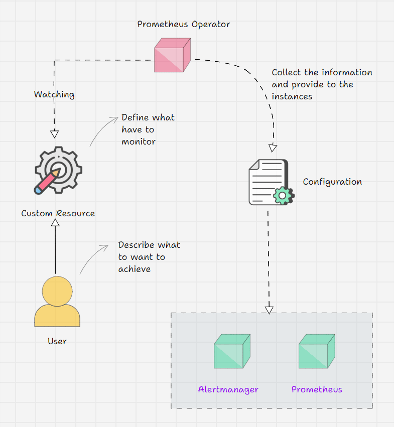
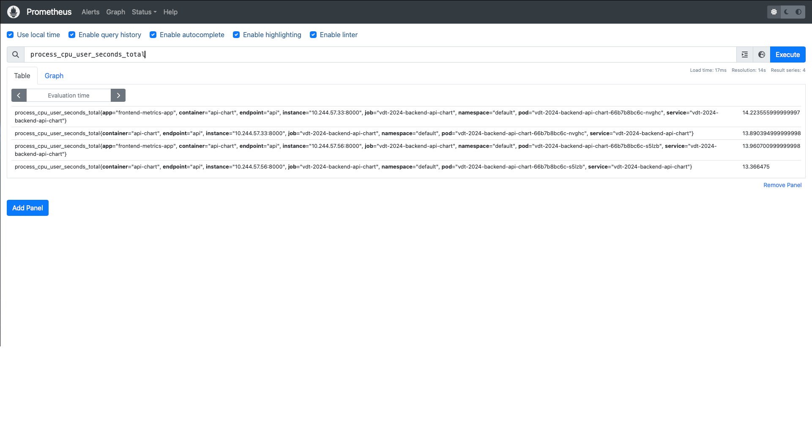
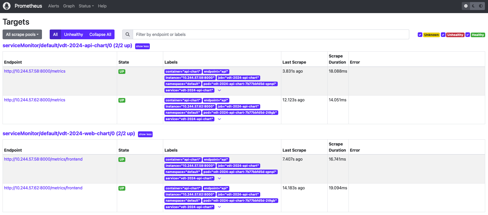

# Monitoring
## 1. Yêu cầu: 
-   Expose metric của web service và api service ra 1 http path.
-   Triển khai Prometheus lên Kubernetes Cluster thông qua Prometheus Operator, phơi ra ngoài dưới dạng NodePort: 
-   Expose Prometheus dưới dạng Nodeport
-   Sử dụng Service Monitor của Prometheus Operator để giám sát Web Deployment và API Deployment

## 2. khái niệm 
### 2.1 Prometheus là gì ?
-   Prometheus là một ứng dụng phần mềm miễn phí được sử dụng để theo dõi và cảnh báo sự kiện. Nó ghi lại các số liệu trong cơ sở dữ liệu chuỗi thời gian được xây dựng bằng mô hình kéo HTTP, với các truy vấn linh hoạt và cảnh báo theo thời gian thực.
### 2.2 Prometheus Operator  là gì ?
-   Prometheus Operator là một công cụ giúp dễ dàng triển khai và quản lý Prometheus trên Kubernetes. Nó cung cấp các tùy chọn để thiết lập và quản lý Prometheus, Alertmanager và các thành phần liên quan.

<div align="center">
    
</div>  

## 3. Triển khai Prometheus lên Kubernetes Cluster

-   Cài đặt Prometheus Operator bằng Helm chart:
```bash 
# Tạo namespace cho monitoring
kubectl create namespace monitoring
helm repo add prometheus-community https://prometheus-community.github.io/helm-charts
helm repo update
helm install prometheus-operator prometheus-community/kube-prometheus-stack -n monitoring
```
-   Expose Prometheus dưới dạng NodePort:
```yaml
apiVersion: v1
kind: Service
metadata:
  name: prometheus
  labels:
    release: prometheus-operator
spec:
  type: NodePort
  ports:
    - port: 9090
      targetPort: 9090
      nodePort: 30090 
      protocol : TCP
  selector:
    release: prometheus-operator
```

-   Quản lý quyền truy cập và bảo mật:

```yaml
apiVersion: rbac.authorization.k8s.io/v1
kind: ClusterRole
metadata:
  name: prometheus
rules:
- apiGroups: [""]
  resources:
  - nodes
  - nodes/metrics
  - services
  - endpoints
  - pods
  verbs: ["get", "list", "watch"]
- apiGroups: [""]
  resources:
  - configmaps
  verbs: ["get"]
- apiGroups:
  - networking.k8s.io
  resources:
  - ingresses
  verbs: ["get", "list", "watch"]
- nonResourceURLs: ["/metrics"]
  verbs: ["get"]
---
apiVersion: rbac.authorization.k8s.io/v1
kind: ClusterRoleBinding
metadata:
  name: prometheus
roleRef:
  apiGroup: rbac.authorization.k8s.io
  kind: ClusterRole
  name: prometheus
subjects:
- kind: ServiceAccount
  name: prometheus
  namespace: monitoring
```

-   Tạo service monitoring cho Web, Api. Vì không thể tạo một endpoint riêng ở web service để expose metrics, vây nên em đã gửi số liệu phân tích xuống backend:
    +   Prometheus nhận metrics của api từ : `/metrics`
    +   Prometheus nhận metrics của web từ: `/metrics/frontend`
    +   Servicemonitor API
    ``` yaml
    {{- if .Values.serviceMonitor.enabled }}
    apiVersion: monitoring.coreos.com/v1
    kind: ServiceMonitor
    metadata:
    name: {{ include "api-chart.fullname" . }}

    labels:
        {{- include "api-chart.labels" . | nindent 4 }}
        {{- with .Values.serviceMonitor.labels }}
        {{- toYaml . | nindent 4 }}
        {{- end }}
    spec:
    selector:
        matchLabels:
        {{- include "api-chart.selectorLabels" . | nindent 6 }}
    endpoints:
        - port: {{ .Values.service.portName }}
        interval: {{ .Values.serviceMonitor.interval }}
        scrapeTimeout: {{ .Values.serviceMonitor.scrapeTimeout }}
    ```
    +   Servicemonitor web
    ```yaml
    apiVersion: monitoring.coreos.com/v1
    kind: ServiceMonitor
    metadata:
    name: vdt-2024-web-chart
    labels:
        release: prometheus
    spec:
    selector:
        matchLabels:
        {{- include "api-chart.selectorLabels" . | nindent 6 }}
    endpoints:
        - port: {{ .Values.service.portName }}
        interval: {{ .Values.serviceMonitor.interval }}
        scrapeTimeout: {{ .Values.serviceMonitor.scrapeTimeout }}
        path: /metrics/frontend

    {{- end }}
    ```

    ```yaml
    serviceMonitor: #values.yaml
    enabled: true
    interval: 30s
    scrapeTimeout: 10s
    labels:
    release: prometheus
    ```
## 4. Kết quả 
- Giao diện prometheus
<div align="center">
    
</div>  

- Hiển thị target
<div align="center">
    
</div>  

## References
- [Prometheus Operator - Running Prometheus on Kubernetes](https://prometheus-operator.dev/docs/prologue/introduction/)
- [Prometheus Operator Kubernetes Tutorial - Youtube](https://www.youtube.com/watch?v=HOmdYtsB950)

