# Security
## 1. Yêu cầu:
- Dựng HAProxy Loadbalancer trên 1 VM riêng (trong trường hợp cụm lab riêng của sinh viên) hoặc trên Basion Node (trường hợp sử dụng cụm Lab của Viettel Cloud) với mode TCP, mở 2 port web_port và api_port trên LB trỏ đến 2 NodePort của Web Deployment và API Deployment trên K8S Cluster. 
- Sử dụng 1 trong 2 giải pháp Ingress, hoặc haproxy sidecar container cho các deployment, đảm bảo các truy cập đến các port web_port và api_port sử dụng https 
- Cho phép sinh viên sử dụng self-signed cert để làm bài
- Đảm bảo 1 số URL của api service  khi truy cập phải có xác thực thông qua 1 trong số các phương thức cookie, basic auth, token auth, nếu không sẽ trả về HTTP response code 403. 
- Thực hiện phân quyền cho 2 loại người dùng trên API:
  + Nếu người dùng có role là user thì truy cập vào GET request trả về code 200, còn truy cập vào POST/DELETE thì trả về 403
  + Nếu người dùng có role là admin thì truy cập vào GET request trả về code 200, còn truy cập vào POST/DELETE thì trả về 2xx


## 2. Triển khai
### 2.1 Dựng HAProxy Loadbalancer 
-  Cài đặt HAProxy
```bash
sudo apt-get update
sudo apt-get install haproxy -y
```
- Cấu hình của HAProxy nằm ở /etc/haproxy/haproxy.cfg. 
```bash
sudo nano /etc/haproxy/haproxy.cfg
```
```HAProxy
global
    log /dev/log local0
    log /dev/log local1 notice
    chroot /var/lib/haproxy
    stats socket /run/haproxy/admin.sock mode 660 level admin
    stats timeout 30s
    user haproxy
    group haproxy
    daemon

defaults
    log global
    mode tcp
    option tcplog
    option dontlognull
    timeout connect 5000
    timeout client 50000
    timeout server 50000
    errorfile 400 /etc/haproxy/errors/400.http
    errorfile 403 /etc/haproxy/errors/403.http
    errorfile 408 /etc/haproxy/errors/408.http
    errorfile 500 /etc/haproxy/errors/500.http

frontend web_frontend
    bind *:8080
    mode tcp
    default_backend web_backend

backend web_backend
    mode tcp
    balance roundrobin
    server web1 192.168.0.105:30002 check
    server web2 192.168.0.106:30002 check

frontend api_frontend
    bind *:8000
    mode tcp
    default_backend api_backend

backend api_backend
    mode tcp
    balance roundrobin
    server api1 192.168.0.105:30001 check
    server api2 192.168.0.106:30001 check

listen stats
    bind :9000
    mode http
    stats enable
    stats uri /stats
    stats refresh 10s
    stats auth admin:password

http-request deny if { src -f /etc/haproxy/blacklist.lst }
```
- Truy câp web và api thông qua địa chỉ load balancer
<div align="center">
    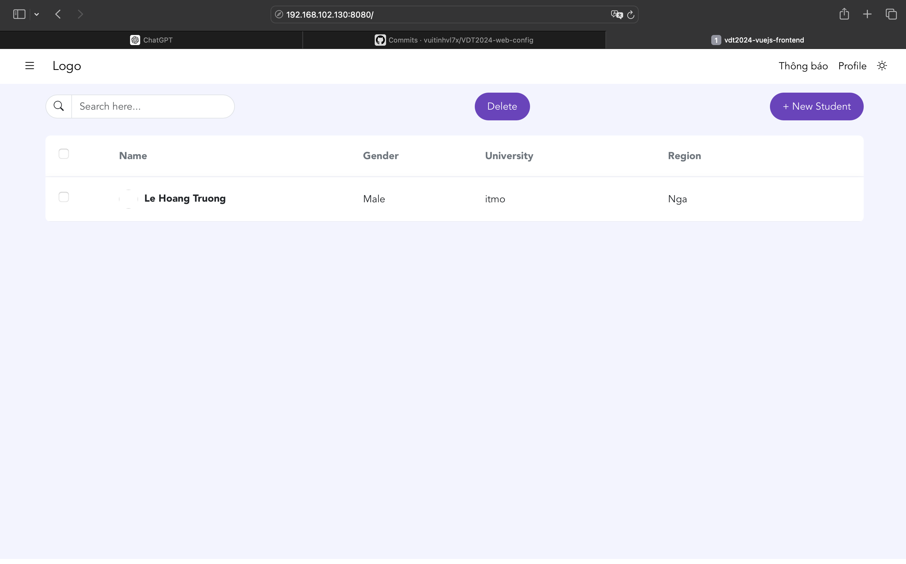
</div>  
<div align="center">
    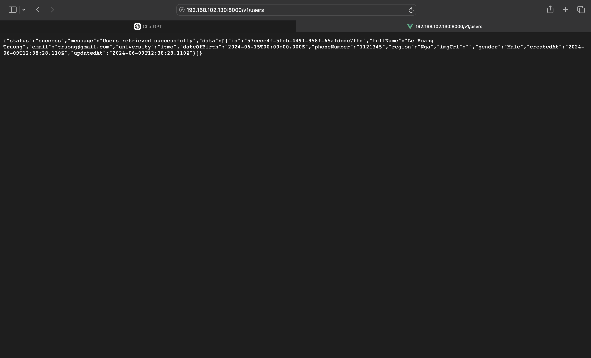
</div>  

- Giao diện giám sát, phân tích của **HAProxy**
<div align="center">
    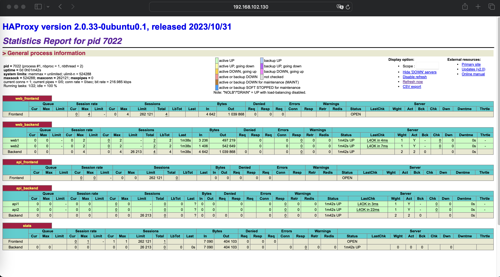
</div>  

### 2.2 Cấu hình ingress

- Tải NGINX Ingress controller 
```bash
helm repo add nginx-stable https://helm.nginx.com/stable
helm repo update
helm install nginx-ingress nginx-stable/nginx-ingress --set rbac.create=true
```

- Cấu hình ingress:
  + **API**: [code here](https://github.com/descent1511/vdt2024-api-nodejs/blob/develop/api-chart/templates/ingress.yaml)
  + **WEB**: [code here](https://github.com/descent1511/vdt2024-vuejs-frontend/blob/develop/web-chart/templates/ingress.yaml)
- Sửa giá trị config của hai service để có thể sử dụng ingress:
  + **API**: [code here](https://github.com/descent1511/vdt2024-api-config/blob/main/values.yaml)
  + **WEB**: [code here](https://github.com/descent1511/vdt2024-web-config/blob/main/values.yaml)

- Truy cập dịch vụ qua domain:

<div align="center">
    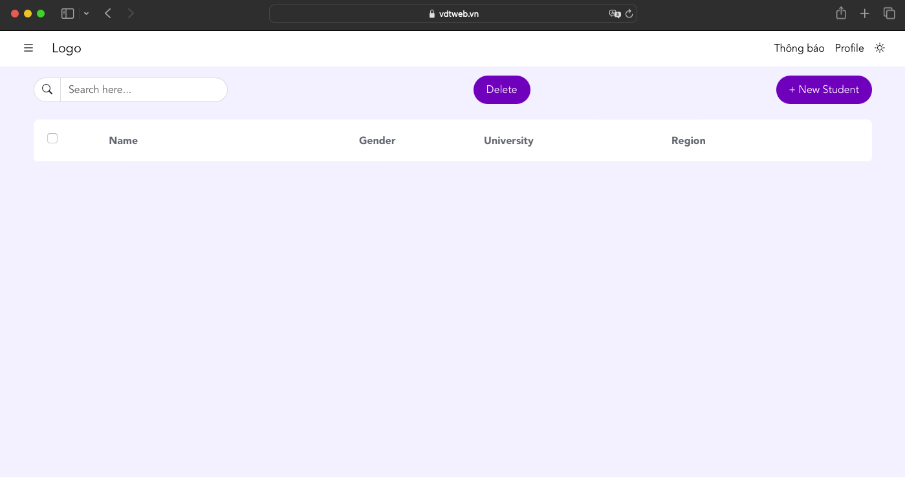
</div>  

<div align="center">
    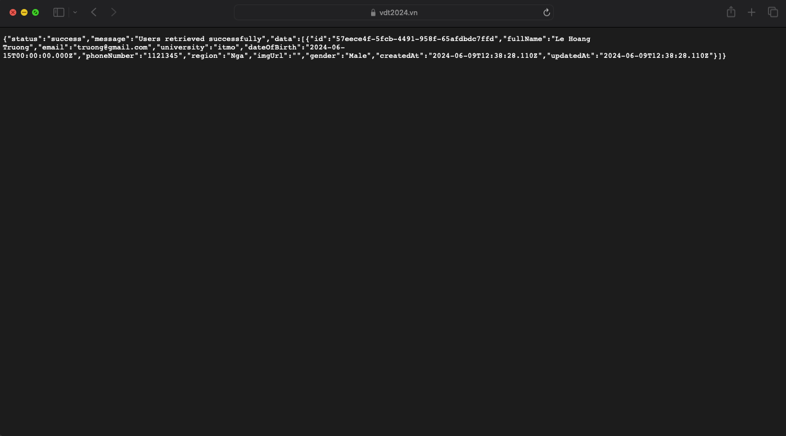
</div>  


### 2.3 Phân quyền 
-   Tạo thêm trường role, password trong model:
-   Tạo api để xử lý authentication :
    + Code service: [here](https://github.com/descent1511/vdt2024-api-nodejs/blob/develop/users/src/services/auth.ts)
    + Code controller: [here](https://github.com/descent1511/vdt2024-api-nodejs/blob/develop/users/src/controllers/authController.ts)

-   Thêm middleware để kiểm tra role trước khi trả về yêu cầu cho người dùng:
```javascript
import jwt, { Secret, JwtPayload } from 'jsonwebtoken';
import { Request, Response, NextFunction } from 'express';
import User from '../models/user';
require('dotenv').config();

if (!process.env.SECRET_KEY) {
  throw new Error('Missing SECRET_KEY in environment variables');
}

export const SECRET_KEY: Secret = process.env.SECRET_KEY;
export interface CustomRequest extends Request {
  user: any;
}

export const auth = async (req: Request, res: Response, next: NextFunction) => {
  try {
    const token = req.header('Authorization')?.replace('Bearer ', '');

    if (!token) {
      throw new Error('Missing token');
    }

    const decoded = jwt.verify(token, SECRET_KEY) as JwtPayload;
    const userData = await User.findByPk(decoded.id);

    if (!userData) {
      throw new Error('User not found');
    }
    if(userData.role !='admin')
    {
        throw new Error('not admin');
    }
    (req as CustomRequest).user = userData;
    next();
  } catch (err) {
    res.status(401).send('You are not an admin');
  }
};
```
#### Kết quả :
- Tất cả user đều có thể lấy dữ liệu 
<div align="center">
    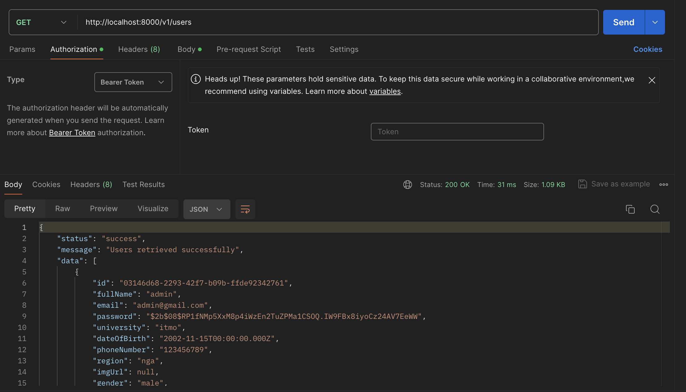
</div>  

- Các user không phải admin không thể tạo user
<div align="center">
    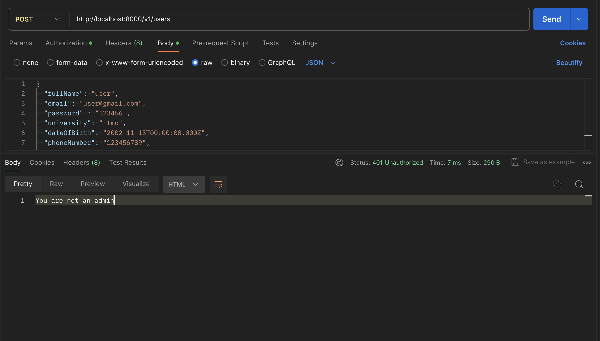
</div>  

- Đăng nhập tài khoản admin để lấy token
<div align="center">
    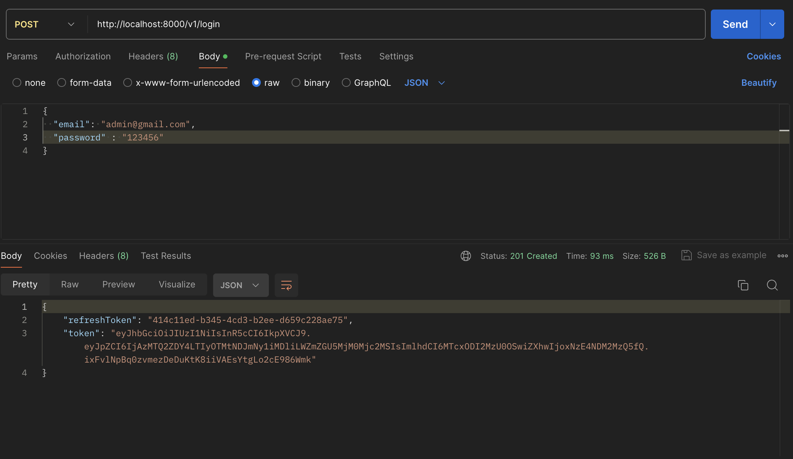
</div>  

- Tạo user thành công với token của admin
<div align="center">
    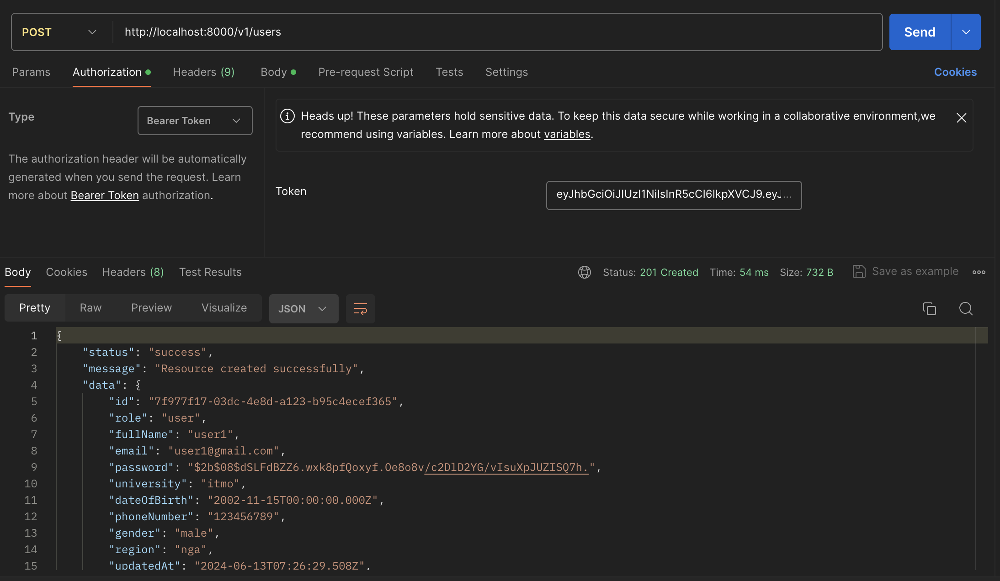
</div>  


### 2.4 Ratelimit cho Endpoint:
- Sử dụng thư viện `express-rate-limit` 
- Tạo `rateLimiter.ts` trong thư mục `middleware` để có thể handle giữa các yêu cầu

```javascript
import rateLimit from 'express-rate-limit';

const rateLimiter = rateLimit({
  windowMs: 1 * 60 * 1000,
  max: 10,
  message: 'You have sent too many requests, please try again later .',
  statusCode: 409,
  headers: true,
});

export default rateLimiter;
```


- Sử dụng nó trong `index.ts`
```javascript
app.use(rateLimiter);
```

#### Kết quả 
- Trả về lỗi khi thực hiện quá 10 request:
<div align="center">
    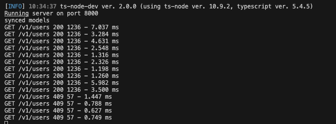
</div>  

- Trả về tin nhắn khi thực hiện quá 10 request:
<div align="center">
    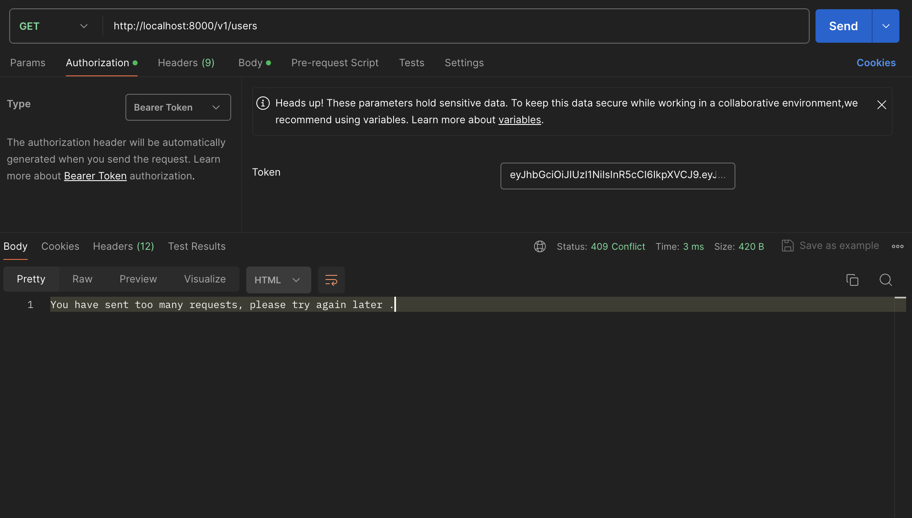
</div>  

## References
- [Build an Authentication API with Node.js, TypeScript, Typegoose, ExpressJS](https://www.youtube.com/watch?v=qylGaki0JhY)
- [Cài đặt Metallb và Ingress Nginx trên Bare metal Kubernetes cluster](https://nvtienanh.info/blog/cai-dat-metallb-va-ingress-nginx-tren-bare-metal-kubernetes-cluster)
- [How to Rate Limit an Express App - Youtube](https://www.youtube.com/watch?v=mZ0O7gcS7Yk)


## Lời cuối cùng, em xin chân thành cảm ơn các anh đã truyền đạt kiến thức và kinh nghiệm quý báu trong suốt khóa học. Em đã học hỏi được rất nhiều và cảm thấy vô cùng biết ơn, mong có cơ hội được gặp lại các anh một lần nữa !
