# Bài tập lớn giữa kỳ chương trình VDT 2024 lĩnh vực Cloud 
## Phát triển một 3-tier web application đơn giản
### 1. Chức năng
- Hiển thị danh sách sinh viên tham gia chương trình VDT2024 dưới dạng bảng với các thông tin: Họ và tên, Giới tính, và Trường đang theo học.
- Cho phép xem chi tiết, thêm, xóa, và cập nhật thông tin sinh viên.
### 2. Kiến trúc hệ thống
Hệ thống được thiết kế với ba dịch vụ:
-   **web**: Vuejs
-   **api**: TypeScript, Express
-   **db**: Postgresql  

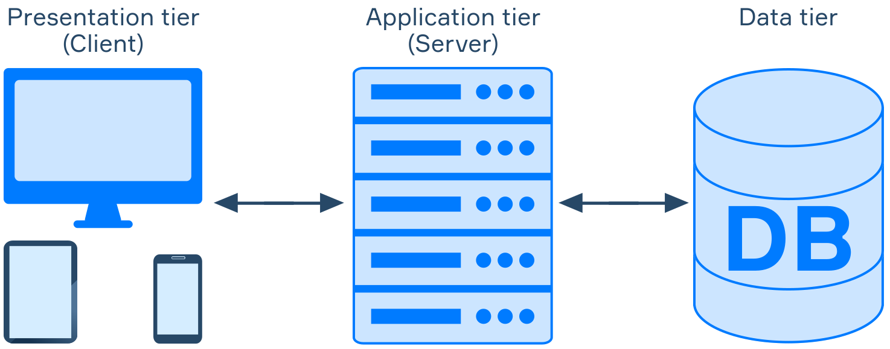

### 3. Kho mã nguồn
- [Web](https://github.com/descent1511/vdt2024-vuejs-frontend)
- [API](https://github.com/descent1511/vdt2024-api-nodejs)

### 4. Output

-  Hiển thị danh sách sinh viên   
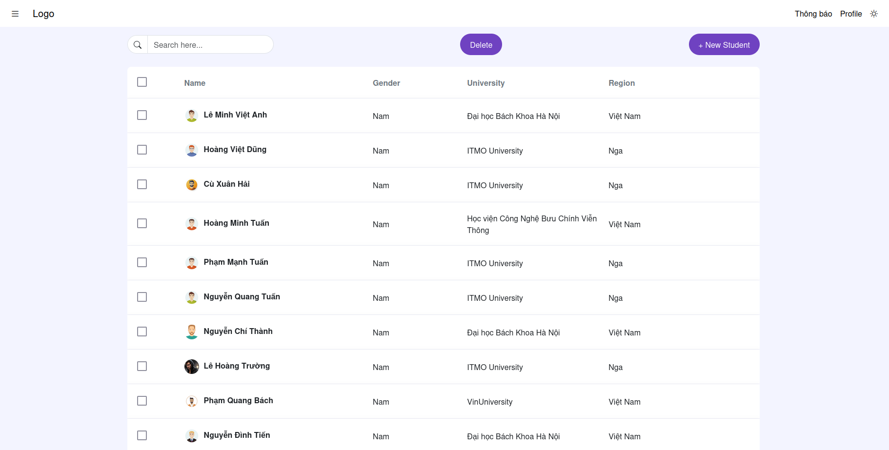  
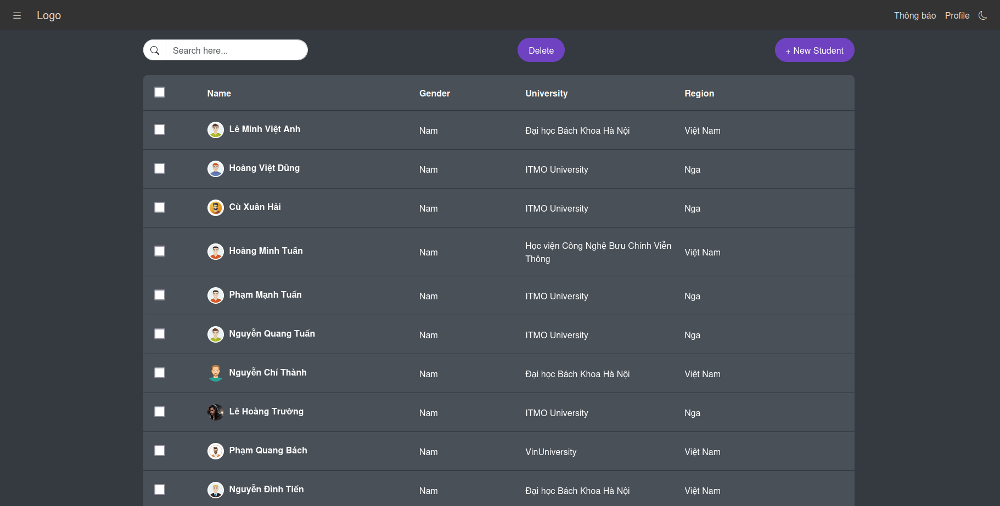

-  Thêm sinh viên mới

-  Xóa sinh viên
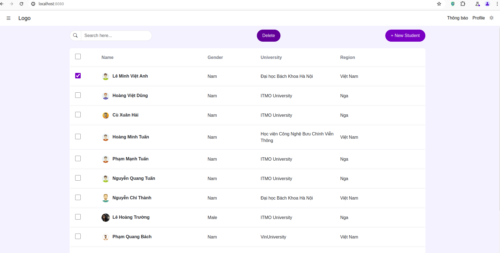

-   Xem chi tiết
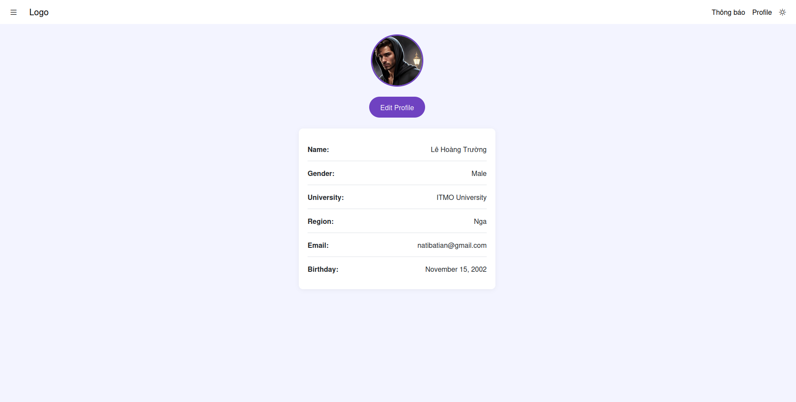

-   Cập nhật thông tin
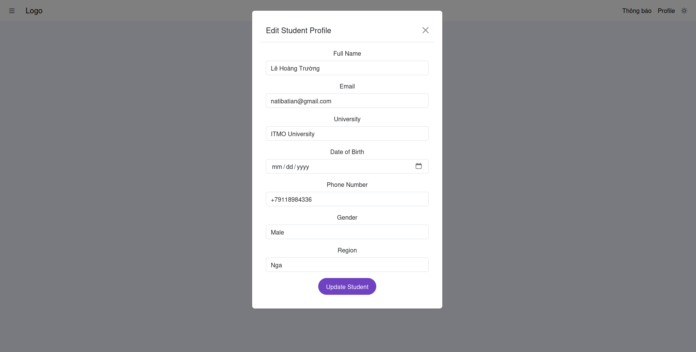

## Triển khai web application sử dụng các DevOps tools & practices

### 1. Containerization
-   **API** :
    - Source code
        -   [Dockerfile](https://github.com/descent1511/vdt2024-api-nodejs/blob/develop/users/Dockerfile)
        -   [Docker-compose](https://github.com/descent1511/vdt2024-api-nodejs/blob/develop/docker-compose.yml)

    -  Lệnh build:  
        `docker build -t api --no-cache --compress .`  
        `docker-compose up --build`

    - History image
        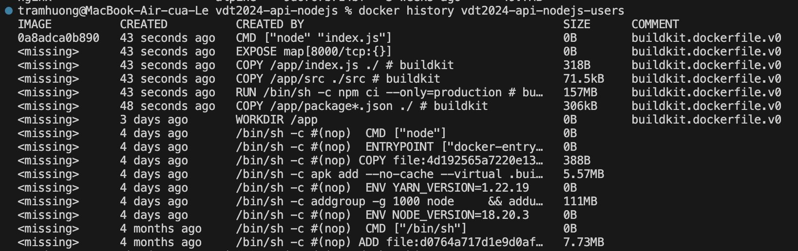
                        
        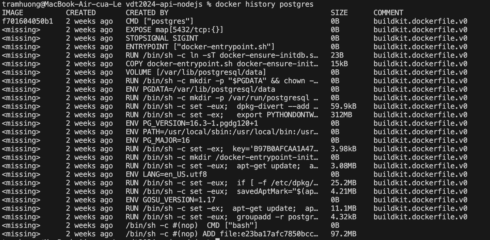

-   **WEB** :
    - Source code
        -   [Source code dockerfile](https://github.com/descent1511/vdt2024-vuejs-frontend/blob/develop/Dockerfile)
        -   [Source code docker-compose](https://github.com/descent1511/vdt2024-vuejs-frontend/blob/develop/docker-compose.yml)
    -  Lệnh build:
    
        `docker build -t web --no-cache --compress .`  
        `docker-compose up --build`

    - History image
        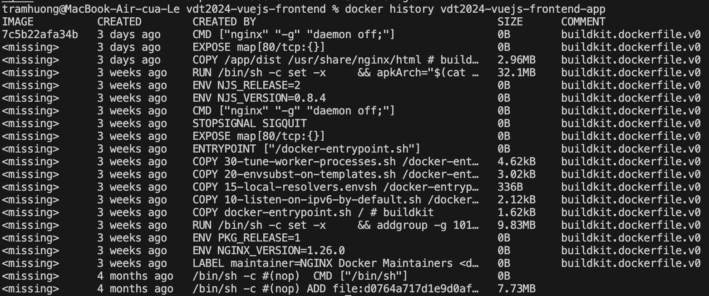
                        
### 2. Continuous Integration
- Source code: [here](https://github.com/descent1511/vdt2024-api-nodejs/blob/develop/.github/workflows/ci.yml)

- Output: 
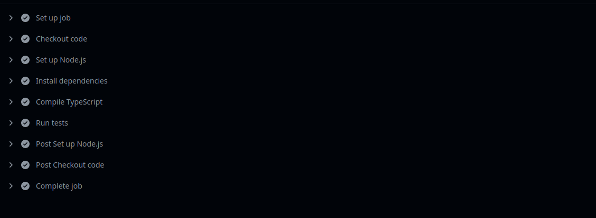  
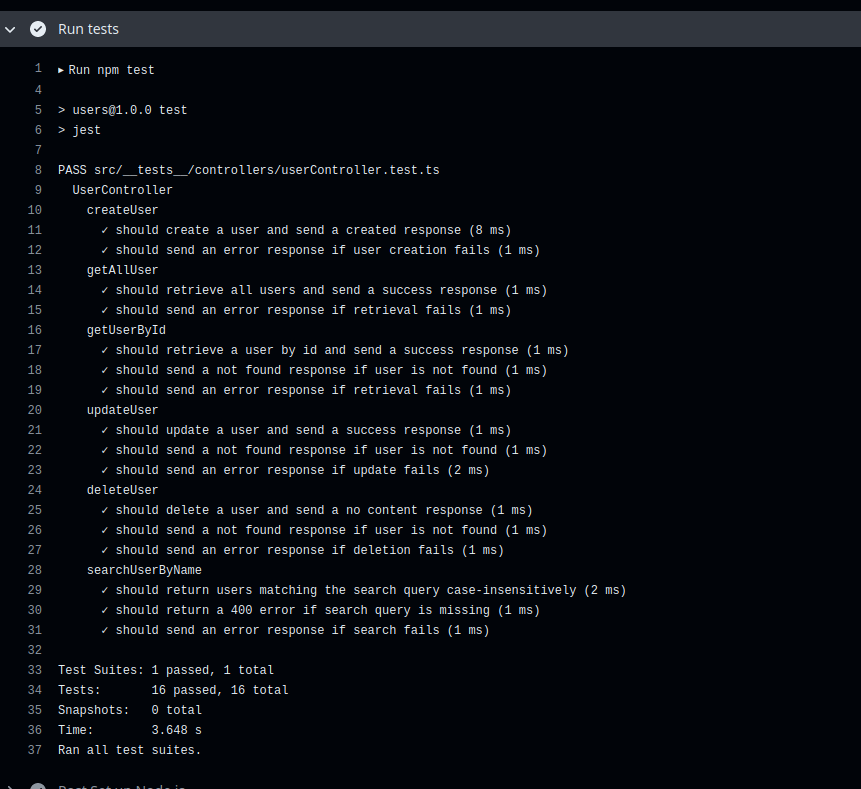

### 3. Automation
- Source code: [here](https://github.com/descent1511/vdt2024-ansible/tree/develop)
- Output: 
    -   Log 
    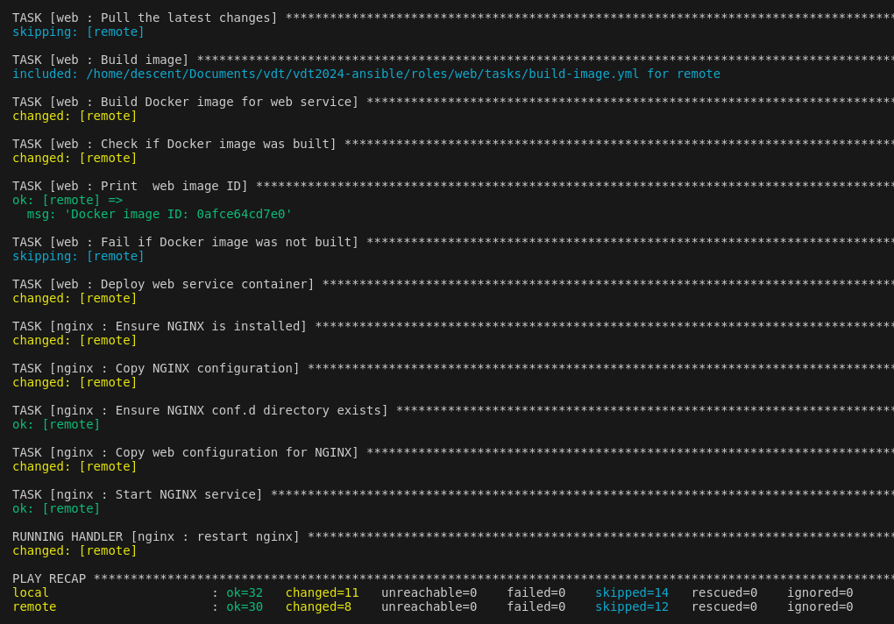  
    -   Kiểm tra container đang chạy
    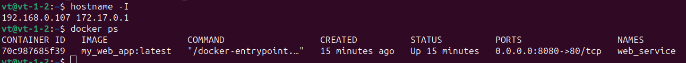
    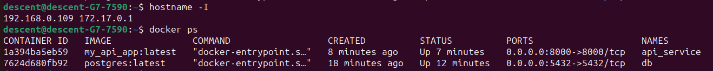
    -   Demo app:  
    APi :192.168.0.109
    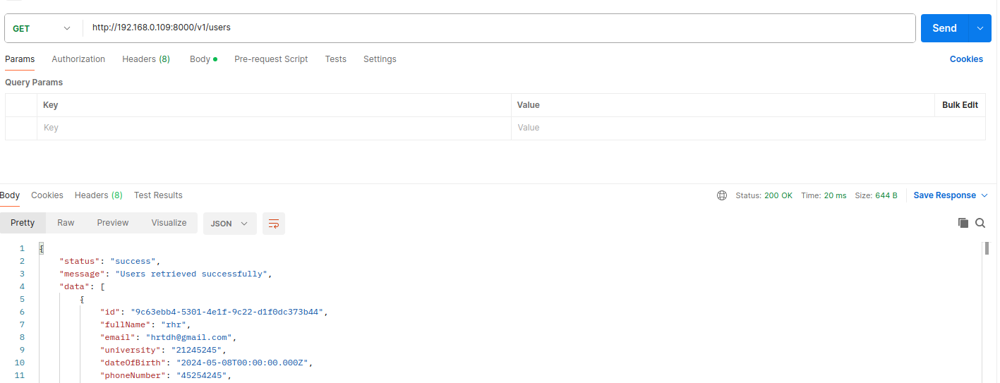
    WEB :192.168.0.107
    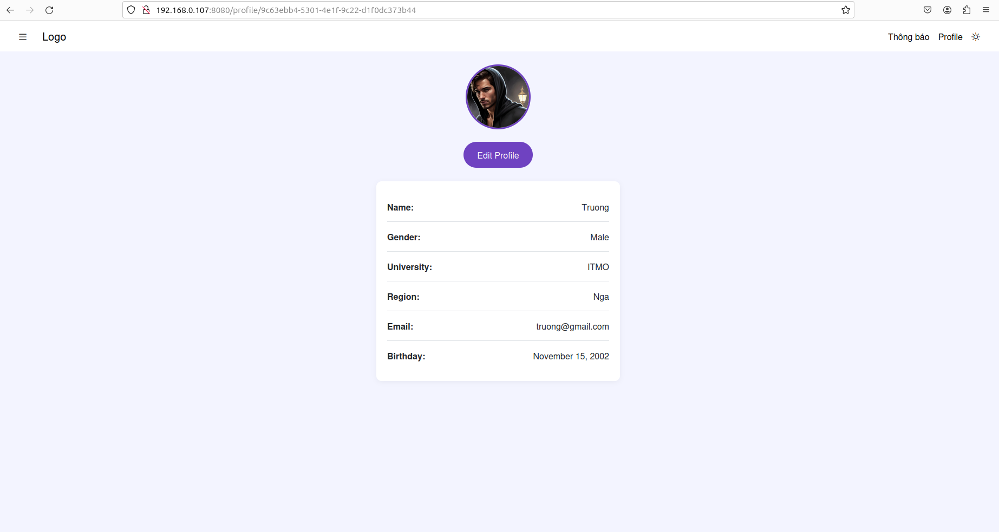

## 4. Research topic: Microservices Security
