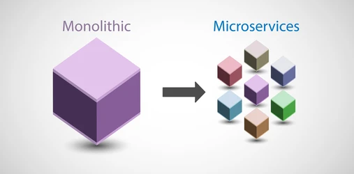
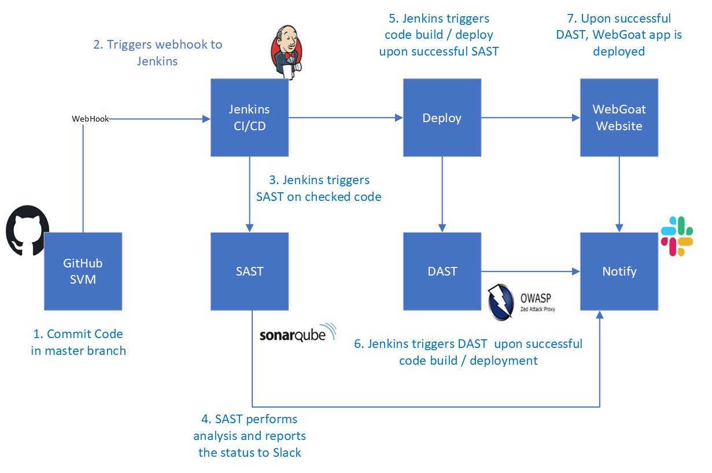
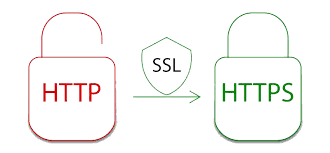
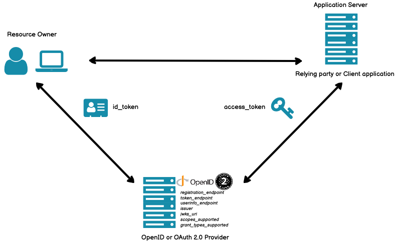
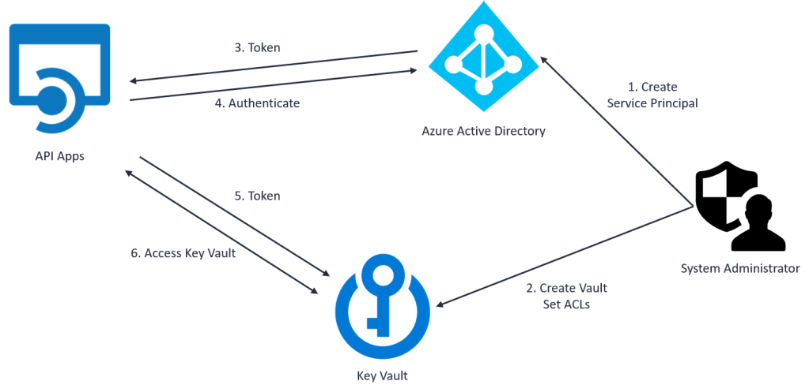
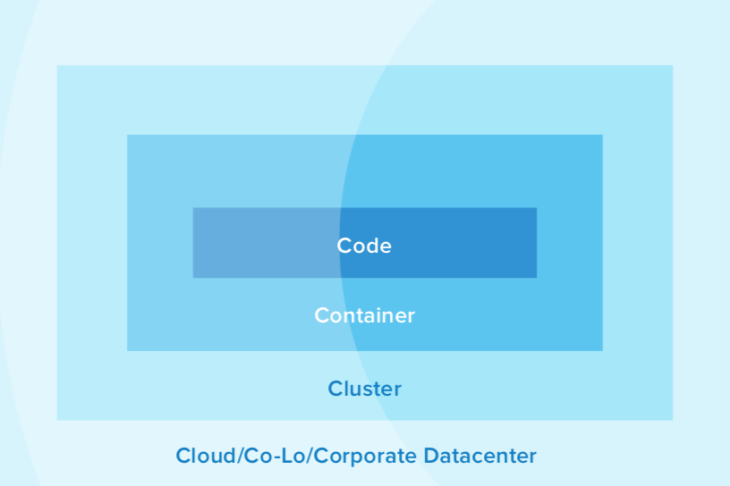
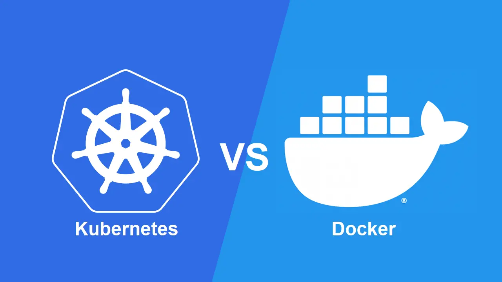

# Bảo Mật Trong Microservices

## Giới Thiệu
### Microservice là gì?
-   Microservices là một kiến trúc phần mềm trong đó một ứng dụng lớn được chia thành nhiều dịch vụ nhỏ, độc lập và có khả năng triển khai riêng biệt. Mỗi dịch vụ, được gọi là "microservice," thực hiện một chức năng cụ thể và giao tiếp với các dịch vụ khác thông qua các giao thức nhẹ như HTTP/HTTPS, REST, hoặc messaging.

    

### Tại sao bảo mật trong microservices lại quan trọng?
#### 1. Nhiều Điểm Tiếp Xúc
- Microservices phân tán có nhiều điểm tiếp xúc, tạo ra nhiều cơ hội hơn cho các cuộc tấn công nếu không được bảo vệ đúng cách.

#### 2. Giao Tiếp Qua Mạng
- Dữ liệu giữa các microservices truyền qua mạng cần được mã hóa và xác thực để ngăn chặn đánh cắp và giả mạo.

#### 3. Bảo Vệ Dữ Liệu Nhạy Cảm
- Microservices xử lý dữ liệu nhạy cảm cần được bảo vệ để tuân thủ các quy định và bảo vệ quyền riêng tư của người dùng.

#### 4. Quản Lý Quyền Truy Cập
- Cần có hệ thống quản lý quyền truy cập để đảm bảo chỉ người dùng và dịch vụ được ủy quyền mới truy cập được vào các tài nguyên.

#### 5. Chống Lại Các Cuộc Tấn Công
- Hệ thống cần được bảo vệ khỏi các cuộc tấn công phổ biến như DDoS, tấn công brute force, SQL injection, và XSS.

#### 6. Tuân Thủ Quy Định
- Đảm bảo tuân thủ các quy định bảo mật như GDPR, HIPAA, PCI-DSS để tránh các hình phạt và mất uy tín.

#### 7. Quản Lý Bí Mật
- Bảo vệ các thông tin nhạy cảm như khóa API và thông tin đăng nhập cơ sở dữ liệu khỏi rò rỉ và truy cập trái phép.

#### 8. Đảm Bảo Tính Toàn Vẹn và Độ Tin Cậy
- Bảo mật giúp đảm bảo dữ liệu không bị thay đổi hoặc mất mát, duy trì độ tin cậy của hệ thống.

## Nội Dung
Dưới đây là 8 cách để bảo mật kiến trúc microservice

### 1. Xây dựng kiến trúc microservices an toàn theo thiết kế
Giống như các công nhân xây dựng cần phải chiến lược hóa việc xếp lớp thép và bê tông để xây dựng nền móng vững chắc cho các tòa nhà chọc trời, các nhà phát triển phải tích hợp các lớp bảo mật vào ứng dụng để bảo vệ dữ liệu mà chúng chứa đựng. Trong kiến trúc microservices, điều này có nghĩa là phải “an toàn theo thiết kế”—luôn giữ bảo mật làm ưu tiên hàng đầu trong mọi giai đoạn của sản xuất, từ thiết kế đến xây dựng và triển khai.

    

Khi viết mã, điều này có nghĩa là triển khai một hình thức kiểm tra độ bền liên tục trên kiến trúc của bạn. Một phần của điều này là kiểm tra các pipelines tích hợp liên tục (**CI**) và phân phối liên tục (CD) của bạn. Điều này có thể được thực hiện bằng cách triển khai đồng thời các bài kiểm tra bảo mật đơn vị như kiểm tra bảo mật phân tích tĩnh (SAST) và kiểm tra bảo mật phân tích động (DAST):

- SAST sẽ phát hiện các lỗ hổng trong mã của bạn, cũng như các thư viện mà bạn nhập vào. Nó hoạt động từ bên trong và do đó yêu cầu một công cụ quét tương thích với ngôn ngữ lập trình của bạn.

- DAST hoạt động từ bên ngoài, mô phỏng các cuộc tấn công độc hại để xác định các lỗ hổng. Không giống như SAST, nó không phụ thuộc vào một ngôn ngữ cụ thể.

- Các bài kiểm tra đơn vị này có thể được tích hợp vào pipeline phân phối của bạn để giúp giảm thiểu các kiểm tra bảo mật thủ công có thể gây gánh nặng cho các nhà phát triển của bạn. Dự án Bảo mật Ứng dụng Web Mở (OWASP) cũng cung cấp một loạt các tài nguyên và công cụ phân tích để giúp nhóm của bạn thực hiện các thực hành tốt nhất khi xây dựng phần mềm.

### 2. Quét các phụ thuộc

Nhiều thư viện được sử dụng để phát triển phần mềm phụ thuộc vào các thư viện khác, điều này có nghĩa là phần lớn mã được triển khai vào sản xuất bao gồm các phụ thuộc của bên thứ ba. Điều này làm cho bảo mật trở thành một mối quan tâm lớn hơn, vì các mối quan hệ này có thể tạo ra các chuỗi phụ thuộc lớn, có thể gây ra các lỗ hổng cho hệ thống của bạn.

Những điểm yếu này có thể được loại bỏ bằng cách thường xuyên và kỹ lưỡng quét kho mã nguồn của ứng dụng, các đóng góp mã mới và pipeline triển khai để tìm các phụ thuộc dễ bị gặp vấn đề (bao gồm cả các phiên bản phát hành cập nhật).

Mặc dù phần lớn các ứng dụng cung cấp ghi chú phát hành, nhưng chỉ có 75% báo cáo các vấn đề bảo mật—và chỉ 10% báo cáo các lỗ hổng và phơi nhiễm phổ biến. Biết các phụ thuộc của bạn giúp đảm bảo rằng không có lỗ hổng nào do các yêu cầu kéo mới và rằng mã của bạn được cập nhật vào thời điểm triển khai. Ngoài việc bật cảnh báo bảo mật trong kho của bạn, các công cụ như Dependabot của Github có thể giúp tự động hóa các bản cập nhật thông qua các yêu cầu kéo.

### 3. Sử dụng HTTPS mọi nơi

Điều này có thể cảm thấy như một nguyên tắc cơ bản, nhưng việc triển khai nó nhất quán là rất quan trọng như một yếu tố nền tảng cho các hoạt động nội bộ và bên ngoài của bạn.

Trong khi các cuộc tấn công phổ biến như phishing và credential stuffing được hầu hết các chuyên gia IT quan tâm khi triển khai cơ sở hạ tầng bảo mật, thì việc giảm thiểu các cuộc tấn công có thể bắt nguồn từ mạng của bạn cũng quan trọng không kém. Điều này có thể được thực hiện một phần bằng cách triển khai HTTPS trên toàn bộ kiến trúc microservices của bạn.

    

Được gọi chính thức là Transport Layer Security (TLS), HTTPS đảm bảo quyền riêng tư và tính toàn vẹn của dữ liệu bằng cách mã hóa giao tiếp qua HTTP. Hãy nghĩ theo cách này: giống như việc lái xe yêu cầu có giấy phép chứng minh bạn là ai và cho phép điều khiển phương tiện, HTTPS yêu cầu chứng chỉ để xác thực danh tính của bạn và cung cấp quyền truy cập vào các giao tiếp được mã hóa thông qua Hạ tầng Khóa Công khai. Sau khi bạn có được chứng chỉ của mình, bạn có thể tiếp tục tăng cường bảo mật bằng cách tự động hóa việc tạo và gia hạn chứng chỉ—giữ cho các tác nhân xấu muốn xâm phạm kiến trúc của bạn ở xa.

Mọi khía cạnh của kiến trúc microservices của bạn, từ các kho Maven đến XSD, đều có thể tham chiếu đến các URL an toàn này. Bạn cũng có thể sử dụng header HTTP Strict-Transport-Security để yêu cầu trình duyệt chỉ truy cập vào các điểm cuối của bạn bằng HTTPS.

Khi bạn xây dựng các microservices và API của mình, HTTPS sẽ rất quan trọng để bảo vệ dữ liệu được truyền trong hệ thống của bạn. Và khi chúng được triển khai, nó sẽ cung cấp các kết nối an toàn cho người dùng bên ngoài, bảo vệ dữ liệu của bạn—và danh tiếng của bạn.

### 4. Sử dụng mã truy cập và mã định danh

Kiến trúc microservices có thể bao gồm mọi thứ từ các dịch vụ backend cung cấp dữ liệu, đến mã trung gian giao tiếp với các kho dữ liệu, đến giao diện người dùng cung cấp dữ liệu một cách thân thiện. Và việc đặt đúng các công cụ và giao thức vào vị trí là rất quan trọng để cung cấp xác thực và ủy quyền an toàn và hiệu quả trên các microservices đó.

Ví dụ, OAuth 2.0 cung cấp một giao thức tiêu chuẩn trong ngành để ủy quyền người dùng trên các hệ thống phân tán. Trong bối cảnh microservices, luồng thông tin xác thực của client của OAuth 2.0 cho phép giao tiếp an toàn giữa máy chủ API và máy khách API.

Năm 2014, OpenID Connect (OIDC) đã mở rộng OAuth, thêm danh tính liên kết vào ủy quyền được ủy nhiệm. Cùng nhau, hai lớp này cung cấp một đặc tả tiêu chuẩn mà các nhà phát triển có thể viết mã theo cách hoạt động trên nhiều nhà cung cấp danh tính.
OIDC và OAuth 2.0 cũng cho phép bạn tra cứu danh tính của người dùng bằng cách gửi mã truy cập đến điểm cuối thông tin người dùng. Đường dẫn cho điểm cuối này có thể được xác định bằng cách sử dụng khám phá OIDC. Kết quả là, OAuth 2.0 giảm bớt gánh nặng cho các nhà phát triển của bạn khi họ không phải xây dựng các cơ chế xác thực riêng vào từng microservice.

    

OAuth 2.0 + OIDC có thể:

- Khám phá metadata của nhà cung cấp OpenID

- Thực hiện các luồng OAuth để nhận mã ID và/hoặc mã truy cập

- Nhận Bộ Khóa Web JSON (JWKS) cho các khóa chữ ký

- Xác thực mã định danh (ví dụ: mã web JSON)

- Nhận các thuộc tính người dùng bổ sung với mã truy cập từ các điểm cuối thông tin người dùng

#### Authorization servers: many-to-one or one-to-one?

Sử dụng tiêu chuẩn OAuth 2.0, các máy chủ ủy quyền đóng vai trò quan trọng vì chúng chịu trách nhiệm xác thực chủ sở hữu tài nguyên, phát hành mã truy cập và cho phép ủy quyền người dùng. Thông thường, các máy chủ ủy quyền được thiết lập trong mối quan hệ nhiều-một, nơi nhiều microservice nói chuyện với một máy chủ ủy quyền duy nhất. Tuy nhiên, có cả lợi ích và thách thức với cách tiếp cận này.

#### Lợi ích của mối quan hệ many-to-one:
- **Các dịch vụ sử dụng mã truy cập để nói chuyện an toàn với các dịch vụ nội bộ khác**
- **Đặt phạm vi và định nghĩa quyền hạn ở một nơi**
- **Cải thiện quản lý cho các nhà phát triển và người bảo mật**
- **Tăng tốc độ (vì ít phải trao đổi thông tin hơn)**

#### Nhược điểm của mối quan hệ many-to-one:
- **Mở ứng dụng ra cho các dịch vụ giả mạo, có thể gây ra vấn đề với mã**
- **Đặt tất cả các dịch vụ vào rủi ro nếu một mã bị xâm phạm**
- **Tạo ra ranh giới dịch vụ mơ hồ vì tất cả đều giao tiếp với một công cụ định danh duy nhất**

Một lựa chọn khác—an toàn hơn—là áp dụng một kiến trúc mà mỗi microservice được liên kết với máy chủ ủy quyền riêng của nó, đảm bảo rằng các giao tiếp chỉ xảy ra trong các mối quan hệ tin cậy.

#### Lợi ích của mối quan hệ one-to-one:
- **Ranh giới bảo mật được xác định rõ ràng hơn**

#### Nhược điểm của mối quan hệ one-to-one:
- **Chậm hơn**
- **Khó quản lý hơn**

Vì chúng cung cấp một con đường phức tạp hơn hướng tới giao tiếp an toàn, các mối quan hệ một-một cần có kế hoạch và tài liệu hiệu quả trước khi chúng có thể được áp dụng trên toàn bộ kiến trúc microservices của bạn.

### 5. Mã hóa và bảo vệ các bí mật

Khi bạn phát triển các microservices giao tiếp với các máy chủ ủy quyền và các dịch vụ khác, các microservices có thể có các bí mật mà chúng sử dụng để giao tiếp—như các khóa API, bí mật của client, hoặc thông tin đăng nhập cho xác thực cơ bản.

    

Những bí mật này không nên được kiểm tra vào hệ thống quản lý kiểm soát mã nguồn của bạn. Ngay cả khi bạn phát triển mã trong một kho riêng tư, điều này vẫn có thể gây ra rắc rối khi nhóm của bạn làm việc trên mã sản xuất. Thay vào đó, bước đầu tiên để bảo mật các bí mật trong các microservices của bạn là lưu trữ chúng trong các biến môi trường. Tốt hơn nữa, các nhà phát triển nên mã hóa các bí mật bằng các công cụ như HashiCorp Vault, Microsoft Azure Key Vault, hoặc Amazon KMS. Với Amazon KMS, ví dụ, bạn có thể tạo một khóa chính, mã hóa dữ liệu của bạn bằng các khóa dữ liệu duy nhất sau đó được mã hóa bởi khóa chính, tạo ra một thông điệp mã hóa được lưu trữ dưới dạng tệp hoặc trong cơ sở dữ liệu. Cách tiếp cận này đảm bảo các khóa cần thiết để giải mã bất kỳ dữ liệu nào luôn là duy nhất và an toàn, có nghĩa là nhóm của bạn có thể dành ít thời gian hơn để triển khai và quản lý các biện pháp bảo vệ khác.

### 6. Làm chậm kẻ tấn công

Nếu ai đó cố gắng tấn công API của bạn với hàng trăm kết hợp tên người dùng và mật khẩu, sẽ mất một thời gian để họ xác thực thành công. Làm chậm quá trình này thậm chí còn là một cách khác để bảo vệ các điểm cuối khác nhau của bạn. Sử dụng một phương pháp như hạn chế tốc độ, ví dụ, có nghĩa là kẻ tấn công chỉ có thể thực hiện một hoặc hai lần thử mỗi giây, điều này có thể ngăn cản họ tiếp tục tấn công nhồi nhét thông tin đăng nhập trên hệ thống của bạn. Hạn chế tốc độ có thể được triển khai trong mã của bạn—với một thư viện mã nguồn mở—hoặc trong một API gateway. Ví dụ, các giới hạn tốc độ API và giới hạn tốc độ email của Okta rất hữu ích trong việc ngăn chặn các cuộc tấn công từ chối dịch vụ.

### 7. Biết về bảo mật đám mây và cụm của bạn

Nếu nhóm của bạn đang quản lý các cụm sản xuất và đám mây riêng của mình, họ nên biết về bốn yếu tố của bảo mật gốc đám mây: code, container, cluster, and cloud/co-lo/ corporate datacenter.

Mỗi yếu tố trong bốn yếu tố này phụ thuộc vào bảo mật của các yếu tố mà chúng nằm trong đó. Hầu như không thể bảo vệ microservices nếu bạn chỉ giải quyết bảo mật ở một mức độ. Tuy nhiên, thêm bảo mật thích hợp cho mã, container, cụm và đám mây sẽ củng cố một nền tảng đã mạnh sẵn.
Chúng tôi đã nói về cách bạn có thể thiết kế mã an toàn nhất và hoạt động trong một môi trường đám mây an toàn. Trong khi đó, về bảo mật container, việc đảm bảo tính toàn vẹn của các container và các hình ảnh cơ bản của chúng là rất quan trọng. Bạn có thể làm điều này bằng cách:

    

- Sử dụng các hình ảnh được ký với Docker Content Trust
- Xây dựng một registry nội bộ
- Sử dụng phiên bản hóa container an toàn
- Quét hình ảnh container để tìm các lỗ hổng và lỗi
- Giữ bí mật các cấu hình
- Ngăn chặn container breakouts bằng cách hoạt động trên các nguyên tắc quyền hạn tối thiểu
- Triển khai các tính năng xác thực (điều này đúng trên cả bốn yếu tố)
- Cập nhật các phương pháp bảo mật container tốt nhất—nhớ rằng, điều gì an toàn hôm nay có thể không an toàn vào ngày mai

Nếu bạn muốn bảo vệ các cụm của mình và tăng khả năng phục hồi của chúng khi đối mặt với một cuộc tấn công, đây là những hành động bạn nên xem xét:

- Triển khai Okta Advanced Server Access để quản lý quyền truy cập vào tài khoản máy chủ và áp dụng các chính sách ủy quyền trên bất kỳ đám mây nào
- Sử dụng TLS mọi nơi (như chúng tôi đã thảo luận ở trên)
- Kích hoạt kiểm soát truy cập dựa trên vai trò với quyền hạn tối thiểu
- Vô hiệu hóa kiểm soát truy cập dựa trên thuộc tính và sử dụng ghi nhật ký kiểm toán
- Sử dụng nhà cung cấp xác thực bên thứ ba như Google, GitHub, hoặc Okta
- Xoay vòng các khóa mã hóa của bạn để giảm thiểu các lỗ hổng
- Sử dụng các chính sách mạng để hạn chế lưu lượng giữa các pods
- Chạy một service mesh

### 8. Bảo vệ toàn diện các cơ sở bảo mật của bạn

Ngoài các chiến lược đã thảo luận, có ba cách chiến thuật mà nhóm của bạn có thể tăng cường bảo mật cho microservices của mình:

1. **Sử dụng chế độ không root:** Docker 19.03+ có chế độ không root được thiết kế để giảm bớt dấu chân bảo mật của Docker daemon và cung cấp các khả năng Docker cho các hệ thống mà người dùng không thể có quyền root. Nếu bạn đang chạy Docker daemons trong sản xuất, tính năng này thêm một lớp bảo mật bổ sung.

2. **Triển khai bảo mật dựa trên thời gian:** Ý tưởng đằng sau bảo mật dựa trên thời gian là hệ thống của bạn không bao giờ hoàn toàn an toàn. Như vậy, bạn không chỉ phải ngăn chặn những kẻ xâm nhập truy cập vào cơ sở hạ tầng ứng dụng của mình, mà còn phải có khả năng phát hiện các bất thường và phản ứng nhanh chóng. Các sản phẩm như Okta's Advanced Server Access (ASA) làm chậm những kẻ xâm nhập bằng cách xác thực các yêu cầu đăng nhập máy chủ thông qua Đăng nhập Một Lần và xác thực đa yếu tố và ủy quyền dựa trên các chính sách truy cập tùy chỉnh. ASA cũng tạo ra các sự kiện yêu cầu phong phú có thể được tiêu thụ qua API, hoặc có thể được truyền trực tiếp đến SIEM như Splunk để giúp nhóm của bạn nhanh chóng phát hiện các mối đe dọa bảo mật.

3. **Quét cấu hình Docker và Kubernetes để tìm lỗ hổng:** Các container Docker thường được sử dụng trong các kiến trúc microservice—vì vậy chúng cần được bảo mật đúng cách. Điều này có nghĩa là làm theo các bước chúng tôi đã nêu ở trên để bảo vệ cả hình ảnh và container.

    

### Tổng kết

Việc chuyển sang kiến trúc microservice đang xác định lại cách thức hoạt động của nhà phát triển và nhóm DevOps. Áp dụng phương pháp tiếp cận nguyên khối thường thấy để xây dựng hệ thống và ứng dụng, vi dịch vụ cho phép các nhóm hoạt động linh hoạt hơn, tiết kiệm chi phí hơn và có khả năng mở rộng quy mô hệ thống của họ tốt hơn. Và khi cách tiếp cận kiến trúc này trở nên phổ biến hơn trong tổ chức của bạn, điều quan trọng là bạn phải trang bị cho nhóm của mình những công cụ và tài nguyên phù hợp để bảo mật các tính năng khác nhau này.