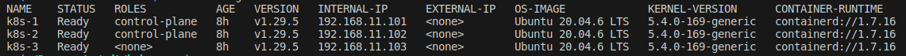
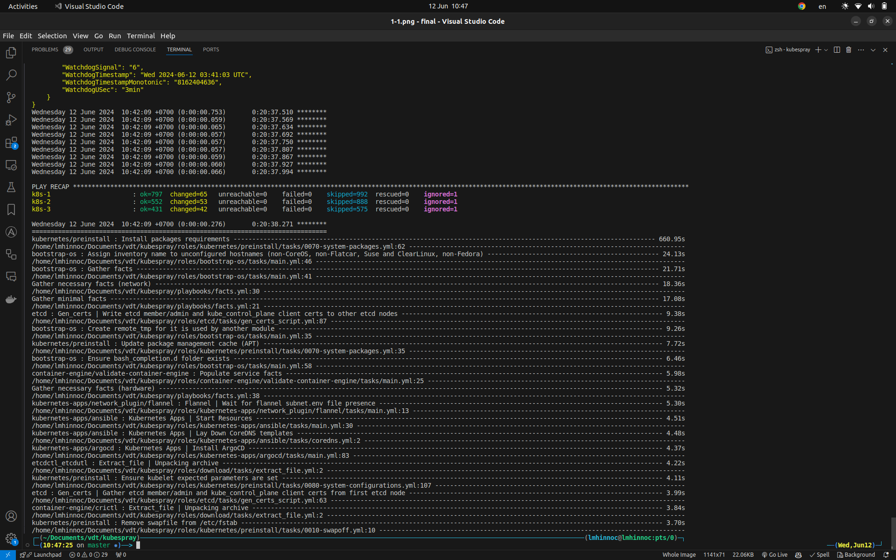

# Set up k8s cluster with Kubespray

3 node Kubernetes cluster with 2 master nodes and all 3 will be worker nodes

<!-- https://youtu.be/dz-nuXbvqWU -->

## Steps

### 1. Install kube && Vagrant

#### 1.1. Install kube
```
sudo apt-get update
sudo apt-get install -y apt-transport-https ca-certificates curl gpg

curl -fsSL https://pkgs.k8s.io/core:/stable:/v1.30/deb/Release.key | sudo gpg --dearmor -o /etc/apt/keyrings/kubernetes-apt-keyring.gpg
echo 'deb [signed-by=/etc/apt/keyrings/kubernetes-apt-keyring.gpg] https://pkgs.k8s.io/core:/stable:/v1.30/deb/ /' | sudo tee /etc/apt/sources.list.d/kubernetes.list

sudo apt-get update
sudo apt-get install -y kubelet kubeadm kubectl
sudo apt-mark hold kubelet kubeadm kubectl

sudo systemctl enable --now kubelet
```

#### 1.2. Install Vagrant
```
sudo apt update
sudo apt install virtualbox -y

wget -O- https://apt.releases.hashicorp.com/gpg | sudo gpg --dearmor -o /usr/share/keyrings/hashicorp-archive-keyring.gpg
echo "deb [signed-by=/usr/share/keyrings/hashicorp-archive-keyring.gpg] https://apt.releases.hashicorp.com $(lsb_release -cs) main" | sudo tee /etc/apt/sources.list.d/hashicorp.list
sudo apt update && sudo apt install vagrant
```

### 2. Clone the Kubespray Repository from GitHub
```
git clone https://github.com/kubernetes-sigs/kubespray.git --branch release-2.25
cd kubespray
```

### 3. Install the requirements
```
sudo apt-get install python3-pip
python3 -m pip install -r requirements.txt
pip install -r requirements.txt  
```

### 4. Nano Vagrantfile
```
- $forwarded_ports ||= {}
- $subnet ||= "172.18.8"

+ $forwarded_ports ||= {
+   22 => 2422,
+ }
+ $subnet ||= "192.168.11"
```

Config vagrant

nano .vagrant/provisioners/ansible/inventory/vagrant_ansible_inventory
```
- ansible_ssh_private_key_file=...
+ ansible_ssh_pass='vagrant'
```

### 5. Run Vagrantfile
```
vagrant up
```

Confirm vms
```
vagrant status
```

### 6. Verify config and output
```
cp inventory/sample/artifacts/admin.conf ~/.kube/config
```

Verifying the cluster
```
kubectl cluster-info
kubectl get nodes -o wide
```

Output




### 7. Rerun ansible playbook

```

vagrant reload
vagrant status
vagrant ssh k8s-[1-3]
vagrant suspend
vagrant up
vagrant snapshot save "$(echo $(date +'%d%m%Y_%H%M%S%3N'))"
vagrant snapshot list
vagrant snapshot restore "version"

ansible-playbook -vvv -i .vagrant/provisioners/ansible/inventory/vagrant_ansible_inventory --become --become-user=root cluster.yml
``