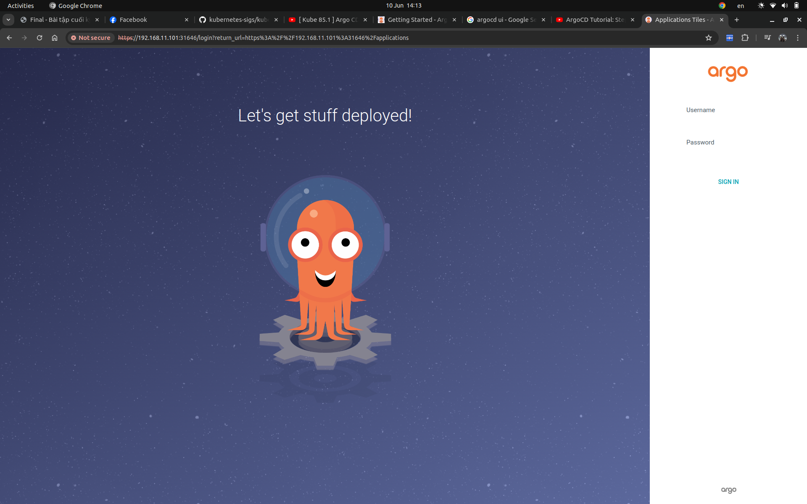
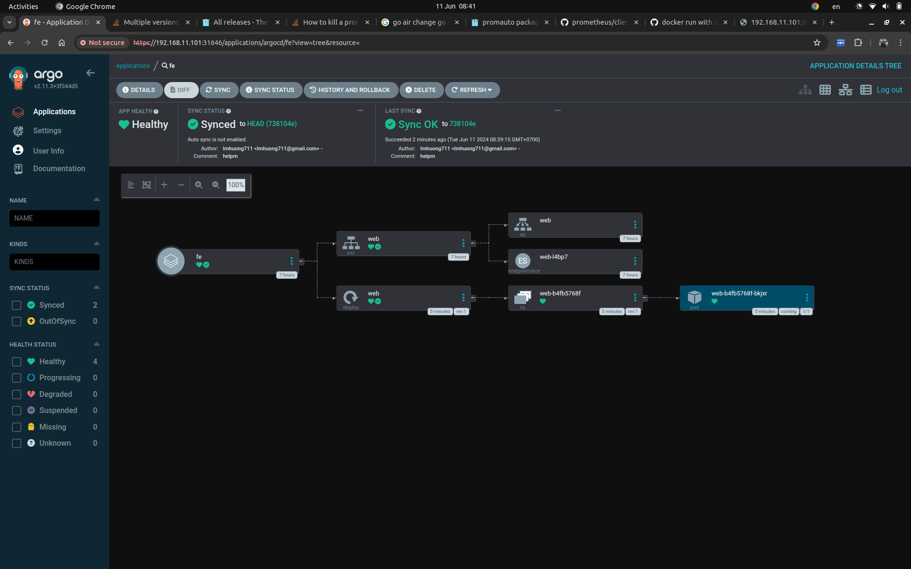
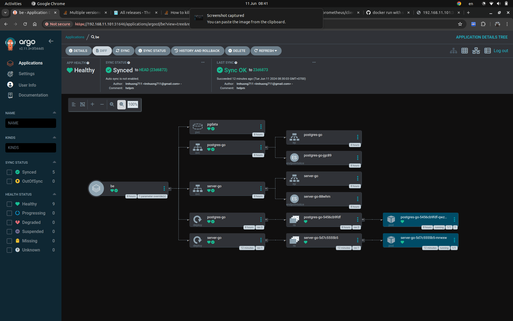
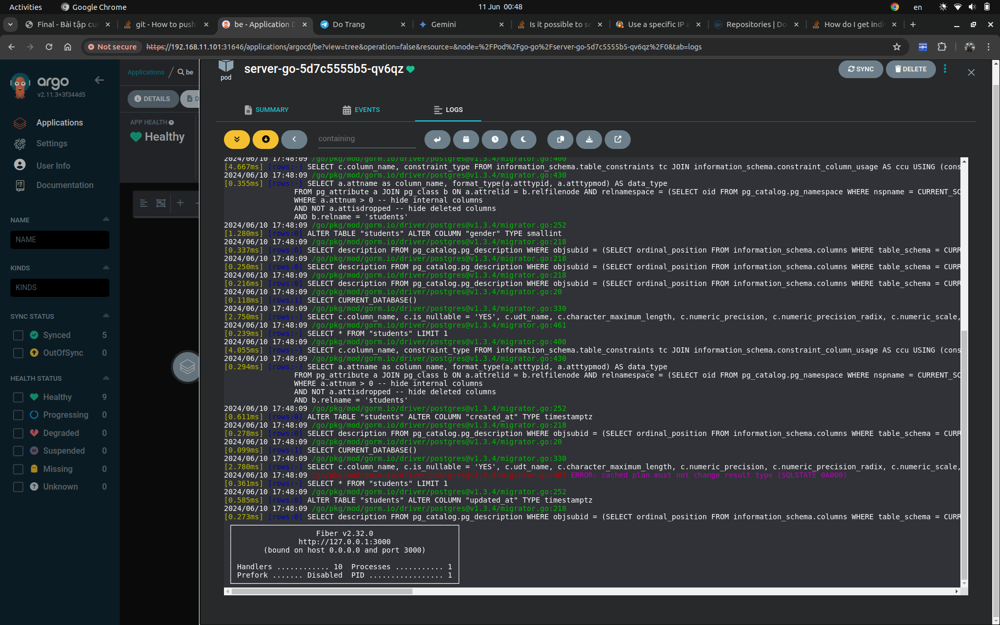
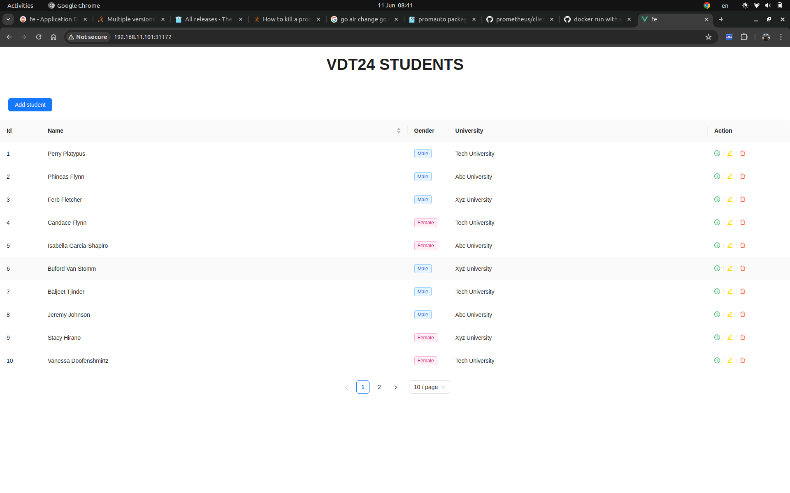
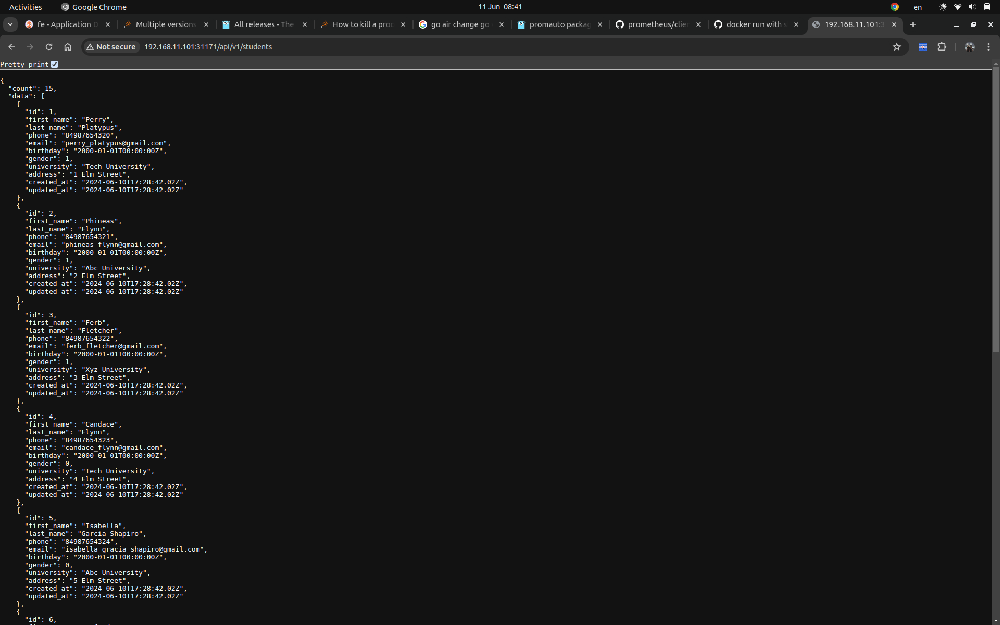

# K8S Helm Chart

## 1. Set up for kubespray

- inventory/sample/group_vars/k8s_cluster/addons.yml
```
dashboard_enabled: true
helm_enabled: true
argocd_enabled: true
argocd_version: v2.11.0
argocd_namespace: argocd
argocd_admin_password: "password"
```

- roles/kubernetes-apps/argocd/defaults/main.yml
```
argocd_enabled: false
argocd_version: v2.11.0
argocd_namespace: argocd
# argocd_admin_password:
argocd_install_url: "https://raw.githubusercontent.com/argoproj/argo-cd/{{ argocd_version }}/manifests/install.yaml"
```

- roles/kubernetes-apps/helm/defaults/main.yml
```
helm_enabled: true
```

- roles/kubespray-defaults/defaults/main/main.yml
```
dashboard_enabled: true
```

## 2. File manifests sử dụng để triển khai ArgoCD lên K8S Cluster

- [argocd playbook](https://github.com/kubernetes-sigs/kubespray/tree/master/roles/kubernetes-apps/argocd)




admin:password

## 3. Deployment

### 3.1. Các Helm Chart sử dụng để triển khai web Deployment và api Deployment lên K8S Cluster

- [go-go-be/argocd](https://github.com/lmhuong711/go-go-be/tree/main/argocd)

- [go-go-fe/argocd](https://github.com/lmhuong711/go-go-fe/tree/main/argocd)

### 3.2. Các file values.yaml trong 2 config repo của của web service và api service

- [go-go-be-config](https://github.com/lmhuong711/go-go-be-config/blob/main/dev-values.yaml)
- [go-go-fe-config](https://github.com/lmhuong711/go-go-fe-config/blob/main/dev-values.yaml)

### 3.3. Manifest của ArgoCD Application

- [go-go-be/argo-application](https://github.com/lmhuong711/go-go-be/blob/main/argo-application.yaml)

- [go-go-fe/argo-application](https://github.com/lmhuong711/go-go-fe/blob/main/argo-application.yaml)

## 4. Images





