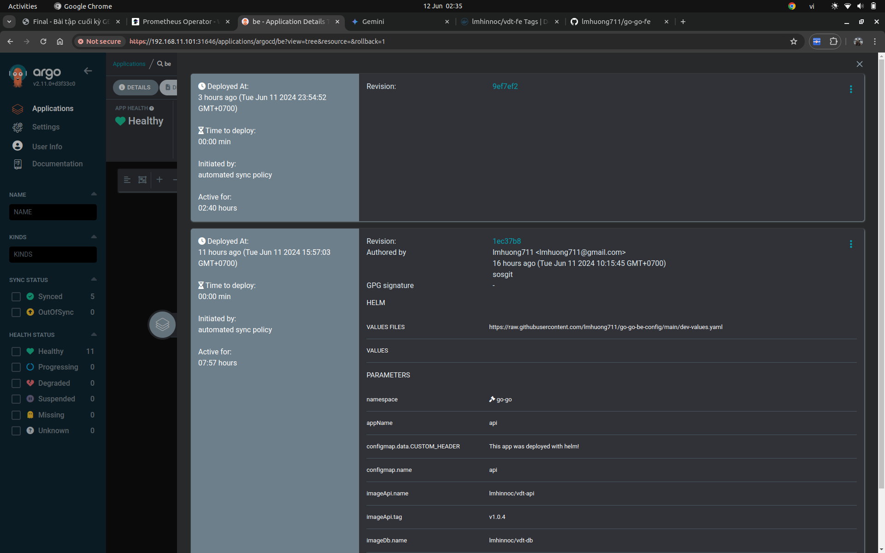

# Continuous Delivery

## 1. Các file setup công cụ của 2 luồng CD

- [go-go-be-db](https://github.com/lmhuong711/go-go-be/blob/main/.github/workflows/build-docker-api.yml)
- [go-go-fe](https://github.com/lmhuong711/go-go-fe/blob/main/.github/workflows/build-docker-api.yml)

## 2. Output log của 2 luồng CD khi tạo tag mới trên repo web và repo api

- [go-go-be/actions/docker-image.yml](https://github.com/lmhuong711/go-go-be/actions/workflows/docker-image.yml)
- [go-go-fe/actions/docker-image.yml](https://github.com/lmhuong711/go-go-fe/actions/workflows/docker-image.yml)

## 3. Demo

- [Docker hub](https://hub.docker.com/repositories/lmhinnoc?search=vdt)
- [go-go-be-config/commits](https://github.com/lmhuong711/go-go-be-config/commits/main/)
- [go-go-fe-config/commits](https://github.com/lmhuong711/go-go-fe-config/commits/main/)
- 
- 