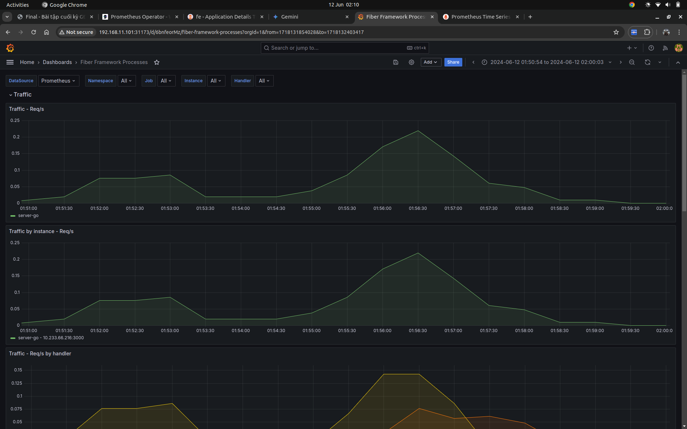

# Monitoring

## 1. Các file setup để triển khai Prometheus lên Kubernetes Cluster

```bash
helm repo add prometheus-community https://prometheus-community.github.io/helm-charts
helm repo update
helm install kube-prometheus-stack -n go-go prometheus-community/kube-prometheus-stack

kubectl get pods -n kube-prometheus-stack
helm list -n go-go
helm uninstall kube-prometheus-stack -n go-go  
```

- [prometheus](https://github.com/lmhuong711/go-go-charts/blob/main/prometheus/)
- [service monitor](https://github.com/lmhuong711/go-go-charts/blob/main/prometheus/metrics.yaml)

## 2. Demo





