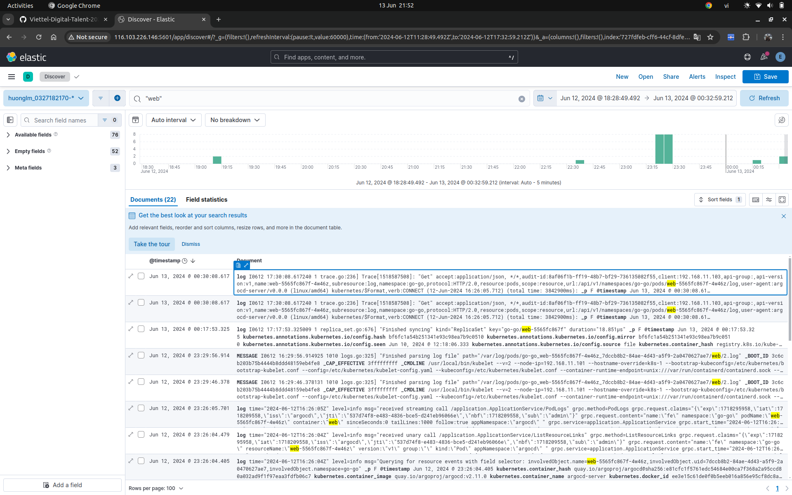

# Logging

- [kibana/config](https://github.com/lmhuong711/go-go-charts/blob/main/kibana/config.yaml)
- CMD
```
helm install fluent-bit fluent/fluent-bit -n go-go
KUBE_EDITOR="nano" kubectl edit cm fluent-bit
kubectl apply -f https://raw.githubusercontent.com/lmhuong711/go-go-charts/main/kibana/config.yaml                                                                                           
```
- Hình ảnh chụp màn hình Kibana kết quả tìm kiếm log của các Service Web và Service API theo url path

[link kibana](http://116.103.226.146:5601/app/discover#/?_g=(filters:!(),refreshInterval:(pause:!t,value:60000),time:(from:'2024-06-12T11:28:49.492Z',to:'2024-06-12T17:32:59.212Z'))&_a=(columns:!(),filters:!(),index:'727fdfeb-cff6-44cf-8dfe-e438f706d9e9',interval:auto,query:(language:kuery,query:%22%2Fapi%2Fv1%2Fstudents%22),sort:!(!('@timestamp',desc)),viewMode:documents))



