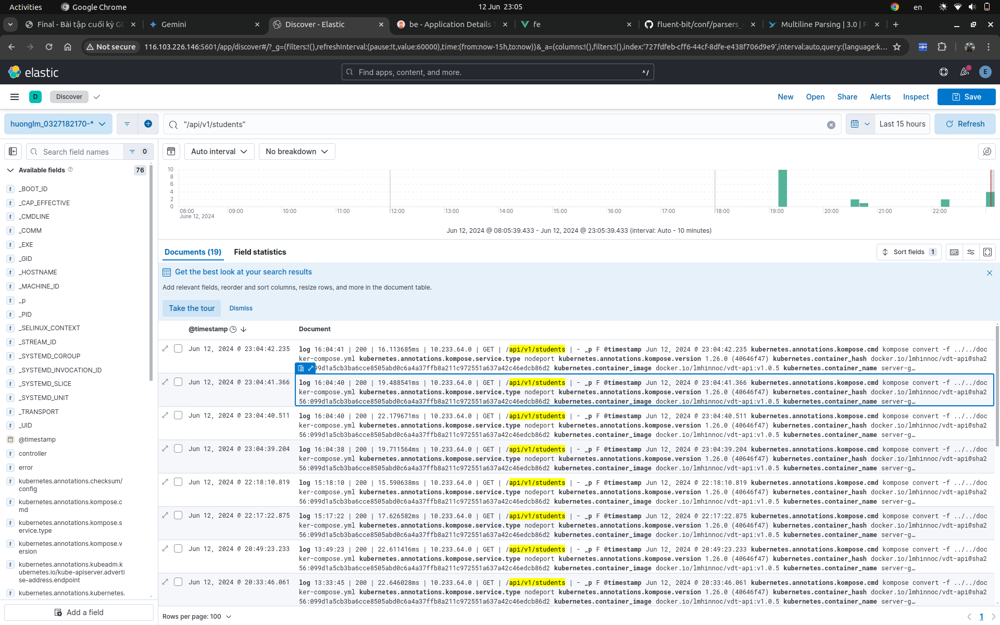
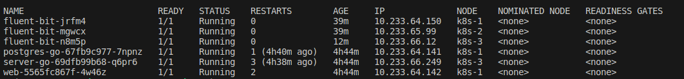

# Logging

- [kibana/config](https://github.com/lmhuong711/go-go-charts/blob/main/kibana/config.yaml)
- CMD
```
helm install fluent-bit fluent/fluent-bit -n go-go
KUBE_EDITOR="nano" kubectl edit cm fluent-bit                                                                                               
```
- Hình ảnh chụp màn hình Kibana kết quả tìm kiếm log của các Service Web và Service API theo url path


