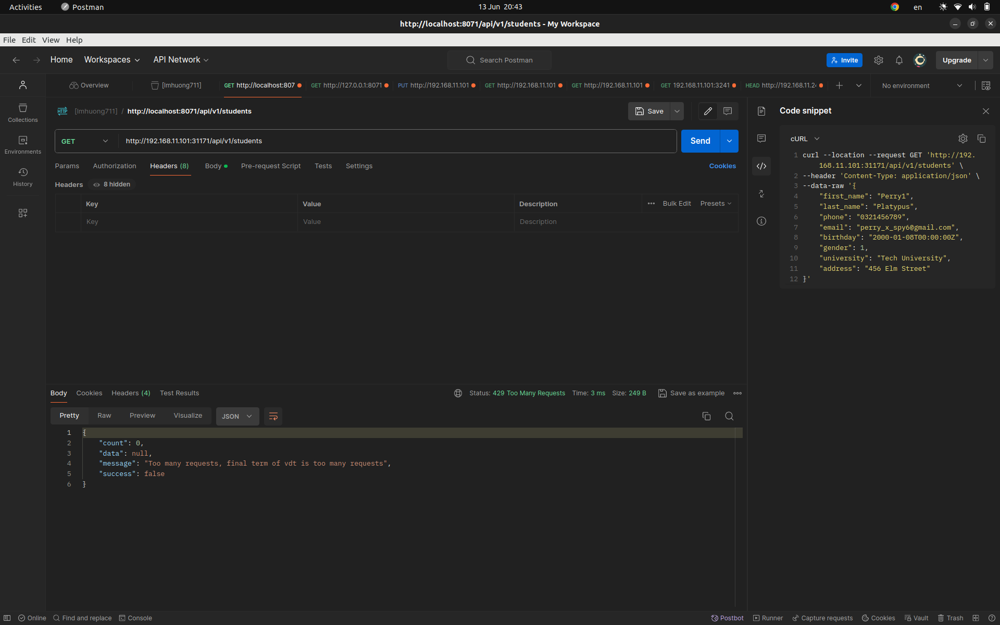

# Giải pháp sử dụng để authen/authorization cho các service

## 1. HAProxy

- Guideline

```bash
// 1. Gen cert and apply cert to k8s
openssl genrsa -out server.key 2048
openssl req -new -key server.key -out server.csr
openssl x509 -req -days 365 -in server.csr -signkey server.key -out server.crt
kubectl create secret tls mycert --key=/home/lmhinnoc/Documents/code/server.key --cert=/home/lmhinnoc/Documents/code/server.crt


// 2. Install haproxy
helm repo add haproxytech https://haproxytech.github.io/helm-charts
helm repo update
helm uninstall haproxy // only if you have installed haproxy before
helm install haproxy-kubernetes-ingress \
haproxytech/kubernetes-ingress \
--create-namespace \
--namespace haproxy-controller \
--set controller.service.type=LoadBalancer \
--set-string "controller.defaultTLSSecret.secret=go-go/mycert"


// 3. Install metallb
// install metallb for external ip in cluster
helm repo add metallb https://metallb.github.io/metallb
helm install metallb metallb/metallb
// get nodes ip range
kubectl get nodes -o jsonpath='{range .items[*]}{.status.addresses[*].address}{"\n"}'
// config metallb file
kubectl apply -f https://raw.githubusercontent.com/lmhuong711/go-go-charts/main/haproxy/metallb.yaml


// 4. Install helm app
helm install be [./go-go-be](https://github.com/lmhuong711/go-go-be/tree/main/argocd)
helm install be [./go-go-fe](https://github.com/lmhuong711/go-go-fe/tree/main/argocd)


// 5. Config host
sudo nano /etc/hosts
192.168.11.240  go-go.com
192.168.11.240  go-go-hehe.com
```

- Demo


## 2. JWT

### 2.1. Solution

- Set up middleware cho việc phân quyền bằng jwt
- Decode token và check role thuộc [user, admin]
- Sử dụng các package để detect auth: golang-jwt/jwt/v5, gofiber/contrib/jwt

### 2.2. Source code

- [middlewares/jwt.go](https://github.com/lmhuong711/go-go-be/blob/main/middlewares/jwt.go)

### 2.3. Output

- 
- 
- 
- 

## 3. Rate limit

### 3.1. Giải pháp: gofiber/limiter

- Gofiber có đưa ra những phương pháp giải quyết trong middleware sau (LimiterMiddleware)
- [limiter#FixedWindow](https://pkg.go.dev/github.com/gofiber/fiber/v2@v2.52.4/middleware/limiter#FixedWindow): Khi người dùng gửi request đến hệ thống, nó sẽ lưu số request đã gửi vào 1 biến count cùng với thời điểm start_time gửi request. Sau đó sẽ lưu count vs timestamp vào 1 hash table (Có thể là Redis, memcached... Mặc định là fiber.Storage). Trong đó key sẽ là user_id và value sẽ chứa json bao gồm số lượng request đã gửi, cùng với thời điểm timestamp.
- [limiter#SlidingWindow](https://pkg.go.dev/github.com/gofiber/fiber/v2@v2.52.4/middleware/limiter#SlidingWindow): Lưu thời gian gửi mỗi request lại, nếu có những request cũ hơn 1 khoảng thời gian (ví dụ 1 phút) sẽ xóa đi. Tính tổng số request vượt quá quy định thì sẽ giới hạn lại. So với Fixed Window thì Sliding Window nhiều memory hơn. 
- Hoặc có thể tự custom lại middleware rate limit.

> Vì status code 429 Too Many Requests phù hợp trả về hơn 409 Conflict nên sử dụng status code 429. Tuy nhiên, có thể config lại status code trả về bằng cách thay đổi [fiber.StatusTooManyRequests](https://github.com/lmhuong711/go-go-be/blob/main/middlewares/rate_limit.go#L17) thành ```fiber.StatusConflict``` 

### 3.2. Demo

- [stress test](https://github.com/lmhuong711/go-go-be/blob/main/stress_test.html)

