# Project giữa kỳ Viettel Digital Talent 2024

Lê Minh Hương

# TOC
{:toc}

## 1. Phát triển một 3-tier web application đơn giản

- Mã nguồn be: https://github.com/lmhuong711/go-go-go/tree/main/go-go-be

- Mã nguồn fe: https://github.com/lmhuong711/go-go-go/tree/main/go-go-fe

- Hiển thị danh sách sinh viên
  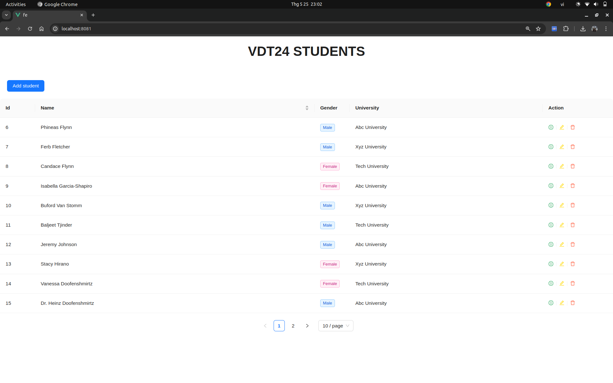

- Thêm sinh viên
  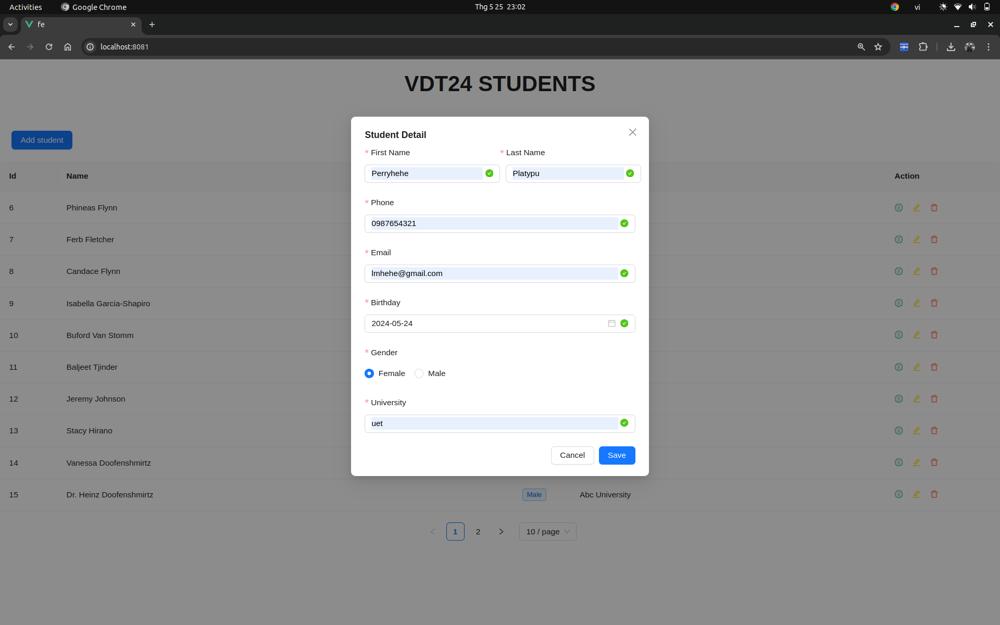

- Lưu thành công
  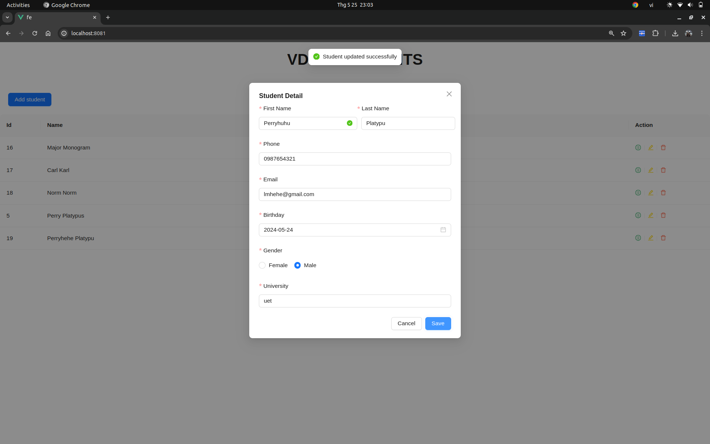

- Xem chi tiết sinh viên
  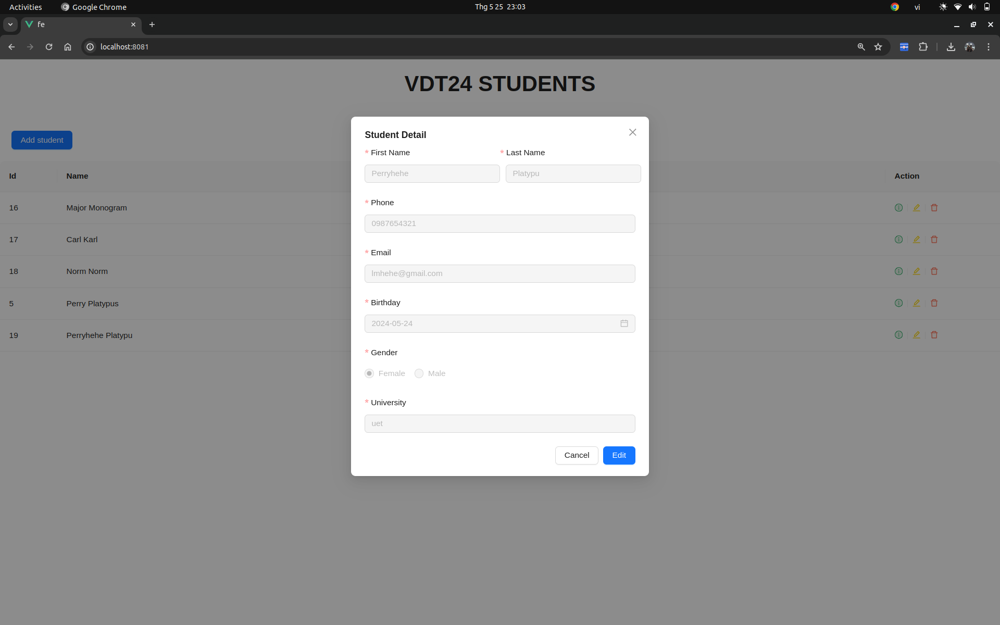

- Cập nhật thông tin sinh viên
  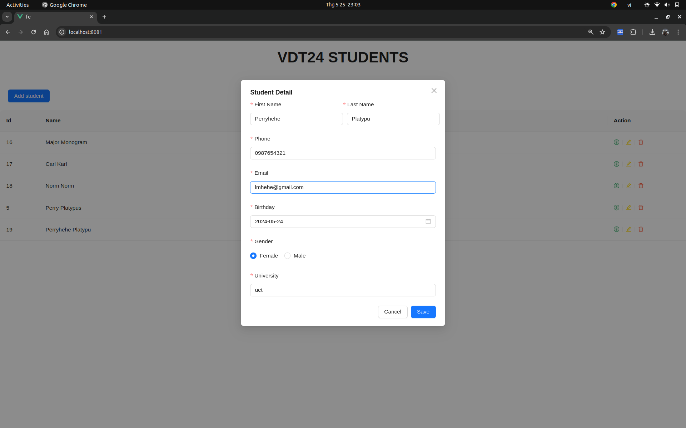

- Xóa sinh viên
  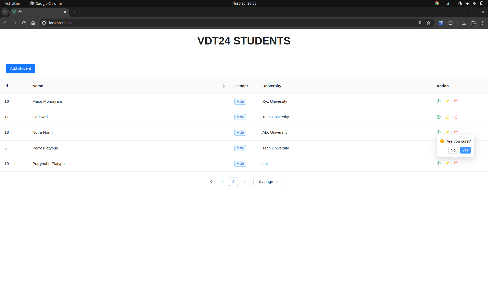

## 2.Triển khai web application sử dụng các DevOps tools & practices

### 2.1. Containerization

- Link docker compose be: https://github.com/lmhuong711/go-go-go/blob/main/go-go-be/docker-compose.yml

- Link docker be server: https://github.com/lmhuong711/go-go-go/blob/main/go-go-be/dockerfile.server

- Link docker be postgres: https://github.com/lmhuong711/go-go-go/blob/main/go-go-be/dockerfile.postgres

- Link docker compose fe: https://github.com/lmhuong711/go-go-go/blob/main/go-go-fe/docker-compose.yml

- Link docker fe: https://github.com/lmhuong711/go-go-go/blob/main/go-go-fe/Dockerfile

- Docker compose be
  

- Docker compose fe
  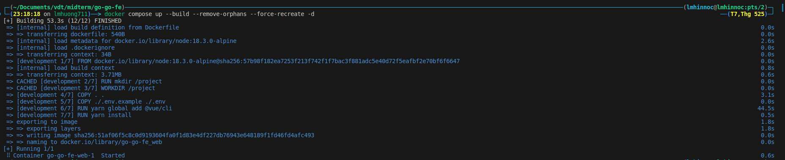

- Docker history db
  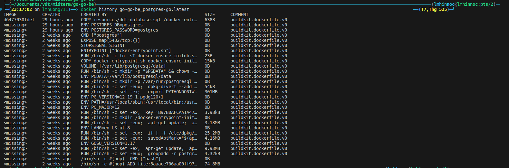

- Docker history server
  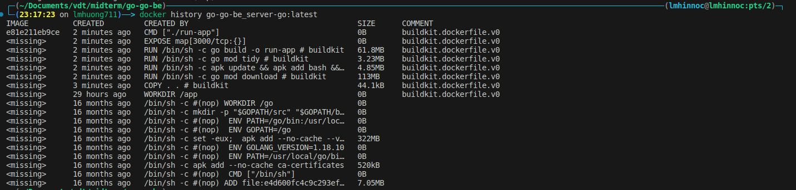

- Docker history fe
  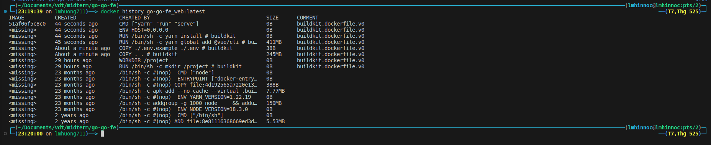

### 2.2. Continuous Integration

- File setup công cụ CI: (https://github.com/lmhuong711/go-go-go/tree/main/.github/workflows)

  Lịch sử chạy CI : (https://github.com/lmhuong711/go-go-go/actions)

- Output log của luồng CI
  
  
- Ảnh demo
  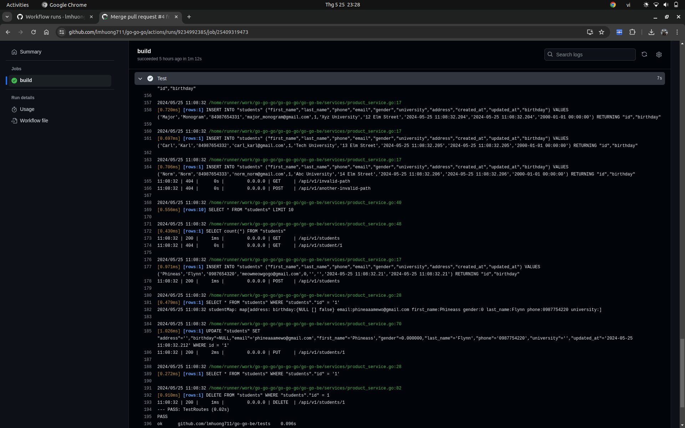
  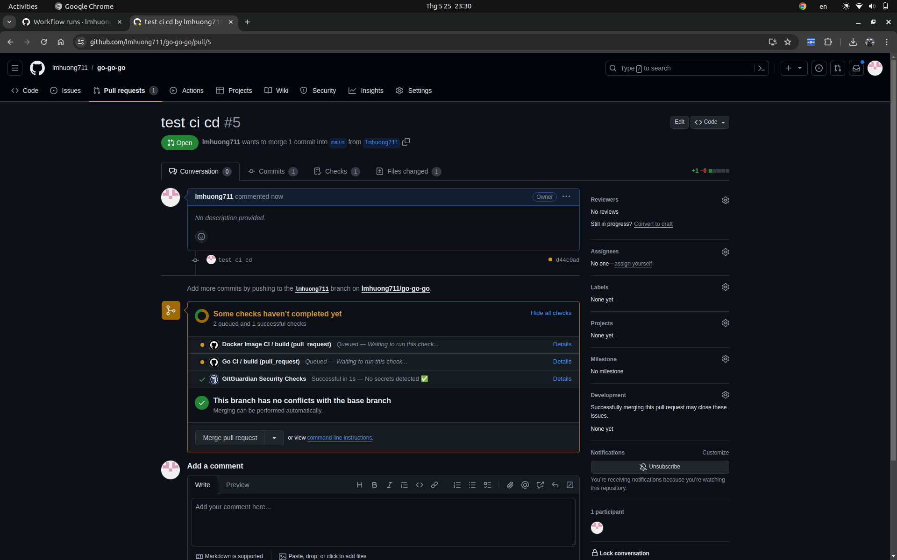
  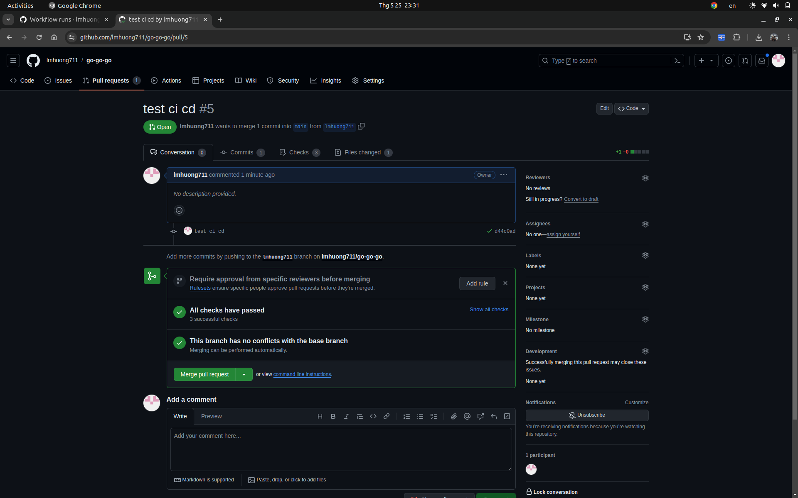

## 3. Automation

### Viết ansible playbooks để triển khai các image docker của các dịch vụ web, api, db, mỗi dịch vụ 1 role

Ví dụ triển khai hệ thống với Ansible + Vagrant: Triển khai lên 2 máy ảo go_go_1 và go_go_2

- inventory.yml (https://github.com/lmhuong711/go-go-go/blob/main/inventory.yml)

- playbook.yml (https://github.com/lmhuong711/go-go-go/blob/main/intro-playbook.yml)

- ansible.cnf (https://github.com/lmhuong711/go-go-go/blob/main/ansible.cfg)

- Chạy Ansible playbook:
  `ansible-playbook [-v] intro-playbook.yml`

- Output log triển khai hệ thống (https://github.com/lmhuong711/go-go-go/blob/main/ansible.log)

- Ảnh demo
  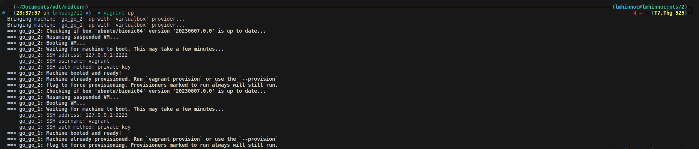
  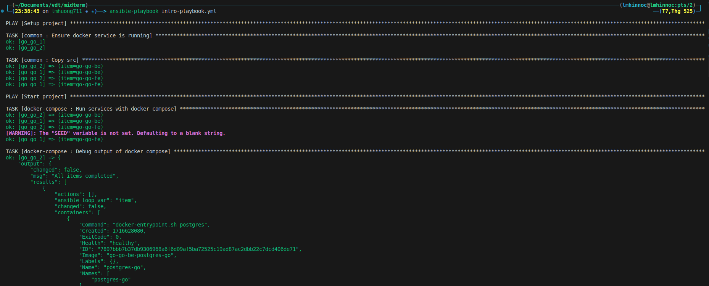
  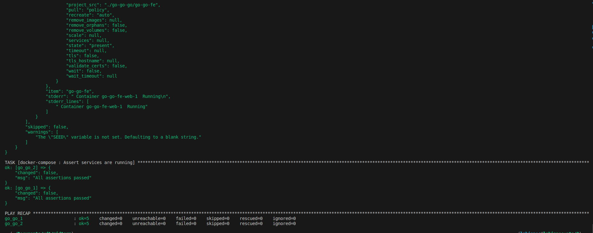
  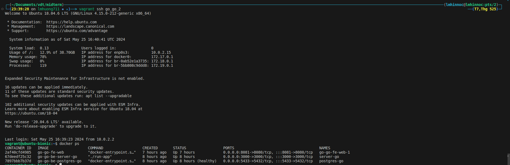
  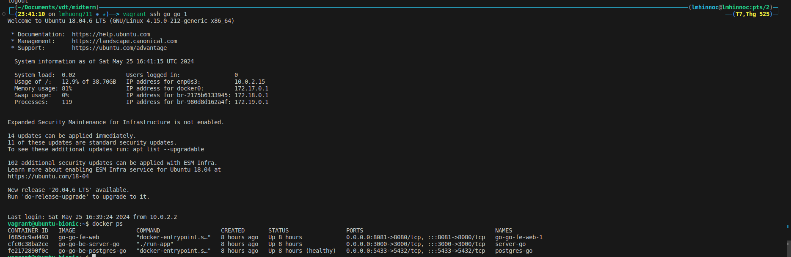
  

## 4. Nghiên cứu sâu về một vấn đề, khái niệm trong các chủ đề đã được học (2đ)

[report](./Prometheus-Kubernetes.pdf)
