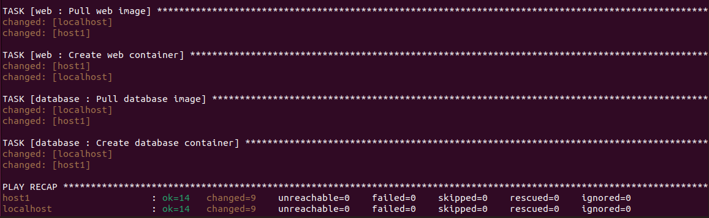

# Bài tập lớn giữa kỳ
- [Bài tập lớn giữa kỳ](#bài-tập-lớn-giữa-kỳ)
  - [Phát triển một 3-tier web application đơn giản (3đ)](#phát-triển-một-3-tier-web-application-đơn-giản-3đ)
      - [Phát triển web application có các chức năng sau](#phát-triển-web-application-có-các-chức-năng-sau)
      - [Thiết kế hệ thống với ba dịch vụ](#thiết-kế-hệ-thống-với-ba-dịch-vụ)
      - [Unit test](#unit-test)
  - [Triển khai web application sử dụng các DevOps tools \& practices](#triển-khai-web-application-sử-dụng-các-devops-tools--practices)
    - [1. Containerization](#1-containerization)
      - [Viết Dockerfile để ở từng repo để đóng gói các dịch vụ trên thành các container image](#viết-dockerfile-để-ở-từng-repo-để-đóng-gói-các-dịch-vụ-trên-thành-các-container-image)
      - [Output câu lệnh build và thông tin docker history của từng image](#output-câu-lệnh-build-và-thông-tin-docker-history-của-từng-image)
    - [2. Continuous Integration](#2-continuous-integration)
      - [File setup công cụ CI](#file-setup-công-cụ-ci)
      - [Output luồng hoạt động CI](#output-luồng-hoạt-động-ci)
      - [Các hình ảnh khác](#các-hình-ảnh-khác)
    - [3. Automation](#3-automation)
      - [Triển khai lên 2 host khác nhau với ansible](#triển-khai-lên-2-host-khác-nhau-với-ansible)
      - [Source code của ansible playbooks](#source-code-của-ansible-playbooks)
      - [File Inventory](#file-inventory)
      - [Output log](#output-log)
      - [Kết quả](#kết-quả)
  - [Nghiên cứu sâu về một vấn đề, khái niệm trong các chủ đề đã được học](#nghiên-cứu-sâu-về-một-vấn-đề-khái-niệm-trong-các-chủ-đề-đã-được-học)
    - [Chủ đề: Docker networking](#chủ-đề-docker-networking)

## Phát triển một 3-tier web application đơn giản (3đ)
#### Phát triển web application có các chức năng sau
- Hiển thị danh sách sinh viên tham gia chương trình VDT2024 dưới dạng bảng với các thông tin sau: Họ và tên, Giới tính, trường đang theo học.\
Giao diện chính

- Cho phép xem chi tiết/thêm/xóa/cập nhật thông tin sinh viên.\
Thêm sinh viên\

Xóa sinh viên\

Xem chi tiết/cập nhật sinh viên\

#### Thiết kế hệ thống với ba dịch vụ
- web: HTML, JS, CSS
- api: Python Flask
- database: MongoDB
#### Unit test
`unit_test.py` 
```python
import unittest
import requests

URL = "http://localhost:9999"
class AppTestCase(unittest.TestCase):
    def test_list(self):
        response = requests.get(f"{URL}/api/list")
        self.assertEqual(response.status_code, 200)
    def test_get(self):
        response = requests.get(f"{URL}/api/get/1")
        self.assertEqual(response.status_code, 200)

    def test_create(self):
        data = {
            "_id": "500",
            "Họ và tên": "Nguyen van x",
            "Năm": "2002",
            "Giới tính": "Nam",
            "Trường": "Dai hoc a",
            "Quốc gia": "VN"
        }
        response = requests.post(f"{URL}/api/create", json=data)
        self.assertEqual(response.status_code, 200)

        response = requests.get(f"{URL}/api/get/500")
        self.assertEqual(response.status_code, 200)
        requests.delete(f"{URL}/api/delete/500")
    def test_delete(self):
        data = {
            "_id": "502",
            "Họ và tên": "Nguyen van x",
            "Năm": "2002",
            "Giới tính": "Nam",
            "Trường": "Dai hoc a",
            "Quốc gia": "VN"
        }
        requests.post(f"{URL}/api/create", json=data)

        response = requests.delete(f"{URL}/api/delete/502")
        self.assertEqual(response.status_code, 200)


    def test_update(self):
        data = {
            "_id": "501",
            "Họ và tên": "Nguyen van x",
            "Năm": "2002",
            "Giới tính": "Nam",
            "Trường": "Dai hoc a",
            "Quốc gia": "VN"
        }
        requests.post(f"{URL}/api/create", json=data)

        updated_data = {
            "_id":"501",
            "Họ và tên": "Nguyen thi x",
            "Năm": "2005",
            "Giới tính": "Nu",
            "Trường": "Dai hoc b",
            "Quốc gia": "Lao"
        }
        response = requests.put(f"{URL}/api/update", json=updated_data)
        self.assertEqual(response.status_code, 200)

        response = requests.get(f"{URL}/api/get/501")
        self.assertEqual(response.status_code, 200)
        student = response.json()
        self.assertEqual(student["Họ và tên"], "Nguyen thi x")
        self.assertEqual(student["Năm"], "2005")
        self.assertEqual(student["Giới tính"], "Nu")
        self.assertEqual(student["Trường"], "Dai hoc b")
        self.assertEqual(student["Quốc gia"], "Lao")
        requests.delete(f"{URL}/api/delete/500")

if __name__ == '__main__':
    unittest.main()
```
Output:

- Source code
    - [api + db](https://github.com/ngo-bang/api)
    - [web](https://github.com/ngo-bang/web)
## Triển khai web application sử dụng các DevOps tools & practices
### 1. Containerization
#### Viết Dockerfile để ở từng repo để đóng gói các dịch vụ trên thành các container image
- Dockerfile Api:
```Dockerfile
FROM python:3.9-alpine as builder
WORKDIR /app
COPY requirements.txt /app
RUN pip3 install --no-cache-dir -r requirements.txt

FROM builder as dev-envs
WORKDIR /src
COPY --from=builder /app /src
COPY . .
EXPOSE 9999
CMD ["python", "-u", "app.py"]
```
- Dockerfile database
```Dockerfile
FROM mongo:7.0.9
COPY ./init-db.js /docker-entrypoint-initdb.d/init-db.js
```
- Dockerfile web 
```Dockerfile
FROM nginx:1.26.0-alpine
COPY ./nginx.conf /etc/nginx/conf.d/default.conf
COPY ./html/ /usr/share/nginx/html
EXPOSE 81
```
#### Output câu lệnh build và thông tin docker history của từng image
- Image api\
Output câu lệnh build\

Docker history\

- Image database\
Output câu lệnh build\

Docker history \

- Image web\
Output câu lệnh build\

Docker history \

### 2. Continuous Integration
#### File setup công cụ CI
```yml
name: Continuous Integration 

on:
  push:
    branches: [ "master" ]
  pull_request:
    branches: [ "*" ]

jobs:
  build:
    runs-on: ubuntu-latest
          
    steps:
    - uses: actions/checkout@v4
    - name: setup container 
      run: |
        docker network create --subnet=172.18.0.0/16 vdt
        docker build -t api api
        docker build -t database db
        docker run -d -p 9999:9999 --name api --network vdt api
        docker run -d -p 27017:27017 --name database --network vdt --ip 172.18.0.20 database
    - name: Test
      run: |
        python api/unit_test.py
```
#### Output luồng hoạt động CI
[Github Action](https://github.com/ngo-bang/api/actions/runs/9245244686/job/25431453054)

#### Các hình ảnh khác


### 3. Automation
#### Triển khai lên 2 host khác nhau với ansible
#### [Source code của ansible playbooks](https://github.com/ngo-bang/ansible)
#### File Inventory
`inventory.yml`
```yml
all:
  hosts:
    localhost:
      ansible_connection: local
      ansible_python_interpreter: /usr/bin/python3
      ansible_become_user: root
      ansible_become_password: bang

    host1:
      ansible_host: 192.168.86.129
      ansible_connection: ssh
      ansible_user: test
      ansible_ssh_pass: test
      ansible_become: yes 
      ansible_become_method: sudo
      ansible_become_pass: test
```
#### Output log


#### Kết quả


## Nghiên cứu sâu về một vấn đề, khái niệm trong các chủ đề đã được học
### Chủ đề: [Docker networking](<research/Docker networking.md>)