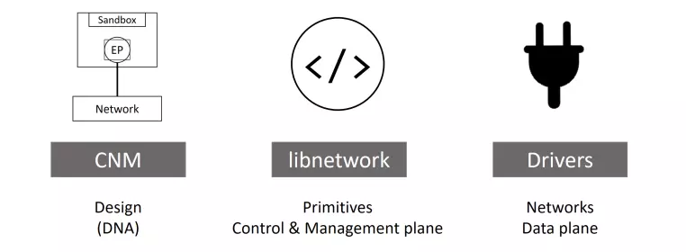
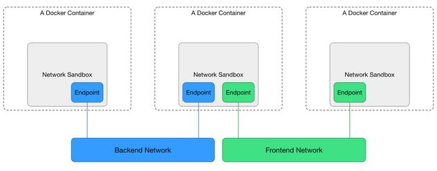
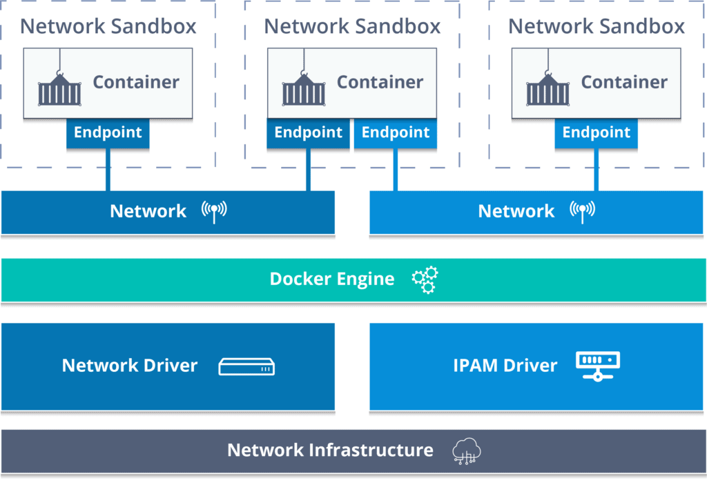
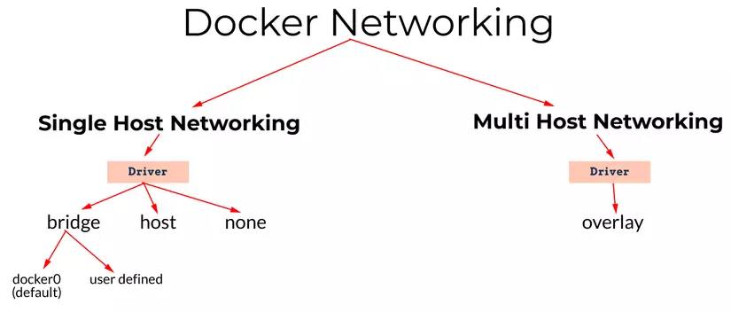
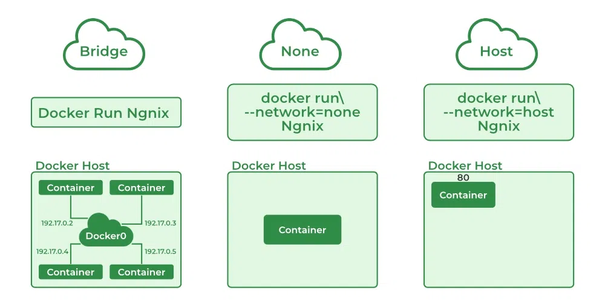

# Docker networking
## Giới thiệu
Một trong những điểm mạnh của Docker đó là tính đóng gói, với Docker chúng ta có thể gói gọn một ứng dụng vào một container thông qua việc build một image. Đằng sau đó là rất nhiều thứ cấu thành nên tính đóng gói này, một trong số đó là Docker network.\
Docker network quản lý, cung cấp các tùy chọn kết nối giữa các container, với Docker host và với các tiến trình khác qua internet.
## Các thành phần trong Docker networking
Docker networking được cấu thành từ ba thành phần chính quan trọng nhất:
1. **Container network model (CNM)**: là một hướng dẫn thiết kế chi tiết hay có thể coi là một chuẩn thiết kế networking cho hệ thống container, nó định nghĩa những block cơ bản cần thiết để cấu thành nên Docker network
2. **libnetwork**: là một bản implementation của CNM, và được sử dụng bởi Docker, được viết bằng ngôn ngữ Go và implement đầy đủ những thành phần cốt lõi của CNM.
3. **Các drivers**: là các bản implement custom của mô hình CNM cho các mô hình mạng khác nhau, giúp chúng ta ứng dụng trong từng trường hợp sử dụng khác nhau.


## Mô hình mạng
Docker sử dụng Container Network Model với 3 thành phần chính:
- **Sandbox**: chứa các config của một container network stack. Điều này bao gồm việc quản lý container interface, bảng định tuyến (routing table) và cài đặt DNS.Sandbox có thể có nhiều endpoint vào từ nhiều network.
- **Endpoint**: là một virtual network interface, cũng giống như các network interface hoạt động trên máy tính của chúng ta, nhiệm vụ của nó là tạo kết nối mạng. Trong thiết kế của CNM, nhiệm vụ của các endpoint là connect các sandbox đến network.
- **Network**: tập hợp các endpoint và chúng được kết nối với nhau.


Ngoài ra Container Network Model còn cung cấp cho ta hai kiểu interface để có thể nối và mở nhằm thêm chức năng, hiển thị hoặc kiểm soát network:
- **Network Drivers**: Docker Network Drivers cung cấp implement giúp cho network hoạt động. Nhiều Network Drivers có thể được sử dụng đồng thời trên Docker Engine hoặc Cluster cụ thể. Nhưng chỉ có thể khởi tạo thông qua một Network Drivers duy nhất.
- **IPAM Drivers**: là drivers quản lý địa chỉ IP gốc cung cấp subnet hoặc địa chỉ IP mặc định cho network và endpoint. Địa chỉ IP cũng có thể được gán thủ công thông qua các lệnh tạo network, container và service. IPAM Drivers cũng tồn tại và cung cấp tích hợp cho các công cụ IPAM hiện có.


## Các loại Network Driver của Docker

1. `Host`\
Xóa bỏ sự cô lập về mạng giữa container và docker host, container sẽ sử dụng trực tiêp mạng của host. Các container có thể sử dụng tất cả các interface trên host. Sử dụng địa chỉ IP và port của host cho ứng dụng trong container. Vì vậy ứng dụng chạy trên container hoạt động tương tự như khi đuợc chạy trên host.
1. `Bridge`\
Các container trên cùng 1 bridge có thể kết nối với nhau và kết nối với host, cách ly với các container không đuợc kết nối với bridge đó.Các container trên các bridge khác nhau không thể kết nối trực tiếp với nhau.\
Bridge sử dụng một dải ip được cấp ngẫu nhiên hoặc tự thiết lập.\
Bridge là network driver mặc định của Docker. Nếu không chỉ định driver thì bridge sẽ là driver mặc định khi khởi tạo.Bridge đáp ứng hầu hết các usecase nếu triển khai các container trên cùng một host
1. `Overlay`\
Overlay network tạo mạng phân tán giữa các Docker deamon host, cho phép các container giữa các host có thể kết nối với nhau\
Nhờ Overlay network, không cần các công việc thiết lập routing giữa các container thông qua hệ điều hành. Overlay network tạo nên một lớp phủ trên mạng của máy chủ và cho phép container kết nối đến (bao gồm cả các cụm containers) để kết nối một cách bảo mật. Docker đảm bảo định tuyến các gói tin đến và đi đúng container đích.
1. `macvlan`\
Mạng Macvlan cho phép chúng ta gán địa chỉ MAC cho container, điều này làm cho mỗi container như là một thiết bị vật lý trong mạng. Docker daemon định tuyến truy cập tới container bởi địa chỉ MAC. Sử dụng driver macvlan là lựa chon tốt khi các ứng dụng khác cần phải connect đến theo địa chỉ vật lý hơn là thông qua các lớp mạng của máy chủ.
1. `ipvlan`\
Chó phép nguời dùng kiểm soát hoàn toàn địa chỉ IPv4 và IPv6\
IPVlan tuơng tự với MacVlan nhưng khác nhau ở điểm các endpoint có cùng địa chỉ MAC. IPVlan hỗ trợ L2 và L3 mode.\
Với IPVlan L2 Mode, Mỗi endpoint sử dụng chung địa chỉ MAC nhưng khác địa chỉ IP.\
Với IPVlan L3 Mode, Các packet được route giữa các endpoint. Vì vậy ở mode này cho ta sự mở rộng tốt hơn.
1. `none`\
Tắt tất cả kết nối mạng. Cô lập hoàn toàn container với docker host và các container khác.Container sẽ không được gán địa chỉ IP, vì thế, chúng không thể đuợc truy cập từ bên ngoài. Sử dụng cho những container không cần đến mạng.


## Libnetwork
`libnetwork` là một bản implementation của CNM, nó là một open-source viết bằng Go, cross-platform và được sử dụng bởi Docker.

Từ thời kì đầu của Docker, tất cả phần implement của CNM được nằm trong docker daemon, nhưng cho tới khi nó trở nên quá to và không tuân theo quy tắc thiết kế module theo chuẩn Unix, nó đã được tách ra thành một thư viện riêng biệt và dó là cách mà `libnetwork` được hình thành.

Ngoài việc implement các thành phần có trong CNM, nó còn có các chức năng khác như service discovery, ingress-base container load balancing (cơ chế load balancing trong docker swarm), network control plane, management plane (giúp quản lý network trên docker host).
## Cách Docker Network hoạt động
Docker hoạt động dựa trên network stack của host. Trên Linux, Docker sử dụng `iptables` rules để chuyển hướng traffic cho các container và để tạo ra sự cô lập giữa các Docker network và mạng của host.

IPtables là công cụ loc gói tin trong Linux, cho phép thiết lập các rule để kiểm soát và điều hướng traffic qua network stack của host. Docker thêm các rule vào `iptables` để chuyển hướng trafic đến ứng dụng trên các container.

Mỗi Docker container có network namespace riêng. Container tạo các network interface ảo trên host để có thể kết nối với bên ngoài thông qua mạng của host.
## Docker Networking vs. VM Networking
Mô hình của Docker network cung cấp môi truờng cô lập ảo cho các container, đáp ứng các use case phổ biến và có một số điểm khác với các mạng ảo được tạo ra bởi các máy ảo truyền thống.

Trong khi Docker tạo ra sự cô lập trên mạng bằng cách sử dụng network namespace và `iptables` rules, các máy ảo thường tạo ra một network stack cho mỗi máy ảo. Ngoài ra, bridge của Docker tương tự với các mạng dựa trên NAT của hầu hết máy ảo.

Thông thường, máy ảo hỗ trợ nhiều cấu trúc mạng hơn Docker. Nhưng Docker đã có các công cụ để tạo ra các giải pháp mạng máy tính cần thiết.
## Sử dụng Docker Network
### Tạo một Docker Network
```
$ docker network create [OPTIONS] NETWORK
$ docker network create -d bridge my-bridge-network
```
Trong đó options `-d` là driver, để tạo mạng overlay thì có thể dùng `-d overlay` Ngoài ra thì còn nhiều options để tùy vào mức độ custom mà chúng ta có thể thêm vào. Dưới đây là 1 số options:
```
--gateway: Địa chỉ Ip của Gateway (IPv4 hay IPv6) cho mạng con
--ip-range: Xác định một dải IPs sử dụng trong mạng
--internal: Hạn chế truy cập từ bên ngoài vào mạng
--ipv6: Bật IPv6
--subnet: Chọn subnet
```
**Ví dụ**: Khởi tạo mạng với driver bridge có tên là vdt, subnet 10.11.0.0/16, ip gateway là 10.11.0.1
```
$ docker network create -d bridge --subnet=10.11.0.0/16 --gateway=10.11.0.1  vdt
```
```
$ docker network inspect vdt
[
    {
        "Name": "vdt",
        "Id": "f3f693f2a492697a9dd92771bcdf794f23f58e5752a70674bf79a7f239e14961",
        "Created": "2024-05-27T21:16:39.3470722+07:00",
        "Scope": "local",
        "Driver": "bridge",
        "EnableIPv6": false,
        "IPAM": {
            "Driver": "default",
            "Options": {},
            "Config": [
                {
                    "Subnet": "10.11.0.0/16",
                    "Gateway": "10.11.0.1"
                }
            ]
        },
        "Internal": false,
        "Attachable": false,
        "Ingress": false,
        "ConfigFrom": {
            "Network": ""
        },
        "ConfigOnly": false,
        "Containers": {},
        "Options": {},
        "Labels": {}
    }
]
```
### Chạy một container trên một network
Sử dụng flag `--network` cùng với lệnh `docker run` để chạy một container trên network đó
```
$ docker run -d --name container --network vdt image
```
Hoặc có thể sử dụng `docker network connect` để kết nối container vào network đó
```
$ docker network connect vdt container
```
### Sử dụng Host network
Container sẽ sử dụng trực tiêp mạng của host. Có thể sử dụng Host network bằng cách kết nối container với network `host`
```
$ docker run -d --name nginx --network host nginx:latest
```
Nginx mặc định ở port 80. Vì container đang sử dụng mạng trực tiếp của host nên có thể truy cập vào nginx từ host bằng địa chỉ `localhost:80`
```
$ curl localhost:80
<!DOCTYPE html>
<html>
<head>
<title>Welcome to nginx!</title>
<style>
html { color-scheme: light dark; }
body { width: 35em; margin: 0 auto;
font-family: Tahoma, Verdana, Arial, sans-serif; }
</style>
</head>
<body>
<h1>Welcome to nginx!</h1>
<p>If you see this page, the nginx web server is successfully installed and
working. Further configuration is required.</p>

<p>For online documentation and support please refer to
<a href="http://nginx.org/">nginx.org</a>.<br/>
Commercial support is available at
<a href="http://nginx.com/">nginx.com</a>.</p>

<p><em>Thank you for using nginx.</em></p>
</body>
</html>
```
### Ngắt kêt nối container khỏi network
Docker cho phép người dùng quản lý các kết nối giữa container và network mà không cần khởi động lại container
```
docker network disconnect vdt container
```
### Quản lý network
Dùng lệnh `docker network ls` để xem danh sách các network
```
$ docker network ls
NETWORK ID     NAME            DRIVER    SCOPE
e7139df0fb72   bridge          bridge    local
f87594380cd3   host            host      local
84e75e87ce15   none            null      local
2b31d4c410d8   vdt             bridge    local
```
Để xóa một network, ngắt kết nối hoặc dừng tât cả container đang kết nối với network đó, sau đó sử dụng lệnh `docker network rm` với id hoặc tên của network
```
$ docker network rm vdt
```
Lệnh `docker network prune` sẽ xóa tất cả những network không đuợc sử dụng
```
$ docker network prune
```
### Sử dụng network qua docker-compose
Khi dùng docker-compose và không khai báo network, docker sẽ tự động khởi tạo một mạng dành cho app và driver sẽ là bridge.
```
$ docker-compose up
Creating network "api_default" with the default driver
```
Lúc này kiểm tra danh sách network sẽ có network mà docker-compose vừa tạo
```
$ docker network ls
NETWORK ID     NAME            DRIVER    SCOPE
e7139df0fb72   bridge          bridge    local
f87594380cd3   host            host      local
f3f693f2a492   api_default   bridge    local
84e75e87ce15   none            null      local
2b31d4c410d8   vdt             bridge    local
```
Và khi dừng app thì docker sẽ xóa mạng này
```
$ docker-compose down
Stopping api_api_1       ... done
Stopping api_db_1        ... done
Removing api_api_1       ... done
Removing api_db_1        ... done
Removing network api_default
```
### Tham khảo
1. https://spacelift.io/blog/docker-networking
2. Docker docs (https://docs.docker.com/network/)