# Bài tập lớn cuối kỳ chương trình VDT 2024 lĩnh vực Cloud - GĐ1

> Note: Bài tập của em được thực hiện trên cụm Lab Local.
> Thông tin tài nguyên như sau:
>  - VM1: là Master/ Control-plane node, IP address: 192.168.122.21, tên là node1
>  - VM2: là Worker node, IP address: 192.168.122.22, tên là node2
>  - VM3: là LoadBalancer (trong bài Security)
 
## Triển khai Kubernetes (1 điểm)

### Yêu cầu:

**Yêu cầu 1:**
- Triển khai được Kubernetes thông qua công cụ minikube trên 1 node: 0.5 điểm hoặc
- Triển khai được Kubernetes thông qua công cụ kubeadm hoặc kubespray lên 1 master node VM + 1 worker node VM: 1 điểm

**Output:**

- Triển khai cụm Kubernetes 1 node sử dụng minikube:
  
  - Tài liệu cài đặt: 
    - Tài liệu tham khảo: [minikube installation](https://minikube.sigs.k8s.io/docs/start/?arch=%2Flinux%2Fx86-64%2Fstable%2Fbinary+download)

    - File cấu hình: ở đây em cài đặt mặc định theo hướng dẫn ở trên, không custom gì thêm.

  - Log của câu lệnh kiểm tra hệ thống: [Log_file_text](./Log_file/1-k8s/check-kubernetes-log.txt)
    
    - ```kubect get nodes -o wide```: 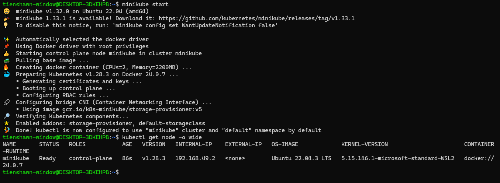

    - ```kubectl get pod -o wide```: 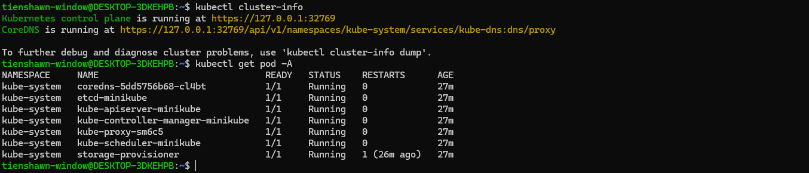

- Triển khai cụm Kubernetes gồm 1 Master node và 1 Worker node VM: 

  - Tài liệu cài đặt: 
    - Tài liệu tham khảo: [Deploy a production-ready cluster using Kubespray](https://github.com/kubernetes-sigs/kubespray)

    - File cấu hình:
      - Ở đây em có sửa lại các thông số trong file [host.yaml](./manifest/1-k8s/host.yaml). Các thông số còn lại để mặc định như theo tài liệu cài đặt.

  - Log của câu lệnh kiểm tra hệ thống: [Log_file_text](./Log_file/1-k8s/check-kubernetes-log.txt)

    - ```kubectl get node -o wide```: 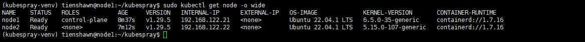

    - ```kubectl get pod -o wide```: 

    - List all resources: 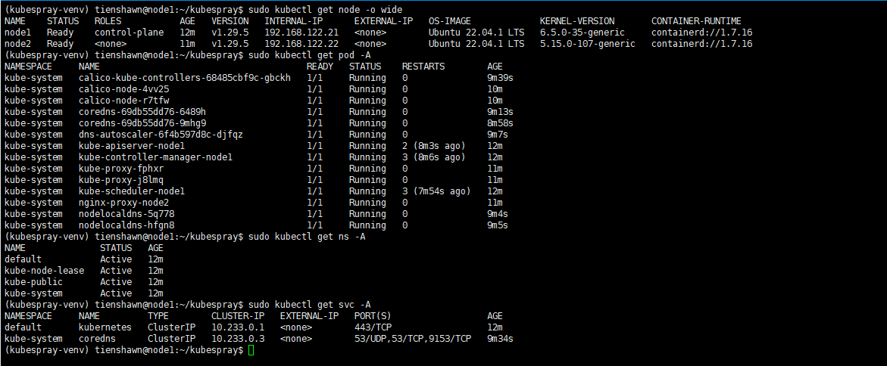


## Triển khai web application sử dụng các DevOps tools & practices

### K8S Helm Chart (1.5đ)

**Yêu cầu 1:**
- Cài đặt ArgoCD lên Kubernetes Cluster, expose được ArgoCD qua NodePort

- Trong trường hợp sử dụng cụm Lab trên Viettel Cloud, cài đặt Loadbalancer lên Bastion Node thông qua công cụ docker-compose, expose port ArgoCD ra môi trường public thông qua một trong số các port đã được cấp cho từng sinh viên


**Output 1:**

- File manifests sử dụng để triển khai ArgoCD lên K8S Cluster:

  - File manifest cài đặt Argocd: [argocd_manifest](https://raw.githubusercontent.com/argoproj/argo-cd/stable/manifests/install.yaml)

  > Ở đây em cài đặt mặc định theo tài liệu hướng dẫn

  - Expose ArgoCD qua NodePort: em đã sử dụng câu lệnh sau 

  ```
  kubectl patch svc argocd-server -n argocd -p \
  '{"spec": {"type": "NodePort", "ports": [{"name": "http", "nodePort": 30080, "port": 80, "protocol": "TCP", "targetPort": 8080}, {"name": "https","nodePort": 30443, "port": 443, "protocol": "TCP", "targetPort": 8080}]}}'
  ``` 
  
- Ảnh chụp giao diện màn hình hệ thống ArgoCD khi truy cập qua trình duyệt:
  
  - Giao diện ArgoCD khi đăng nhập: 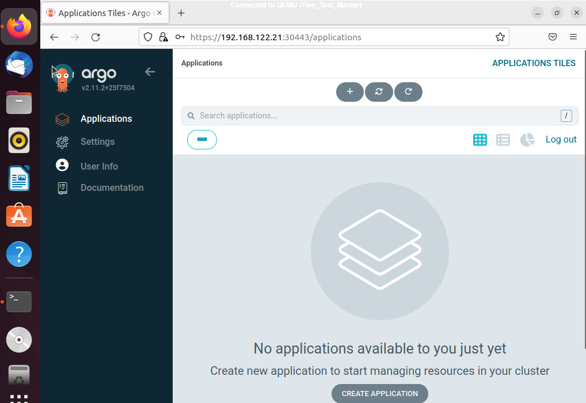


**Yêu cầu 2:**
- Viết 2 Helm Chart cho web Deployment và api Deployment, để vào 1 folder riêng trong repo web và repo api

- Tạo 2 Repo Config cho web và api, trong các repo này chứa các file values.yaml với nội dung của cá file values.yaml là các config cần thiết để chạy web và api trên k8s bằng Helm Chart

- Sử dụng tính năng multiple sources của ArgoCD để triển khai các service web và api service lên K8S Cluster theo hướng dẫn của ArgoCD, expose các service này dưới dạng NodePort Multiple Sources for an Application - Argo CD - Declarative GitOps CD for Kubernetes

- Trong trường hợp sử dụng cụm Lab trên Viettel Cloud, cài đặt Loadbalancer lên Bastion Node thông qua công cụ docker-compose, expose 2 port của Web ra môi trường public thông qua một trong số các port đã được cấp cho từng sinh viên


**Output 2:**
- Các Helm Chart sử dụng để triển khai web Deployment và api Deployment lên K8S Cluster: 

  - Helm Chart cho web Deployment: [Link-Github-web-HelmChart](https://github.com/tienshawn/student_web/tree/main/helm-chart-web)

  - Helm Chart cho api Deployment: [Link-Github-api-HelmChart](https://github.com/tienshawn/student_api/tree/main/helm-chart-api)

- Các file ***values.yaml*** trong 2 config repo của của web service và api service:

  - File values của web service: [Link-Github-web-values](https://github.com/tienshawn/helm-web-values/blob/main/values.yaml)

  - File values của api service: [Link-Github-api-values](https://github.com/tienshawn/helm-api-values/blob/main/values.yaml)

- Manifest của ArgoCD Application: [Multisource-application-manifest](./manifest/2-helm/argocd/multi-source.yaml)

- Ảnh chụp giao diện màn hình hệ thống ArgoCD trên trình duyệt: 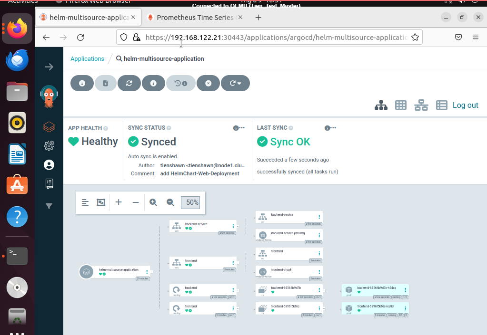

- Ảnh chụp giao diện màn hình trình duyệt khi truy cập vào Web URL, API URL
  - Web URL: 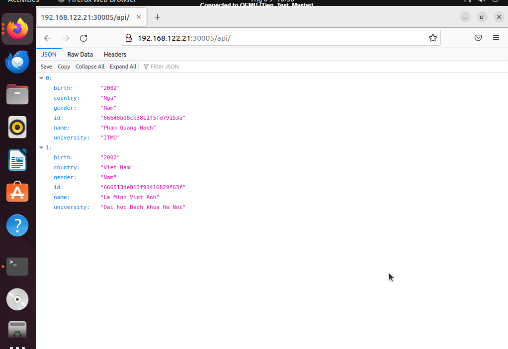

  - API URL: 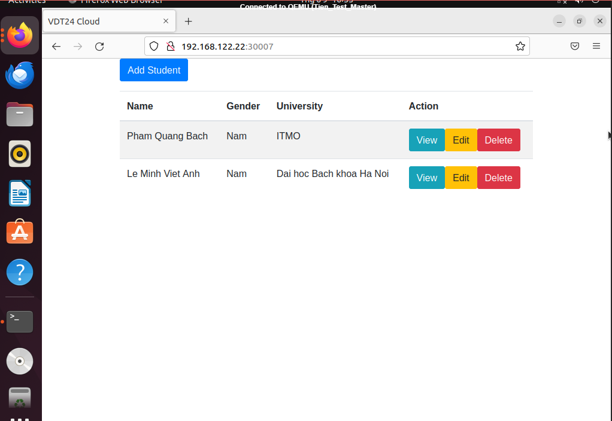


### Continuous Delivery

**Yêu cầu:**
- Viết 2 luồng CD cho 2 repo web và api, khi có 1 tag mới được tạo ra trên trên 1 trong 2 repo này thì luồng deploy tương ứng của repo đó thực hiện các công việc sau:
  - Build docker image với image tag là tag name đã được tạo ra trên gitlab và push docker image sau khi build xong lên Docker Hub

  - Sửa giá trị Image version trong file ***values.yaml*** trong config repo và push thay đổi lên config repo. Tham khảo: https://stackoverflow.com/a/72696837

- Cấu hình ArgoCD tự động triển khai lại web Deployment và api Deployment khi có sự thay đổi trên config repo.


**Output:**

- Các file setup công cụ của 2 luồng CD:
> Hai luồng CD dưới đây đều thực hiện build docker image với image tag được tạo trên Repo Gitlab, sau đó thay đổi giá trị Image version tương ứng lưu trong repo của file ***values.yaml*** trên Github.
> Các biến giá trị liên quan đến xác thực, login được lưu trong mục Variable trong phần CI/CD của Repo trên Gitlab

  - File setup luồng CD web: [CD-web-file](./manifest/3-cd/web-gitlab-ci.yaml)

  - File setup luồng CD backend: [CD-api-file](./manifest/3-cd/api-gitlab-ci.yaml)

- Output log của 2 luồng CD khi tạo tag mới trên repo web và repo api: 
  > Đối với mỗi luồng CD em định nghĩa 2 stage là build (dùng để build image và đẩy lên Dockerhub Registry) cùng với update_helm_chart (dùng để update image version trong file ***values.yaml*** ở Repo Github)

  - Output log của luồng CD web: [log-web-cd](./Log_file/3-cd/web/)
  
    - Ảnh chạy thành công luồng CD, với v1.0-cd là tag được tạo trước đó: 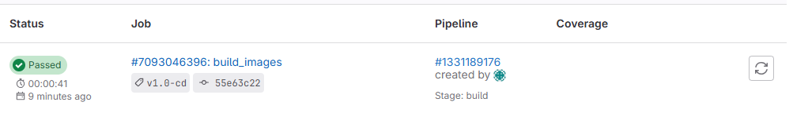

  - Output log của luồng CD api: [Log-CD-api](./Log_file/3-cd/api/)

- Hình ảnh app triển khai argoCD, hình ảnh diff khi argoCD phát hiện thay đổi ở config repo: 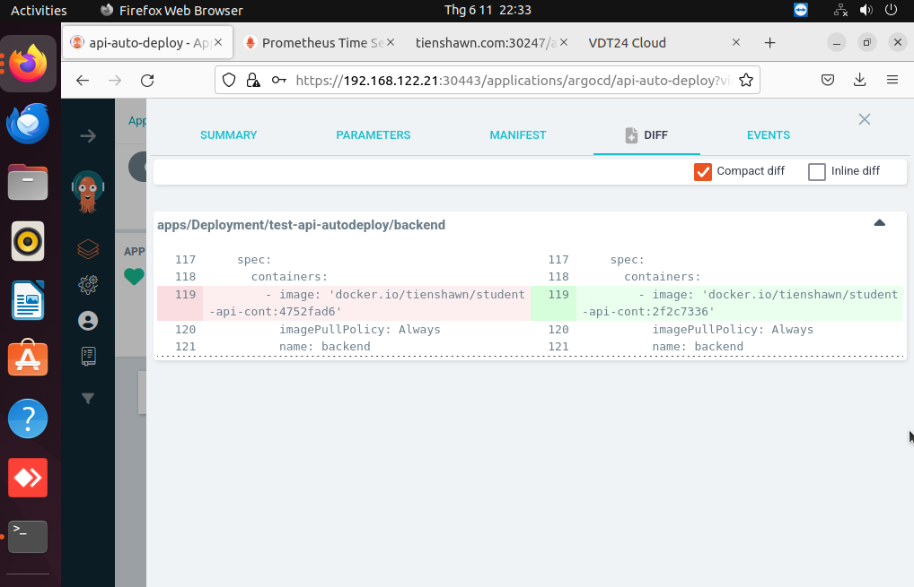


### Monitoring

**Yêu cầu:**
- Expose metric của web service và api service ra 1 http path. Tham khảo: https://github.com/korfuri/django-prometheus

- Triển khai Prometheus lên Kubernetes Cluster thông qua Prometheus Operator, phơi ra ngoài dưới dạng NodePort

- Expose Prometheus dưới dạng Nodeport

- Trong trường hợp sử dụng cụm lab của Viettel Cloud, tạo 1 load balancer với backend là NodePort Service của Prometheus, để expose Prometheus UI ra Public Internet

- Sử dụng Service Monitor của Prometheus Operator để giám sát Web Deployment và API Deployment

**Output:**
> Đối với Api, em sử dụng thư viện flask_prometheus_exporter để đẩy các metrics của Api qua path /metrics.

> Đối với Web, em triển khai sidecar container là nginx_prometheus_exporter. Sidecar container này sẽ lấy metrics từ uri http://127.0.0.1/stub_status của nginx và biến đổi dưới dạng mà Prometheus có thể hiểu được

> File Deployment - Service của Web để lấy metrics: [web-deployment-svc.yaml](./manifest/4-monitoring/sidecar-web-deployment-svc.yaml)


- Các file setup để triển khai Prometheus lên Kubernetes Cluster: [prometheus-setup](./manifest/4-monitoring/prometheus-setup/)

- Hình ảnh khi truy cập vào Prometheus UI thông qua trình duyệt: 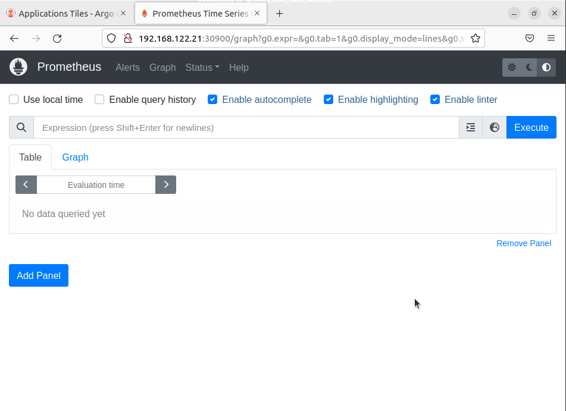

- Hình ảnh danh sách target của Web Deployment và API Deployment được giám sát bởi Prometheus: 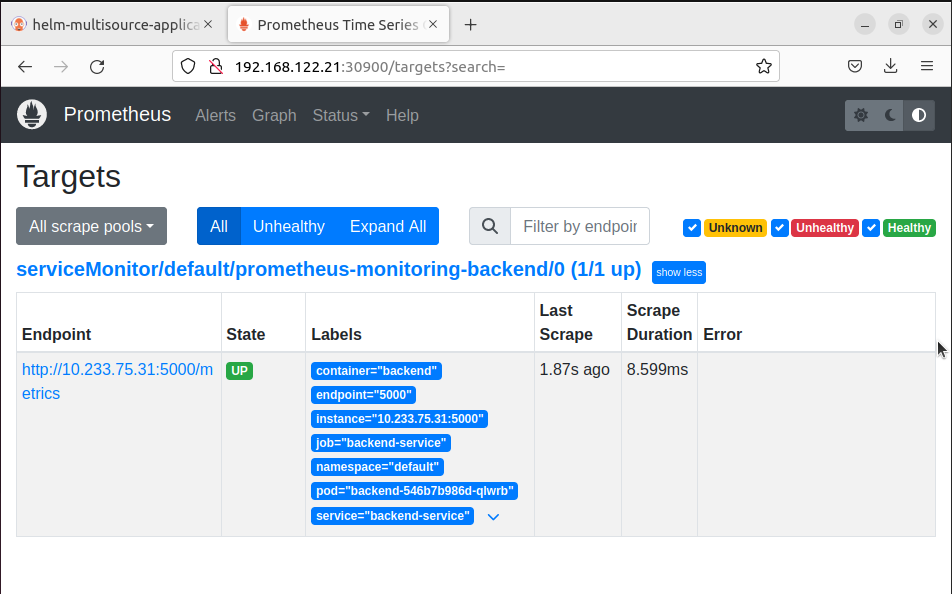

> Đối với Web Deployment, em xin phép được show metrics thu thập được khi curl tới endpoint ***:9113/metrics*** khi đứng trong pod ạ. Lí do là khi làm đến phần này thì cụm của em bị sập nên em có sử dụng Kind-Kubernetes để triển khai lại. Kind thì triển khai cụm sử dụng Container nên không có UI nên em chưa làm được việc show target được giám sát bởi Prometheus ạ.

> File log-web-metrics: [Web-metrics-log](./Log_file/error/web-metrics.log)


### Logging 

**Yêu cầu:**
- Sử dụng Kubernetes DaemonSet triển khai fluentd hoặc fluentbit lên kubernetes đẩy log của các Deployment Web Deployment và API Deployment lên cụm ElasticSearch tập trung với prefix index dưới dạng tên_sinh_viên_viết_tắt_sdt


### Security

**Yêu cầu 1:**
- Dựng HAProxy Loadbalancer trên 1 VM riêng (trong trường hợp cụm lab riêng của sinh viên) hoặc trên Basion Node (trường hợp sử dụng cụm Lab của Viettel Cloud) với mode TCP, mở 2 port web_port và api_port trên LB trỏ đến 2 NodePort của Web Deployment và API Deployment trên K8S Cluster. (0.5)

- Sử dụng 1 trong 2 giải pháp Ingress, hoặc haproxy sidecar container cho các deployment, đảm bảo các truy cập đến các port web_port và api_port sử dụng https (0.5)

- Cho phép sinh viên sử dụng self-signed cert để làm bài

**Output 1:**
- File cấu hình của HAProxy LoadBalancer cho web port và api port: [haproxy.cfg](./manifest/6-security/yc1/haproxy.cfg)

> Ở đây các cổng 80 và 8080 trên VM LoadBalancer sẽ trỏ vào cổng NodePort của Service Web và Api tương ứng, với 30007 là cổng NodePort của Web Service và 30006 là cổng NodePort của Api Service. IP được trỏ đến là IP của Master Node.
> Cơ chế cân bằng tải sử dụng là Round-Robin

- File cấu hình ingress hoặc file cấu hình deployment sau khi thêm HAProxy sidecar container vào Deployment: [nginx-ingress.yaml](./manifest/6-security/yc1/nginx-ingress.yaml)
  
  - Ở đây em sử dụng giải pháp Ingress, cụ thể là Nginx Ingress. Hostname 'tienshawn.com' được cấu hình trỏ đến địa chỉ IP của Master Node (192.168.122.21)

  - Em sử dụng self-signed cert


- Kết quả truy cập vào web port và api port từ trình duyệt thông qua giao thức https hoặc dùng curl
  - Web-https: 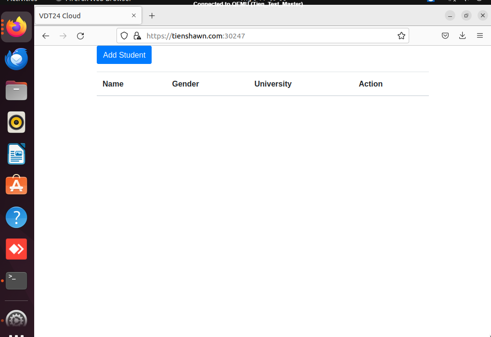

  - Api-https: 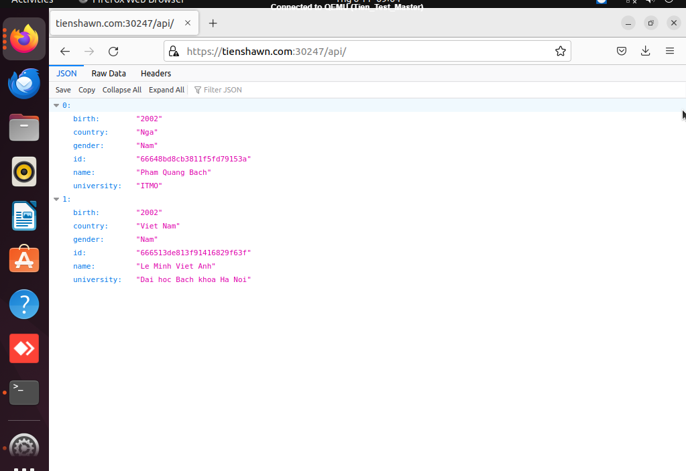


**Yêu cầu 2**:
- Đảm bảo 1 số URL của api service khi truy cập phải có xác thực thông qua 1 trong số các phương thức cookie, basic auth, token auth,nếu không sẽ trả về HTTP response code 403. (0.5)
- Thực hiện phân quyền cho 2 loại người dùng trên API:
  - Nếu người dùng có role là user thì truy cập vào GET request trả về code 200, còn truy cập vào POST/DELETE thì trả về 403
  - Nếu người dùng có role là admin thì truy cập vào GET request trả về code 200, còn truy cập vào POST/DELETE thì trả về 2xx

> Do ở phần này cụm Kubernetes của em bị sập, cụ thể là 2 pod ***kube-controller-manager-node1*** và ***kube-scheduler-node1*** luôn trong tình trạng ***CrashLoopBackOff*** và em không fix được lỗi này; dựng lại một cụm Kubernetes thì tốn nhiều thời gian và có thể sẽ trễ hạn nộp bài ạ, nên em xin phép sử dụng **Kind-Kubernetes** để làm tiếp phần bài còn lại ạ. Mong các anh có thể châm chước cho em trong tình huống này ạ. 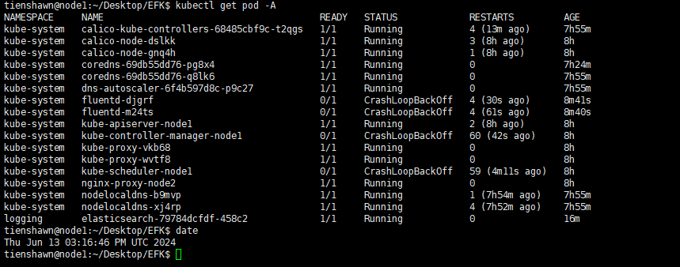

**Output:**
- File trình bày giải pháp sử dụng để authen/authorization cho các service: [authentication-report](./security_report/authenticate.md)

- Kết quả HTTP Response khi curl gọi vào các URL khi truyền thêm thông tin xác thực và khi không truyền thông tin xác thực
>  - Endpoint của api service được expose dưới dạng NodePort, cổng 30005. Thực hiện câu lệnh 'curl' vào endpoint trên để kiểm tra tính năng authentication 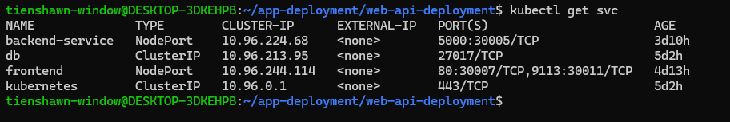
> - ip của node: 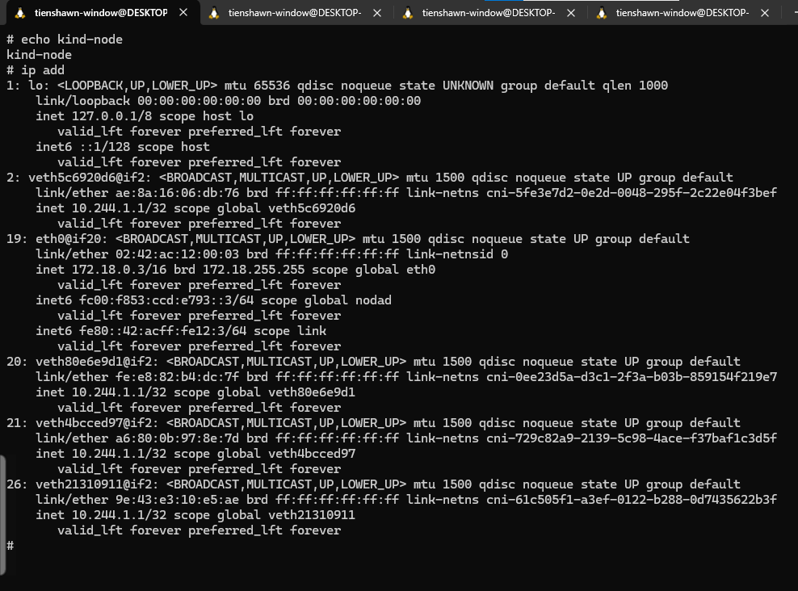

  - Kết quả curl xác thực/không xác thực:
  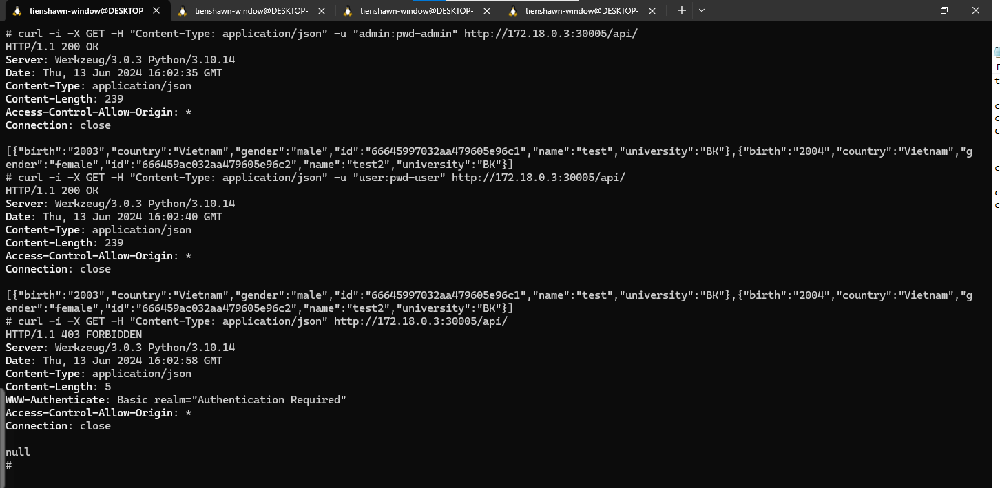

-  Kết quả HTTP Response khi curl hoặc dùng postman vào các URL với các method GET/POST/DELETE khi lần lượt dùng thông tin xác thực của các user có role là user và admin
   - method POST: 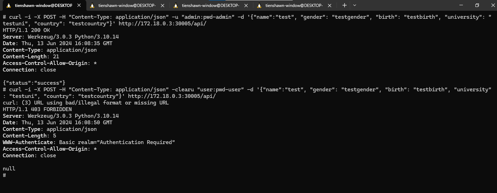

   - method DELETE: 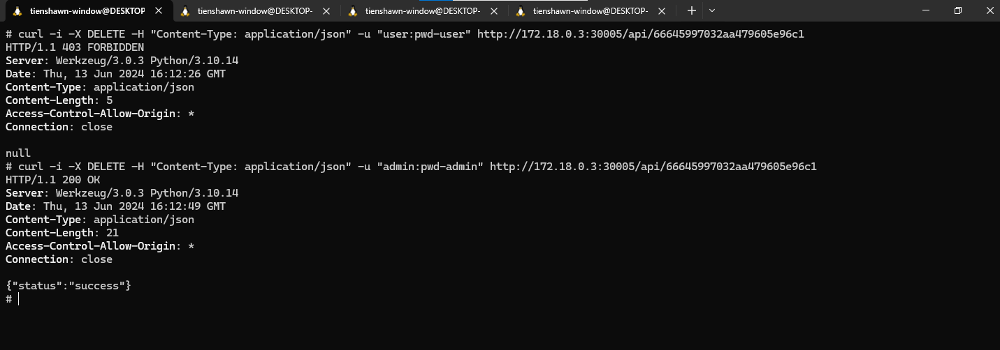

**Yêu cầu 3:**
- Sử dụng 1 trong số các giải pháp để ratelimit cho Endpoint của api Service, sao cho nếu có quá 10 request trong 1 phút gửi đến Endpoint của api service thì các request sau đó bị trả về HTTP Response 409

**Output:**
- File tài liệu trình bày giải pháp: [rate-limit-report](./security_report/rate-limit.md)

- File ghi lại kết quả thử nghiệm khi gọi quá 10 request trong 1 phút vào Endpoint của API Service: [Curl-log-Limit](./Log_file/6-security/yc3/curl-limit.log)
  - Kết quả dưới dạng ảnh: 
  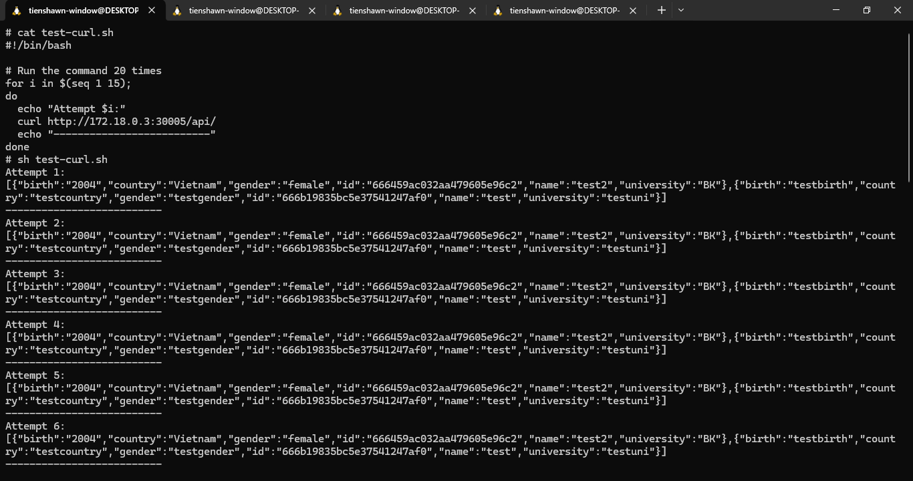
  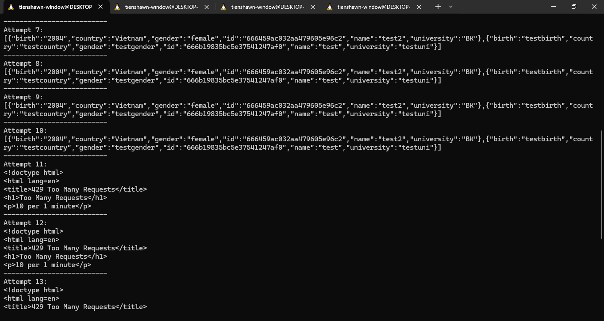