# Bài tập lớn giữa kỳ chương trình VDT 2024 lĩnh vực Cloud

## Phát triển một 3-tier web application đơn giản (3đ)

### Output:

#### Hình ảnh thể hiện kết quả đã đạt được 

- Hiển thị danh sách sinh viên: 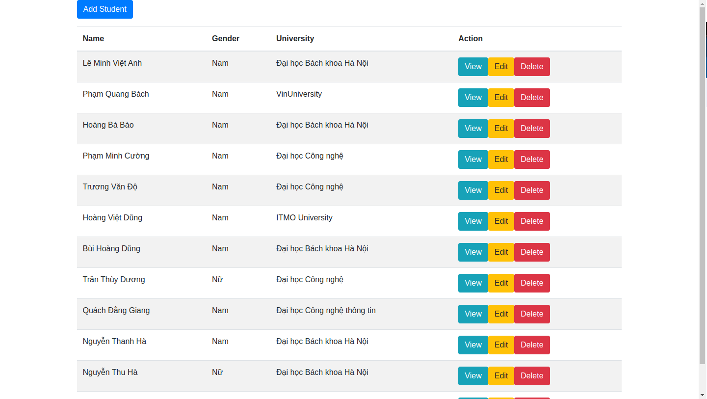

- Xem chi tiết thông tin sinh viên: 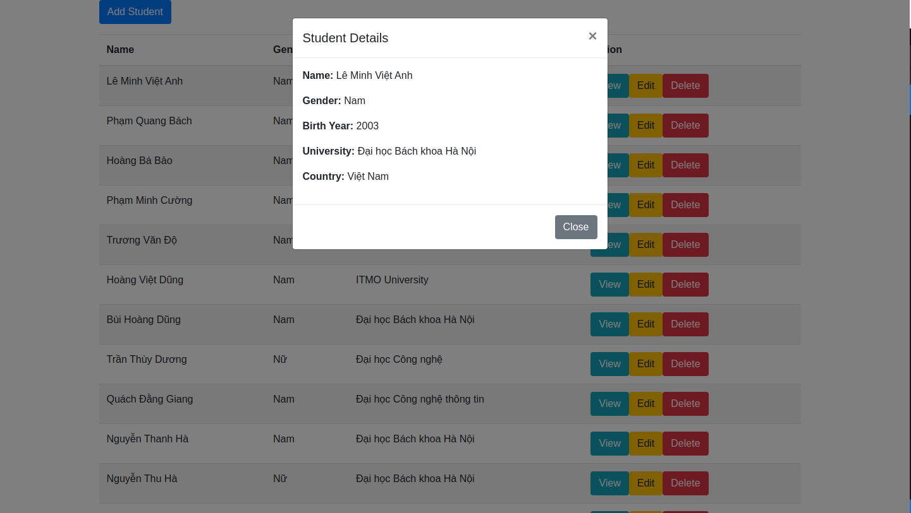

- Thêm sinh viên: 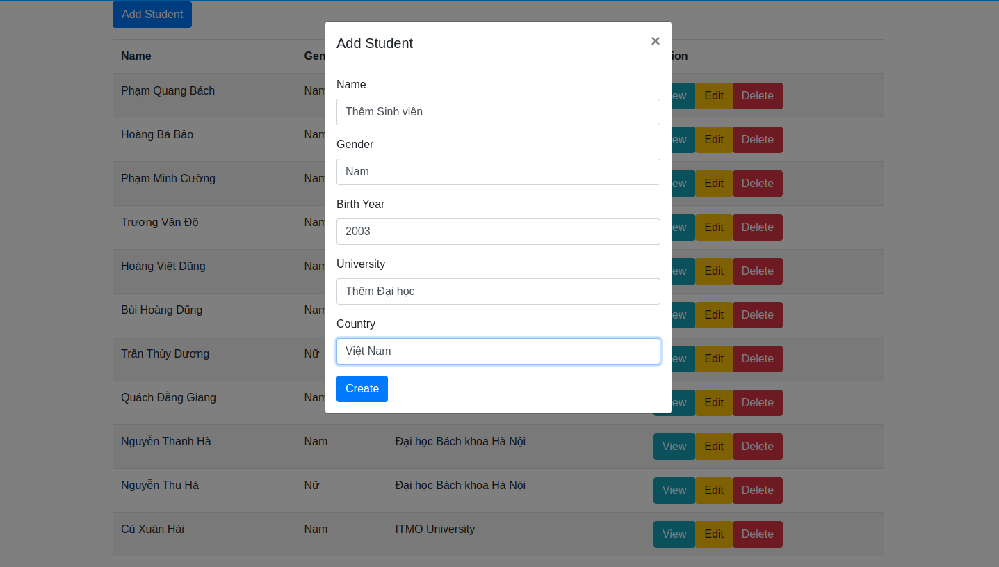
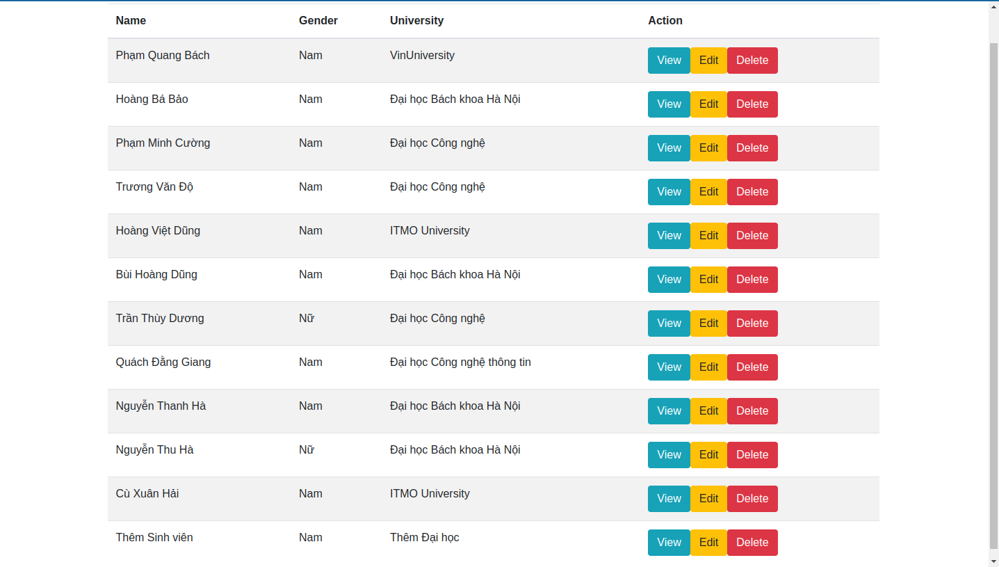

- Cập nhật thông tin sinh viên: 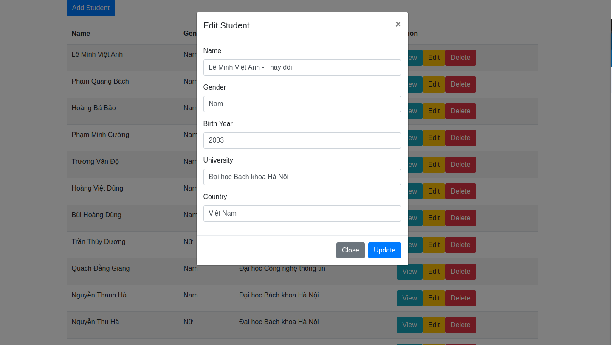
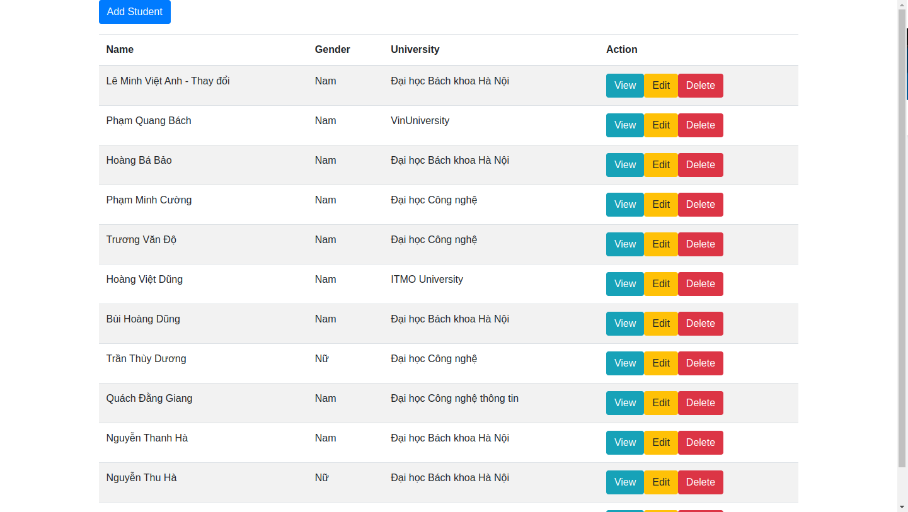

- Xóa sinh viên: 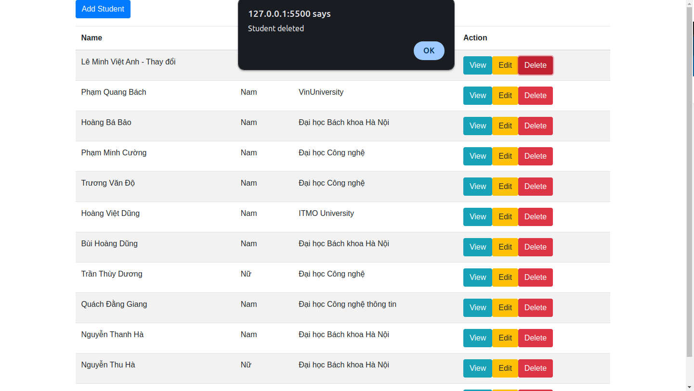
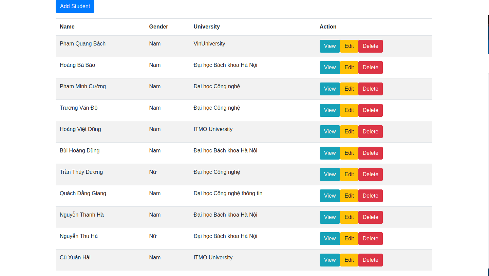

#### Mã nguồn của từng dịch vụ (link github)

- Mã nguồn của dịch vụ Web: [Project_Web](https://github.com/tienshawn/student_web)

- Mã nguồn của dịch vụ API (bao gồm cả file unit tests cho các chức năng APIs): [Project_API](https://github.com/tienshawn/student_api)

## Triển khai web application sử dụng các DevOps tools & practices (5đ)

### Output:

#### 1. Containerization (2đ)

- File Dockerfile cho từng dịch vụ: 

- Output câu lệnh build và thông tin docker history của từng image:
  
  - Build history của container web: 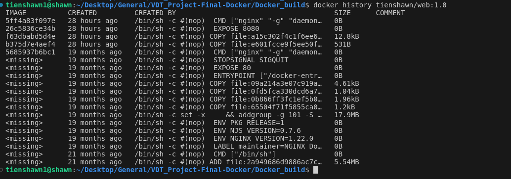

  - Build của container api: 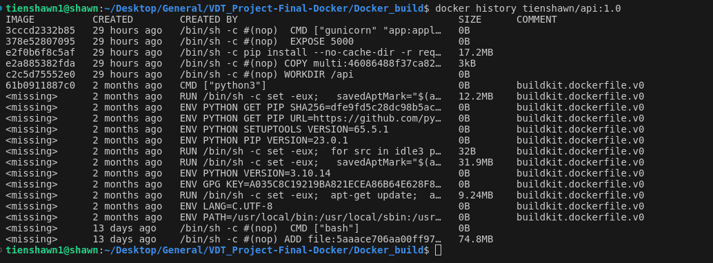

#### 2. Continuous Integration (1.5đ)

- File setup công cụ CI: [CI-setup](./CI/setup.yaml)

- Output log của luồng CI: [CI-log](./CI/log.txt)

- Các hình ảnh demo khác: 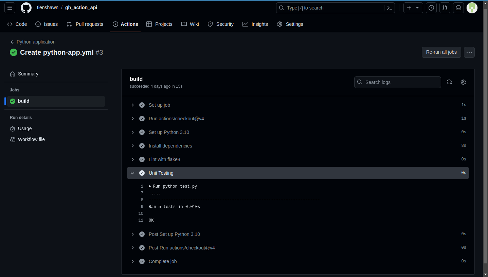

#### 3. Automation (1.5đ)
[Link thư mục Ansible](./Ansible/)

## Nghiên cứu sâu về một vấn đề, khái niệm trong các chủ đề đã được học (2đ)

- File báo cáo: [File-báo-cáo](./Research/Research.md)

