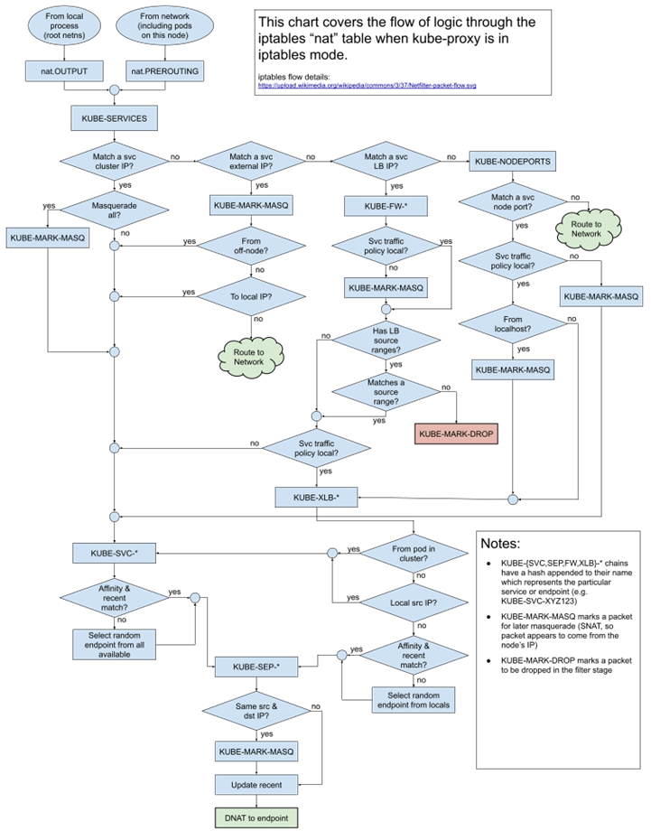
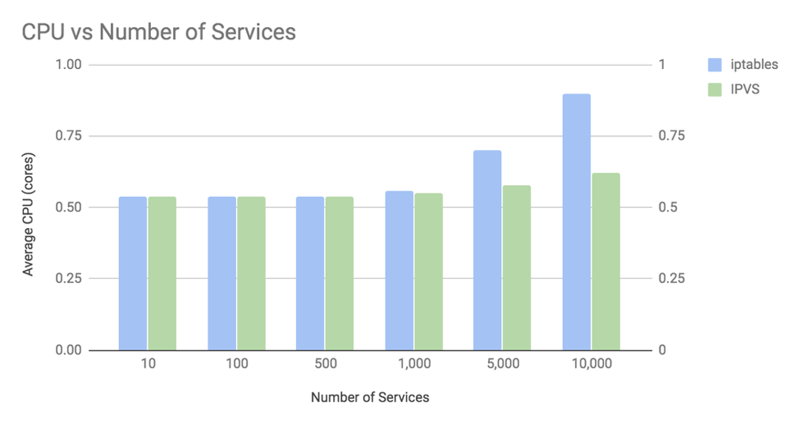
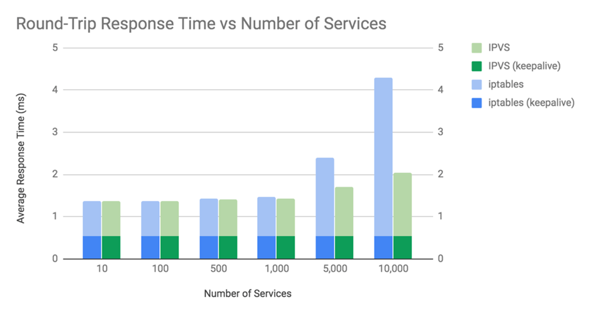

# Nghiên cứu một vấn đề, khái niệm trong các chủ đề đã được học

Chủ đề tìm hiểu: Networking trong Kubernetes, cụ thể là Service-to-Pod Networking và các vấn đề LoadBalancing liên quan tới đường đi từ Service tới Pod.

Nội dung này được giới thiệu trong bài Tổng quan về Kubernetes

# Các khái niệm ban đầu

## Kube-proxy

- Mỗi một node trong cụm sẽ có một container mang tên ***kube-proxy***, nằm trong kube-system namespace. 

- ***kube-proxy*** đảm nhiệm việc định tuyến luồng traffic từ Service đến các Pods phù hợp.

- Hiện tại, ***kube-proxy*** hỗ trợ 3 kiểu hoạt động chính:
 
  - ***Userspace***: Service sẽ được routing trong các tiến trình của Userspace thay vì Kernel Networking Stack. 
  Chế độ này không được phổ biến bởi việc routing đường đi sẽ chậm và không hiệu quả.

  - ***iptables***: Chế độ này sử dụng Netfilter để định tuyến đường đi cho Kubernetes Service. 
    - Netfilter là một Linux framework cung cấp chức năng cho việc Packet filtering, Network Address Translation và Port Translation

    - Loadbalancing được sử dụng dưới dạng thuật toán unweighted round-robin scheduling.

  - ***IPVS*** (IP Virtual Server):
    - ***IPVS*** được thiết kế dựa trên Netfilter framework được giới thiệu ở trên, thực hiện việc LoadBalancing Layer-4 trong Linux kernel. 

    - Khác với ***iptables*** mode, ***IPVS*** hỗ trợ đa dạng các loại thuật toán LoadBalancing khác nhau, bao gồm least connections và shortest expected delay.

## Sơ lược về iptables

- ***iptables*** là một chương trình Userspace, tương tác với Networking stack trong Linux kernel (hay chính là Netfilters) để thực hiện chức năng của một Firewall cơ bản.

- ***iptables*** sử dụng Tables để quản lý các Chains. Chains chịu trách nhiệm quản lý các Rules khác nhau, phục vụ mục đích Firewalls.

### Chains trong iptables là gì?

- ***iptables*** định nghĩa và sử dụng các Chains sau:

  - `PREROUTING`: thực hiện chức năng DNAT (Destination NAT), thay đổi gói tin khi chúng bắt đầu đi vào hệ thống.

  - `INPUT`: chuyển tiếp các gói tin đến Firewall

  - `FORWARD`: chuyển tiếp gói tin cho Network Interface Card khác 

  - `OUTPUT`: chuyển tiếp các gói tin đi ra Firewall

  - `POSTROUTING`: thực hiện chức năng SNAT (Source NAT), thay đổi gói tin khi chúng ra khỏi hệ thống

# Kube-proxy trong chế độ iptables

- Trong chế độ ***iptables*** này (thường là mặc định), ***kube-proxy*** sẽ chịu trách nhiệm tạo ra các rules cho Service để đảm bảo việc routing cũng như loadbalancing các yêu cầu từ người dùng tới Pod tương ứng.

- Những rules trong ***iptables*** sẽ giúp việc routing đường đi giữa request từ Service tới Pod khả thi kể cả trong trường hợp tiến trình ***kube-proxy*** bất ngờ gặp sự cố trong node. 
  - Tuy nhiên, trong trường hợp này, do ***kube-proxy*** không hoạt động nên việc định tuyến cho Service mới tạo ra sẽ không khả thi trên node đó, bởi không có một thành phần nào chịu trách nhiệm tạo ra các ***iptables*** rules.

## Kube-proxy đã áp dụng iptables như thế nào?

- Ngoài các Chains mặc định của ***iptables*** được giới thiệu ở trên, Kubernetes tự định nghĩa và chỉnh sửa các Chains, nhằm thực hiện mục đích NAT và packet filtering trong đường đi giữa Pod và Service.

- Các Chains được thêm vào bao gồm: 
  - `KUBE-SERVICES`: là điểm đầu vào của Service packets, dựa theo địa chỉ đích IP:Port để gửi gói tin tới chain KUBE-SVC* tương ứng

  - `KUBE-SVC-\*`: hoạt động như một LoadBalancer, chịu trách nhiệm gửi gói tin tương ứng tới `KUBE-SEP-\*` chain.
    - Số lượng `KUBE-SEP-\*` sẽ tương ứng với số lượng Endpoints của Service.

    - Cách chọn KUBE-SEP-\* sẽ là ngẫu nhiên.

  - `KUBE-SEP-\*`: đại diện cho Endpoints của Service. Thực hiện chức năng DNAT, thay đổi địa chỉ IP:Port của Service với IP:Port của Pod

  - `KUBE-MARK-MASQ`: thực hiện chức năng thêm Netfilter Mark vào packet xuất phát từ ngoài Cluster đi vào. 
    - Các packet này sẽ được thay đổi trong POSTROUTING chain và được SNAT (Source NAT).

  - `KUBE-MARK-DROP`: thực hiện chức năng thêm Netfilter Mark đối với gói tin không có bản ghi DNAT có sẵn. 
    - Các gói tin này sẽ bị huỷ trong chain `KUBE-FIREWALL`.

  - `KUBE-FW-\*`: hoạt động khi Service được triển khai dưới dạng LoadBalancer, kết nối địa chỉ IP của Service với địa chỉ IP của LoadBalancer 
    - Thực hiện gửi gói tin tới các chain `KUBE-SVC-*` tương ứng (trong trường hợp chỉ định `externalTrafficPolicy: Cluster`) hoặc gửi gói tin tới chain `KUBE-XLB-*` (trong trường hợp chỉ định `externalTrafficPolicy: Local`)

  - `KUBE-NODEPORTS`: hoạt động khi Service được triển khai dưới dạng NodePort và LoadBalancer. 
    - Traffic từ bên ngoài sẽ tiếp cận được tới Service bên trong thông qua Node Port. Chain này sẽ kiểm tra địa chỉ Node Port và gửi gói tin tới chain `KUBE-SVC-*` tương ứng (đối với `externalTrafficPolicy` là `Cluster`) hoặc chain `KUBE-XLB-*` (đối với `externalTrafficPolicy` là `Local`).

  - `KUBE-XLB-*`: hoạt động khi `externalTrafficPolicy` được đặt `Local`. Packet sẽ bị huỷ nếu node được gửi gói tin đến không có thông tin về endpoints cần thiết.

## Đường đi của gói tin trong chế độ iptables

Đường đi của gói tin trong chế độ ***iptables*** sẽ trông giống như sau:

- Các gói tin sẽ đi qua các Chain, kiểm tra các Rules tương ứng cho đến khi thực hiện được hành động DNAT.

## Các vấn đề khi sử dụng iptables trong Kubernetes

- ***iptables*** là một phương pháp khá hiệu quả cho việc Routing cũng như LoadBalancing đường đi traffic từ Service tới Pod cho các cụm Kubernetes quy mô nhỏ.

- Tuy nhiên, khi triển khai trên môi trường production với quy mô lớn, việc sử dụng iptables như thông thường sẽ không phải là một "good choice", bởi lẽ:
  
  - ***iptables*** và netfilter được thiết kế để thực hiện chức năng của một Firewall, không phải để thực hiện chức năng proxy.

  - Giả sử ta cần nhiều ClusterIP Service. Trong trường hợp này, mỗi Service này đều sẽ cần một entry riêng biệt, không thể nhóm và phải được xử lý một cách tuần tự dưới dạng các Chains trong Tables.
    - Việc tìm kiếm/thay đổi/xoá bản ghi sẽ phải đi qua các Chain cho tới khi Rules chúng ta cần được tìm thấy

    - Độ phức tạp trong trường hợp xấu nhất là O(n).

    - Trong trường hợp chúng ta tăng quy mô của cụm lên, việc tìm kiếm tuần tự như vậy sẽ gây ra độ trễ, có thể lên tới vài phút.

  - Lấy một ví dụ đơn giản, một công ty cần triển khai NodePort Service trong một cụm 5000-nodes. 
    - Giả sử số lượng Service là 2000, mỗi Service có 10 Pods tương ứng. 
    - ***kube-proxy*** sẽ định ra ít nhất là 20000 bản ghi ***iptables*** trên mỗi Worker node. 
    - Với quy mô 5000-node, việc định tuyến chắc chắn sẽ là điều không hề dễ dàng.

# Thay thế iptables bằng IPVS

## Sơ lược về IPVS - IP Virtual Server

- ***IPVS*** được triển khai dưới dạng một Layer4-LAN-Switching dựa trên Netfilter Framework, hoạt động như một Transport-Layer LoadBalancing trong Linux Kernel.

- ***IPVS*** được tích hợp với Linux Virtual Server, chạy trên một host và hoạt động như một LoadBalancer trước một cụm các server. Ngoài ra, ***IPVS*** còn hỗ trợ điều tiết các luồng request đối với các Service dựa trên TCP và UDP, giúp cho các Service thật của các máy chủ thật trông giống như một Service ảo với chỉ một địa chỉ IP duy nhất.  

- ***IPVS*** hỗ trợ nhiều thuật toán triển khai khác nhau: Round-Robin, Least connection, Destination Hashing, Source Hashing, Shortest expected delay,...

- Khác với ***iptables***, ***IPVS*** được thiết kế để phục vụ chức năng LoadBalancing và sử dụng cấu trúc lưu trữ hiệu quả hơn (hash tables), đảm bảo cho việc scaling với quy mô lớn.

---
## Điểm khác biệt giữa việc sử dụng iptables và IPVS trong Kubernetes

***IPVS*** và ***iptables*** đều được thiết kế dựa trên **Netfilter Framework**. Tuy nhiên, giữa chúng có một vài điểm khác biệt sau:

- ***IPVS*** hoạt động tốt hơn so với ***iptables*** trong môi trường Production với các cụm Cluster lớn.

- ***IPVS*** hỗ trợ đa dạng các thuật toán LoadBalance hơn so với ***iptables***.

Cần để ý rằng, ***IPVS*** sẽ không hoàn toàn được sử dụng độc lập với ***iptables*** mà sẽ dựa vào chính ***iptables*** để thực hiện một vài chức năng như Packet filtering, SNAT hoặc Masquerade. 

Lý do làm cho ***IPVS*** hiệu quả hơn ***iptables*** trong việc định tuyến đường đi Service tới Pod là bởi thành phần ***IPVS*** proxier sử dụng ipset để nhóm và lưu địa chỉ nguồn hoặc địa chỉ đích của traffic, với điểm chung là những traffic đó cần thực hiện một hành động chung như DROP hoặc Masquerade. Việc này đảm bảo cho số lượng bản ghi ***iptables*** được giữ ở mức ổn định bất chấp việc tăng số lượng Service lên nhiều lần.

Theo tài liệu của nhóm phát triển, bảng ipset sẽ được triển khai như sau:

| set name                       | members                                  | usage                                    |
| :----------------------------- | ---------------------------------------- | ---------------------------------------- |
| KUBE-CLUSTER-IP                | All service IP + port                    | Mark-Masq for cases that `masquerade-all=true` or `clusterCIDR` specified |
| KUBE-LOOP-BACK                 | All service IP + port + IP               | masquerade for solving hairpin purpose   |
| KUBE-EXTERNAL-IP               | service external IP + port               | masquerade for packages to external IPs  |
| KUBE-LOAD-BALANCER             | load balancer ingress IP + port          | masquerade for packages to load balancer type service  |
| KUBE-LOAD-BALANCER-LOCAL       | LB ingress IP + port with `externalTrafficPolicy=local` | accept packages to load balancer with `externalTrafficPolicy=local` |
| KUBE-LOAD-BALANCER-FW          | load balancer ingress IP + port with `loadBalancerSourceRanges` | package filter for load balancer with `loadBalancerSourceRanges` specified |
| KUBE-LOAD-BALANCER-SOURCE-CIDR | load balancer ingress IP + port + source CIDR | package filter for load balancer with `loadBalancerSourceRanges` specified |
| KUBE-NODE-PORT-TCP             | nodeport type service TCP port           | masquerade for packets to nodePort(TCP)  |
| KUBE-NODE-PORT-LOCAL-TCP       | nodeport type service TCP port with `externalTrafficPolicy=local` | accept packages to nodeport service with `externalTrafficPolicy=local` |
| KUBE-NODE-PORT-UDP             | nodeport type service UDP port           | masquerade for packets to nodePort(UDP)  |
| KUBE-NODE-PORT-LOCAL-UDP       | nodeport type service UDP port with `externalTrafficPolicy=local` | accept packages to nodeport service with `externalTrafficPolicy=local` |

## So sánh về mặt tài nguyên tiêu thụ trong hai chế độ

> Các thông số và kết quả được trích dẫn từ bài viết: [Comparing kube-proxy modes: iptables or IPVS?](https://www.tigera.io/blog/comparing-kube-proxy-modes-iptables-or-ipvs/)

- Vể mặt tài nguyên tiêu thụ CPU: 

- Về mặt thời gian phản hồi: 

Như vậy, có thể thấy rằng với các cụm Kubernetes được triển khai với quy mô lớn, việc sử dụng ***iptables*** sẽ không còn phù hợp. ***IPVS*** sẽ là một lựa chọn tối ưu hơn.

**Tổng kết lại**, việc định tuyến đường đi từ Service tới Pod được thực hiện bởi thành phần mang tên Kube-proxy, áp dụng những công nghệ có sẵn của Linux Kernel.
Và sử dụng IPVS sẽ mang lại nhiều ưu điểm hơn và cải thiện hiệu năng tốt hơn cho cụm Kubernetes được triển khai với quy mô lớn.