<!-- install kubeadm, kubelet, kubectl
https://forum.linuxfoundation.org/discussion/864693/the-repository-http-apt-kubernetes-io-kubernetes-xenial-release-does-not-have-a-release-file -->

# Bài tập lớn cuối kỳ chương trình VDT 2024 lĩnh vực Cloud - GĐ 1

## Triển khai Kubernetes thông qua công cụ kubespray lên 1 master node VM + 1 worker node VM

Bước 1: Chuẩn bị môi trường

1. Cài đặt các gói cần thiết trên cả hai node (master và worker):

```bash
sudo apt update
sudo apt install -y python3 python3-pip git sshpass
sudo apt install -y openssh-server
sudo systemctl enable ssh
sudo systemctl start ssh
```
2. Thiết lập hostname trên cả hai node để đảm bảo chúng có hostname chính xác và thống nhất.

Trên node1 (192.168.44.132):
```bash
sudo hostnamectl set-hostname node1
```
Trên node2 (192.168.44.133):
```bash
sudo hostnamectl set-hostname node2

```
3. Chỉnh Sửa /etc/hosts trên cả hai node để ánh xạ IP với hostname.

Trên cả node1 và node2, thêm các dòng sau vào /etc/hosts:

```bash
192.168.44.132 node1
192.168.44.133 node2
```

5. Cài đặt Ansible trên máy tính điều khiển (có thể là một trong hai node hoặc máy khác):

```bash
pip3 install ansible
```

Bước 2: Tạo một user và cấu hình SSH

1. Tạo một user không phải root để sử dụng Ansible trên cả hai node:

```bash
sudo useradd -m -s /bin/bash k8suser
sudo passwd k8suser
# Nhập mật khẩu cho user
```

2. Thêm k8suser vào nhóm sudo:

```bash
sudo usermod -aG sudo k8suser
```

3. Thiết lập SSH key cho k8suser để có thể truy cập không cần mật khẩu giữa các node:

```bash
su - k8suser
ssh-keygen -t rsa
# Chấp nhận tất cả các giá trị mặc định
ssh-copy-id k8suser@192.168.44.132
ssh-copy-id k8suser@192.168.44.133
```

Bước 3: Tải và cấu hình Kubespray

1. Clone repository Kubespray trên máy tính điều khiển:

```bash
git clone https://github.com/kubernetes-sigs/kubespray.git
cd kubespray
pip3 install -r requirements.txt
```
2. Sao chép inventory mẫu và cấu hình cho cluster:
```bash
cp -rfp inventory/sample inventory/mycluster
```

3. Cài đặt gói ruamel.yaml
```bash
pip3 install ruamel.yaml
```
4. Chỉnh sửa tệp inventory để thêm các node:

```bash
declare -a IPS=(192.168.44.132 192.168.44.133)
CONFIG_FILE=inventory/mycluster/hosts.yml python3 contrib/inventory_builder/inventory.py ${IPS[@]}

```
4. Mở tệp inventory/mycluster/hosts.yml và đảm bảo các node được cấu hình đúng, ví dụ:

```yaml
all:
  hosts:
    node1:
      ansible_host: 192.168.44.132
      ansible_user: k8suser
      ansible_become: true
      ansible_become_method: sudo
      ansible_become_password: Anything112
    node2:
      ansible_host: 192.168.44.133
      ansible_user: k8suser
      ansible_become: true
      ansible_become_method: sudo
      ansible_become_password: Anything112
  children:
    kube_control_plane:
      hosts:
        node1:
    kube_node:
      hosts:
        node2:
    etcd:
      hosts:
        node1:
    k8s_cluster:
      children:
        kube_control_plane:
        kube_node:
    calico_rr:
      hosts: {}
```

Bước 4: Triển khai Kubernetes Cluster

```bash
ansible-playbook -i inventory/mycluster/hosts.yml --become --become-user=root cluster.yml --ask-become-pass
```

Bước 5: Kiểm tra cài đặt

1. Sau khi cài đặt xong, chuyển đến master node (192.168.44.132):

```bash
ssh k8suser@192.168.44.132
kubectl get nodes -o wide
```

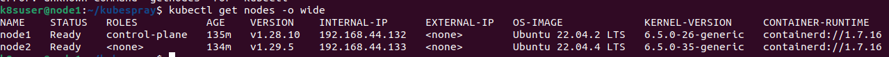

## K8S Helm Chart

Bước 1: Tạo một file manifest để triển khai ArgoCD

Tạo một file `argocd-install.yaml` với nội dung như sau:

```yaml
apiVersion: v1
kind: Namespace
metadata:
  name: argocd
---
apiVersion: v1
kind: ServiceAccount
metadata:
  name: argocd-server
  namespace: argocd
---
apiVersion: v1
kind: Service
metadata:
  name: argocd-server
  namespace: argocd
spec:
  ports:
  - port: 80
    targetPort: 8080
    nodePort: 30007
  selector:
    app: argocd-server
  type: NodePort
---
apiVersion: apps/v1
kind: Deployment
metadata:
  name: argocd-server
  namespace: argocd
spec:
  replicas: 1
  selector:
    matchLabels:
      app: argocd-server
  template:
    metadata:
      labels:
        app: argocd-server
    spec:
      serviceAccountName: argocd-server
      containers:
      - name: argocd-server
        image: argoproj/argocd:v2.5.3
        ports:
        - containerPort: 8080
        command: ["argocd-server"]
        args:
        - --staticassets
        - /shared/app
        - --insecure
        volumeMounts:
        - name: static-assets
          mountPath: /shared/app
      volumes:
      - name: static-assets
        emptyDir: {}
```

Bước 2: Áp dụng file manifest để cài đặt ArgoCD

```sh
kubectl apply -f argocd-install.yaml
```

Bước 3: Kiểm tra trạng thái của các pod trong namespace `argocd`
```sh
kubectl get pods -n argocd
```

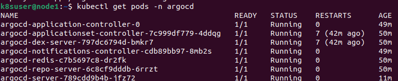

Bước 4: Lấy các services name argocd

```sh
kubectl get svc -n argocd
```
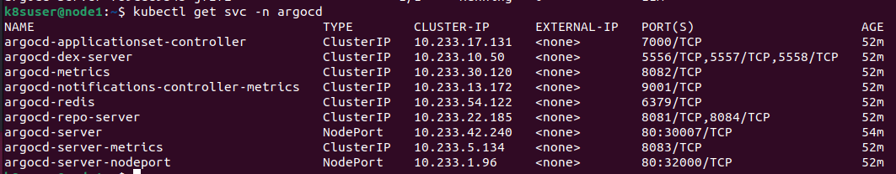

Bước 5: Port-foward argocd để truy cập web interface Argo CD

```sh
kubectl port-forward svc/argocd-server -n argocd 8080:80
```

Bước 6: Mở trình duyệt nhập https://localhost:8000 và đăng nhập bằng user admin và lấy mật khẩu bằng command và login:

```sh
# get admin password
$ kubectl get secret argocd-initial-admin-secret \
    --namespace argocd \
    --output jsonpath="{.data.password}" \
    | base64 --decode \
    && echo
```

Kết quả sau khi login

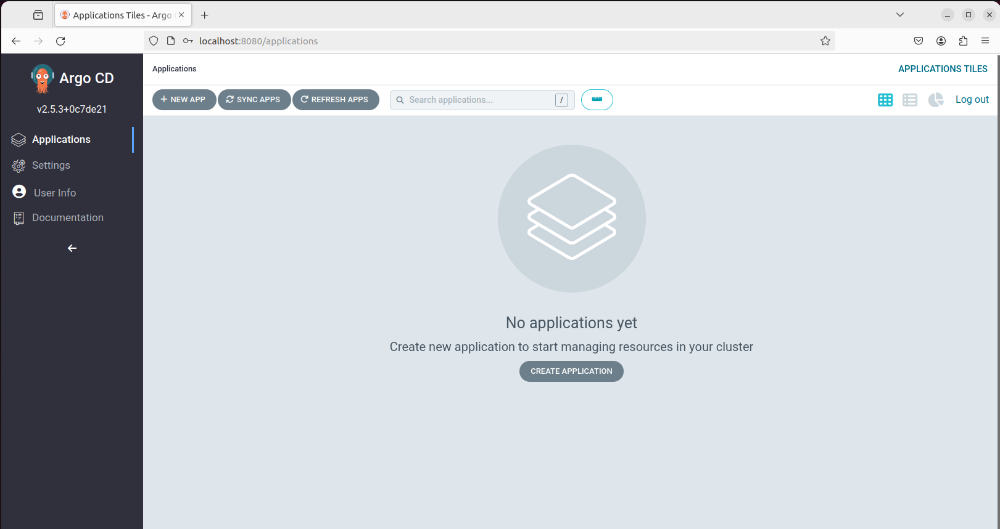


- Helm Chart cho web deployment: [Helm Chart Web Devlopment](https://github.com/Minh141120/frontend_midterm_vdt2024/tree/main/charts)
- Helm Chart cho api development: [Helm Chart API Development](https://github.com/Minh141120/vdt2024_backend_midterm/tree/main/charts)


## Continuous Delivery

- File setup CI/CD cho web project: [ci-cd.yml](https://github.com/Minh141120/frontend_midterm_vdt2024/blob/main/.github/workflows/ci-cd.yml)
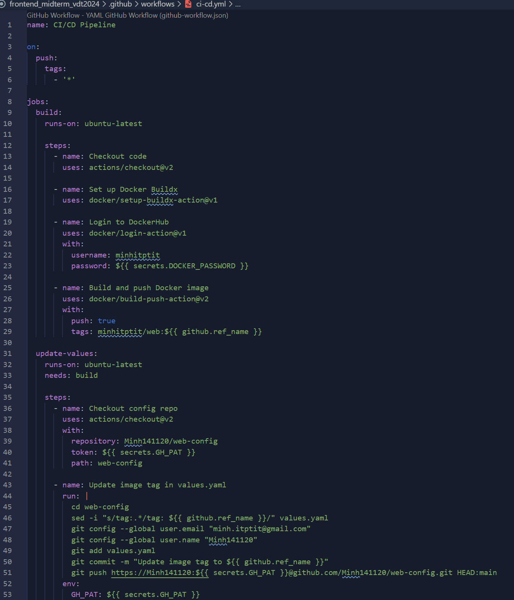

- FIle setup CI/CD cho api project: [ci-cd.yml](https://github.com/Minh141120/vdt2024_backend_midterm/blob/main/.github/workflows/ci-cd.yml)
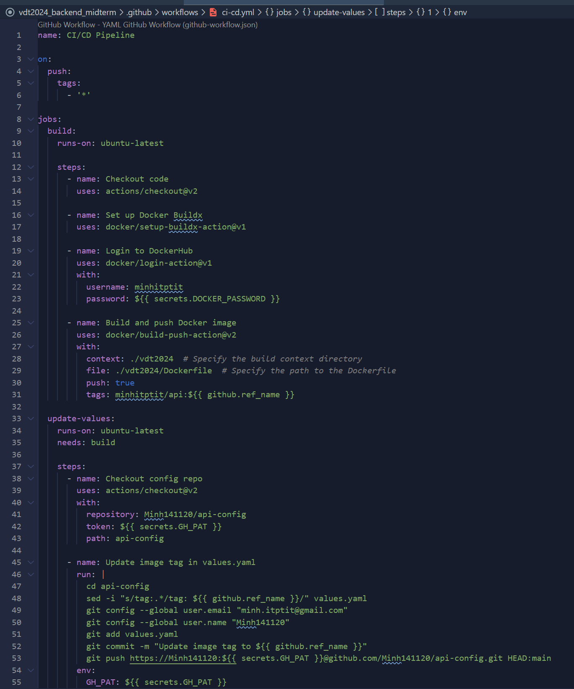
- Outlut log web cicd:

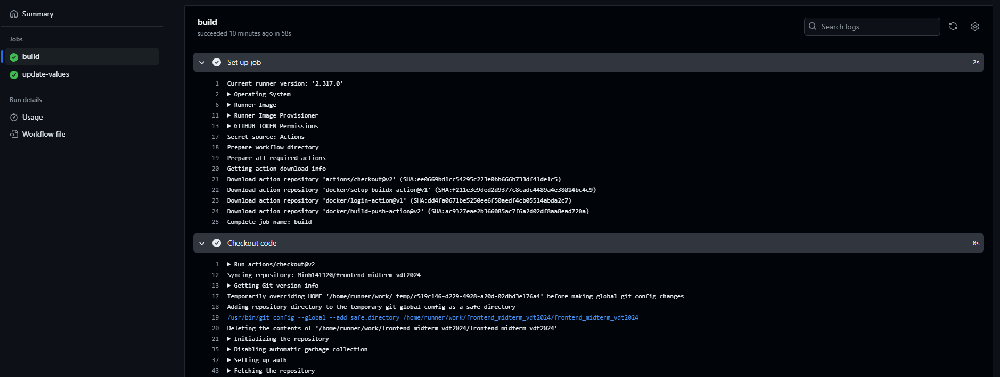
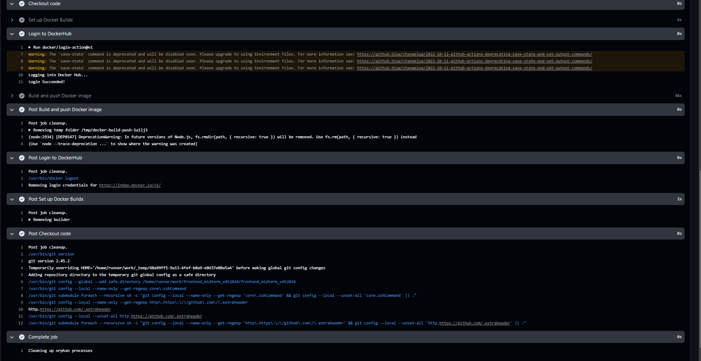
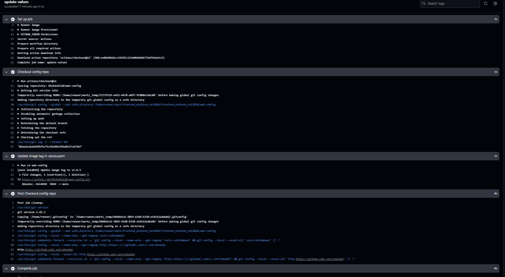

- Output log api cicd:
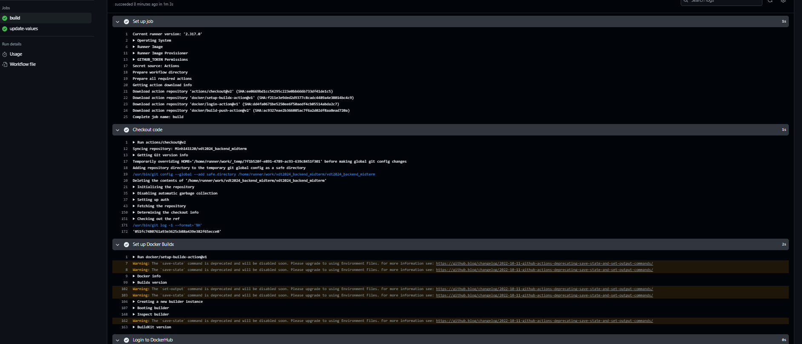
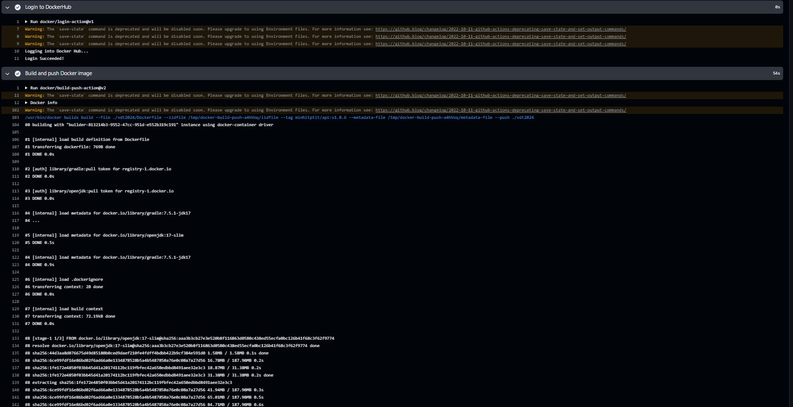
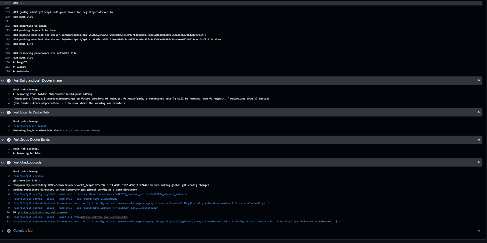
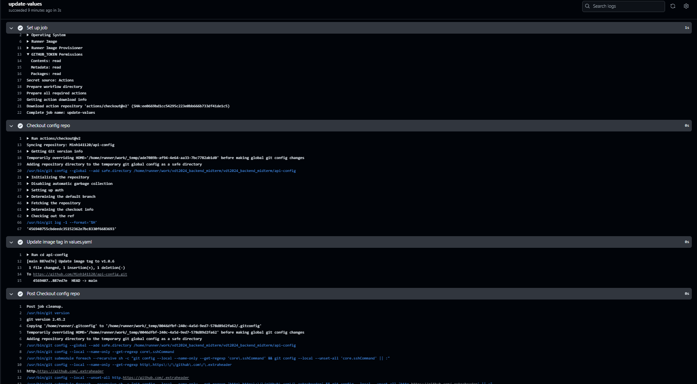

## Monitoring
```bash
kubectl describe svc prometheus-operator-kube-p-prometheus -n monitoring
```
Modify to NodePort type:
```yaml
apiVersion: v1
kind: Service
metadata:
  annotations:
    meta.helm.sh/release-name: prometheus-operator
    meta.helm.sh/release-namespace: monitoring
  creationTimestamp: "2024-06-13T10:19:38Z"
  labels:
    app: kube-prometheus-stack-prometheus
    app.kubernetes.io/instance: prometheus-operator
    app.kubernetes.io/managed-by: Helm
    app.kubernetes.io/part-of: kube-prometheus-stack
    app.kubernetes.io/version: 60.1.0
    chart: kube-prometheus-stack-60.1.0
    heritage: Helm
    release: prometheus-operator
  name: prometheus-operator-kube-p-prometheus
  namespace: monitoring
  resourceVersion: "24591"
  uid: b5348442-a774-4f95-9169-8d9cd2f7e26c
spec:
  clusterIP: 10.233.9.77
  clusterIPs:
    - 10.233.9.77
  internalTrafficPolicy: Cluster
  ipFamilies:
    - IPv4
  ipFamilyPolicy: SingleStack
  ports:
    - name: http-web
      port: 9090
      protocol: TCP
      targetPort: 9090
    - name: reloader-web
      port: 9091
      protocol: TCP
      targetPort: reloader-web
  selector:
    app.kubernetes.io/name: prometheus
    app.kubernetes.io/instance: prometheus-operator-kube-p-prometheus
  sessionAffinity: None
  type: NodePort # Add this line to specify the type as NodePort
status:
  loadBalancer: {}

```

`web-service-monitor.yaml`

```yaml
apiVersion: monitoring.coreos.com/v1
kind: ServiceMonitor
metadata:
  name: web-service-monitor
  namespace: monitoring
spec:
  selector:
    matchLabels:
      app: frontend-midterm
  endpoints:
  - port: http
    interval: 30s
  namespaceSelector:
    matchNames:
    - default
```

`api-service-monitor.yaml`

```yaml
apiVersion: monitoring.coreos.com/v1
kind: ServiceMonitor
metadata:
  name: api-service-monitor
  namespace: monitoring
spec:
  selector:
    matchLabels:
      app: backend-midterm
  endpoints:
  - port: http
    interval: 30s
  namespaceSelector:
    matchNames:
    - default

```
```bash
kubectl apply -f web-service-monitor.yaml
kubectl apply -f api-service-monitor.yaml
```
- Hình ảnh truy cập vào Prometheus UI
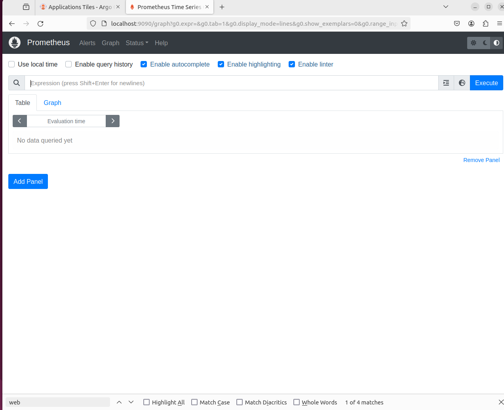

## Logging

- Tạo file fluent-bit-configmap.yaml
```yaml
apiVersion: v1
kind: ConfigMap
metadata:
  name: fluent-bit-config
  namespace: logging
data:
  fluent-bit.conf: |
    [SERVICE]
        Flush        5
        Daemon       Off
        Log_Level    info
        Parsers_File parsers.conf

    [INPUT]
        Name              tail
        Path              /var/log/containers/*.log
        Parser            docker
        Tag               kube.*
        Refresh_Interval  5

    [FILTER]
        Name                kubernetes
        Match               kube.*
        Kube_URL            https://kubernetes.default.svc:443
        Merge_Log           On
        Keep_Log            Off
        K8S-Logging.Parser  On
        K8S-Logging.Exclude Off

    [OUTPUT]
        Name  es
        Match *
        Host  116.103.226.146
        Port  9200
        HTTP_User elastic
        HTTP_Passwd iRsUoyhqW-CyyGdwk6V_
        Index minhnn_0337191138
        Type  _doc

  parsers.conf: |
    [PARSER]
        Name        docker
        Format      json
        Time_Key    time
        Time_Format %Y-%m-%dT%H:%M:%S.%L

```

- Apply Configmap
```bash
kubectl apply -f fluent-bit-configmap.yaml
```

- Tạo file fluent-bit-daemonset.yaml

```yaml
apiVersion: apps/v1
kind: DaemonSet
metadata:
  name: fluent-bit
  namespace: logging
  labels:
    k8s-app: fluent-bit
spec:
  selector:
    matchLabels:
      name: fluent-bit
  template:
    metadata:
      labels:
        name: fluent-bit
    spec:
      serviceAccountName: fluent-bit
      tolerations:
      - key: node-role.kubernetes.io/master
        effect: NoSchedule
      containers:
      - name: fluent-bit
        image: fluent/fluent-bit:1.8
        ports:
        - containerPort: 2020
          name: monitor
        volumeMounts:
        - name: varlibcontainers
          mountPath: /var/lib/docker/containers
          readOnly: true
        - name: varlog
          mountPath: /var/log
          readOnly: true
        - name: config-volume
          mountPath: /fluent-bit/etc
      volumes:
      - name: varlibcontainers
        hostPath:
          path: /var/lib/docker/containers
      - name: varlog
        hostPath:
          path: /var/log
      - name: config-volume
        configMap:
          name: fluent-bit-config

```

- Apply daemonset

```bash
kubectl apply -f fluent-bit-daemonset.yaml
```

- Tạo file fluent-bit-serviceaccount.yaml

```yaml
apiVersion: v1
kind: ServiceAccount
metadata:
  name: fluent-bit
  namespace: logging

```

```bash
kubectl apply -f fluent-bit-serviceaccount.yaml
```

