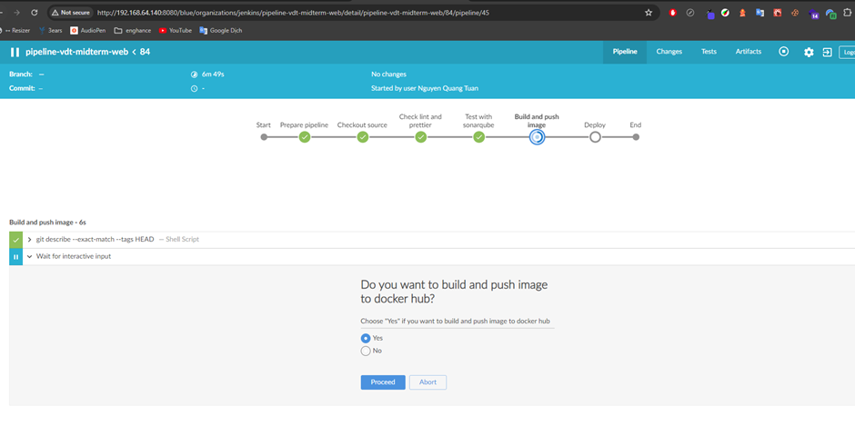
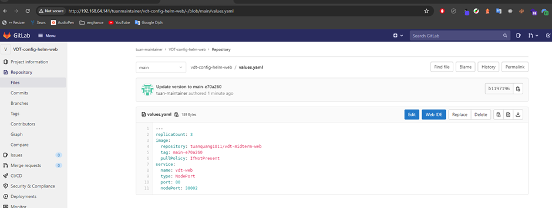

# Continuous Delivery

## 1. Mô tả

**Mô hình Gitops cơ bản với Jenkins và ArgoCD**

- Source code của dự án được lưu ở một repo riêng, gọi là `source repo`
- Phần cấu hình triển khai ứng dụng (helmchart hay k8s manifest files..) được lưu ở một repo riêng, gọi là `config repo`
- Luồng CICD hoạt động theo trình tự cơ bản mô phỏng như sau:
  - Dev commit source code
  - Jenkins build source code, triển khai các bước CI, test code,...
  - Jenkins Build Images
  - Jenkins push image lên image registry
  - Jenkins cập nhật thông tin phiên bản ứng dụng vào các file cấu hình triển khai ứng dụng lưu trên config repo
  - ArgoCD phát hiện thay đổi trên config repo thì cập nhật thay đổi về
  - ArgoCD so sánh thông tin cấu hình mới với cấu hình hiện tại trên hệ thống, nếu phát hiện sai khác sẽ cảnh báo và đồng bộ lại theo cấu hình được khai báo và lưu trên config repo

<div align="center">
  
</div>

<div align="center">
  <i><a href=https://medium.com/@abhishek261291/cicd-using-jenkins-and-argocd-cb0b9fa63aa0>
         CICD using Jenkins and Argocd
</a></i>
</div>
<br>

## 2. Output

Các tài nguyên từ bài giữa kỳ đã triển khai

- Server 1: **_CI/CD QA server (cicd-qa-server)_**: Memory: 3 GB, Processors: 1 – IP: `192.168.64.140`
  - Port `8080` - Jenkins server
  - Port `9000` - Sonarqube server
- Server 2: **_Gitlab server (gitlab-server)_**: Memory: 3 GB, Processors: 1 – IP: `192.168.64.141`
- Server 3: **_App server 1 (app-server-1)_**: Memory: 1 GB, Processors: 1 – IP: `192.168.64.142`
- Server 4: **_Database server (database-server)_**: Memory: 1 GB, Processors: 1 – IP: `192.168.64.143`
- Server 5: **_App server 2 (app-server-2)_**: Memory: 1 GB, Processors: 1 – IP: `192.168.64.144`
- Server 6: **_Load balancing server (lb-server)_**: Memory: 1 GB, Processors: 1 – IP: `192.168.64.145`
- Server 7: Docker registry: sử dụng **_Docker Hub_**

Trong bài cuối kỳ chuẩn bị thêm các tài nguyên:

- Server 8: **_k8s master server (k8s-master-server)_**: Memory: 2 GB, Processors: 1 – IP: `192.168.64.148`
- Server 9: **_k8s worker server (k8s-worker-server)_**: Memory: 2 GB, Processors: 2 – IP: `192.168.64.149`

<br>

ArgoCD đã được triển khai trên cluster rồi chi tiết (xem [tại đây](../helmChart-argocd/README.md))

Chi tiết các cài đặt từ bài giữa kỳ và luồng CI/CD (xem [tại đây](https://github.com/quangtuanitmo18/Viettel-Digital-Talent-2024/tree/NguyenQuangTuan/midterm)) đã đảm bảo được việc khi tạo tag trên repo thì pipeline sẽ được chạy và push image lên docker hub qua 1 bước manual. Việc còn lại là sửa file config và push lên repo config để argoCD thấy được và deploy lại

Các credentials tạo trên Jenkins cho pipeline:

- `gitlab-api-token`: token được tạo vởi user có quyền admin trên Gitlab
- `gitlab-credential`: tài khoản có quyền admin trên Gitlab
- `sonarqube-token`: token được tạo vởi user có quyền admin trên Sonarqube
- `sonar-host-url`: url truy cập vào Sonarqube server `192.168.64.140:9000`
- `vdt-midterm-web-project-key`: project key của project `vdt-midterm-web` trên Sonarqube
- `vdt-midterm-api-project-key`: project key của project `vdt-midterm-api` trên Sonarqube
- `dockerhub-credential`: tài khoản dockerhub
- `telegram-token`: token được tạo bởi `BotFather` trên Telegram
- `telegram-chatId`: chat ID của bot chat trên Telegram
- `ip-gitlab-server`: `192.168.64.141`
- `vdt-midterm-api-env`: file env cho môi trường prod của `web` service
- `vdt-midterm-web-env`: file env cho môi trường prod của `api` service

**_Dưới đây là pipeline CI/CD của service `api`, đổi với service `web` cũng sẽ tương tự_**

- `def sendTelegramMessage(token, chatId, message)`: Hàm này giúp gửi tin nhắn đến Telegram

  - `sh`: Chạy lệnh curl để gửi tin nhắn qua API của Telegram

- `pipeline`

  - `agent any`: Chỉ định rằng pipeline này có thể chạy trên bất kỳ agent nào của Jenkins
  - `environment`: Khai báo các biến môi trường cần thiết cho pipeline
  - `stages`: Bao gồm các bước cụ thể trong quá trình pipeline

    - Stage `Prepare pipeline`: Gửi tin nhắn Telegram thông báo bắt đầu build
    - Stage `Checkout source`: Sao chép mã nguồn vào thư mục dự án, thay đổi quyền sở hữu và quyền truy cập
    - Stage `Test with SonarQube`: Chạy kiểm tra mã nguồn với SonarQube để phân tích chất lượng mã nguồn
    - Stage `Check lint and prettier`: Cài đặt các phụ thuộc npm và chạy kiểm tra linting và định dạng mã với Prettier
    - Stage `Unit test with Jest`: Đọc tệp môi trường và chạy kiểm tra unit test với Jest
    - Stage `Build and push image`
      - Điều kiện kiểm tra nếu commit có tag. Nếu đúng, hỏi người dùng có muốn build và đẩy Docker Image lên Docker Hub không
      - Nếu người dùng chọn "Yes", build và đẩy Docker Image lên Docker Hub.
    - Stage `Update version image in helm chart`

      - Điều kiện kiểm tra nếu commit có tag. Nếu đúng, hỏi người dùng có muốn update version của image tại file values trong repo config hay không
      - Nếu người dùng chọn "Yes", update version của image tại repo config

  - `post`: Gửi thông báo đến Telegram dựa trên kết quả của pipeline:
    - `success`: Gửi tin nhắn thành công
    - `failure`: Gửi tin nhắn thất bại
    - `aborted`: Gửi tin nhắn khi pipeline bị hủy

```shell
def sendTelegramMessage(token, chatId, message) {
    sh """
    curl -s -X POST https://api.telegram.org/bot${token}/sendMessage -d chat_id=${chatId} -d text="${message}"
    """
}

pipeline{
    agent any
    environment{
        PATH_PROJECT = '/home/projects/VDT-midterm-api'
        PATH_CONFIG_PROJECT = '/home/projects/VDT-config/VDT-config-helm-api'

        SONAR_PROJECT_KEY = credentials('vdt-midterm-api-sonar-project-key')
        SONAR_TOKEN = credentials('sonarqube-token')
        SONAR_HOST_URL= credentials('sonar-host-url')

        IP_GITLAB_SERVER = credentials('ip-gitlab-server')
        NAME_REPO_CONFIG = 'vdt-config-helm-api'

        DOCKER_HUB ='tuanquang1811'
        DOCKER_HUB_CREDENTIALS = credentials('dockerhub-credentials')
        NAME_API = 'vdt-midterm-api'
        DOCKER_TAG = "${GIT_BRANCH.tokenize('/').pop()}-${GIT_COMMIT.substring(0,7)}"

        ENV_FILE_VDT_MIDTERM_API = ''

        TELEGRAM_TOKEN = credentials('telegram-token')
        TELEGRAM_CHAT_ID = credentials('telegram-chatId')
        TEXT_PRE_BUILD = "Jenkins is building ${JOB_NAME}"

    }
    stages{

        stage("Prepare pipeline") {
            steps {
                script {
                    sendTelegramMessage(TELEGRAM_TOKEN, TELEGRAM_CHAT_ID, TEXT_PRE_BUILD)
                }
            }
        }

        stage('Checkout source' ){
            steps{
                sh "sudo cp -r . $PATH_PROJECT \
                && sudo chown -R jenkins:jenkins $PATH_PROJECT \
                && sudo chmod -R 755  $PATH_PROJECT \
                "
            }
        }
        stage('Test with sonarqube'){
            steps{
                withSonarQubeEnv('sonarqube connection') {
                    sh "cd $PATH_PROJECT && docker run --rm \
                    -e SONAR_HOST_URL=${SONAR_HOST_URL} \
                    -e SONAR_SCANNER_OPTS='-Dsonar.projectKey=${SONAR_PROJECT_KEY}' \
                    -e SONAR_TOKEN=${SONAR_TOKEN} \
                    -v '.:/usr/src' \
                    sonarsource/sonar-scanner-cli"
                }
            }
        }
        stage('Check lint and prettier'){
            steps{
              sh "cd $PATH_PROJECT && npm install && npm run lint && npm run prettier"
            }
        }
        stage('Unit test with Jest'){
            steps{
              script{
                 withCredentials([file(credentialsId: 'vdt-midterm-api-env', variable: 'ENV_FILE_VDT_MIDTERM_API')]) {
                                ENV_FILE_VDT_MIDTERM_API = readFile(file:"$ENV_FILE_VDT_MIDTERM_API").trim()
                }
                sh "echo \"$ENV_FILE_VDT_MIDTERM_API\" > $PATH_PROJECT/.env.production"
                sh "cd $PATH_PROJECT && npm run test:prod"
              }
            }
        }
        stage('Build and push image'){
           when {
                expression {
                     return sh(script: 'git describe --exact-match --tags HEAD', returnStatus: true) == 0
                }
            }
            steps{
                script {
                    try {
                        timeout(time: 3, unit: 'MINUTES') {
                            env.userChoice = input message: 'Do you want to build and push image to docker hub?',
                                parameters: [choice(name: 'Versioning service', choices: 'Yes\nNo', description: 'Choose "Yes" if you want to build and push image to docker hub')]
                        }
                        if(env.userChoice == 'Yes') {

                            env.IMAGE_TAG = DOCKER_TAG
                            sh " cd $PATH_PROJECT \
                            && IMAGE_TAG=${IMAGE_TAG} \
                            && NAME_API=${NAME_API} \
                            && docker-compose build --parallel \
                            && docker tag ${NAME_API}:$DOCKER_TAG ${DOCKER_HUB}/${NAME_API}:$DOCKER_TAG \
                            && echo $DOCKER_HUB_CREDENTIALS_PSW | docker login -u $DOCKER_HUB_CREDENTIALS_USR --password-stdin \
                            && docker push ${DOCKER_HUB}/${NAME_API}:$DOCKER_TAG \
                            && docker rmi  ${DOCKER_HUB}/${NAME_API}:$DOCKER_TAG "
                        } else {
                            echo "build and push image to docker hub cancelled"
                        }
                    } catch(Exception err) {
                        def user = err.getCauses()[0].getUser()
                        if('SYSTEM' == user.toString()) {
                            def didTimeout = true
                            echo "Timeout. Build and push image to docker hub cancelled"
                        } else {
                            echo "Build and push image to docker hub cancelled by: ${user}"
                        }
                    }
                }
            }
        }
        stage('Update version image in helm chart'){
            when {
                expression {
                     return sh(script: 'git describe --exact-match --tags HEAD', returnStatus: true) == 0
                }
            }
            steps{
                script{
                    try {
                        timeout(time: 3, unit: 'MINUTES') {
                            env.userChoice = input message: 'Do you want to update version image in helm chart?',
                                parameters: [choice(name: 'Versioning service', choices: 'Yes\nNo', description: 'Choose "Yes" if you want to update version image in helm chart')]
                        }
                        if(env.userChoice == 'Yes') {
                            withCredentials([usernamePassword(credentialsId: 'gitlab-credentials', usernameVariable: 'GIT_USERNAME', passwordVariable: 'GIT_PASSWORD')]) {
                                sh """
                                    rm -rf ${PATH_CONFIG_PROJECT}

                                    # Clone the repository
                                    git clone http://${GIT_USERNAME}:${GIT_PASSWORD}@${IP_GITLAB_SERVER}/tuanmaintainer/${NAME_REPO_CONFIG}.git ${PATH_CONFIG_PROJECT}
                                    cd ${PATH_CONFIG_PROJECT}

                                    # Update the version in the values file
                                    sed -i 's/tag:.*/tag: ${DOCKER_TAG}/' values.yaml

                                    # Commit and push the changes
                                    git config user.name "${GIT_USERNAME}"
                                    git config user.email "${GIT_USERNAME}@git-server.com"
                                    git add .
                                    git commit -m "Update version to ${DOCKER_TAG}"
                                    git push origin main
                                """
                            }
                        } else {
                            echo "deploy cancelled"
                        }
                    }
                    catch(Exception err) {
                        def user = err.getCauses()[0].getUser()
                        if('SYSTEM' == user.toString()) {
                            def didTimeout = true
                            echo "Timeout. update version image in helm chart cancelled"
                        } else {
                            echo "Update version image in helm chart cancelled by: ${user}"
                        }
                    }
                }
            }

        }
    }
    post{
        success {
            sendTelegramMessage(TELEGRAM_TOKEN, TELEGRAM_CHAT_ID, "JOB ${JOB_NAME} is Success")
        }
        failure {
            sendTelegramMessage(TELEGRAM_TOKEN, TELEGRAM_CHAT_ID, "JOB ${JOB_NAME} is Failure")
        }
        aborted {
            sendTelegramMessage(TELEGRAM_TOKEN, TELEGRAM_CHAT_ID, "JOB ${JOB_NAME} is Aborted")
        }
    }

}
```

File `.env.production` của service `api` triển khai lên k8s ([link repo](https://github.com/quangtuanitmo18/VDT-midterm-api))

```shell
# APP
HOST=http://192.168.64.149:30003/api
PORT=4000
CLIENT_URL=http://192.168.64.149:30002

# DB
DB_NAME=vdt-final
DB_NAME_TEST=vdt-final-test
DB_USERNAME=mongo_user
DB_PASSWORD=mongo_password
DB_HOST=vdt-db-0.vdt-db.vdt-final.svc.cluster.local
DB_HOST_TEST=192.168.64.143
DB_PORT=27017

#JWT
ACCESS_TOKEN_EXPIRES_IN='1d'
REFRESH_TOKEN_EXPIRES_IN='3d'
PASSWORD_SECRET='tuanquang!@#123'
JWT_SECRET='SECRET!@#123'
JWT_SECRET_ACCESS_TOKEN='SECRET!@#123456_ACCESS'
JWT_SECRET_REFRESH_TOKEN='SECRET!@#123456_REFRESH'

```

File `.env` của service `web` triển khia lên k8s ([link repo](https://github.com/quangtuanitmo18/VDT-midterm-web))

```shell
VITE_API_URL="http://192.168.64.149:30003"
```

<br>

### 2.1 Các hình ảnh demo

**Các hình ảnh demo cho pipeline** `pipeline-vdt-midterm-api`

Tiến hành tạo tag trên nhánh main của repo `VDT-midterm-api`, lúc này đã có thể thực hiện được stage `Build and push image` và `Update version image in helm chart` thông qua 1 bước manual để xác nhận có muốn thực hiện 2 stage này không (Continuous Delivery)

<div align="center">
  
</div>
<div align="center">
  
</div>
<div align="center">
  
</div>

Sonarqube phân tích code

<div align="center">
  
</div>
<br>

Image được đẩy lên Docker hub

<div align="center">
  
</div>
<br>

Version của docker image được update ở repo config

<div align="center">
  
</div>
<br>

Nhận thông báo bên Telegram

<div align="center">
  
</div>
<br>

ArgoCD thấy được sự thay đổi trong file values của repo config `VDT-config-helm-api`

<div align="center">
  
</div>
<br>

Các events trong application `vdt-api-app` trên argoCD

<div align="center">
  
</div>
<br>

Giờ chỉ cần sync là version mới sẽ được triển khai trên cluster

<div align="center">
  
</div>
<br>

<br>

**Các hình ảnh demo cho pipeline** `pipeline-vdt-midterm-web`

Tiến hành tạo tag trên nhánh main của repo `VDT-midterm-web`, lúc này đã có thể thực hiện được stage `Build and push image` và `Update version image in helm chart` thông qua 1 bước manual để xác nhận có muốn thực hiện 2 stage này không (Continuous Delivery)

<div align="center">
  
</div>
<div align="center">
  
</div>
<div align="center">
  
</div>

Sonarqube phân tích code

<div align="center">
  
</div>
<br>

Image được đẩy lên Docker hub

<div align="center">
  
</div>
<br>

Version của docker image được update ở repo config

<div align="center">
  
</div>
<br>

Nhận thông báo bên Telegram

<div align="center">
  
</div>
<br>

ArgoCD thấy được sự thay đổi trong file values của repo config `VDT-config-helm-api`

<div align="center">
  
</div>
<br>

Các events trong application `vdt-api-app` trên argoCD

<div align="center">
  
</div>
<br>

Giờ chỉ cần sync là version mới sẽ được triển khai trên cluster

<div align="center">
  
</div>
<br>
