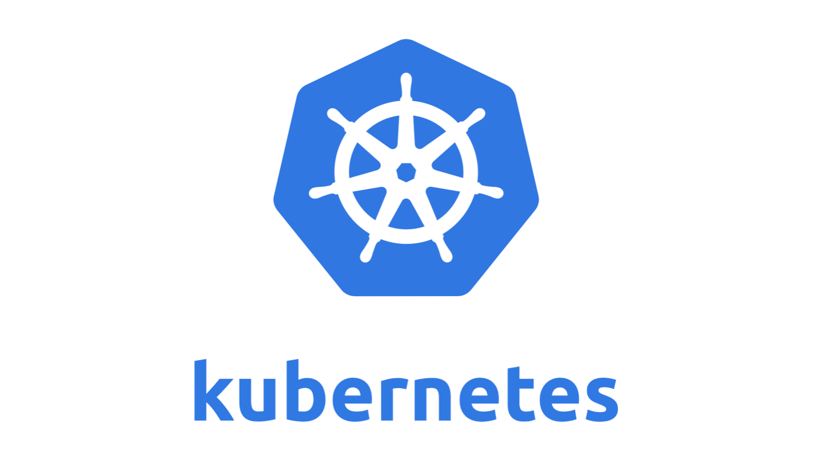
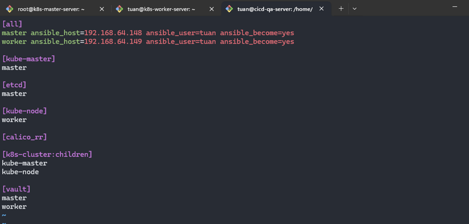
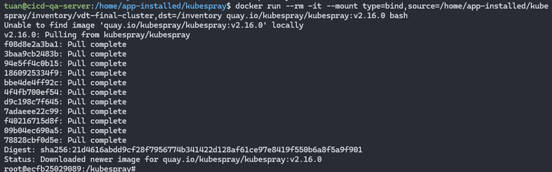
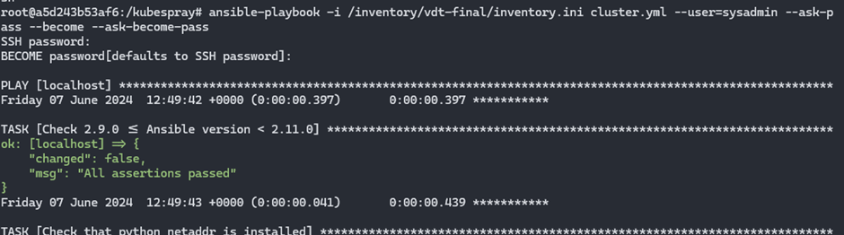
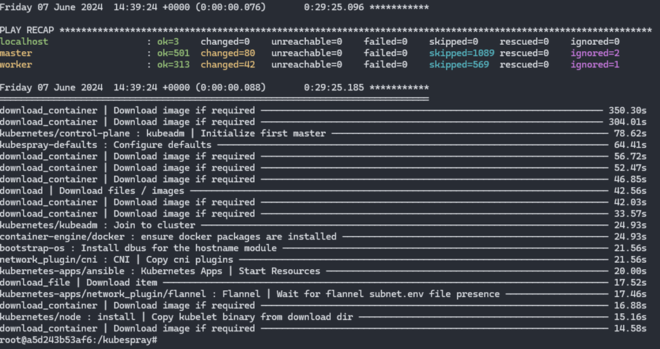
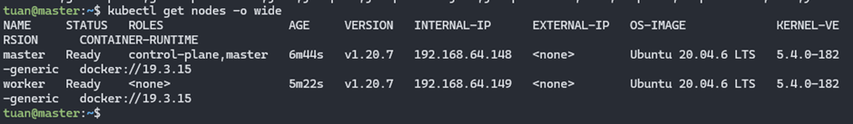
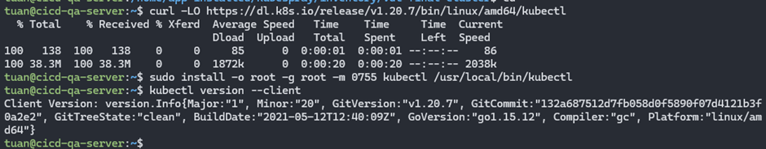
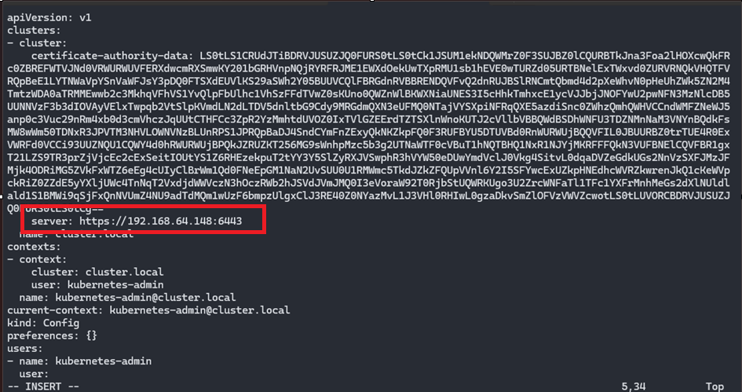
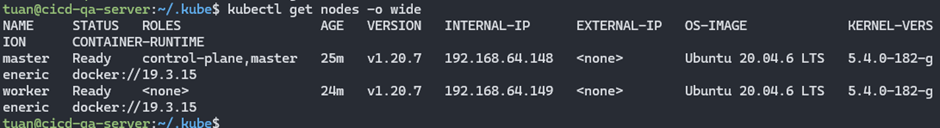

# Kubernetes

## 1. Mô tả

**Kubernetes**, thường được gọi là K8s, là một hệ thống mã nguồn mở để tự động hóa việc triển khai, mở rộng, và quản lý các ứng dụng container. Được phát triển bởi Google và hiện tại được duy trì bởi Cloud Native Computing Foundation (CNCF), Kubernetes cung cấp một nền tảng để điều hành các containerized applications trong một cluster of nodes. Các thành phần chính của Kubernetes bao gồm:

- Cluster: Một tập hợp các máy (node) chạy các ứng dụng container.
- Nodes: Các máy trong cluster, có thể là máy vật lý hoặc ảo, nơi các container chạy.
- Pods: Nhóm nhỏ nhất của Kubernetes, một Pod có thể chứa một hoặc nhiều container.
- Services: Định nghĩa cách tiếp cận để truy cập đến một nhóm các Pod.
- Ingress: Quản lý truy cập bên ngoài vào các service trong cluster, thường thông qua HTTP và HTTPS.

<div align="center">
  
</div>

<div align="center">
  <i><a href=https://kubernetes.io/vi/docs/concepts/overview/what-is-kubernetes/>
         K8S
        </a></i>
</div>
<br>

**Kubectl** là công cụ dòng lệnh để giao tiếp với Kubernetes. Nó cho phép thực hiện các thao tác như deploy ứng dụng, quản lý tài nguyên, kiểm tra logs,... Một số lệnh phổ biến của kubectl bao gồm:

`kubectl apply -f <file.yaml>`: Áp dụng cấu hình từ tệp YAML.
`kubectl get <resource>`: Liệt kê các tài nguyên (pods, services, deployments, etc.).
`kubectl describe <resource> <name>`: Hiển thị chi tiết về một tài nguyên cụ thể.
`kubectl logs <pod>`: Xem logs của một Pod.

**Kubelet** là một agent chạy trên mỗi node trong cluster và chịu trách nhiệm cho các Pod được phân công đến node đó. Nó đảm bảo rằng các containers trong một Pod đang chạy. Kubelet nhận các chỉ dẫn từ API server và thực hiện chúng, quản lý vòng đời của các container thông qua container runtime như Docker hoặc containerd.

**Kubespray** là một dự án mã nguồn mở cung cấp Ansible playbooks để triển khai một cluster Kubernetes. Được thiết kế để dễ dàng và linh hoạt, Kubespray hỗ trợ nhiều loại hệ điều hành và môi trường cloud khác nhau. Nó cung cấp các tính năng như:

- Multi-node deployment.
- High availability.
- Network plugin support.
- Cluster upgrades.

## 2. Output

### 2.1 Chuẩn bị tài nguyên

Các tài nguyên từ bài giữa kỳ đã triển khai

- Server 1: **_CI/CD QA server (cicd-qa-server)_**: Memory: 3 GB, Processors: 1 – IP: `192.168.64.140`
  - Port `8080` - Jenkins server
  - Port `9000` - Sonarqube server
- Server 2: **_Gitlab server (gitlab-server)_**: Memory: 3 GB, Processors: 1 – IP: `192.168.64.141`
- Server 3: **_App server 1 (app-server-1)_**: Memory: 1 GB, Processors: 1 – IP: `192.168.64.142`
- Server 4: **_Database server (database-server)_**: Memory: 1 GB, Processors: 1, Disk: 20 GB – IP: `192.168.64.143`
- Server 5: **_App server 2 (app-server-2)_**: Memory: 1 GB, Processors: 1 – IP: `192.168.64.144`
- Server 6: **_Load balancing server (lb-server)_**: Memory: 1 GB, Processors: 1 – IP: `192.168.64.145`
- Server 7: Docker registry: sử dụng **_Docker Hub_**

Để triển khai K8s trong bài này cần chuẩn bị thêm các tài nguyên:

- Server 8: **_k8s master server (k8s-master-server)_**: Memory: 2 GB, Processors: 1 – IP: `192.168.64.148`
- Server 9: **_k8s worker server (k8s-worker-server)_**: Memory: 2 GB, Processors: 2 – IP: `192.168.64.149`

### 2.2 Cài đặt k8s qua Kubespray

Trong phần này sẽ triển khai Kubernetes thông qua công cụ kubespray lên 1 master node VM + 1 worker node VM

Ý tưởng là sẽ cài kubespray một lên máy chủ (Installation Server) trong bài lab này chọn node `cicd-qa-server` và cần cho Kubespray biết cần phải cài một cụm K8S với bao nhiêu node master, bao nhiêu worker, cài etcd trên bao nhiêu node, thông tin kết nối của các node là gì.

Clone Kubespray từ github về
`git clone https://github.com/kubernetes-sigs/kubespray.git --branch release-2.16`

Tạo một inventory mới từ bộ mẫu của kubespray
`cp -rf inventory/sample inventory/vdt-final-cluster`

Cấu hình file inventory. Trong thẻ [all] là nơi khai báo thông tin chi tiết của tất cả các node gồm tên và IP. [kube-master] là các node sẽ chạy với role master, [kube-node] là các node chạy role worker, [etcd] là các node sẽ chạy etcd, thường chọn là các node master luôn.

<div align="center">
  
</div>
<br>

Tiếp đến nếu muốn đổi CNI (network plugin của K8S) thì sửa file config sau:
`inventory/vdt-final-cluster/group_vars/k8s_cluster/k8s-cluster.yml`
sửa tham số `kube_network_plugin` từ `calino` về `flannel`(chi tiết về 2 plugin mạng này xem [tại đây](https://www.suse.com/c/rancher_blog/comparing-kubernetes-cni-providers-flannel-calico-canal-and-weave/))

Do dùng Kubespray dùng Ansible nên cần tạo ssh key và đẩy lên 2 con `k8s-master-server` và `k8s-worker-server`

Chạy Kubespray từ container để sau đó thực hiện cài đặt cluster k8s trong này
`docker run -it --mount type=bind,source=/home/app-installed/kubespray/inventory/vdt-final-cluster,dst=/inventory/vdt-final quay.io/kubespray/kubespray:v2.16.0 bash`

<div align="center">
  
</div>
<br>

Giờ cài k8s qua Ansible
`ansible-playbook -i /inventory/vdt-final/iventory.ini cluster.yml --user=sysadmin --ask-pass --become --ask-become-pass`

<div align="center">
  
</div>

<div align="center"> 
  
</div>
<br>

### 2.3 Cài đặt và cấu hình kubectl

**Cấu hình kubectl lên master**

```shell
mkdir -p $HOME/.kube
sudo cp /etc/kubernetes/admin.conf $HOME/.kube/config
sudo chown $(id -u):$(id -g) $HOME/.kube/config
```

Chạy `kubectl get nodes -o wide` để lấy các nodes ra

<div align="center"> 
  
</div>
<br>

**Cấu hình kubectl lên `cicd-qa-server`**
Cài kubectl lên server này

```shell
curl -LO https://dl.k8s.io/release/v1.20.7/bin/linux/amd64/kubectl
sudo install -o root -g root -m 0755 kubectl /usr/local/bin/kubectl
kubectl version --client
```

<div align="center"> 
  
</div>
<br>

Cấu hình kubectl để kết nối tới cụm K8S:

```shell
mkdir -p $HOME/.kube
scp tuan@192.168.64.148:~/.kube/config  $HOME/.kube/
chown $(id -u):$(id -g) $HOME/.kube/config
```

<br>

Sửa file config, tham số "server: https://127.0.0.1:6443" thành "server: https://192.168.64.148:6443" và lưu lại (`192.168.64.148` là IP của node master, 6443 là port mặc định của kube-api-server)

<div align="center"> 
  
</div>
<br>
Rồi get nodes ra 
<div align="center"> 
  
</div>
