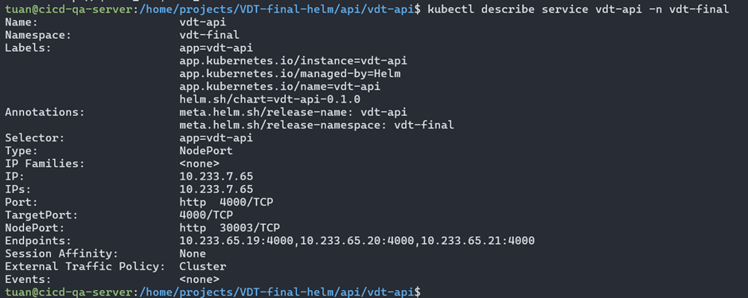

# Monitoring

## 1. Mô tả

Monitoring là quá trình thu thập, phân tích và sử dụng dữ liệu về hệ thống hoặc ứng dụng để đảm bảo chúng hoạt động một cách chính xác và hiệu quả. Mục tiêu của monitoring bao gồm:

- Phát hiện sự cố sớm: Nhận diện các vấn đề trước khi chúng ảnh hưởng đến người dùng hoặc gây ra thiệt hại nghiêm trọng.
- Tối ưu hóa hiệu suất: Đảm bảo rằng hệ thống hoặc ứng dụng hoạt động tối ưu.
- Đưa ra quyết định dựa trên dữ liệu: Cung cấp thông tin chính xác để giúp quản lý và phát triển hệ thống tốt hơn.
- Đảm bảo tính sẵn sàng: Đảm bảo rằng các dịch vụ luôn sẵn sàng cho người dùng.

Các thành phần cơ bản của một hệ thống monitoring bao gồm:

- Metrics (số liệu): Dữ liệu đo lường từ hệ thống (như CPU usage, memory usage, request rate).
- Logs (nhật ký): Dữ liệu chi tiết về các sự kiện xảy ra trong hệ thống.
- Alerts (cảnh báo): Thông báo khi có sự cố hoặc điều kiện không bình thường xảy ra.

Prometheus là một hệ thống giám sát và cảnh báo mã nguồn mở, ban đầu được phát triển bởi SoundCloud. Prometheus được thiết kế để thu thập và lưu trữ các metrics thời gian thực trong một cơ sở dữ liệu chuỗi thời gian. Nó hỗ trợ một ngôn ngữ truy vấn mạnh mẽ để phân tích dữ liệu. Dưới đây là cách Prometheus hoạt động:

- Scraping: Prometheus định kỳ lấy dữ liệu từ các endpoints được cấu hình (gọi là targets) thông qua HTTP. Các endpoints này phải cung cấp dữ liệu metrics theo định dạng Prometheus exposition format.

- Storage: Prometheus lưu trữ dữ liệu metrics trong cơ sở dữ liệu chuỗi thời gian của nó.

- Querying: Người dùng có thể sử dụng PromQL, ngôn ngữ truy vấn của Prometheus, để truy vấn và phân tích dữ liệu metrics.

- Alerting: Prometheus tích hợp với Alertmanager để gửi cảnh báo dựa trên các điều kiện được định nghĩa bởi người dùng.

- Visualization: Prometheus có thể được tích hợp với các công cụ như Grafana để hiển thị dữ liệu metrics dưới dạng biểu đồ và dashboards.

<div align="center">
  
</div>

<div align="center">
  <i><a href=https://www.atatus.com/glossary/prometheus-monitoring/>
         Prometheus monitoring
        </a></i>
</div>
<br>

## 2. Output

### 2.1 Expose metrics của web và api service

Với Api service do là chạy dưới server nên là việc expose metric chỉ cần cài thêm 1 số package, trong bài lab này dùng [prom-client](https://www.npmjs.com/package/prom-client)

Thực hiện cài đặt và implement package trên vào code Api server Nodejs

<div align="center">
  
</div>
<br>

Còn đối với Web service cần chạy thêm 1 sidecar container ([Nginx prometheus exporter](https://github.com/nginxinc/nginx-prometheus-exporter))

Mô hình Sidecar Container thường được sử dụng trong các ứng dụng container hóa để thêm chức năng mà không cần phải sửa đổi ứng dụng chính. Trong trường hợp này, sử dụng Nginx làm web server cho Reactjs và một Prometheus Exporter để expose các metrics từ Nginx, cho phép Prometheus thu thập chúng.

Service web chạy trên web server nginx, dưới đây là file cấu hình nginx

<div align="center">
  
</div>
<br>

Cần cập nhật thêm helm-chart (service, deployment) và file values ở repo config

- `api`: Cập nhật thêm labels, tên của port nhằm phục vụ cho việc service monitor có thể bắt được service chạy api (xem tại các pr [vdt-midterm-api/update-helm-chart](https://github.com/quangtuanitmo18/VDT-midterm-api/pull/9/files), [vdt-config-helm-api/update-values](https://github.com/quangtuanitmo18/VDT-config-helm-api/pull/1))
- `web`: Cập nhật thêm labels, tên của port nhằm phục vụ cho việc service monitor có thể bắt được service chạy web và thêm sidecar container `Nginx prometheus expoter` để bắt được metrics của web (xem tại các pr [vdt-midterm-web/update-helm-chart](https://github.com/quangtuanitmo18/VDT-midterm-web/pull/7/files), [vdt-config-helm-web/update-values](https://github.com/quangtuanitmo18/VDT-config-helm-web/pull/1))

### 2.2 Triển khai Prometheus lên K8s cluster

Cài đặt Prometheus trên Kubernetes thông qua Prometheus Operator là một cách tiếp cận linh hoạt và mạnh mẽ hơn so với việc sử dụng Helm trực tiếp. Prometheus Operator cung cấp các Custom Resource Definitions (CRDs) và Controllers để quản lý và cấu hình các thành phần Prometheus trên Kubernetes

Chạy các lệnh dưới đây để cài Prometheus Operator

<div align="center">
  
</div>
<br>

Check các pods của prometheus

<div align="center">
  
</div>
<br>

Chạy lệnh dưới để expose service `prometheus-operator-kube-p-prometheus` ra NodePort với port `32090`

`kubectl patch svc prometheus-operator-kube-p-prometheus -n monitoring -p '{"spec": {"type": "NodePort", "ports": [{"port": 9090, "targetPort": 9090, "nodePort": 32090}]}}'`

Truy cập và port `32090` để mở giao diện prometheus trên trình duyệt

<div align="center">
  
</div>
<br>

### 2.3 Sử dụng Service Monitor của Prometheus Operator

Sử dụng Service Monitor của Prometheus Operator để giám sát Web Deployment và API Deployment

**Giám sát Web Deployment**

Tạo file `web-service-monitor.yaml` và apply lên cluster

```shell
apiVersion: monitoring.coreos.com/v1
kind: ServiceMonitor
metadata:
  name: vdt-web-sm
  namespace: monitoring
  labels:
    app: vdt-web
    release: prometheus-operator
spec:
  selector:
    matchLabels:
      app: vdt-web
  namespaceSelector:
    matchNames:
      - vdt-final
  endpoints:
  - port: metrics
    path: /metrics
    interval: 15s
```

Describe service của web ra thấy đối với metrics của web đã được expose bằng `Nginx prometheus exporter` qua cổng `9100` và tên của cổng là `metrics`

<div align="center">
  
</div>
<br>

Get thử metrics qua `curl`

<div align="center">
  
</div>
<br>

Hình ảnh danh sách target của Web Deployment được giám sát bởi Prometheus

<div align="center">
  
</div>

**Giám sát Api Deployment**

Tạo file `api-service-monitor.yaml` và apply lên cluster

```shell
apiVersion: monitoring.coreos.com/v1
kind: ServiceMonitor
metadata:
  name: vdt-api-sm
  namespace: monitoring
  labels:
    app: vdt-api
    release: prometheus-operator
spec:
  selector:
    matchLabels:
      app: vdt-api
  namespaceSelector:
    matchNames:
      - vdt-final
  endpoints:
  - port: http
    path: /metrics
    interval: 15s
```

Đối với metrics của api thì sẽ qua path `metrics` cổng `4000` với tên cổng là `http`

<div align="center">
  
</div>
<br>

Get thử metrics qua `curl`

<div align="center">
  
</div>
<br>

Hình ảnh danh sách target của Api Deployment được giám sát bởi Prometheus

<div align="center">
  
</div>
<br>
