# Security

### 1. Dựng HAProxy Loadbalancer

Chưa hoàn thành

### 2. Authentication và Authorization

Authentication (xác thực) là quá trình xác định danh tính của người dùng, thường bằng cách kiểm tra thông tin đăng nhập như tên người dùng và mật khẩu. Một trong những phương pháp hiện đại và phổ biến để thực hiện xác thực trong các ứng dụng web và API là sử dụng JWT (JSON Web Tokens).

JSON Web Token (JWT) là một chuẩn mở (RFC 7519) để tạo ra token dưới dạng JSON nhằm truyền tải thông tin giữa các bên một cách an toàn. JWT được sử dụng rộng rãi để xác thực và trao quyền (authorization).

  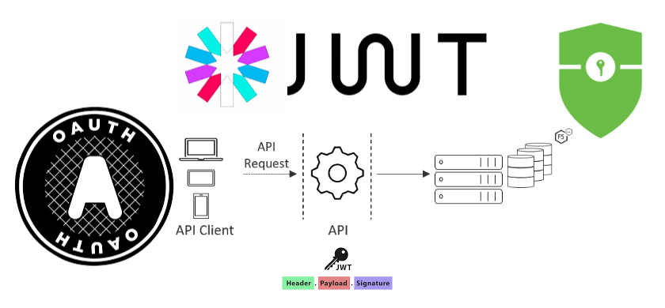

 

Một JWT bao gồm ba phần chính:

- Header: Chứa thông tin về thuật toán ký và loại token.
- Payload: Chứa các thông tin (claims) như thông tin người dùng, thời gian hết hạn, quyền truy cập, v.v.
- Signature: Được tạo ra bằng cách ký kết hợp phần header và payload với một khóa bí mật hoặc khóa riêng.

Mô hình phổ biến với JWT là stateless lưu `access-token` và `refresh-token` lên phía client ([Phân biệt stateful và stateless authentication](https://www.openidentityplatform.org/blog/stateless-vs-stateful-authentication))

Trong bài lab này sẽ thực hiện trả về `access-token` và `refresh-token` khi người dùng đăng nhập hoặc đăng ký vào hệ thống. Với `access-token` sẽ được lưu ở local storage còn `refresh-token` lưu ở cookie. Việc phân quyền giữa `user` và `admin` thông qua 1 trường `role` được lưu vào payload của JWT (không lưu những thông tin nhạy cảm ở payload của jwt).

Khi đi vào 1 endpoint sẽ cài đặt 1 middleware `accessTokenValidator` để xác định token đưa vào qua header có phải token của hệ thống cung cấp hay không. Còn đối với những endpoint yêu cầu quyền `admin` sau khi đi qua middleware `accessTokenValidator` sẽ đi qua 1 middleware nữa là `isAdminValidator`, middleware này sẽ lấy thông tin `role` ở trên payload của token ra để biết được quyền là `user` hay `admin`
Chi tiết xem tạo pr: [VDT-midterm-api/authen-author](https://github.com/quangtuanitmo18/VDT-midterm-api/pull/8)

**Các hình ảnh demo**

Các bước dưới đây chỉ là mô phỏng Authentication và Authorizartion, quy trình này trong thực tế sẽ phức tạp hơn (ví dụ: Đăng ký xong cần verify email, token phải được verify mới dùng được, mô hình phân quyền RBAC,... )

Khi người dùng đăng nhập qua endpoint `register` sẽ nhận về token

  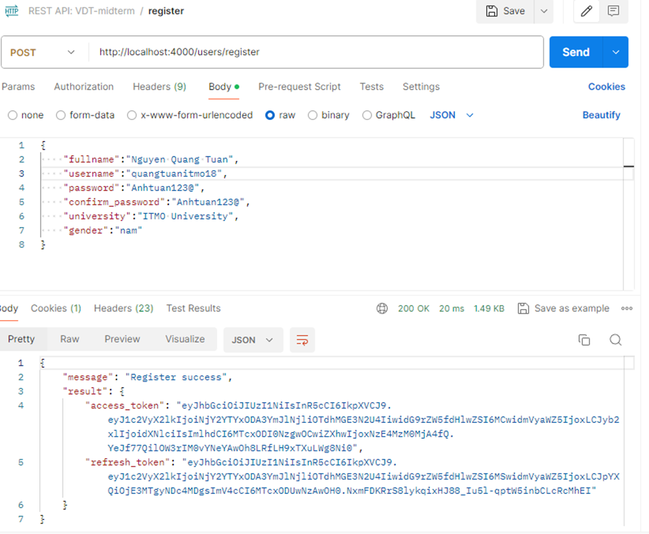

 

Decode cái `access-token` ra thấy các thông tin payload như sau

  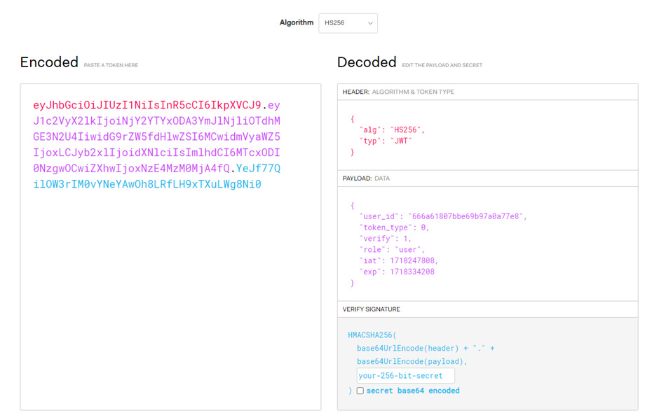

 

Khi đăng nhập qua endpoint `login` cũng sẽ nhận về token

  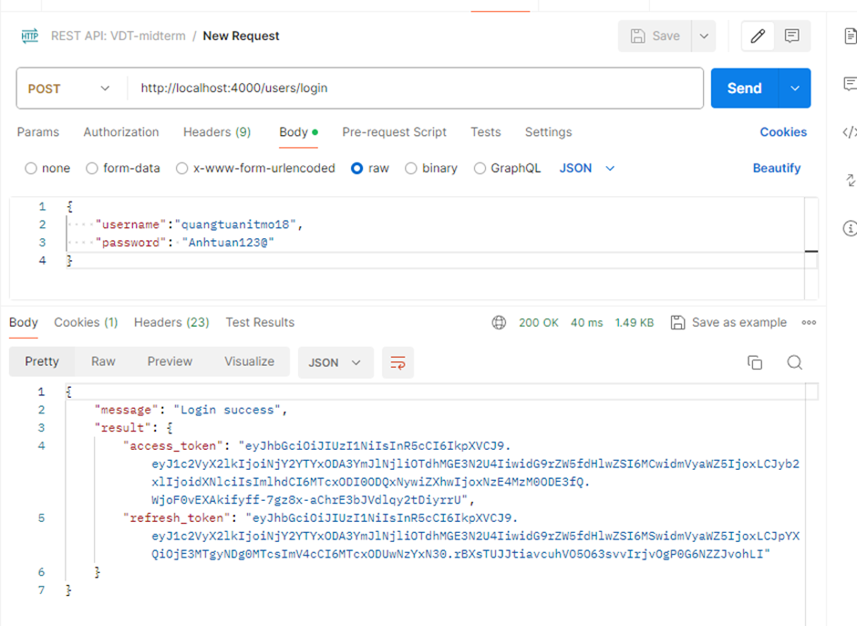

 

Thêm middleware `accessTokenValidator` và `isAdminValidator` vào endpoint `create`, `update` và `delete`. Vậy là muốn thực hiện được các endpoint này thì cần có valid token và cần có role `admin`

  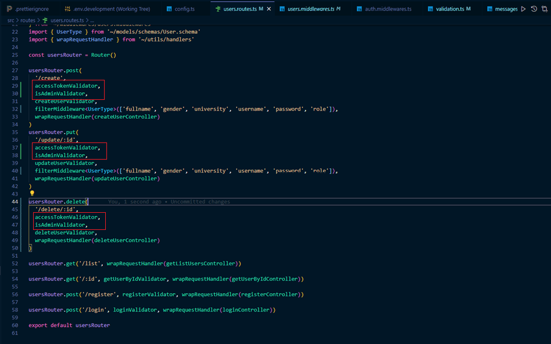

 

Thực hiện endpoint `create` với token có role `user` sẽ trả về `403`

  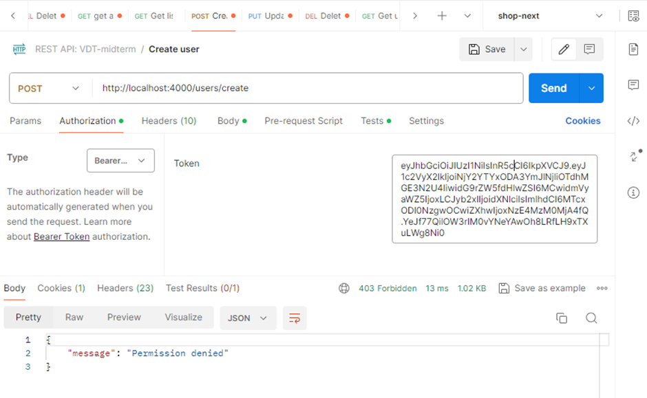

 
Get list user ra vẫn sẽ thực hiện bình thường

  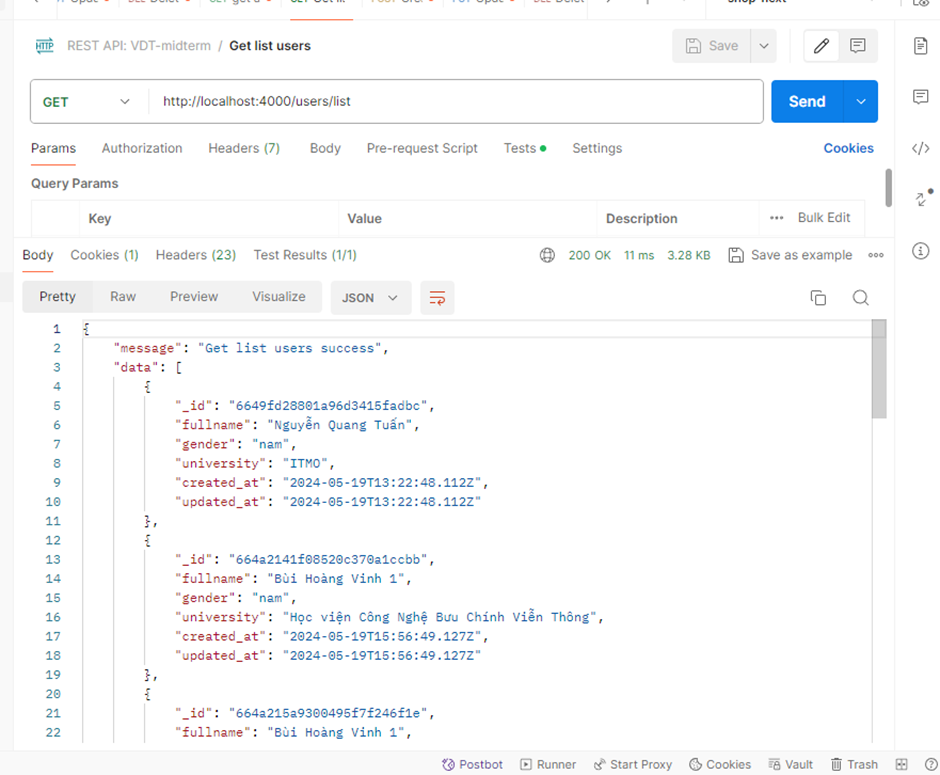

 

Giờ lấy 1 user có role `admin` đăng nhập vào hệ thống, và lấy token đó để thực hiện endpoint `create`, `update`, `delete`

  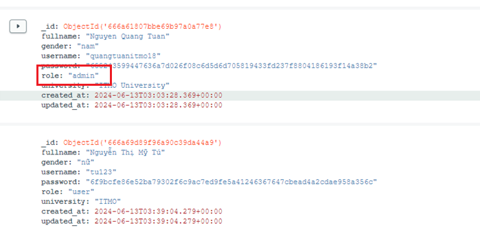

 

  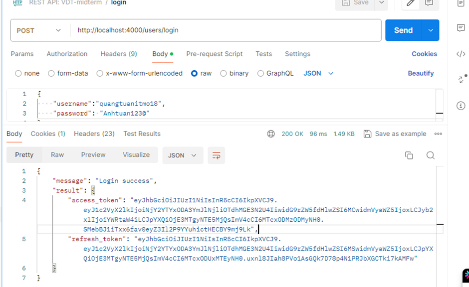

 

  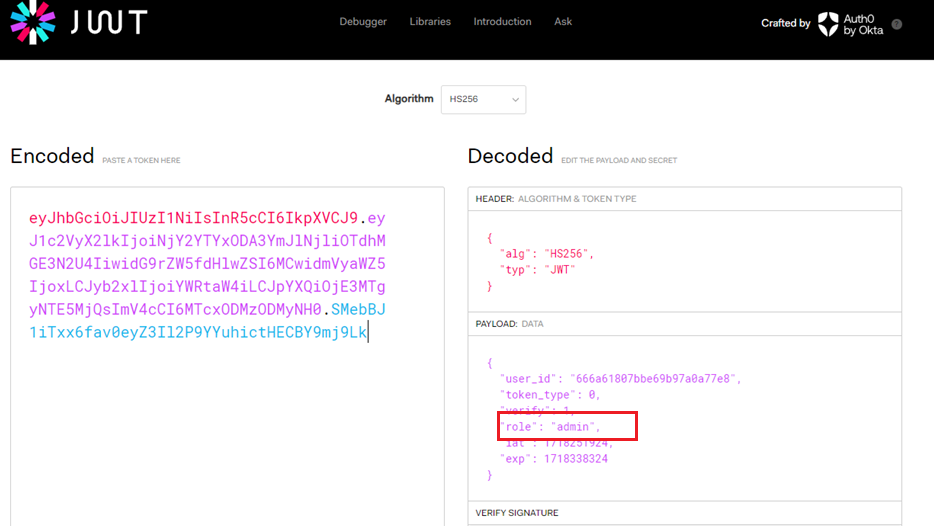

 

Quay lại thực hiện các endpoint `create`, `update`, `delete` bằng token trên
`create` trả về `200` còn `update` và `delete` trả về status code `204`

  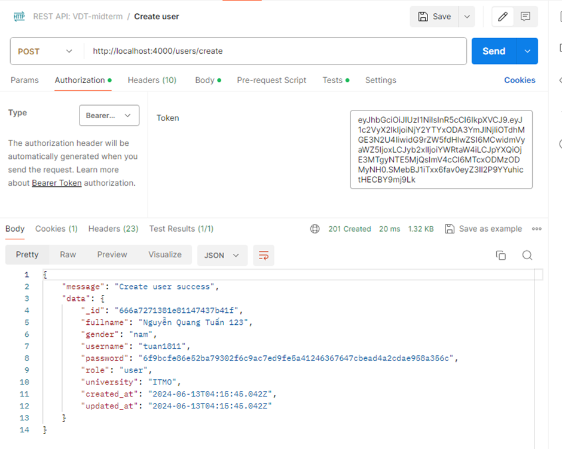

  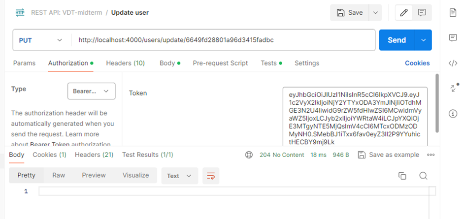

  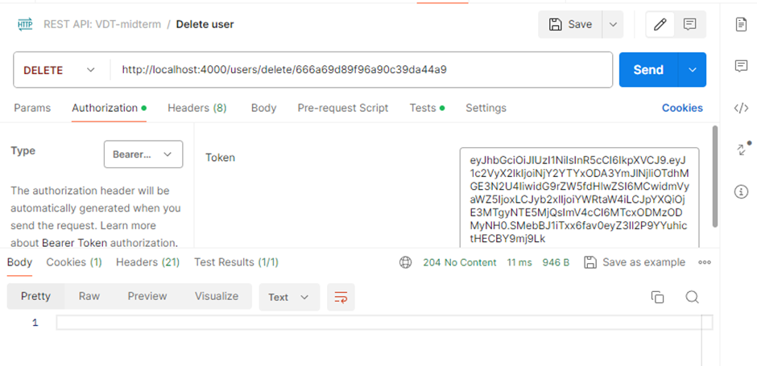

### 3. Ratelimit cho Endpoint của api Service

Rate Limiting (giới hạn tần suất) là kỹ thuật dùng để kiểm soát số lượng yêu cầu mà một người dùng hoặc ứng dụng có thể gửi đến một dịch vụ trong một khoảng thời gian nhất định. Điều này giúp ngăn chặn việc sử dụng quá mức tài nguyên hoặc các cuộc tấn công DDoS.

`express-rate-limit` là một package phổ biến cho Node.js và Express, cho phép dễ dàng triển khai rate limiting.

  

  <i><a href=https://singh-sandeep.medium.com/protecting-your-node-js-application-with-express-rate-limiter-a-guide-to-rate-limiting-in-node-js-5763e4e22d18/>
         Express Rate Limiter
</a></i>

 

Triển khai `express-rate-limit` chi tiết xem lại pr [VDT-midterm-api/rate-limiting](https://github.com/quangtuanitmo18/VDT-midterm-api/pull/10)

Cấu hình của `express-rate-limit` sẽ như sau

- `windowMs`: Đây là khoảng thời gian tính theo milliseconds mà giới hạn sẽ được áp dụng
- `max`: Đây là số lượng request tối đa mà một IP có thể gửi trong mỗi window
- `standardHeaders`: Khi giá trị này là true, các thông tin về giới hạn tần suất sẽ được trả về trong các header tiêu chuẩn như `RateLimit-Limit`, `RateLimit-Remaining`, và `RateLimit-Reset`
- `legacyHeaders`: Khi giá trị này là false, các header cũ như `X-RateLimit-Limit`, `X-RateLimit-Remaining`, và `X-RateLimit-Reset` sẽ bị vô hiệu hóa
- `statusCode`: ở đây trả về status code là `429` mang ý nghĩa là `TooManyRequests`

  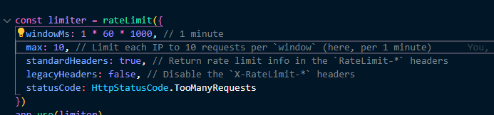

 

Truy cập vào trình duyệt và thực hiện quá 10 request trong vòng 1 phút sẽ nhận được `429 Too Many Requests`

  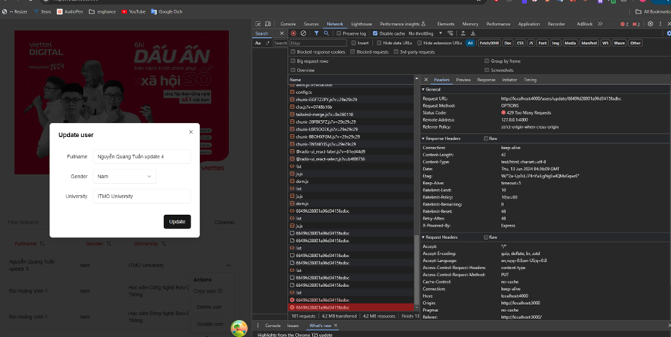

 
